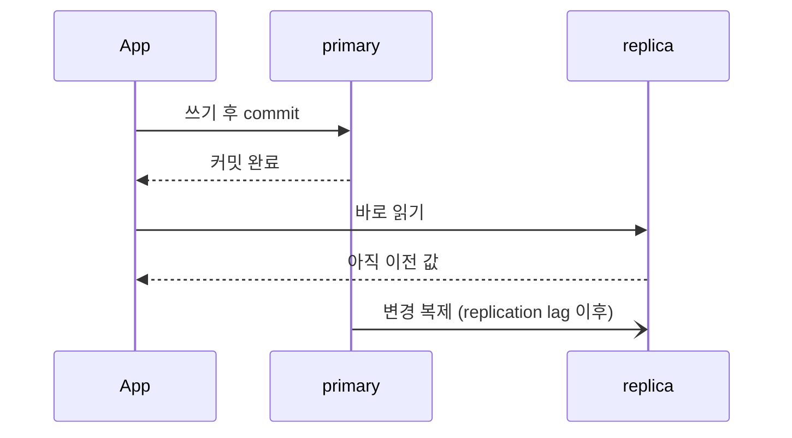

## 리플리케이션이란

리플리케이션은 한 데이터베이스의 변경 사항을 다른 데이터베이스로 복제하는 구조다. 보통 primary가 쓰기를 받고, replica가 이를 따라가는 형태를 많이 사용한다.

## 왜 쓰는가

- 읽기 부하 분산
- 장애 대응
- 백업/분석 분리
- 지역 분산 아키텍처의 기반

## 가장 먼저 알아야 할 점

리플리케이션은 "복사본이 있다"는 뜻이지, 항상 완벽히 동일 시점이라는 뜻은 아니다. [MySQL 매뉴얼](https://dev.mysql.com/doc/refman/8.0/en/replication.html)은 "Replication is asynchronous by default"라고 적는다(기본 복제는 비동기다). 그래서 대부분의 구조에서는 복제 지연(replication lag)을 고려해야 한다.

## primary-replica 구조의 특징

- 쓰기는 primary
- 읽기는 replica로 분산 가능
- 장애 시 승격(failover) 절차 필요

이 구조는 단순하지만, 쓰기 직후 읽기에서 그 쓰기가 보이는지 같은 문제를 반드시 고려해야 한다.

## 자주 나오는 문제

### 복제 지연

방금 쓴 데이터를 replica에서 바로 읽으면 아직 반영되지 않았을 수 있다. 아래는 커밋과 replica 반영 사이의 틈을 그린 것이다.

### 읽기 일관성

어떤 요청은 primary에서, 어떤 요청은 replica에서 읽으면 같은 사용자 경험 안에서도 데이터가 다르게 보일 수 있다([일관성 모델](/posts/consistency-models/)).

### 장애 전환

primary 장애 시 replica 승격이 필요하고, 이 과정에서 split-brain(두 노드가 동시에 primary로 동작하는 상태)이나 데이터 유실 가능성을 조심해야 한다.

## 실무에서 자주 쓰는 대응

- 중요한 읽기는 primary로 강제 ([사례](/posts/airbnb-orpheus-idempotency/))
- 쓰기 직후 읽기(read-after-write) 구간은 세션 단위로 primary stickiness 적용
- lag 모니터링
- 복제 구조와 장애 전환 절차를 문서화

## 정리

리플리케이션은 읽기 확장과 가용성에 큰 도움이 되지만, 결국 "동기화 지연이 있는 복제본"이라는 사실을 항상 의식해야 한다. 그래서 설계에서 먼저 정할 것은 복제 방식 자체보다, 어떤 읽기는 replica를 믿고 어떤 읽기는 primary로 보낼지다.

## 참고

- [MySQL 8.0 Reference Manual: Replication](https://dev.mysql.com/doc/refman/8.0/en/replication.html)
