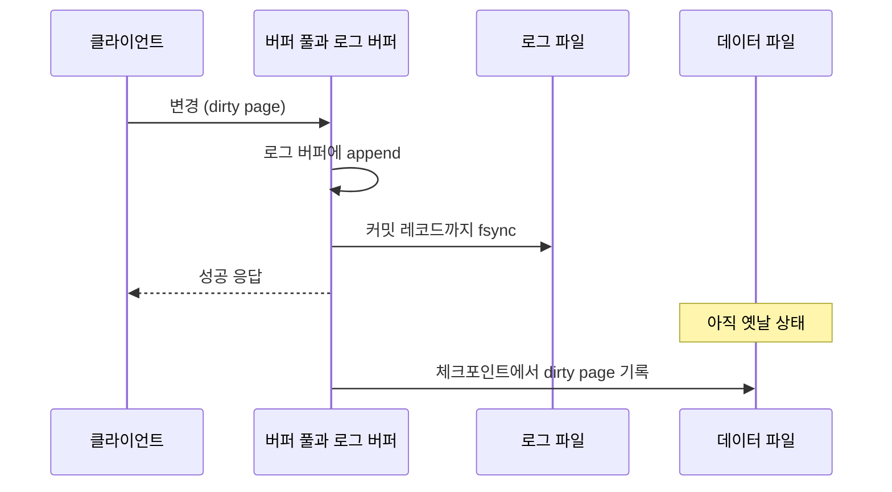

"커밋하면 디스크에 저장된다"는 말은 맞지만, 저장되는 것이 데이터 파일은 아니다. 데이터 페이지는 한참 뒤에 쓰인다. 커밋 시점에 디스크에 닿는 것은 **로그**이고, 이 순서를 뒤집지 않는 것이 [ACID](/posts/acid/)의 D(내구성)를 만드는 방법이다.

## 문제: 랜덤 쓰기는 느리다

트랜잭션 하나가 여러 테이블의 여러 페이지를 바꾼다. 그 페이지들은 디스크 여기저기에 흩어져 있다. 커밋할 때마다 전부 제자리에 쓰면, 커밋 하나가 랜덤 쓰기 수십 번이 된다.

게다가 중간에 죽으면 일부만 쓰인 상태가 남는다. 어느 페이지가 반영됐고 어느 것이 안 됐는지 알 방법이 없다.

## 해법: 로그를 먼저 쓴다

Write-Ahead Logging의 규칙은 하나다. 데이터 페이지를 디스크에 쓰기 전에, 그 변경을 기술한 로그 레코드를 먼저 디스크에 쓴다. PostgreSQL 문서는 데이터 파일의 변경은 그 변경을 기술한 WAL 레코드가 영구 저장소에 flush된 뒤에만 쓰여야 한다고 이 규칙을 설명한다([PostgreSQL: Write-Ahead Logging (WAL)](https://www.postgresql.org/docs/current/wal-intro.html)).

커밋 시점에 하는 일은 이것뿐이다.

1. 변경 내용을 로그 버퍼에 append
2. 커밋 레코드까지 로그를 디스크에 `fsync`
3. 클라이언트에 성공 응답

데이터 페이지는 메모리(버퍼 풀)에서만 바뀐 채로 남는다(dirty page). 디스크의 데이터 파일은 아직 옛날 상태다. 커밋과 체크포인트를 시간 순으로 놓으면 다음과 같다.

이 순서로 얻는 것이 크다. 로그는 순차 쓰기이고 파일 하나다. 그래서 랜덤 쓰기 수십 번이 순차 쓰기 한 번 + `fsync` 한 번이 된다.

크래시에서 복구하는 방법도 이 규칙에서 나온다. 재시작하면 로그를 읽어 커밋된 것은 다시 적용하고([redo](/posts/redo-undo-log/)), 커밋 안 된 것은 되돌린다(undo). 로그에 커밋 레코드가 있으면 그 트랜잭션은 성공한 것이고, 데이터 페이지에 반영이 안 됐어도 redo로 복원된다.

## 그룹 커밋

`fsync`는 비싸다. 커밋마다 하나씩 하면 디스크 지연이 곧 커밋 지연이다.

그룹 커밋이 이 비용을 나눈다. 짧은 시간 안에 도착한 여러 트랜잭션의 커밋을 모아 `fsync` 한 번으로 처리한다. PostgreSQL 문서도 작은 트랜잭션이 동시에 많을 때 WAL `fsync` 한 번으로 여러 트랜잭션을 커밋할 수 있다고 적는다. 그래서 동시성이 높을수록 커밋당 비용이 줄어든다.

실무적 함의가 하나 있다. **"커밋 지연이 N ms"는 단일 수치가 아니라 부하의 함수다.** 한가할 때 잰 값과 바쁠 때 잰 값이 다르고, 대개 바쁠 때가 건당으로는 더 싸다.

## 체크포인트

로그는 무한히 자랄 수 없다. 그리고 복구 시 읽어야 할 로그가 길면 재시작이 오래 걸린다.

체크포인트는 "이 지점까지의 변경은 데이터 파일에 반영됐다"를 기록한다. dirty page들을 디스크에 쓰고, 그 시점을 로그에 남긴다. 그러면 복구는 마지막 체크포인트부터 읽으면 된다.

여기에 교환이 있다.

- 자주 하면: 복구가 빠르고, 평상시 디스크 쓰기가 늘어난다.
- 드물게 하면: 평상시가 가볍고, 복구가 느리며, 한 번에 쓸 양이 많아 체크포인트 순간에 지연 스파이크가 생긴다.

MySQL에서 `innodb_io_capacity`와 리두 로그 크기(`innodb_redo_log_capacity`)를 튜닝하는 것이 이 교환을 조절하는 일이다. 리두 로그가 작으면 체크포인트가 강제로 자주 일어나고(furious flushing), 그때 처리량이 눈에 띄게 떨어진다.

PostgreSQL에서는 `checkpoint_timeout`, `max_wal_size`, `checkpoint_completion_target`이 같은 역할이다. 체크포인트는 `checkpoint_timeout`이 지나거나 `max_wal_size`를 넘기려 할 때 중 먼저 오는 쪽에서 시작하고, 기본값은 5분과 1GB다([PostgreSQL: WAL Configuration](https://www.postgresql.org/docs/current/wal-configuration.html)). 마지막 값은 체크포인트 쓰기를 시간에 걸쳐 분산시켜 스파이크를 줄인다.

## 부분 페이지 쓰기

디스크의 원자적 쓰기 단위(보통 512B~4KB)가 DB 페이지 크기(8~16KB)보다 작다. 그래서 페이지를 쓰는 도중 전원이 나가면 반만 쓰인 페이지가 남는다. 이 페이지는 redo로도 복구할 수 없다. redo는 정상 페이지에 변경을 적용하는 것이지 손상된 페이지를 고치는 것이 아니기 때문이다.

두 DB가 각각 다르게 푼다.

- MySQL: 더블라이트 버퍼. 버퍼 풀에서 내보내는 페이지를 먼저 별도 영역에 쓰고, 그 다음 제자리에 쓴다. 손상되면 크래시 복구 때 별도 영역의 복사본으로 복구한다([MySQL: Doublewrite Buffer](https://dev.mysql.com/doc/refman/8.4/en/innodb-doublewrite-buffer.html)).
- PostgreSQL: `full_page_writes`. 체크포인트 후 각 페이지의 첫 변경 시 페이지 전체를 WAL에 기록한다. 그래서 체크포인트 직후 WAL 양이 급증한다.

두 방식 다 쓰기가 두 배가 되는 구간이 있다는 뜻이고, 이것이 "WAL이 왜 이렇게 많이 쌓이지"의 흔한 답이다.

## 커밋 내구성의 손잡이

| 설정 | 의미 |
| --- | --- |
| `innodb_flush_log_at_trx_commit=1` | 커밋마다 `fsync`. 기본이자 가장 안전 |
| `=2` | 커밋 시 OS에 쓰기만, `fsync`는 1초마다. OS 크래시에 최근 1초 유실 |
| `=0` | 1초마다 쓰기와 `fsync`. 프로세스 크래시에도 유실 |
| `synchronous_commit=on` | 커밋 시 WAL `fsync` (PostgreSQL 기본) |
| `=off` | 비동기. 최근 커밋 유실 가능, **데이터 손상은 없음** |
| `=remote_apply` | 동기 복제본이 적용할 때까지 대기 |

[MySQL 문서](https://dev.mysql.com/doc/refman/8.4/en/innodb-parameters.html#sysvar_innodb_flush_log_at_trx_commit)는 0과 2에서 "1초마다"가 100% 보장되지는 않는다고 덧붙인다.

PostgreSQL의 `synchronous_commit=off`가 특이하다. 유실은 가능하지만 일관성은 깨지지 않는다.


"The risk that is taken by using asynchronous commit is of data loss, not data corruption."


비동기 커밋이 지는 위험은 데이터 유실이지 손상이 아니라는 뜻이다([PostgreSQL: Asynchronous Commit](https://www.postgresql.org/docs/current/wal-async-commit.html)). "최근 몇 건이 없었던 일이 될 수 있다"이지 "데이터가 망가진다"가 아니다. 설정을 고를 때는 이 구분을 기준으로 삼는다.

## 이 설명이 깨지는 곳

- **`fsync`가 거짓말할 수 있다.** 쓰기 캐시가 켜진 디스크는 캐시에 담고 성공을 돌려준다([페이지 캐시와 fsync](/posts/page-cache-and-fsync/)).
- **복제가 있으면 내구성의 정의가 바뀐다.** 로컬 `fsync`보다 "과반 복제본이 받았는가"가 더 강한 보장일 수 있다([리플리케이션 기본](/posts/db-replication/)).
- **WAL은 복제와 PITR의 재료이기도 하다.** 스트리밍 복제, 논리 복제, 시점 복구, CDC가 전부 이 로그를 읽는다([CDC의 원리와 한계](/posts/cdc-principles-and-limits/)).
- **긴 트랜잭션은 WAL을 쌓는다.** 커밋되지 않은 트랜잭션이 있으면 그 이전 로그를 지울 수 없다.

## 무엇을 재면 확인되는가

1. `innodb_flush_log_at_trx_commit`이나 `synchronous_commit`을 바꿔 가며 커밋 지연과 처리량을 재고, 동시성을 올려 그룹 커밋 효과를 본다.
2. 리두 로그 크기를 줄여 체크포인트를 강제로 자주 일으키고 처리량 저하를 관찰한다.
3. 체크포인트 직후의 WAL 생성량 급증(`full_page_writes`)을 실제로 본다.

[ParityPay 2편](/posts/parity-pay-lock-hold-time/)에서 잠금 보유 17ms 중 마지막 0.761ms가 "COMMIT — 잠금 해제"였다. 그 0.761ms 안에서 일어나는 일이 이 글의 내용이고, 설정에 따라 그 값이 달라진다.

## 정리

- 커밋 시점에 디스크에 닿는 것은 데이터 페이지가 아니라 로그다. 순차 쓰기 한 번으로 랜덤 쓰기 수십 번을 대신한다.
- 그룹 커밋 때문에 커밋 지연은 단일 수치가 아니라 부하의 함수다.
- 부분 페이지 쓰기 방어(더블라이트, `full_page_writes`) 때문에 쓰기가 두 배가 되는 구간이 있다.

## 참고

- [PostgreSQL: Write-Ahead Logging (WAL)](https://www.postgresql.org/docs/current/wal-intro.html)
- [PostgreSQL: WAL Configuration](https://www.postgresql.org/docs/current/wal-configuration.html)
- [PostgreSQL: Asynchronous Commit](https://www.postgresql.org/docs/current/wal-async-commit.html)
- [MySQL: InnoDB Redo Log](https://dev.mysql.com/doc/refman/8.4/en/innodb-redo-log.html)
- [MySQL: Doublewrite Buffer](https://dev.mysql.com/doc/refman/8.4/en/innodb-doublewrite-buffer.html)
- [MySQL: innodb_flush_log_at_trx_commit](https://dev.mysql.com/doc/refman/8.4/en/innodb-parameters.html#sysvar_innodb_flush_log_at_trx_commit)
- [Redo·Undo 로그 정리](/posts/redo-undo-log/), [ACID 정리](/posts/acid/)
