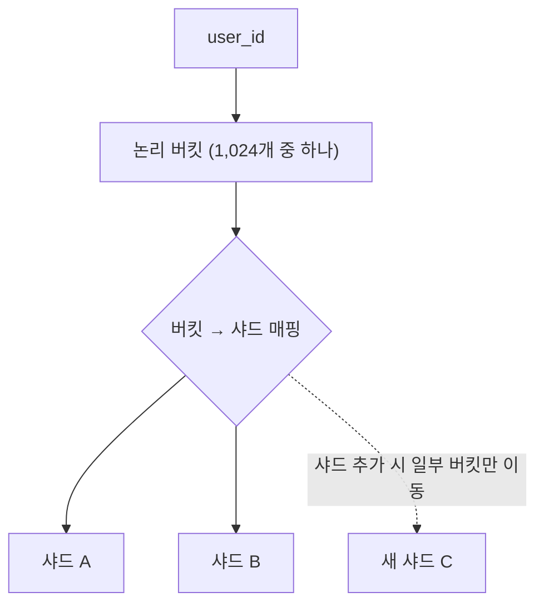

테이블이 커져서 느려졌을 때 "파티셔닝하자"가 나오는데, 무엇이 해결되고 무엇은 그대로인지 구분하지 않으면 복잡도만 늘어난다. 그리고 파티셔닝과 샤딩은 같은 단어로 묶이기 쉽지만, 한 대 안에서 나누는 것과 여러 대로 나누는 것은 전혀 다른 문제다.

## 둘의 차이

| | 파티셔닝 | 샤딩 |
| --- | --- | --- |
| 범위 | DB 한 대 안 | 여러 대 |
| 트랜잭션 | 파티션을 넘어도 하나 | 샤드를 넘으면 분산 트랜잭션 |
| 조인 | 그대로 가능 | 샤드를 넘으면 애플리케이션이 조립 |
| 유니크 제약 | 테이블 전체에 걸 수 있다(조건 있음) | **전역 보장이 어렵다** |
| 운영 | DB 기능 | 라우팅·재분배를 직접 만들어야 한다 |

파티셔닝은 DB가 해 주는 일이고, 샤딩은 **대부분 애플리케이션이 떠안는 일**이다. 그래서 순서가 있다. 인덱스 → 쿼리 개선 → 읽기 [복제본](/posts/db-replication/) → 파티셔닝 → 그래도 안 되면 샤딩.

## 파티셔닝이 실제로 해결하는 것

첫째는 파티션 가지치기(pruning)다. `WHERE created_at >= '2026-08-01'`처럼 파티션 키가 조건에 있으면 해당 파티션만 읽는다. 이것이 조회가 빨라지는 유일한 경로다. 거꾸로 파티션 키가 조건에 없으면 전체 파티션을 훑으므로 오히려 느려질 수 있다.

둘째는 오래된 데이터 제거다. 월별 파티션이면 지난 달 데이터를 `DROP PARTITION` 한 번으로 지운다. `DELETE` 수백만 건과 그에 따른 vacuum·인덱스 정리가 사라진다. PostgreSQL 문서도 파티션 하나를 `DROP TABLE`하거나 `DETACH PARTITION`하는 것이 대량 작업보다 훨씬 빠르고, 대량 `DELETE`가 남기는 `VACUUM` 부담을 피한다고 적는다([PostgreSQL: Table Partitioning](https://www.postgresql.org/docs/current/ddl-partitioning.html)). **실무에서 파티셔닝의 가장 확실한 이득이 이쪽인 경우가 많다.**

셋째, 인덱스와 vacuum의 단위가 작아진다. 인덱스가 파티션마다 나뉘므로 각각이 작고, 유지 작업도 파티션 단위로 돈다.

해결하지 못하는 것도 분명하다. 쓰기 처리량은 늘지 않는다. 같은 디스크, 같은 CPU, 같은 [WAL](/posts/wal-and-checkpoint/)이다. 그래서 쓰기가 병목이면 파티셔닝은 답이 아니다.

## 기준 선택

| 방식 | 적합 | 주의 |
| --- | --- | --- |
| 범위(시간) | 로그, 이력, 시계열 | 최신 파티션에 쓰기가 몰린다 |
| 리스트(지역, 상태) | 값의 종류가 적고 고정적 | 값이 늘면 파티션 추가 운영 |
| 해시(ID) | 고르게 분산 | **범위 조회에 가지치기가 안 된다** |

시간 기준이 가장 흔하고, 가장 흔한 실패도 여기서 난다. 조회 조건에 시간이 없으면 이득이 없다. 주문 테이블을 주문일로 파티셔닝했는데 조회가 대부분 `WHERE user_id = ?`라면, 모든 파티션을 뒤진다.

그래서 파티션 키는 **데이터의 성질이 아니라 조회 패턴이 정한다.**

## 로컬 인덱스와 전역 유니크

PostgreSQL의 선언적 파티셔닝에서 인덱스는 파티션마다 따로 만들어진다(로컬 인덱스). 전역 인덱스가 없다.

그래서 **유니크 제약을 걸려면 파티션 키가 그 제약에 포함되어야 한다.** `UNIQUE (order_no)`는 안 되고 `UNIQUE (order_no, created_at)`은 된다. 문서의 설명은 이렇다. 제약을 이루는 각 인덱스는 자기 파티션 안의 유일성만 직접 강제할 수 있다. 그러므로 서로 다른 파티션 사이에 중복이 없다는 것은 파티션 구조 자체가 보장해야 한다.

실무에서 이것이 설계를 바꾼다. 주문번호를 전역 유니크로 두고 싶은데 파티션 키가 날짜라면, 주문번호 자체에 날짜를 포함시키거나 별도 유니크 테이블을 두는 식의 우회가 필요하다.

## 샤딩의 진짜 비용은 재분배

샤딩을 시작하는 것보다 샤드를 늘리는 것이 어렵다.

`user_id % N`으로 나눴다면 N이 바뀌는 순간 거의 모든 데이터가 이동한다. 이것을 피하는 방법이 둘이다.

첫째는 일관된 해싱이다. 노드를 추가해도 전체가 아니라 일부만 이동한다.

둘째는 가상 버킷이다. 처음부터 1,024개 같은 논리 버킷으로 나누고, 버킷을 물리 샤드에 매핑한다. 샤드를 늘리면 매핑만 바꾸고 해당 버킷만 옮긴다. 키에서 버킷을 구하는 계산은 그대로다. Redis Cluster가 이 방식의 예다. 키 공간을 16384개 해시 슬롯으로 나누고, 각 마스터 노드가 그 일부를 맡는다([Redis Cluster specification](https://redis.io/docs/latest/operate/oss_and_stack/reference/cluster-spec/)).

키가 샤드에 닿는 경로를 그리면 다음과 같다.

`user_id % N`과 달리 샤드 수가 바뀌어도 첫 화살표는 바뀌지 않고, 바뀌는 것은 매핑표뿐이다.

어느 쪽이든 **이동 중에도 읽기와 쓰기가 계속돼야** 한다. 그래서 이중 쓰기, 복사, 검증, 전환의 단계가 필요하고, 샤딩 운영의 대부분이 이 절차다.

핫 샤드도 문제다. 고르게 나눈 것 같아도 특정 키에 트래픽이 몰린다. 대형 고객 하나가 한 샤드를 다 쓰는 상황은 흔하고, 그때는 그 키만 별도로 빼는(전용 샤드) 예외 처리가 필요하다.

## 이 설명이 깨지는 곳

- **파티션이 너무 많으면 계획 수립이 느려진다.** PostgreSQL 문서는 대부분의 쿼리가 소수의 파티션만 남기고 가지치기된다면 플래너가 수천 개 파티션까지 대체로 잘 다룬다고 한다. 가지치기 뒤에 남는 파티션이 많을수록 계획 시간과 메모리 사용이 늘어난다.
- **파티션 키는 사실상 바꿀 수 없다.** 전체 재구축이므로 처음 선택이 오래 간다. 문서도 일반 테이블을 파티션 테이블로 바꿀 수 없고, 대량 데이터의 재파티셔닝은 매우 느릴 수 있어 처음부터 바르게 정해야 한다고 적는다.
- **읽기 복제본이 더 싼 답일 때가 많다.** 읽기가 병목이면 복제본 추가가 파티셔닝보다 단순하다.
- **샤딩 전에 도메인 분리를 먼저 본다.** 한 테이블이 너무 큰 것이 아니라 한 DB에 너무 많은 도메인이 있는 경우가 흔하다.

## 무엇을 재면 확인되는가

1. 파티션 키가 있는 쿼리와 없는 쿼리의 실행 계획을 비교해 가지치기가 실제로 일어나는지 본다([실행 계획 읽기](/posts/reading-execution-plans/)).
2. `DROP PARTITION`과 같은 양의 `DELETE`를 비교한다. 소요 시간과 그 뒤의 vacuum 부하까지.
3. 파티션 수를 늘려 가며 계획 수립 시간을 잰다. 임계점이 있다.
4. 샤드 간 키 분포를 실제 데이터로 계산한다. 핫 샤드가 미리 보인다.

## 실무와의 접점

[ParityPay 5편](/posts/parity-pay-outbox/)의 한계에 "`PUBLISHED` 행이 쌓이는데 테이블 정리를 하지 않았다"를 적었다. Outbox는 시간 기준 파티셔닝이 잘 맞는 테이블이다. 조회가 항상 최근 데이터이고, 오래된 것은 통째로 버려도 되며, `DELETE` 대신 `DROP PARTITION`을 쓸 수 있다. 파티셔닝이 성능 최적화가 아니라 보존 정책의 구현 수단인 경우이고, 이쪽이 더 흔한 용법이다.

[키 생성 병목 시리즈](/posts/sequence-part1/)에서 다룬 채번도 여기 닿는다. 샤딩을 하면 전역 시퀀스를 쓸 수 없으므로, 샤드별 범위 할당이나 스노우플레이크 같은 분산 ID가 필요해진다.

## 정리

- 파티셔닝이 확실히 주는 것은 가지치기와 `DROP PARTITION`이고, 쓰기 처리량은 주지 않는다.
- 파티션 키는 조회 조건과 유니크 제약 양쪽에 들어가야 하므로, 한 번 정하면 설계 전체가 그 키를 따른다.
- 샤딩은 시작보다 재분배가 어렵다. 가상 버킷으로 미리 나눠 두면 재분배가 매핑 변경과 일부 버킷 이동으로 줄어든다.

## 참고

- [PostgreSQL: Table Partitioning](https://www.postgresql.org/docs/current/ddl-partitioning.html)
- [MySQL: Partitioning](https://dev.mysql.com/doc/refman/8.4/en/partitioning.html)
- [Redis Cluster specification](https://redis.io/docs/latest/operate/oss_and_stack/reference/cluster-spec/)
- [B+Tree 인덱스의 내부](/posts/btree-index-internals/)
