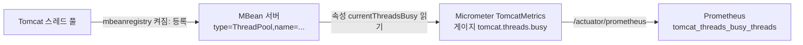

[무너지는 Spring 서버 1편](/posts/tomcat-thread-exhaustion/)에서 측정이 틀어진 첫 번째 원인은 Tomcat 스레드 지표가 아예 없었다는 것이다. `/actuator/prometheus`에 `tomcat_threads_busy_threads`가 없었다. 설명은 한 줄이었다. "Micrometer의 Tomcat 바인더는 MBean을 읽는데, `server.tomcat.mbeanregistry.enabled: true`가 없으면 MBean이 등록되지 않는다." 이 문장에는 모르는 단어가 셋 있다. JMX, MBean, 바인더다. 이 글은 셋을 차례로 풀고, 왜 결과가 0이 아니라 빈 패널이었는지를 설명한다.

## JMX: JVM 안의 관리 창구

JMX(Java Management Extensions)는 애플리케이션과 장치, 서비스 같은 자원을 관리하고 모니터링하는 Java SE 표준이다([JMX 소개](https://docs.oracle.com/en/java/javase/21/jmx/introduction-jmx-technology.html)). 구조는 두 층으로 보면 충분하다.

- **MBean**(Managed Bean): 관리할 자원 하나를 대표하는 Java 객체다. 속성(attribute)을 읽고 쓸 수 있고 연산(operation)을 호출할 수 있다. Tomcat의 스레드 풀이라면 `maxThreads`, `currentThreadsBusy` 같은 속성을 가진 MBean이 하나 생긴다.
- **MBean 서버**: MBean이 등록되는 저장소다. 각 MBean은 `도메인:key=value,...` 형식의 `ObjectName`으로 등록되고, 바깥에서는 이 이름으로 찾아 속성을 읽는다.

JVM은 자기 자신에 대한 MBean도 기본으로 갖고 있다. `ManagementFactory.getPlatformMBeanServer()`가 돌려주는 플랫폼 MBean 서버에는 처음 호출될 때 스레드(`java.lang:type=Threading`), 메모리(`java.lang:type=Memory`) 같은 플랫폼 MXBean이 등록된다([ManagementFactory](https://docs.oracle.com/en/java/javase/21/docs/api/java.management/java/lang/management/ManagementFactory.html)). JConsole이나 VisualVM이 원격으로 붙어서 보여주는 값도 이 MBean들이다.

비유하면 MBean 서버는 건물의 계기판 벽이고, MBean은 거기 붙은 계기 하나하나다. 계기가 벽에 붙어 있어야 누구든 와서 눈금을 읽을 수 있다.

## Micrometer 바인더: MBean을 읽어 지표로 바꾸는 쪽

Micrometer는 애플리케이션 지표를 모아 Prometheus 같은 모니터링 시스템 형식으로 내보내는 라이브러리다. Spring Boot Actuator가 이것을 쓴다. 지표 수집 단위를 **바인더**(binder)라고 부르는데, JVM 바인더만 해도 클래스 로딩, 메모리, GC, 스레드 등을 맡는 것이 따로 있다([Micrometer JVM Metrics](https://docs.micrometer.io/micrometer/reference/reference/jvm.html)).

Tomcat 바인더(`TomcatMetrics`)가 하는 일을 소스로 보면 이렇다([TomcatMetrics.java](https://raw.githubusercontent.com/micrometer-metrics/micrometer/main/micrometer-core/src/main/java/io/micrometer/core/instrument/binder/tomcat/TomcatMetrics.java)).

1. MBean 서버에서 `<도메인>:type=ThreadPool,name=*` 패턴에 맞는 MBean 이름을 찾는다.
2. 찾으면 MBean마다 게이지를 등록한다. `tomcat.threads.busy`는 `currentThreadsBusy` 속성을, `tomcat.threads.config.max`는 `maxThreads` 속성을, `tomcat.threads.current`는 `currentThreadCount` 속성을 읽는다.
3. 아직 하나도 없으면 MBean 등록 알림을 받는 리스너를 걸어 두고, 나중에 등록될 때 게이지를 만든다.

게이지는 값을 미리 저장하지 않는다. 지표를 내보내는 시점에 함수를 불러 현재 값을 읽는다([Micrometer Gauges](https://docs.micrometer.io/micrometer/reference/concepts/gauges.html)). 그래서 Prometheus가 긁어 갈 때마다 MBean의 `currentThreadsBusy`를 새로 읽는다. 이름의 점은 Prometheus 이름 규칙에 따라 밑줄로 바뀌어 `tomcat_threads_busy_threads`로 보인다.



## MBean이 없으면 지표는 0이 아니라 없다

Spring Boot 문서는 Tomcat의 MBean 레지스트리가 기본으로 꺼져 있고, 켜져 있을 때만 Tomcat 계측을 자동 구성한다고 적는다([Spring Boot Metrics](https://docs.spring.io/spring-boot/reference/actuator/metrics.html)).

```yaml
server:
  tomcat:
    mbeanregistry:
      enabled: true
```

이 설정이 없으면 위 그림의 첫 화살표가 끊긴다. MBean 서버에 `ThreadPool` MBean이 없으니 바인더의 1단계에서 찾는 것이 없다. 게이지는 등록되지 않는다. Prometheus가 긁어 가는 출력에 그 이름의 줄 자체가 없다.

여기서 0과 "없음"의 차이가 중요하다.

- 값이 0이면 그래프에 바닥에 붙은 선이 그려진다. "바쁜 스레드가 없다"는 주장이고, 틀렸다면 누군가 의심할 수 있다.
- 시계열이 없으면 그래프는 빈 패널이다. 쿼리 결과가 비어 있으므로 경보 규칙도 조건을 평가할 값이 없어 울리지 않는다.

1편의 anti 조건에서 실제 값은 200개 중 191개였다. 설정이 빠진 상태였다면 그 순간에도 대시보드는 비어 있었을 것이고, 빈 패널은 "문제 없음"과 구별되지 않는다. 지표 체계 전반은 [메트릭, 로그, 트레이스](/posts/metrics-logs-traces/)에서 다뤘다.

## MBean을 거치지 않는 지표도 있다

모든 지표가 MBean에서 오는 것은 아니다. 1편 실험의 `UpstreamClient`는 벌크헤드에 남은 permit 수를 Micrometer 게이지로 직접 등록한다.

```java
Gauge.builder("opslab.upstream.bulkhead.available", this, UpstreamClient::availablePermits)
        .register(registry);
```

이 게이지는 MBean 서버를 거치지 않고 [세마포어](/posts/semaphore-and-permits/)의 `availablePermits()`를 바로 읽는다. 그래서 MBean 설정과 무관하게 항상 나온다. 반대로 Tomcat처럼 남이 만든 컴포넌트의 내부 상태는 그 컴포넌트가 MBean으로 내놓아야 읽을 수 있다. 바인더는 그 MBean이 있다는 전제 위에서만 동작한다.

## 정리

- MBean은 자원 하나를 대표하는 관리용 객체이고, MBean 서버는 그것을 이름으로 찾게 해 주는 등록소다.
- Micrometer의 Tomcat 바인더는 MBean 서버에서 `ThreadPool` MBean을 찾아 그 속성을 읽는 게이지를 만든다. 찾지 못하면 게이지를 만들지 않는다.
- 그래서 MBean이 빠진 지표는 0이 아니라 빈 시계열로 나타난다. 빈 패널과 침묵하는 경보는 정상처럼 보인다.
- 새 대시보드를 만들면 장애가 없을 때 각 패널에 값이 실제로 찍히는지부터 확인한다. 값이 0인 것과 값이 없는 것은 다른 문제다.

## 참고

- [무너지는 Spring 서버 1편](/posts/tomcat-thread-exhaustion/) — 지표가 비어 있던 실험
- [Java SE 21 - Introduction to JMX Technology](https://docs.oracle.com/en/java/javase/21/jmx/introduction-jmx-technology.html) — MBean, MBean 서버, 커넥터
- [Java SE 21 API - ManagementFactory](https://docs.oracle.com/en/java/javase/21/docs/api/java.management/java/lang/management/ManagementFactory.html) — 플랫폼 MBean 서버와 플랫폼 MXBean의 `ObjectName`
- [Micrometer - JVM Metrics](https://docs.micrometer.io/micrometer/reference/reference/jvm.html) — JVM 바인더 목록
- [Micrometer - Gauges](https://docs.micrometer.io/micrometer/reference/concepts/gauges.html) — 게이지는 관측 시점에 값을 읽는다
- [Micrometer 소스 - TomcatMetrics.java](https://raw.githubusercontent.com/micrometer-metrics/micrometer/main/micrometer-core/src/main/java/io/micrometer/core/instrument/binder/tomcat/TomcatMetrics.java) — `ThreadPool` MBean 조회와 속성 이름
- [Spring Boot Reference - Metrics](https://docs.spring.io/spring-boot/reference/actuator/metrics.html) — `server.tomcat.mbeanregistry.enabled`
