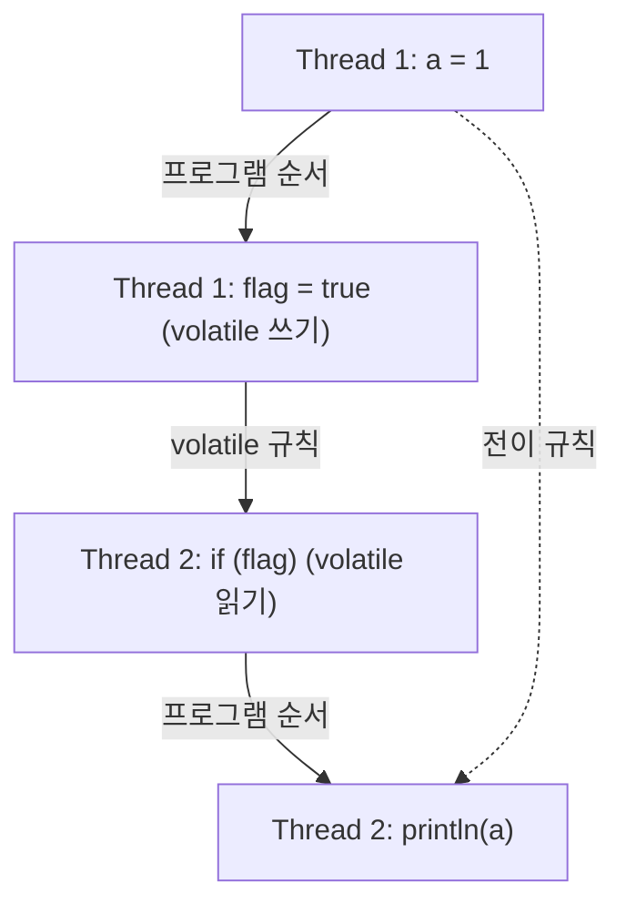

멀티스레드 버그를 "가시성 문제"라고 부르고 `volatile`을 붙여 고친 경험은 있는데, 왜 그게 고쳐지는지는 설명하지 못했다. 자바 메모리 모델(JMM)은 그 "왜"를 정의한 문서다. JSR-133이 정의했고, 언어 명세 17장에 들어 있다. 그 정의의 중심에 happens-before라는 관계 하나가 있다.

## 무엇이 문제인가: 코드 순서는 실행 순서가 아니다

```java
// 초기값: a = 0, flag = false
// Thread 1
a = 1;
flag = true;

// Thread 2
if (flag) {
    System.out.println(a);   // 0이 찍힐 수 있다
}
```

`a = 1`이 `flag = true`보다 코드에서 먼저 있으니 Thread 2가 `flag`를 봤다면 `a`도 봐야 할 것 같다. 그렇지 않다. 컴파일러는 의존성이 없는 두 문장의 순서를 바꿀 수 있고, CPU는 쓰기를 스토어 버퍼에 모았다가 순서를 바꿔 반영할 수 있으며, 각 코어의 캐시는 서로 다른 시점의 값을 갖고 있을 수 있다.

이것들은 버그가 아니다. 단일 스레드에서 관찰 가능한 결과가 같다면(as-if-serial) 재배치는 허용된다. 그래서 JMM은 재배치를 금지하는 대신 **어느 경우에 한 스레드의 쓰기가 다른 스레드에 반드시 보이는가**를 정의한다.

## happens-before: 보인다는 것의 정의

명세는 이 관계를 "If one action happens-before another, then the first is visible to and ordered before the second."라고 정의한다([JLS §17.4.5](https://docs.oracle.com/javase/specs/jls/se21/html/jls-17.html#jls-17.4.5)). 앞 동작이 뒤 동작에 보이고, 순서도 앞선다는 뜻이다. 명세가 정한 주요 규칙은 이렇다.

| 규칙 | 내용 |
| --- | --- |
| 프로그램 순서 | 한 스레드 안에서 앞 문장은 뒤 문장보다 happens-before |
| 모니터 잠금 | `unlock`은 같은 락의 이후 `lock`보다 happens-before |
| volatile | `volatile` 쓰기는 같은 변수의 이후 읽기보다 happens-before |
| 스레드 시작 | `Thread.start()`는 그 스레드의 모든 동작보다 happens-before |
| 스레드 종료 | 스레드의 모든 동작은 다른 스레드의 `join()` 반환보다 happens-before |
| 전이 | A hb B이고 B hb C이면 A hb C |

위 예제를 `volatile boolean flag`로 바꾸면, `flag = true`(쓰기)가 `if (flag)`(읽기)보다 happens-before가 된다. 프로그램 순서 규칙으로 `a = 1`은 `flag = true`보다 앞서므로, 전이 규칙에 따라 `a = 1`도 Thread 2에 보인다. 아래 그림이 그 사슬이다.



그래서 `volatile`이 고치는 것은 `flag` 하나가 아니라 그 앞의 모든 쓰기다. "volatile을 붙였더니 무관해 보이는 필드까지 제대로 보인다"는 경험은 이 전이 규칙으로 설명된다.

## volatile이 하지 않는 것

`volatile`은 가시성과 순서를 주지 원자성을 주지 않는다.

```java
volatile int count;
count++;   // 읽기 → 더하기 → 쓰기. 세 단계라 여전히 경쟁한다
```

`count++`는 `AtomicInteger.incrementAndGet()`이나 락이 필요하다. 반대로 원자성만 필요하고 가시성은 필요 없는 경우는 거의 없으므로, `Atomic*` 클래스는 내부적으로 `volatile` 필드에 [CAS](/posts/lock-free-and-cas/)(compare-and-swap, 읽은 값이 그대로일 때만 바꾸는 원자 연산)를 건다.

## final의 안전 공개

생성자가 끝나기 전에 객체 참조가 새어 나가면, 다른 스레드가 생성이 덜 된 객체를 볼 수 있다. JMM은 `final` 필드에 특별한 보장을 준다. 생성자가 정상적으로 끝나면, 그 객체를 참조하는 다른 스레드는 `final` 필드의 올바른 값을 본다. 동기화 없이도 그렇다([JLS §17.5](https://docs.oracle.com/javase/specs/jls/se21/html/jls-17.html#jls-17.5)).

조건이 있다. **생성자 안에서 `this`가 새어 나가지 않아야 한다.** 명세도 생성자가 끝나기 전에 다른 스레드가 볼 수 있는 곳에 그 객체의 참조를 쓰지 말라고 적는다. 생성자에서 리스너를 등록하거나 스레드를 시작하면 이 보장이 깨진다.

```java
public class Config {
    private final Map<String, String> values;   // final이라 안전 공개 대상

    public Config(Map<String, String> v) {
        this.values = Map.copyOf(v);
        // 여기서 registry.register(this) 같은 것을 하면 보장이 깨진다
    }
}
```

불변 객체를 쓰라는 조언의 근거가 이것이다. 모든 필드가 `final`이고 `this`가 새지 않으면 동기화 없이 공유해도 된다.

## 이 설명이 깨지는 곳

- x86에서 테스트하면 대부분 재현되지 않는다. x86의 메모리 모델은 비교적 강해서 재배치가 드물게 관찰된다. ARM(Apple Silicon, Graviton)에서는 같은 코드가 다르게 동작할 수 있다. "우리 서버에서는 문제없었다"가 이식성의 근거가 되지 못한다.
- `synchronized`는 락일 뿐 아니라 메모리 장벽이다. 경쟁이 없어도 가시성 때문에 필요한 경우가 있다.
- happens-before는 "동시에 일어나지 않는다"를 뜻하지 않는다. 순서가 정해진다는 것이지 시간상 겹치지 않는다는 뜻이 아니다.
- `volatile` 배열은 배열 참조만 volatile이다. 원소 쓰기에는 보장이 없다. 그래서 원소마다 `volatile` 접근 의미를 주는 `AtomicIntegerArray`가 따로 있다([java.util.concurrent.atomic](https://docs.oracle.com/en/java/javase/21/docs/api/java.base/java/util/concurrent/atomic/package-summary.html)).
- [가상 스레드](/posts/virtual-threads-internals/)에서도 JMM은 같다. 캐리어 스레드가 바뀌어도 happens-before 규칙이 보장을 유지한다.

## 무엇을 재면 확인되는가

JMM 위반은 부하와 하드웨어에 따라 나타나므로 단위 테스트로는 잡히지 않는다. 확인하려면 도구가 필요하다.

1. jcstress로 재배치를 관찰한다. OpenJDK의 동시성 스트레스 도구이고, 위 예제 같은 것을 수억 번 돌려 금지된 결과가 나오는지 센다.
2. ARM 머신에서 같은 테스트를 돌려 x86과 결과를 비교한다.
3. 경쟁 조건에서 `volatile`·`synchronized`·`Atomic`의 처리량 차이를 JMH(OpenJDK의 마이크로벤치마크 도구)로 잰다. 정확성이 아니라 비용의 비교다.

3번은 [동시성 도구의 비용](/posts/concurrency-primitives-cost/)에서 따로 다룬다.

## 실무와의 접점

[ParityPay](/posts/parity-pay-invariants/)에서 JMM이 정면으로 문제가 된 적은 없다. 상태를 JVM 안의 공유 변수가 아니라 DB 행에 두었기 때문이다. 여기서 실무적 결론이 나온다. 공유 가변 상태를 프로세스 메모리에 두지 않으면 JMM을 몰라도 되는 코드가 된다. 반대로 캐시, 카운터, 설정 리로드처럼 메모리에 상태를 두는 순간 이 규칙들이 정확성의 일부가 된다.

## 정리

- `volatile` 하나가 그 앞의 쓰기들까지 고치는 것은 프로그램 순서와 전이 규칙이 함께 작동하기 때문이다.
- x86에서 재현되지 않는 것은 정확성의 근거가 아니다. 확인하려면 jcstress 같은 도구가 필요하다.

## 참고

- [JLS 17.4: Memory Model](https://docs.oracle.com/javase/specs/jls/se21/html/jls-17.html#jls-17.4)
- [JSR-133 FAQ](https://www.cs.umd.edu/~pugh/java/memoryModel/jsr-133-faq.html) — Jeremy Manson, Brian Goetz
- [OpenJDK jcstress](https://github.com/openjdk/jcstress)
- [JVM 정리](/posts/jvm/)
