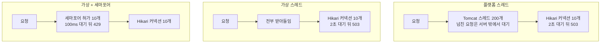

[가상 스레드의 내부](/posts/virtual-threads-internals/)에 핀닝(가상 스레드가 블로킹하는 동안 캐리어 스레드에서 내려오지 못하는 상태)을 설명하면서 "바꾸기 전에 핀닝을 먼저 측정한다"고 적어 뒀다. 문서를 근거로 쓴 글이었고, 그 측정을 한 적은 없었다. 이 글이 그것이다.

질문은 두 개다. 핀닝은 얼마를 앗아가는가. 그리고 스레드 수가 상한이 아니게 되면 무엇이 상한인가.

저장소는 [spring-ops-lab](https://github.com/polynomeer/spring-ops-lab)이고 재실행은 한 줄이다.

```bash
./scenarios/t4/run.sh a virtual 1
```

## 1부 설계: 하는 일은 같고, 쥐고 있는 것만 다르다

엔드포인트 다섯 개가 모두 같은 일을 한다. 200ms 걸리는 업스트림 호출 한 번. 다른 것은 그 호출이 블로킹하는 동안 무엇을 쥐고 있는지다.

| 엔드포인트 | 블로킹 중에 쥐고 있는 것 |
| --- | --- |
| `plain` | 없음 |
| `sync-striped` | 요청마다 다른 모니터 (`synchronized`) |
| `lock-striped` | 요청마다 다른 `ReentrantLock` |
| `sync-shared` | 공용 모니터 하나 |
| `lock-shared` | 공용 `ReentrantLock` 하나 |

핀닝만 보려면 모니터(`synchronized`가 쥐는 객체의 락)를 쥐는 것과 모니터를 기다리는 것을 분리해야 한다. striped 엔드포인트가 그 분리를 맡는다. 모니터를 65,536개 만들고 순차 카운터로 하나씩 나눠 주므로 동시에 떠 있는 요청이 같은 모니터를 만나는 일은 없다. 경합은 0이고, 남는 것은 "모니터를 쥔 채 블로킹했다"는 사실뿐이다.

여기서 한 가지를 피해야 했다. 요청마다 `new Object()`로 모니터를 만들면 짧지만 틀린다. 탈출하지 않는 모니터(만든 메서드 밖으로 참조가 나가지 않는 객체)는 [JIT](/posts/jit-compilation/)가 지워 버릴 수 있고, 지워진 락은 아무것도 핀닝하지 않는다. 그러면 측정된 것은 런타임이 아니라 최적화기다. 배열에 미리 담아 두어 탈출시켰다.

조건은 `spring.threads.virtual.enabled`를 false와 true로 두고 각각 3회다. 같은 jar, 같은 프로필, 같은 부하다. 플랫폼 스레드 조건에서는 다섯 엔드포인트가 다를 이유가 없다. 그래서 그 조건이 대조군이 된다. 차이가 한 칸에서만 나타나야 한다.

부하는 엔드포인트당 클라이언트 100개, 30초 창, 한 번에 하나씩. 이 저장소의 기본은 [open model](/posts/percentile-statistics/)(응답과 무관하게 정해진 도착률로 보내는 방식)이고, 그 이유는 [ADR](https://github.com/polynomeer/spring-ops-lab/blob/main/docs/adr/001-open-model-load-as-default.md)에 적어 뒀다. 그런데 1부는 closed model(클라이언트 수를 고정하고 응답을 받아야 다음 요청을 보내는 방식)로 돌렸다. 1부의 질문은 꼬리가 아니라 용량이기 때문이다. 이 요청을 동시에 몇 개까지 띄울 수 있는지가 답이어야 하고, 고정된 클라이언트 수는 그것을 직접 답한다. 2부는 다시 open model이다. 과부하에서의 admission(들어온 요청을 받아들일지 정하는 것)은 open model의 질문이다.

## 1부 결과

3회 중앙값이다. `ok`는 창 안의 완료 건수, `in flight`는 핸들러 안에 들어와 있는 요청 수다.

| | ok (플랫폼) | ok (가상) | in flight (플랫폼) | in flight (가상) | 핀 (가상) |
| --- | ---: | ---: | ---: | ---: | ---: |
| `plain` | 14,009 | 14,449 | 100 | 100 | 0 |
| **`sync-striped`** | **14,398** | **392** | 100 | **1** | **579** |
| `lock-striped` | 14,446 | 13,435 | 100 | 100 | 0 |
| `sync-shared` | 220 | 246 | 100 | 2 | 345 |
| `lock-shared` | 246 | 174 | 145 | 100 | 0 |

p50은 ms 단위로 이렇다.

| | 플랫폼 | 가상 |
| --- | ---: | ---: |
| `plain` | 206.93 | 205.90 |
| **`sync-striped`** | **205.83** | **10,269.73** |
| `lock-striped` | 205.44 | 206.34 |
| `sync-shared` | 15,406.87 | 20,183.52 |
| `lock-shared` | 20,448.74 | 20,471.81 |

캐리어 스레드는 5초마다 `jcmd Thread.print`로 셌다. 가상 스레드 조건에서 3개(정상 2개, 일시적으로 3개), 플랫폼 조건에서 0개다. 후자는 셀 스케줄러 풀이 없다.

## 37분의 1은 캐리어 수와 같다

엔드포인트 하나가 가상 스레드를 켜는 것만으로 37배 느려졌다. `sync-striped`는 플랫폼에서 14,398건, 가상에서 392건을 완료했다. 같은 jar, 같은 부하, 설정 플래그 하나 차이다. p50은 205.83ms에서 10,269.73ms로 50배가 됐다. 표의 나머지는 움직이지 않았다.

붕괴한 지점은 캐리어 수다. 동시 처리 건수가 100에서 1로 갔고, 캐리어는 2~3개다. `synchronized` 안의 가상 스레드는 unmount(캐리어에서 내려와 캐리어를 다른 가상 스레드에 넘기는 것)할 수 없으므로 캐리어가 같이 멈춘다. JEP 444가 핀닝의 첫 경우로 드는 것이 이것이다. "When it executes code inside a `synchronized` block or method"([JEP 444](https://openjdk.org/jeps/444)), 즉 `synchronized` 블록이나 메서드 안을 실행하는 동안이다. 그래서 그 핸들러 안에 동시에 있을 수 있는 요청 수는 캐리어 수이고, 1과 100 사이의 어떤 값이 아니다.

산술이 두 방향에서 맞는다. 클라이언트 100개를 10.27초 지연으로 나누면 9.7rps다. 캐리어 2개를 207ms 호출로 나누어도 9.7rps다.

같은 코드 경로에서 [`ReentrantLock`](/posts/concurrency-primitives-cost/)은 대가가 없다. `lock-striped`는 `sync-striped`에서 모니터만 런타임이 이해하는 락으로 바꾼 것이고, 13,435건 대 392건이며 핀은 0이다. 런타임이 락을 느리게 잡는 것이 아니다. 모니터를 쥔 프레임을 unmount하지 못하는 것이다. JEP 444가 자주 실행되면서 긴 I/O를 감싸는 `synchronized`를 `ReentrantLock`으로 바꾸라고 권하는 이유가 이 차이다.

## 경합하는 락에서는 핀닝이 공짜다

`sync-shared`와 `lock-shared`는 공용 락 하나로 직렬화된다. 그리고 둘의 결과가 서로의 편차 안에 들어온다(완료 246건과 174건, p50 20.18초와 20.47초).

모니터가 이미 용량 상한이기 때문이다. 핀닝을 없애도 바뀔 것이 없다. 그래서 "`synchronized`를 `ReentrantLock`으로 바꾸라"는 권고는 경합이 없는 쪽에서 값을 한다. 그런데 그쪽은 사람들이 그 권고를 적용하려고 찾아보는 곳의 반대편이다. 경합이 심한 임계 구역은 눈에 띄고 먼저 손대게 되지만, 거기서 락 종류를 바꿔도 처리량은 그대로다.

다만 핀닝이 사라진 것은 아니다. 두 행의 `in flight`가 2와 100이다. `synchronized` 쪽에서는 핸들러 안에 요청이 두 개밖에 존재하지 않는다. 나머지 98개는 캐리어를 얻지 못해 거기까지 오지도 못했다. `ReentrantLock` 쪽에서는 100개가 모두 안에 들어와 락을 기다린다. 처리량은 같고 런타임 상태는 전혀 다르다.

## 핀을 핸들러에 귀속시키기

`-Djdk.tracePinnedThreads=full`은 핀이 날 때 스택을 찍어 주지만 세기에 좋지 않다. 대신 JFR의 `jdk.VirtualThreadPinned`를 썼다. 이 이벤트는 기본으로 켜져 있지만 임계값이 20ms라([JEP 444](https://openjdk.org/jeps/444)) 짧은 핀을 놓친다. 그래서 1ms로 낮췄다.

이벤트에는 엔드포인트 필드가 없다. 어느 핸들러가 핀을 만들었는지는 스택 트레이스에만 있다. 귀속 결과는 `sync-striped` 579건, `sync-shared` 345건, 나머지 세 엔드포인트 0건이다. 가장 긴 핀은 225ms로 200ms 호출에 오버헤드가 붙은 값이다. 플랫폼 조건에서는 0건이고, 그 조건에서는 이벤트가 발생할 수 없다.

## 2부: 스레드가 상한이 아니면 무엇이 상한인가

`/api/vt/db`는 `pg_sleep(0.1)` 동안 커넥션을 쥔다. [HikariCP](/posts/hikaricp/)는 출하 설정 그대로 커넥션 10개, 대기 2초다. 풀 용량은 약 100rps이고 부하는 300rps, 60초, open model이다. 세 번째 조건은 풀 앞에 [세마포어](/posts/semaphore-and-permits/)를 두는데 허가 수는 풀 크기와 같은 10, 획득 대기는 100ms다.

429는 세마포어가 거절한 것이고 503은 통과한 뒤 Hikari의 2초를 다 기다리고 실패한 것이다. 2부는 이 둘을 따로 센다. 세 조건에서 요청이 어디서 기다리고 어디서 실패하는지를 그리면 이렇다.



| 조건 | p50 | p99 | 200 | 429 | 503 | in flight | 풀 대기 | 미전송 |
| --- | ---: | ---: | ---: | ---: | ---: | ---: | ---: | ---: |
| 플랫폼 스레드 | 18,214.94 | 20,111.56 | 7,593 | 0 | 2,056 | 199 | 189 | **8,272** |
| 가상 스레드 | 2,003.49 | 2,114.52 | 5,984 | 0 | 12,016 | 605 | 595 | 0 |
| 가상 + 세마포어 | **103.66** | **223.26** | 5,782 | 12,218 | 0 | 52 | **0** | 0 |

성공 처리량은 세 조건이 같다. 7,593 / 5,984 / 5,782건이고, 배출 구간까지 세면 모두 약 100rps, 즉 풀의 용량이다. 여기서 어떤 설정도 데이터베이스를 빠르게 만들지 않았다. 바뀐 것은 대기가 어디에 쌓이는지와 실패가 얼마인지다.

플랫폼 스레드는 상한을 우연히 문 앞에 둔다. [Tomcat](/posts/tomcat-thread-exhaustion/)이 `threads.max`인 200개까지만 받으므로 in flight가 199에 머물고 그중 189개가 풀을 기다린다. 나머지는 서버 밖에서 기다리고, 그래서 p50이 18.2초다.

그런데 이 행은 실패율로 비교할 수 없다. 그것을 알려 주는 숫자가 '미전송'이다. k6는 의도한 18,000건 중 8,272건을 보내지 못했다. VU(k6의 가상 사용자)가 전부 18초짜리 대기에 묶여 있었기 때문이다. 표만 보면 플랫폼이 21% 실패로 가상의 67%보다 좋아 보이지만, 실제로는 트래픽의 절반 이하만 응답한 것이다. 이 열이 없으면 결론이 뒤집힌다.

가상 스레드는 전부 받아들이고, 대기는 풀 안으로 들어간다. in flight 605, 풀 대기 595, p50 2,003.49ms다. p50이 Hikari의 `connection-timeout` 2,000ms와 사실상 같다. 3분의 2가 타임아웃을 꽉 기다린 뒤 실패했다. 미전송이 0이므로 도착한 요청은 모두 답을 받았고, 그 답이 대부분 느린 오류였다.

상한을 부족한 자원이 있는 곳에 두는 것은 값이 들지 않았다. 풀 대기가 0이 되고, 성공한 요청은 2,003.49ms에서 103.66ms로 19배 빨라졌고(p99는 2,114.52 → 223.26), 처리할 수 없는 요청은 2,000ms가 아니라 약 100ms에 거절됐다. 같은 성공 건수, 같은 데이터베이스, 세마포어 하나다.

가상 스레드를 켜는 변경은 스레드 풀을 지우는 변경이다. 스레드 풀은 admission 제어이기도 했다. 그래서 그것을 지우면 대체물을 명시적으로 넣어야 한다. 넣지 않으면 대체물은 그 아래 있는 가장 약한 자원의 타임아웃이 된다.

## 틀렸던 것 여섯 가지

이 중 넷이 계측기 자체의 문제였다.

**1. 업스트림이 애초에 닿지 않았다.** 앱이 compose 기본값인 toxiproxy를 그대로 쓰고 있었는데 이 시나리오는 toxiproxy에 프록시를 만들지 않는다. 모든 호출이 connect에서 거절됐다. 그런데 나온 표가 다섯 엔드포인트가 전부 동일하고 핀 0건이었다. 핀닝이 존재하지 않는다면 나올 표와 똑같다. "효과가 없다"와 "실험이 없다"를 갈라 준 것은 실패율 100% 열 하나였고, 200ms로 설정한 호출의 p50이 3.9ms라는 것이 단서였다.

**2. `summaryTrendStats`에 `p(99)`가 없었다.** 내보낸 요약에 p(95)와 max만 있어서 p99 칸이 전부 `-`였다.

**3. `jfr print`가 스택을 5프레임에서 자른다.** 그리고 핀의 상위 5프레임은 어느 핀이든 `VirtualThread`·`LockSupport` 내부라 완전히 같다. 기록된 776건이 전부 구별 불가였다. `--stack-depth 64`로 고쳤고, 핸들러 프레임은 소켓 읽기와 HTTP 클라이언트 아래 12프레임쯤에 있었다.

**4. 3번을 고쳐도 귀속이 안 됐다.** 파서가 첫 번째 `VirtualThreadController` 프레임을 핸들러로 잡았는데, 그건 모든 엔드포인트가 통과하는 private 헬퍼 `blockingCall`이었다. 스택을 읽는 이유는 그 위의 프레임인데 그 아래를 읽고 있었다. 1,105건이 여전히 미귀속이었다.

**5. 처리량을 완료 건수 ÷ 창 길이로 계산했다.** k6는 창이 닫힌 뒤에도 떠 있는 요청을 끝내므로, 포화된 행은 창보다 긴 시간의 완료를 창으로 나눠 약 50% 높게 읽혔다. 클라이언트 수 ÷ p50으로 교차 검증하고, 조건 간 비교는 동일한 창의 완료 건수로 한다.

**6. 실행 중인 셸 스크립트를 편집했다.** bash는 스크립트를 조금씩 읽어 나가므로 파일이 실행 중인 프로세스 밑에서 밀렸고, 런 중간에 문법 오류로 죽었다. 코드 문제가 아니라 작업 순서 문제이고, 그 런은 버리고 다시 돌렸다.

1번과 3번은 `reports/data/discarded/` 아래에 README와 함께 남겨 뒀다. 3번의 런은 다시 돌려야 했다. 잘린 스택은 저장된 파일에서 복구할 수 없기 때문이다. T3에서 GC 로그를 다시 파싱해 고칠 수 있었던 것과 달리, 런마다 남기는 것에 답을 다시 끌어낼 만큼의 정보가 없으면 재실행뿐이다.

## 한계

- CPU가 2개이므로 캐리어가 2개다. 스케줄러 병렬성의 기본값이 사용 가능한 프로세서 수(`availableProcessors`)이고([JEP 444](https://openjdk.org/jeps/444)), 핀닝된 붕괴는 그 수까지 간다. 16코어에서는 같은 코드가 16까지만 떨어지므로 상대적 손실이 작고 발견이 훨씬 늦다.
- JDK 21이다. `synchronized` 핀닝은 이 버전대에 한정된다. JDK 24에 들어간 [JEP 491](https://openjdk.org/jeps/491)이 제거했고, 그 제약이 없는 JDK에서는 1부 표가 평평해진다. 이 결과는 의도적으로 날짜가 박혀 있다.
- in flight 게이지는 창별이 아니라 전역이다. 요청이 20~30초 걸리는 행은 8초 간격으로 배출되지 않아 다음 창 표본에 남는다. `lock-shared`가 클라이언트 100개인데 145로 읽힌 것이 그것이다. 그래서 이 열은 1 대 100이 명백한 striped 행에서만 근거로 썼다.
- 요청당 블로킹 호출이 하나다. 200ms를 한 번 핀닝하는 것과 짧게 여러 번 핀닝하는 것은 다른 모양이고 재지 않았다.
- `pg_sleep`은 실제 질의가 아니다. 버퍼도 CPU도 락도 건드리지 않고 커넥션만 쥔다. 2부는 admission에 관한 것이고 데이터베이스가 그 일을 어떻게 하는지에 관한 것이 아니다.
- 세마포어 허가 수를 유도하지 않았다. 지키려는 자원이 풀이므로 풀 크기와 같게 뒀다. 엔드포인트마다 필요한 풀 지분이 다른 혼합 워크로드에서 이 값을 고르는 것은 별도 문제다.
- 3회다. 재현된다고 말할 만큼이고 분포를 말할 만큼은 아니다.

## 정리

- 경합 없는 `synchronized` 하나가 가상 스레드에서 처리량을 37분의 1로 만들었다. 플랫폼 스레드에서는 같은 코드가 `plain`과 구별되지 않는다.
- 붕괴하는 지점은 캐리어 수다. 동시 처리가 100에서 1로 갔고 캐리어는 2~3개였다. 중간값이 아니다.
- `ReentrantLock`으로 바꾸는 것은 경합이 없는 임계 구역에서 값을 한다. 경합하는 쪽에서는 모니터가 이미 상한이라 아무것도 바뀌지 않는다.
- 같은 처리량이라도 런타임 상태는 다를 수 있다. 공용 락 두 행의 in flight가 2와 100이었다.
- 가상 스레드를 켜는 것은 admission 제어를 지우는 것이다. 대체물을 넣지 않으면 그 아래 자원의 타임아웃이 대체물이 된다.
- 세마포어를 풀 크기로 두면 처리량은 그대로지만 성공이 19배 빨라지고 실패가 20배 싸진다.
- 과부하 실험에서는 클라이언트가 보내지 못한 요청 수를 먼저 본다. 8,272건이 빠진 표는 실패율을 거꾸로 읽게 만든다.

## 참고

- [spring-ops-lab](https://github.com/polynomeer/spring-ops-lab) — 원본은 `reports/data/t4a-*`·`t4b-*`, 표는 `reports/01-scenario-report.md`, 집계는 `scenarios/t4/aggregate.py`
- [가상 스레드의 내부](/posts/virtual-threads-internals/) — 이 실험의 개념 짝
- [Bulkhead Pattern](/posts/bulkhead/) — 2부가 넣은 것이 이것이다
- [커넥션 풀](/posts/connection-pool/)
- [JEP 444: Virtual Threads](https://openjdk.org/jeps/444) — 핀닝이 생기는 두 경우, `jdk.VirtualThreadPinned`의 기본 임계값 20ms, 스케줄러 병렬성의 기본값
- [JEP 491: Synchronize Virtual Threads without Pinning](https://openjdk.org/jeps/491)
