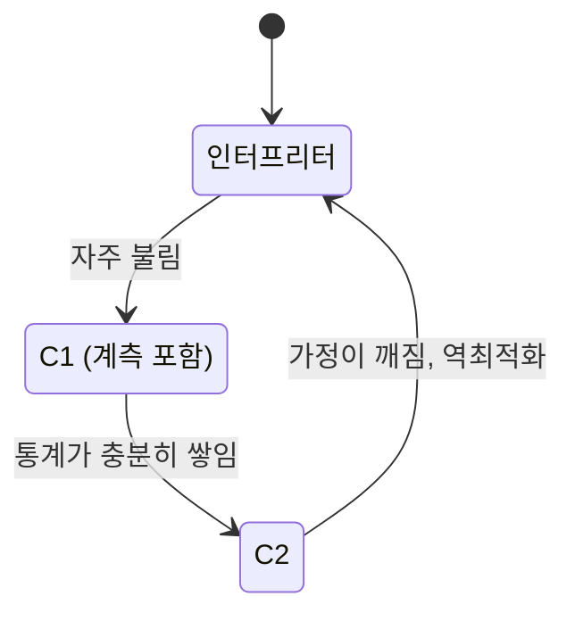

자바 성능을 측정했는데 실행할 때마다 값이 다르고, 루프를 백만 번 돌리니 갑자기 빨라지며, 벤치마크에서 잰 값이 운영에서 재현되지 않는다. 셋 다 JIT(Just-In-Time 컴파일러, 실행 중에 바이트코드를 기계어로 바꾸는 컴파일러)가 하는 일을 모르면 설명되지 않는다. 그리고 이것을 모르면 성능 측정 자체가 틀린다.

## 인터프리터에서 시작한다

[JVM](/posts/jvm/)은 바이트코드를 처음에는 해석 실행한다. 느리지만 즉시 시작할 수 있고, 무엇보다 실행 통계(프로파일)를 모을 수 있다. 어느 메서드가 자주 불리는지, 어느 분기가 주로 참인지, 어느 호출이 항상 같은 구현으로 가는지.

충분히 뜨거워지면 그 메서드를 기계어로 컴파일한다. 이때 모아 둔 통계를 근거로 최적화한다. 실행해 보기 전에는 알 수 없는 것들을 알고 컴파일하므로, 정적 컴파일러가 할 수 없는 최적화가 가능해진다.

## 계층 컴파일

컴파일러가 둘이다.

| | C1 (client) | C2 (server) |
| --- | --- | --- |
| 컴파일 속도 | 빠름 | 느림 |
| 코드 품질 | 보통 | 높음 |
| 역할 | 빨리 괜찮은 코드 + 통계 수집 | 오래 걸려도 최적 코드 |

기본값인 계층 컴파일(tiered compilation)은 둘을 함께 쓴다. 인터프리터 → C1(계측 포함) → C2로 단계적으로 올라간다. Oracle의 HotSpot 문서는 C1이 만든 코드가 스스로 프로파일을 모으므로 프로파일링 구간도 인터프리터보다 빠르게 돈다고 설명하고, 이 기능이 서버 VM에서 기본으로 켜져 있다고 적는다([Java HotSpot VM Performance Enhancements](https://docs.oracle.com/en/java/javase/21/vm/java-hotspot-virtual-machine-performance-enhancements.html)). 초기 응답성과 최종 성능을 둘 다 얻는 구성이다.

아래 그림은 한 메서드가 지나는 단계다. 마지막 화살표는 뒤의 역최적화 절에서 다룬다.

이 단계를 거치는 동안의 느린 구간이 워밍업이다. 애플리케이션이 시작된 직후는 최적화되지 않은 코드로 돌고, 부하를 받으며 점점 빨라진다. 배포 직후 지연이 높다가 내려가는 곡선의 상당 부분이 이것이다. 카나리 배포나 롤링 업데이트에서 새 인스턴스에 트래픽을 천천히 올리는 이유 중 하나이기도 하다.

## 인라이닝이 가장 큰 최적화다

호출을 없애고 본문을 호출 지점에 펼친다. 호출 오버헤드가 사라지는 것보다 그 다음 최적화가 가능해지는 것이 더 크다. 펼쳐진 코드에서 상수 전파, 죽은 코드 제거, 루프 최적화가 연쇄적으로 일어난다.

인라이닝에는 크기 제한이 있다. 기준은 바이트코드 크기이고, C2에서 자주 불리는 메서드는 `FreqInlineSize`, 그렇지 않은 메서드는 `MaxInlineSize`가 상한이다([java 명령 문서](https://docs.oracle.com/en/java/javase/21/docs/specs/man/java.html)). 상한을 넘는 메서드는 펼쳐지지 않으므로, 긴 메서드 하나보다 작은 메서드 여럿이 빠를 수 있다.

가상 호출(인터페이스, 오버라이드 가능한 메서드)은 원래 인라이닝하기 어렵다. 어느 구현이 불릴지 모르기 때문이다. JIT는 실행 통계를 써서 이것을 푼다. 호출 지점에서 항상 같은 구현만 왔다면(monomorphic), 그 구현이라고 가정하고 인라이닝하되 다른 타입이 오면 빠져나가는 검사를 넣는다.

그래서 **인터페이스 구현이 하나뿐일 때와 여럿일 때 성능이 다르다.** 테스트용 스텁 구현을 추가하는 것만으로 호출 지점이 다형적(bimorphic)이 되어 최적화가 약해질 수 있다.

## 역최적화

가정이 깨지면 JIT는 컴파일된 코드를 버리고 인터프리터로 돌아간다. 이것이 역최적화(deoptimization)다.

- 가정했던 구현과 다른 타입이 왔다.
- 한 번도 안 갔던 분기로 갔다.
- 로드되지 않았다고 가정한 클래스가 로드됐다.

역최적화는 정상 동작이지만 비용이 있다. 그 순간 성능이 떨어지고 다시 컴파일해야 한다. 그래서 운영에서 드물게 들어오는 입력이 성능 저하를 만들 수 있다. 평소 안 가던 분기로 가는 요청이 들어오면 그 직후 잠시 느려진다.

## 측정이 틀리는 세 가지 방식

JIT를 모르고 벤치마크를 짜면 반드시 틀린다.

- 워밍업 없이 잰다. 처음 몇 번은 인터프리터 실행이다. 그것을 평균에 넣으면 실제보다 느리게 나온다.
- 죽은 코드가 제거된다. 결과를 쓰지 않는 계산은 통째로 사라진다. 벤치마크가 0 ns를 보고하면 대개 이것이다.
- 상수 접힘이 일어난다. 입력이 컴파일 시점 상수면 계산 결과가 미리 계산된다. 측정한 것은 계산이 아니라 상수 반환이다.

JMH(Java Microbenchmark Harness)가 이 셋을 다룬다. 워밍업 반복을 따로 돌리고, `Blackhole`로 결과를 소비해 제거를 막고, `@State`로 입력이 상수로 접히지 않게 한다. JMH 예제는 죽은 코드 제거를 "The downfall of many benchmarks"(많은 벤치마크가 무너지는 지점)라고 부르고, 상수 접힘은 `@State` 객체의 final이 아닌 필드에서 입력을 읽어 막으라고 안내한다([JMHSample_08_DeadCode](https://github.com/openjdk/jmh/blob/1.37/jmh-samples/src/main/java/org/openjdk/jmh/samples/JMHSample_08_DeadCode.java), [JMHSample_10_ConstantFold](https://github.com/openjdk/jmh/blob/1.37/jmh-samples/src/main/java/org/openjdk/jmh/samples/JMHSample_10_ConstantFold.java)). 이 결함들을 직접 만들어 잰 결과는 [직접 만든 마이크로벤치마크는 얼마나 틀리는가](/posts/microbenchmark-faults-experiment/)에 있다. [동시성 도구의 비용](/posts/concurrency-primitives-cost/)을 잴 때도 JMH가 필요한 이유가 이것이다.

## 이 설명이 깨지는 곳

- JIT가 중요한 경우와 아닌 경우가 있다. 요청 처리 시간의 대부분이 DB와 네트워크라면 JIT 최적화는 소수점 이하다. 프로파일링으로 CPU가 실제 병목인지 먼저 확인한다.
- AOT와 CDS는 다른 접근이다. GraalVM native-image는 미리 컴파일해 기동을 빠르게 하지만 JIT의 실행 시 최적화를 포기한다. 오래 도는 서버는 JIT 쪽이 유리한 경우가 많다([클래스 로딩과 기동 시간](/posts/class-loading-and-startup/)).
- 컨테이너 CPU 제한이 컴파일러 스레드에도 적용된다. 코어가 적으면 컴파일이 느려 워밍업이 길어진다([컨테이너 CPU 상한](/posts/context-switching-and-cgroup/)).
- `-XX:-TieredCompilation` 같은 옵션을 근거 없이 끄지 않는다. 대부분의 워크로드에서 기본값이 낫다.

## 무엇을 재면 확인되는가

1. `-XX:+PrintCompilation`으로 어느 메서드가 언제 컴파일되는지 본다. 워밍업이 끝나는 시점이 보인다.
2. 같은 벤치마크를 워밍업 있이/없이 돌려 차이를 확인한다. 배수로 갈린다.
3. `-XX:+UnlockDiagnosticVMOptions -XX:+PrintInlining`으로 기대한 인라이닝이 실제로 일어나는지 본다.
4. 배포 직후 지연 곡선을 시간축으로 그려 워밍업 구간을 식별한다.

4번은 운영에서 바로 쓸 수 있다. [Tomcat 스레드 고갈 실험](/posts/tomcat-thread-exhaustion/)의 `run.sh`에도 부하 전 워밍업 단계를 넣었다. 워밍업 없이 잰 첫 구간은 서버가 아니라 JIT를 측정하기 때문이다.

## 실무와의 접점

[대량 배치의 성능 개선](/posts/bulk-insert-performacne/)에서 잰 수치들은 오래 도는 배치의 값이라 워밍업 영향이 작았다. 반대로 짧게 도는 작업이나 배포 직후 구간을 잴 때는 JIT가 결과를 지배한다. 두 상황을 같은 방법으로 재면 한쪽이 틀린다. 그래서 측정 조건에 "몇 번 워밍업했는가"를 적어 둔다.

## 정리

- 배포 직후의 지연 곡선과 벤치마크의 첫 구간은 같은 원인(워밍업)이다. 측정 조건에 워밍업 횟수를 남긴다.
- 테스트용 구현 하나를 추가하는 것만으로 호출 지점의 최적화가 약해질 수 있다.
- 요청 시간의 대부분이 DB와 네트워크라면 JIT보다 그쪽을 먼저 본다.

## 참고

- [OpenJDK: HotSpot Runtime Overview](https://openjdk.org/groups/hotspot/docs/RuntimeOverview.html)
- [Oracle: Java HotSpot VM Performance Enhancements — Tiered Compilation](https://docs.oracle.com/en/java/javase/21/vm/java-hotspot-virtual-machine-performance-enhancements.html)
- [Oracle: The java Command (JDK 21)](https://docs.oracle.com/en/java/javase/21/docs/specs/man/java.html)
- [JMH: Java Microbenchmark Harness](https://github.com/openjdk/jmh), [JMH samples 1.37](https://github.com/openjdk/jmh/tree/1.37/jmh-samples/src/main/java/org/openjdk/jmh/samples)
- Aleksey Shipilëv, [JVM Anatomy Quarks](https://shipilev.net/jvm/anatomy-quarks/)
- [JVM 정리](/posts/jvm/)
