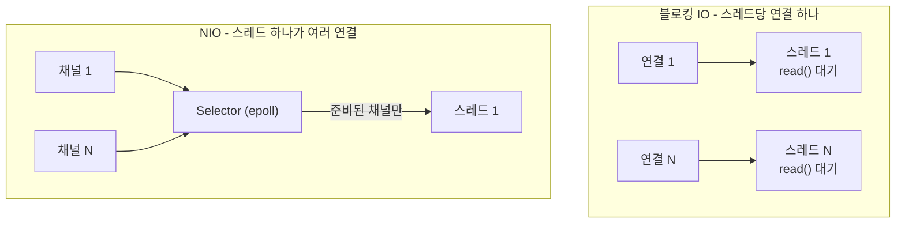

자바에서 소켓을 다루는 방법은 둘이다. `InputStream.read()`로 블로킹하거나, `Selector`로 준비된 채널만 골라 처리하거나. 후자가 NIO이고 [Netty](/posts/netty/)가 그 위에 있다. 무엇이 달라지고 무엇을 직접 해야 하는지 보면, 프레임워크가 감춘 것이 드러난다.

## 블로킹 IO와 NIO

블로킹 모델은 단순하다. `read()`를 부르면 데이터가 올 때까지 스레드가 멈춘다. 연결마다 스레드가 필요하고, 연결이 많아지면 스레드가 감당이 안 된다. [C10K(동시 연결 1만 개 문제) 문서](http://www.kegel.com/c10k.html)가 구분한 "스레드당 클라이언트 하나, 블로킹 IO"와 "스레드당 여러 클라이언트, 논블로킹 IO"의 차이다.

두 모델에서 연결과 스레드가 묶이는 방식이 다르다.



NIO는 셋을 바꾼다.

채널(Channel). 양방향 IO 통로. 논블로킹 모드로 둘 수 있고, 그때 `read()`는 읽을 것이 없으면 0을 돌려주고 즉시 반환한다([ReadableByteChannel.read](https://docs.oracle.com/en/java/javase/21/docs/api/java.base/java/nio/channels/ReadableByteChannel.html#read%28java.nio.ByteBuffer%29)).

버퍼(Buffer). 스트림이 아니라 버퍼를 읽고 쓴다. `position`, `limit`, `capacity`를 직접 관리해야 하고, 쓰기 모드와 읽기 모드를 `flip()`으로 전환한다. NIO를 직접 쓸 때 실수가 가장 잦은 곳이 이 상태 관리다.

셀렉터(Selector). 여러 채널을 등록해 두고 준비된 것만 골라 온다. 리눅스에서는 `epoll`로 구현된다([DefaultSelectorProvider, jdk-21.0.4](https://github.com/openjdk/jdk21u/blob/jdk-21.0.4-ga/src/java.base/linux/classes/sun/nio/ch/DefaultSelectorProvider.java), [epoll](/posts/epoll/)).

```java
while (true) {
    selector.select();                       // 준비된 채널이 생길 때까지 대기
    for (SelectionKey key : selector.selectedKeys()) {
        if (key.isReadable()) { /* 읽기 */ }
        if (key.isWritable()) { /* 쓰기 */ }
    }
    selector.selectedKeys().clear();         // 안 지우면 다음 루프에서 또 나온다
}
```

마지막 줄이 필요한 것은 셀렉터가 selected-key 집합에 키를 넣기만 하고 빼지는 않기 때문이다([Selector](https://docs.oracle.com/en/java/javase/21/docs/api/java.base/java/nio/channels/Selector.html)).

## 다이렉트 버퍼

`ByteBuffer.allocate()`는 힙 안에, `allocateDirect()`는 [힙 밖(네이티브 메모리)](/posts/direct-memory-and-cleaner/)에 잡는다.

차이는 GC에서 나온다. GC는 힙을 정리하면서 객체를 다른 주소로 옮길 수 있다. 그런데 IO를 할 때는 버퍼 주소를 [커널](/posts/user-space-and-kernel-space/)에 넘기고, 커널이 그 주소를 읽고 쓰는 동안 버퍼가 움직이면 안 된다. 그래서 힙 버퍼로 IO를 하면 JVM이 내부적으로 내용을 다이렉트 버퍼에 복사한 뒤 그 주소를 넘긴다. 처음부터 다이렉트 버퍼를 쓰면 이 중간 복사가 없다([ByteBuffer](https://docs.oracle.com/en/java/javase/21/docs/api/java.base/java/nio/ByteBuffer.html)).

대가가 있다.

- **할당과 해제가 비싸다.** 그래서 풀링해서 재사용한다.
- **GC가 직접 관리하지 않는다.** `Cleaner`에 의존하므로 회수 시점이 불확실하고, 누수가 나면 힙 지표에 안 보인다. `-XX:MaxDirectMemorySize`로 상한을 두고 감시해야 한다.
- **작은 IO에는 이득이 없다.** 할당 비용이 복사 비용을 넘는다.

Javadoc의 권고도 같은 방향이다.

> "It is therefore recommended that direct buffers be allocated primarily for large, long-lived buffers that are subject to the underlying system's native I/O operations."

네이티브 IO에 쓰이는 크고 오래 사는 버퍼에 주로 할당하라는 뜻이다.

## 직접 쓰면 만나는 것들

NIO를 그대로 쓰면 프로토콜 처리를 전부 직접 해야 한다.

메시지 경계가 없다. TCP는 바이트 스트림이라 `read()` 한 번이 메시지 하나와 대응하지 않는다. Netty 사용자 가이드의 표현으로는 소켓 수신 버퍼가 "not a queue of packets but a queue of bytes"다([Netty User Guide](https://netty.io/wiki/user-guide-for-4.x.html)). 반만 올 수도(부분 읽기), 두 개가 붙어 올 수도(뭉침) 있다. 길이 접두어나 구분자로 경계를 복원하는 코드가 필요하고, 직접 구현에서 가장 자주 틀리는 곳이 여기다.

쓰기도 부분적이다. 논블로킹 소켓 채널은 소켓 송신 버퍼에 남은 공간보다 많이 쓸 수 없으므로, `write()`가 일부만 쓰거나 아무것도 쓰지 못할 수 있다([WritableByteChannel.write](https://docs.oracle.com/en/java/javase/21/docs/api/java.base/java/nio/channels/WritableByteChannel.html#write%28java.nio.ByteBuffer%29)). 남은 것을 보관했다가 채널이 쓰기 가능해지면 이어 써야 하고, 그 동안 `OP_WRITE`에 관심을 등록해야 한다. 등록해 둔 채 잊으면 CPU를 태우는 busy loop(쉬지 않고 도는 루프)가 된다.

epoll 버그 우회. 특정 JDK·커널 조합에서 `select()`가 준비된 채널 없이 즉시 반환해 CPU 100%가 되는 문제가 알려져 있다. OpenJDK에는 셀렉터가 선택된 키 0개로 끝없이 깨어나는 버그가 Won't Fix로 닫혀 있다([JDK-6670302](https://bugs.openjdk.org/browse/JDK-6670302)). 셀렉터를 다시 만드는 우회가 필요하다.

Netty는 이 셋을 전부 다룬다. `LengthFieldBasedFrameDecoder` 같은 코덱이 경계를, `ChannelOutboundBuffer`가 부분 쓰기를 맡는다. epoll 버그는 셀렉터를 새로 만들어 우회한다. `NioEventLoop`는 `select()`가 준비된 채널 없이 일찍 반환한 횟수를 세고, 이것이 기본 512번 연속 이어지면 셀렉터를 다시 만든다(`io.netty.selectorAutoRebuildThreshold`, [NioEventLoop, netty-4.1.115.Final](https://github.com/netty/netty/blob/netty-4.1.115.Final/transport/src/main/java/io/netty/channel/nio/NioEventLoop.java)). **Netty를 쓰는 이유는 성능보다 이 정확성에 있다.**

## 이벤트 루프의 규칙

Netty의 `EventLoop`는 스레드 하나에 여러 채널을 묶는다. 채널이 한 루프에 등록되면 그 채널의 모든 IO 작업은 그 루프가 처리한다([EventLoop](https://netty.io/4.1/api/io/netty/channel/EventLoop.html)). 따라서 한 채널의 이벤트는 항상 같은 스레드에서 처리된다. 채널 상태를 만지는 스레드가 그 하나뿐이므로 핸들러 안에서는 동기화가 필요 없다.

대신 규칙이 생긴다. **이벤트 루프 스레드에서 블로킹하면 그 루프의 모든 채널이 멈춘다.** DB 호출, 파일 IO, 동기 외부 호출을 핸들러에 그대로 넣으면 안 되고, 별도 `EventExecutorGroup`으로 빼야 한다. `ChannelPipeline` 문서의 예제가 이 구성이다([ChannelPipeline](https://netty.io/4.1/api/io/netty/channel/ChannelPipeline.html)).

그 예제는 코덱은 IO 스레드에 두고, 오래 걸리는 핸들러만 별도 그룹을 지정해 등록한다.

```java
static final EventExecutorGroup group = new DefaultEventExecutorGroup(16);

ChannelPipeline pipeline = ch.pipeline();
pipeline.addLast("decoder", new MyProtocolDecoder());   // 이벤트 루프 스레드
pipeline.addLast("encoder", new MyProtocolEncoder());   // 이벤트 루프 스레드
pipeline.addLast(group, "handler", new MyBusinessLogicHandler()); // group의 스레드
```

이 점에서 [스레드 기반 모델](/posts/tomcat-thread-exhaustion/)과 교환 관계가 갈린다. 스레드 모델에서 느린 호출 하나는 스레드 하나를 묶고, 그런 호출이 쌓여 풀이 마를 때 무너진다. 이벤트 루프에서는 느린 호출 하나가 그 루프의 모든 연결을 즉시 묶는다. 앞쪽은 상한에 닿아야 무너지고, 뒤쪽은 한 번에 무너진다.

## 가상 스레드가 바꾼 것

Java 21 이후 "높은 동시성"만이 목적이라면 가상 스레드로 블로킹 코드를 그대로 쓰면서 같은 효과를 얻는다([가상 스레드의 내부](/posts/virtual-threads-internals/)). [JEP 444](https://openjdk.org/jeps/444)가 목표로 내건 것도 요청당 스레드 방식 그대로의 확장이다. 스택 트레이스와 디버거가 정상 동작하고, 버퍼 상태 관리나 부분 읽기 처리를 직접 할 필요가 없다.

그래서 NIO와 Netty가 여전히 맞는 곳은 좁아졌다.

- 커스텀 바이너리 프로토콜을 구현할 때
- 연결당 메모리를 극단적으로 아껴야 할 때
- 이미 그 생태계 위에 있을 때(gRPC 자바 구현이 Netty 위에 있다)

요청-응답 HTTP 서버를 NIO로 직접 만들 이유는 거의 없다.

## 이 설명이 깨지는 곳

- **NIO가 항상 빠른 것은 아니다.** 연결이 적고 처리량 위주면 블로킹 IO가 단순하고 빠를 수 있다.
- **파일 IO는 이 모델 밖이다.** 셀렉터에 등록하려면 `SelectableChannel`이어야 하는데, 자바의 `FileChannel`은 그렇지 않다([FileChannel](https://docs.oracle.com/en/java/javase/21/docs/api/java.base/java/nio/channels/FileChannel.html)). OS 수준에서도 마찬가지다. POSIX `select()`는 일반 파일을 언제나 '준비됨'으로 보고하므로 기다리는 의미가 없다([POSIX pselect](https://pubs.opengroup.org/onlinepubs/9799919799/functions/pselect.html)). 리눅스 `epoll_ctl()`은 일반 파일 등록을 아예 `EPERM` 오류로 거부한다([epoll_ctl(2)](https://man7.org/linux/man-pages/man2/epoll_ctl.2.html)).
- **`SelectionKey` 관리가 누수 지점이다.** 채널을 닫거나 키를 취소해도 실제 등록 해제는 다음 선택 연산에서 일어난다([Selector](https://docs.oracle.com/en/java/javase/21/docs/api/java.base/java/nio/channels/Selector.html)). 그 전까지 키는 셀렉터에 남는다.
- **Netty의 `ByteBuf`는 [참조 카운팅](/posts/direct-memory-and-cleaner/)을 쓴다.** 핸들러에 도착한 `ByteBuf`는 그 핸들러가 해제할 책임을 진다([Netty User Guide](https://netty.io/wiki/user-guide-for-4.x.html)). `release()`를 잊으면 다이렉트 메모리가 새고, 이 누수는 [힙 덤프](/posts/batch-heap-dump-to-chunk/)에 안 보인다.

## 무엇을 재면 확인되는가

1. 연결 수를 100 → 10,000으로 늘려 가며 블로킹 모델과 NIO의 메모리·CPU·[p99](/posts/percentile-statistics/)를 비교한다. 연결이 적으면 차이가 없다.
2. 이벤트 루프 스레드에서 100ms를 블로킹하고 같은 루프의 다른 연결 지연을 본다.
3. 힙 버퍼와 다이렉트 버퍼로 같은 IO를 반복하고 처리량과 GC 부하를 비교한다.
4. `-XX:MaxDirectMemorySize`를 작게 두고 `ByteBuf` 해제를 빠뜨려 누수가 어떻게 드러나는지 본다.

이 모델의 성질을 가장 빨리 보여주는 것은 2번이다.

## 실무와의 접점

monticker에서 `NioEventLoopGroup`으로 다수 연결에 시세를 뿌렸다. 그때 정리한 것은 리액터 패턴의 구조였고, 이 글은 그 아래에서 JVM이 하는 일이다. [WebSocket과 폴링 비교](/posts/monticker-ws-vs-polling/)에서 잰 수치도 결국 연결 유지 비용을 어느 층이 감당하는가의 결과였다. 다만 같은 머신에서 쟀으므로 네트워크 층의 영향은 그 수치에 들어 있지 않다.

## 정리

- NIO를 직접 쓰면 버퍼의 읽기·쓰기 모드 전환, selected-key 집합 비우기, 키 취소가 다음 선택 연산에서야 반영된다는 점을 모두 호출자가 챙겨야 한다.
- 다이렉트 버퍼는 크고 오래 사는 버퍼를 풀링해서 쓴다.
- Netty가 대신 해주는 것은 메시지 경계 복원, 부분 쓰기 처리, epoll 조기 반환 우회다.
- 이벤트 루프 모델은 핸들러 동기화를 없애는 대신, 블로킹 한 번이 그 루프의 모든 연결을 멈춘다.
- 동시성만이 목적이라면 가상 스레드가 더 단순한 답이다.

## 참고

- [Java SE 21 API: Selector](https://docs.oracle.com/en/java/javase/21/docs/api/java.base/java/nio/channels/Selector.html)
- [Java SE 21 API: ByteBuffer - Direct vs. non-direct buffers](https://docs.oracle.com/en/java/javase/21/docs/api/java.base/java/nio/ByteBuffer.html)
- [Java SE 21 API: WritableByteChannel](https://docs.oracle.com/en/java/javase/21/docs/api/java.base/java/nio/channels/WritableByteChannel.html), [ReadableByteChannel](https://docs.oracle.com/en/java/javase/21/docs/api/java.base/java/nio/channels/ReadableByteChannel.html), [FileChannel](https://docs.oracle.com/en/java/javase/21/docs/api/java.base/java/nio/channels/FileChannel.html)
- [OpenJDK jdk21u: DefaultSelectorProvider (Linux)](https://github.com/openjdk/jdk21u/blob/jdk-21.0.4-ga/src/java.base/linux/classes/sun/nio/ch/DefaultSelectorProvider.java)
- [JDK-6670302: NIO selector wakes up with 0 selected keys infinitely](https://bugs.openjdk.org/browse/JDK-6670302)
- [epoll_ctl(2)](https://man7.org/linux/man-pages/man2/epoll_ctl.2.html), [POSIX pselect/select](https://pubs.opengroup.org/onlinepubs/9799919799/functions/pselect.html)
- [Netty User Guide for 4.x](https://netty.io/wiki/user-guide-for-4.x.html)
- [Netty API: EventLoop](https://netty.io/4.1/api/io/netty/channel/EventLoop.html), [ChannelPipeline](https://netty.io/4.1/api/io/netty/channel/ChannelPipeline.html)
- [Netty source: NioEventLoop (netty-4.1.115.Final)](https://github.com/netty/netty/blob/netty-4.1.115.Final/transport/src/main/java/io/netty/channel/nio/NioEventLoop.java)
- [JEP 444: Virtual Threads](https://openjdk.org/jeps/444)
- [Dan Kegel: The C10K problem](http://www.kegel.com/c10k.html)
- [epoll 정리](/posts/epoll/), [멀티플렉싱 정리](/posts/multiplexing/)
