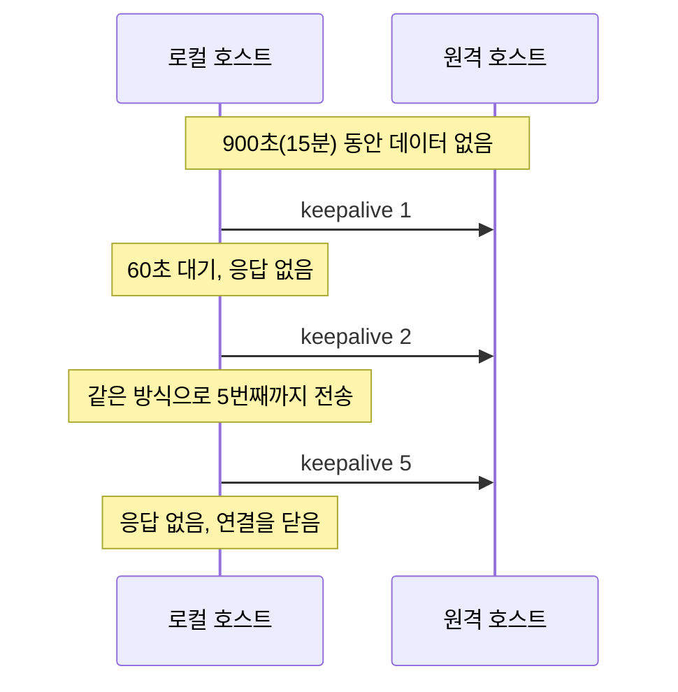

# Keep-Alive

Keep-Alive 또는 Persistent Connection은 HTTP 요청 양을 줄이고 웹 페이지 속도를 높이기 위한 서버와 클라이언트 간의 통신 패턴이다. 즉, 하나의 커넥션을 최대한 효율적으로 활용하기 위한 매커니즘이다.

Keep-Alive가 켜져 있으면 클라이언트와 서버는 이후에 요청이나 응답을 위해 연결을 유지하는 데 동의한다는 의미이다. HTTP/1.1에서는 이것이 기본 동작이다. RFC 9112는 “HTTP/1.1 defaults to the use of "persistent connections"”라고 적는다(HTTP/1.1은 기본적으로 지속 연결을 쓴다, [RFC 9112 §9.3](https://www.rfc-editor.org/rfc/rfc9112#section-9.3)).

아래의 TCP keepalive는 이름만 같고 다른 층의 기능이다. HTTP keep-alive는 연결 하나로 여러 요청을 보내는 것이고, TCP keepalive는 조용한 연결에 커널이 탐침(probe) 패킷을 보내는 것이다. 연결 재사용과 TIME_WAIT의 관계는 [TCP 연결 수립과 큐](/posts/tcp-connection-and-queues/)에서 다룬다.

- [Keep-Alive: How Does It Improves Website Performance](https://www.hostinger.com/tutorials/improving-website-performance-enabling-keep-alive)

## Understand the TCP keepalive parameters

TCP Keepalive는 3개의 파라미터로 제어된다([tcp(7)](https://man7.org/linux/man-pages/man7/tcp.7.html)). keepalive time은 연결이 조용해진 뒤 첫 keepalive 패킷을 보내기까지의 시간이다(기본 7200초, `SO_KEEPALIVE`가 켜진 소켓만 해당). keepalive interval은 keepalive 패킷 사이의 간격이다. keepalive probes는 응답이 없을 때 연결을 끊기 전까지 보내는 keepalive 패킷의 최대 개수다.

- [What are the best practices for implementing TCP keepalive?](https://www.linkedin.com/advice/1/what-best-practices-implementing-tcp-keepalive)

## Keep-Alive Best Practices

그러면 Keepalive time을 최소한으로 설정해서 반복적으로 [LB](/posts/network-load-balancers/) 또는 브라우저에 패킷을 보내게되면 커넥션이 절대로 끊어지지 않는다고 생각해볼 수 있다. 그게 좋은 방법일까? 아래 인용은 HTTP 쪽(정적 파일을 같은 연결로 받는 경우)의 KeepAlive 설정에 대한 답변이다.

> KeepAlive's main purpose is to send several static files via HTTP 1.1 on the same connection. So if you disable or set KeepAlive too short the client has to make a connection for every css, js, jpg, whatever static file it wants from your server. Building up a connection takes time, so it is wise to set it to **300 seconds.** Most browsers keep connections open from 120 to 300 seconds, also most of the SSL keys have the same 300 sec timeout.

HTTP KeepAlive의 주요 목적은 정적인 자원을 같은 커넥션으로 전송하는 것이다. 이를 너무 짧게 설정하면 클라이언트는 정적 자원마다 연결을 새로 맺어야 한다. 그러면 어떻게 설정하는것이 가장 Best Practices일까?

- [Is It Better to set KeepAlive to 1 second rather than turning it off all together?](https://serverfault.com/questions/355717/is-it-better-to-set-keepalive-to-1-second-rather-than-turning-it-off-all-togethe)

### Best Practices for TCP Keepalive Settings

이상적인 TCP keepalive 설정은 특정 네트워크 요구 사항과 실행 중인 애플리케이션 유형에 따라 달라진다. TCP keepalive 설정을 구성하기 위한 몇 가지 일반적인 모범 사례는 다음과 같다.

#### 1. Choose an appropriate keepalive time

tcp_keepalive_time을 너무 낮게 설정하면 불필요한 네트워크 트래픽이 발생하고 시스템 부하가 증가할 수 있다. 반면에 너무 높게 설정하면 끊어진 연결의 감지가 지연될 수 있다. 일반적인 지침으로 **600 ~ 7200초(10분 ~ 2시간)** 사이의 값을 권장한다. 이 글의 출처(아래 webhostinggeeks 글)의 필자는 보통 600초를 쓴다고 적었다.

```
net.ipv4.tcp_keepalive_time = 600
```

#### 2. Set a reasonable keepalive interval

tcp_keepalive_intvl은 원격 호스트에서 응답을 받지 못할 경우 keepalive 패킷 사이의 간격을 결정한다. 이 값을 너무 낮게 설정하면 네트워크 혼잡이 발생할 수 있고, 너무 높게 설정하면 끊어진 연결 감지 속도가 느려질 수 있다. 일반적으로 30 ~ 120초 사이의 값이면 충분하다.

```
넷.ipv4.tcp_keepalive_intvl = 60
```

#### 3. Determine the number of keepalive probes

tcp_keepalive_probes 값은 연결이 끊어진 것으로 간주되기 전에 보내야 하는 승인되지 않은 keepalive 패킷의 수를 지정한다. 값이 높을수록 원격 호스트가 응답할 가능성이 높아지지만 끊어진 연결 감지가 지연될 수도 있다. 일반적으로 3 ~ 10 사이의 값이 권장된다.

```
net.ipv4.tcp_keepalive_probes = 5
```

#### Configure TCP Keepalive for a Web Server

적당한 양의 트래픽이 있는 웹 서버를 실행 중이라고 가정해 본다. 서버에 너무 많은 부하를 주지 않고 유휴 연결이 적시에 감지되고 닫히도록 해야한다.

다음 설정을 사용하는 것이 좋다.

```
net.ipv4.tcp_keepalive_time = 900 # 15분
net.ipv4.tcp_keepalive_intvl = 60 # 1분
net.ipv4.tcp_keepalive_probes = 5
```

이 예에서 keepalive 패킷은 15분간의 비활성 후에 전송된다. 원격 호스트에서 응답이 없으면 추가 keepalive 패킷이 매분 전송되고, 응답 없는 패킷이 5개가 될 때까지 계속된다. 여전히 응답이 없으면 연결이 끊어진 것으로 간주되어 닫힌다.

상대가 응답하지 않는 경우의 순서를 그리면 다음과 같다.



- [TCP keepalive Recommended Settings and Best Practices](https://webhostinggeeks.com/howto/tcp-keepalive-recommended-settings-and-best-practices/)

## References

- [Linux man: tcp(7)](https://man7.org/linux/man-pages/man7/tcp.7.html)
- [RFC 9112 §9.3 Persistence](https://www.rfc-editor.org/rfc/rfc9112#section-9.3)
- [Keepalive 설정으로 NGINX HTTP 성능 향상](https://nginxstore.com/blog/nginx/keepalive-%EC%84%A4%EC%A0%95%EC%9C%BC%EB%A1%9C-nginx-http-%EC%84%B1%EB%8A%A5-%ED%96%A5%EC%83%81/)