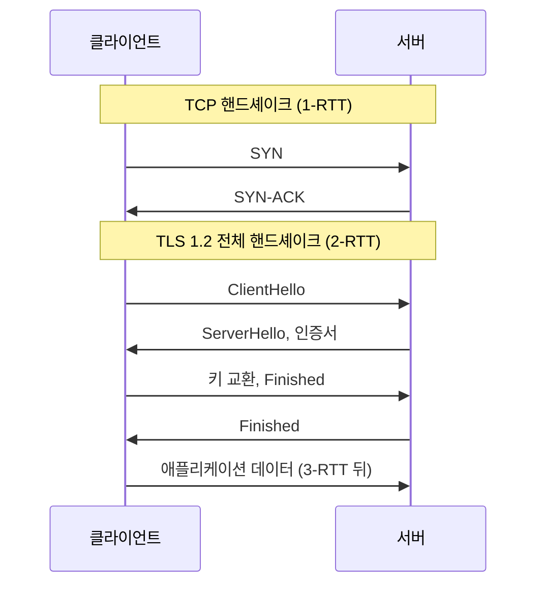
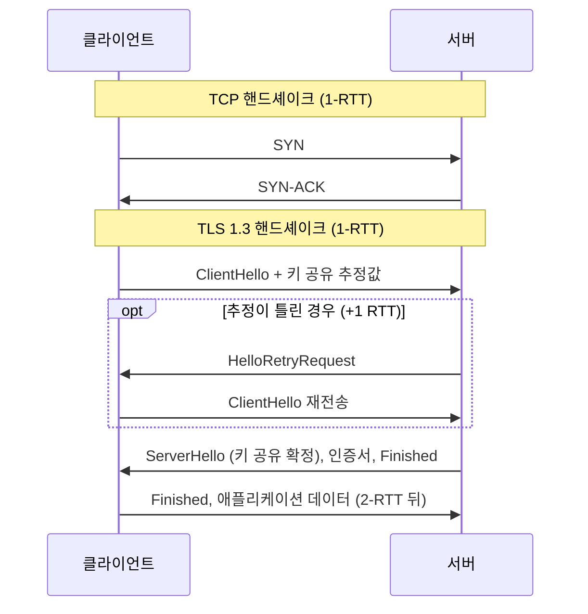
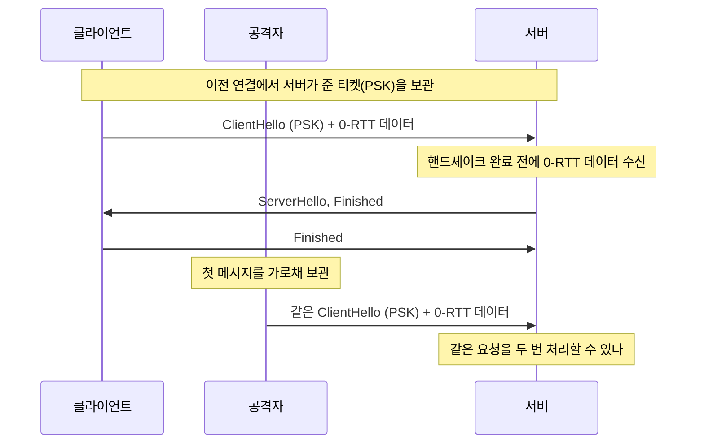

HTTPS를 켜면 느려진다는 말은 절반만 맞다. 암호화 연산 자체는 현대 CPU에서 거의 공짜에 가깝고, 비용의 대부분은 연결을 맺을 때의 왕복에 있다. 그래서 대책도 암호화를 줄이는 쪽이 아니라 왕복을 줄이는 쪽이다.

## 비용이 어디에 있는가

TLS의 비용은 셋으로 나뉜다.

| | 내용 | 크기 |
| --- | --- | --- |
| **왕복(RTT)** | 핸드셰이크 메시지 교환 | RTT에 비례. 원거리일수록 지배적 |
| **비대칭 연산** | 키 교환과 인증서 서명 검증 | 연결당 한 번, 수 ms 이하 |
| **대칭 암복호** | 실제 데이터 암호화 | AES-NI 같은 하드웨어 가속으로 거의 무시 가능 |

첫 줄이 지배적이다. 서울-미국 RTT가 150ms라면 핸드셰이크 왕복 하나가 150ms이고, 이 값은 암호 알고리즘을 바꿔서 줄일 수 있는 값이 아니다.

## TLS 1.2와 1.3

TLS 1.2의 전체 핸드셰이크는 2-RTT다. ClientHello/ServerHello로 한 번, 키 교환과 Finished로 한 번 오간다([RFC 5246, 7.3절](https://datatracker.ietf.org/doc/html/rfc5246#section-7.3)). TCP 핸드셰이크 1-RTT까지 더하면 데이터가 나가기까지 3-RTT다.

첫 요청 데이터가 나가기 전에 오가는 메시지를 왕복 단위로 세면 이렇다.

TLS 1.3은 이것을 1-RTT로 줄였다. 클라이언트는 서버가 받아들일 키 교환 방식을 미리 짐작하고, 그 방식의 [키 공유](/posts/tls-key-exchange-and-cipher-suites/) 값을 ClientHello에 실어 보낸다. 짐작이 맞으면 서버가 ServerHello에서 바로 확정한다. 짐작이 틀리면 서버가 HelloRetryRequest로 다른 값을 요청하고, 왕복이 하나 늘어난다([RFC 8446, 2.1절](https://datatracker.ietf.org/doc/html/rfc8446#section-2.1)). [암호 스위트](/posts/tls-key-exchange-and-cipher-suites/)(함께 쓸 암호 알고리즘의 조합) 협상도 단순해졌다. 정적 RSA와 정적 DH 스위트가 제거됐다([1.2절](https://datatracker.ietf.org/doc/html/rfc8446#section-1.2)).

같은 구간을 TLS 1.3으로 그리면 TLS 쪽 왕복이 하나 줄고, 추정이 틀린 경우에만 왕복이 다시 하나 붙는다.

그래서 성능 측면에서 가장 확실한 조치는 TLS 1.3으로 올리는 것이다. 보안과 지연이 같은 방향으로 개선되는 드문 경우다.

## 세션 재개

이미 한 번 연결한 적 있는 클라이언트와 다시 연결할 때, 전체 핸드셰이크를 반복할 필요가 없다.

**세션 ID.** 서버가 세션 상태를 저장하고 ID로 참조한다([RFC 5246, 7.3절](https://datatracker.ietf.org/doc/html/rfc5246#section-7.3)). 서버가 여러 대면 그 상태를 공유해야 하고, 로드 밸런서가 다른 서버로 보내면 재개가 실패한다.

**세션 티켓.** 서버가 상태를 암호화해 클라이언트에게 주고, 자신은 저장하지 않는다([RFC 5077](https://datatracker.ietf.org/doc/html/rfc5077)). 서버가 여러 대여도 티켓 키만 공유하면 되므로 운영이 단순하다.

TLS 1.3은 두 방식을 폐기하고 하나의 [PSK](/posts/tls-key-exchange-and-cipher-suites/)(미리 공유한 키) 교환으로 대체했다([2.2절](https://datatracker.ietf.org/doc/html/rfc8446#section-2.2)). 이전 연결에서 서버가 준 티켓을 다음 연결에서 PSK로 제시하는 방식이다. 다만 티켓의 내용은 정해져 있지 않다. 서버 데이터베이스를 찾는 조회 키일 수도 있고, 상태를 서버가 직접 암호화한 값일 수도 있다([4.6.1절](https://datatracker.ietf.org/doc/html/rfc8446#section-4.6.1)). 그래서 서버가 상태를 보관하는지는 구현이 정한다.

재개하면 1-RTT이고, 0-RTT까지 갈 수 있다.

## 0-RTT의 대가

TLS 1.3의 0-RTT는 재개 시 핸드셰이크 완료 전에 애플리케이션 데이터를 첫 메시지에 함께 보낸다. 왕복이 0이 되므로 지연 면에서는 최선이다.

문제는 재전송 공격(replay)이다. RFC 8446은 0-RTT 데이터의 보안 성질이 다른 TLS 데이터보다 약하다고 명시하고, 그 이유를 이렇게 적는다([2.3절](https://datatracker.ietf.org/doc/html/rfc8446#section-2.3)).


"There are no guarantees of non-replay between connections."


연결 사이의 재전송을 막는다는 보장이 없다는 뜻이다. 1-RTT 데이터는 서버가 연결마다 새로 만드는 Random 값이 키 계산에 들어가므로, 예전 메시지를 그대로 다시 보내도 통하지 않는다. 0-RTT 데이터는 ServerHello보다 먼저 나가므로 이 보호를 받지 못한다. 공격자가 이 데이터를 가로채 다시 보내면 서버가 같은 요청을 두 번 처리할 수 있다. 서버 측 완화책은 [8절](https://datatracker.ietf.org/doc/html/rfc8446#section-8)에 있지만 완전하지 않다.

재개 연결의 0-RTT 데이터와, 그것을 가로챈 공격자가 다시 보내는 경우를 한 흐름에 놓으면 차이가 보인다.

**그래서 0-RTT는 멱등한 요청에만 쓴다.** `GET` 같은 안전한 요청은 괜찮고, 결제나 주문 생성은 안 된다([멱등한 API 설계](/posts/idempotent-api-design/)). HTTP에서는 [RFC 8470](https://datatracker.ietf.org/doc/html/rfc8470)이 두 가지를 정했다. 클라이언트는 안전하지 않은 메서드를 early data(0-RTT로 보내는 데이터)로 보내지 못하고, 서버는 그런 요청을 `425 Too Early`로 거절할 수 있다. 실무에서는 [CDN이나 엣지](/posts/cache-across-layers/)(사용자 가까이 있는 서버)에서 0-RTT를 켜되, 안전한 메서드로만 제한하는 구성이 쓰인다. Cloudflare는 쿼리 파라미터가 없는 `GET`만 0-RTT로 응답했다([Cloudflare](https://blog.cloudflare.com/introducing-0-rtt/)).

QUIC(HTTP/3)의 0-RTT도 같은 제약을 갖는다([RFC 9001, 9.2절](https://datatracker.ietf.org/doc/html/rfc9001#section-9.2), [HTTP/1.1, 2, 3](/posts/http-versions/)).

## 줄이는 순서

지연을 줄이는 조치를 효과 순으로 놓으면 이렇다.

1. **연결을 재사용한다.** keep-alive와 커넥션 풀. 핸드셰이크 자체가 일어나지 않으므로 가장 확실하다([TCP 연결 수립과 큐](/posts/tcp-connection-and-queues/)).
2. **TLS 1.3을 쓴다.** 2-RTT가 1-RTT가 된다.
3. **세션 재개를 켠다.** 티켓 방식으로, 서버 간 키를 공유한다.
4. **인증서 체인을 짧게.** 체인이 길면 전송량과 검증 비용이 는다. 중간 인증서를 빠뜨리면 클라이언트가 추가로 받아와야 해 왕복이 더 생긴다.
5. **OCSP stapling.** 인증서 폐기 확인을 클라이언트가 직접 하지 않고 서버가 핸드셰이크 안에 응답을 붙여 준다. 별도 왕복이 사라진다([RFC 6066, 8절](https://datatracker.ietf.org/doc/html/rfc6066#section-8)).
6. **TLS 종료 지점을 사용자 가까이.** CDN이나 엣지에서 종료하면 핸드셰이크 RTT가 짧아진다. 엣지-오리진 구간은 재사용되는 연결이라 비용이 분산된다.

1번의 효과가 가장 크다. 핸드셰이크는 연결당 한 번 드는 비용이므로, 연결을 오래 쓸수록 요청 하나에 돌아가는 몫이 0에 가까워진다.

## 이 설명이 깨지는 곳

- **내부 서비스 간 mTLS는 계산이 다르다.** mTLS는 서버뿐 아니라 클라이언트도 인증서로 자신을 증명하는 TLS다. 양쪽이 인증서를 검증하므로 비용이 늘고, 대신 RTT가 작아 왕복 비용은 작다. 사이드카(애플리케이션 옆에 붙어 네트워크 처리를 대신하는 프록시)가 연결을 재사용하면 대부분 상쇄된다.
- **zero-copy가 깨진다.** `sendfile()`은 파일 데이터를 커널 안에서 바로 소켓으로 보내, 애플리케이션 메모리로 복사하지 않는 최적화다. 그런데 [사용자 공간](/posts/user-space-and-kernel-space/)의 TLS 라이브러리로 암호화하려면 데이터가 사용자 공간을 지나야 하므로 이 최적화를 쓸 수 없다([Kafka의 저장 구조](/posts/kafka-storage-internals/)). 대용량 전송이 많은 시스템에서는 이 비용이 보인다. 예외는 리눅스 [kTLS](/posts/user-space-and-kernel-space/)다. 핸드셰이크가 끝난 뒤 레코드 암호화를 커널에 넘기면 `sendfile()`을 다시 쓸 수 있다([Kernel TLS](https://docs.kernel.org/networking/tls.html)).
- **인증서 갱신이 운영 부담이다.** 만료로 인한 장애는 흔하고, 자동 갱신과 만료 경보가 실질적인 대책이다.
- **암호 스위트를 임의로 조정하지 않는다.** 성능을 이유로 약한 옵션을 켜면 보안이 깎인다. TLS 1.3은 선택지를 줄여 이 실수를 막았다.

## 무엇을 재면 확인되는가

1. 연결을 매번 새로 여는 클라이언트와 keep-alive를 쓰는 클라이언트의 [p50·p99](/posts/percentile-statistics/)를 비교한다. 차이가 곧 핸드셰이크 비용이다.
2. TLS 1.2와 1.3에서 첫 바이트까지의 시간(TTFB)을 비교한다. RTT가 큰 경로일수록 차이가 크다.
3. 세션 재개율을 지표로 본다. 낮으면 티켓 키가 서버 간에 공유되지 않고 있을 수 있다.
4. `openssl s_client -connect ... -tls1_3`로 핸드셰이크 왕복과 재개 여부를 직접 확인한다.

실무에서 자주 놓치는 것은 3번이다. 세션 재개를 켰다고 생각했는데 로드 밸런싱 때문에 실제 재개율이 낮은 경우가 있다.

## 실무와의 접점

[SSL/TLS 정리](/posts/ssl-tls/)에서 프로토콜의 동작을 다뤘다. 다시 보면 실무에서 실제로 손대는 것은 알고리즘이 아니라 연결 수명과 종료 지점이었다. 성능 문제로 HTTPS를 의심하게 되면, 암호화보다 "연결을 몇 번 맺고 있는가"부터 확인한다.

## 정리

- TLS 비용의 대부분은 암호 연산이 아니라 핸드셰이크 왕복이고, RTT가 클수록 비중이 커진다.
- TLS 1.3은 세션 ID와 티켓을 하나의 PSK 교환으로 대체했다. 서버가 여러 대일 때는 티켓 키 공유가 재개율을 좌우한다.
- 0-RTT 데이터는 연결 간 재전송 방지가 보장되지 않으므로 멱등한 요청에만 쓴다.
- 사용자 공간에서 TLS를 처리하면 `sendfile()` zero-copy를 잃는다. kTLS가 예외다.

## 참고

- [RFC 8446: The Transport Layer Security (TLS) Protocol Version 1.3](https://datatracker.ietf.org/doc/html/rfc8446) - 1.2절(1.2와의 차이), 2.1절(HelloRetryRequest), 2.2절(PSK 재개), 2.3절과 8절(0-RTT와 재전송)
- [RFC 5246: TLS 1.2](https://datatracker.ietf.org/doc/html/rfc5246) - 7.3절, 전체 핸드셰이크와 세션 ID 재개
- [RFC 5077: TLS Session Resumption without Server-Side State](https://datatracker.ietf.org/doc/html/rfc5077)
- [RFC 8470: Using Early Data in HTTP](https://datatracker.ietf.org/doc/html/rfc8470)
- [RFC 9001: Using TLS to Secure QUIC](https://datatracker.ietf.org/doc/html/rfc9001) - 9.2절
- [RFC 6066: TLS Extensions](https://datatracker.ietf.org/doc/html/rfc6066) - 8절, Certificate Status Request
- [Linux kernel documentation: Kernel TLS](https://docs.kernel.org/networking/tls.html)
- [Cloudflare: Introducing Zero Round Trip Time Resumption (0-RTT)](https://blog.cloudflare.com/introducing-0-rtt/)
- [SSL/TLS 정리](/posts/ssl-tls/)
