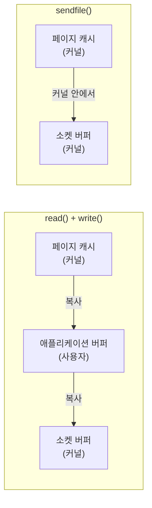

두 글에서 같은 경계가 등장한다. [TLS 핸드셰이크의 비용](/posts/tls-handshake-cost/)은 사용자 공간 TLS 라이브러리로 암호화하면 데이터가 사용자 공간을 지나야 해서 `sendfile()`을 쓸 수 없고, kTLS가 예외라고 했다. [NIO와 이벤트 루프](/posts/nio-and-event-loop/)는 힙 버퍼로 IO를 하면 JVM이 다이렉트 버퍼로 한 번 더 복사한다고 했다. 둘 다 "데이터가 어느 공간에 있는가"의 문제다.

## 두 공간이 나뉘는 이유

운영체제는 메모리와 CPU 권한을 둘로 나눈다.

- **커널 공간.** 커널 코드와 데이터가 있는 곳이다. 디스크, 네트워크 카드, 페이지 테이블 같은 하드웨어와 공유 자원을 직접 다룬다.
- **사용자 공간.** 애플리케이션이 도는 곳이다. 프로세스마다 따로 있고, 하드웨어나 다른 프로세스의 메모리에 직접 접근할 수 없다.

이렇게 나누는 이유는 보호다. 애플리케이션 하나가 잘못된 주소에 쓰더라도 그 프로세스만 죽고, 커널이나 다른 프로세스는 영향을 받지 않는다. CPU도 이 구분을 안다. 사용자 모드에서는 특권 명령을 실행할 수 없고, 커널 모드로 들어가야만 실행할 수 있다.

## 시스템 콜

애플리케이션이 파일을 읽거나 소켓에 쓰려면 커널에 부탁해야 한다. 그 창구가 시스템 콜이다. syscalls(2)는 시스템 콜을 애플리케이션과 리눅스 커널 사이의 기본 인터페이스라고 정의한다([syscalls(2)](https://man7.org/linux/man-pages/man2/syscalls.2.html)). 보통은 직접 부르지 않고 glibc의 래퍼 함수(`read()`, `write()` 등)를 거친다. 래퍼는 인자를 레지스터에 옮기고 CPU의 진입 명령을 실행한다. x86-64에서는 `syscall` 명령이다([syscall(2)](https://man7.org/linux/man-pages/man2/syscall.2.html)).

이 전환은 공짜가 아니다. CPU가 모드를 바꾸고, 커널이 인자를 검사하고, 끝나면 다시 사용자 모드로 돌아온다. vdso(7)는 자주 불리는 시스템 콜이 전체 성능을 좌우할 수 있다고 쓰고, 그 원인으로 호출 빈도와 함께 사용자 공간을 나와 커널로 들어가는 전환 비용을 든다([vdso(7)](https://man7.org/linux/man-pages/man7/vdso.7.html)). 그래서 리눅스는 `gettimeofday()`처럼 민감하지 않은 값을 읽는 호출을 vDSO로 사용자 공간에 노출해, 시스템 콜 대신 일반 함수 호출로 처리한다.

## 경계를 넘을 때 생기는 복사

전환보다 큰 비용은 대개 복사다. 사용자 공간은 커널 메모리를 직접 볼 수 없으므로, 데이터가 경계를 넘을 때마다 복사가 일어난다.

파일을 읽어 소켓으로 보내는 가장 단순한 코드는 `read()`와 `write()`를 반복한다. 이때 데이터는 커널의 페이지 캐시에서 애플리케이션 버퍼로 복사되고, 다시 애플리케이션 버퍼에서 커널의 소켓 버퍼로 복사된다. 애플리케이션은 내용을 건드리지도 않는데 데이터가 사용자 공간을 한 번 왕복한다.

## sendfile과 zero-copy

`sendfile()`은 두 파일 디스크립터 사이에서 데이터를 옮기는 시스템 콜이다. man 페이지는 이 복사가 커널 안에서 일어나므로 사용자 공간을 오가야 하는 `read()`와 `write()` 조합보다 효율적이라고 설명한다([sendfile(2)](https://man7.org/linux/man-pages/man2/sendfile.2.html)). 시스템 콜 횟수도 줄고, 사용자 공간 버퍼도 필요 없다. 이렇게 사용자 공간 복사를 없애는 기법을 묶어 zero-copy라고 부른다.

자바에서는 `FileChannel.transferTo()`가 같은 역할을 한다. Javadoc은 많은 운영체제가 파일시스템 캐시에서 대상 채널로 바이트를 실제 복사 없이 옮길 수 있다고 쓴다([FileChannel](https://docs.oracle.com/en/java/javase/21/docs/api/java.base/java/nio/channels/FileChannel.html)). Kafka 브로커가 컨슈머에게 로그를 보낼 때 쓰는 경로가 이것이다([Kafka의 저장 구조](/posts/kafka-storage-internals/)).

조건이 하나 있다. 애플리케이션이 데이터를 바꾸지 않아야 한다. 압축 형식을 바꾸거나 암호화를 하려면 데이터가 사용자 공간으로 올라와야 하고, 그 순간 zero-copy는 성립하지 않는다.

## 자바 힙 버퍼가 한 번 더 복사되는 이유

NIO 글의 다이렉트 버퍼 이야기는 이 경계 위에 한 겹이 더 있는 경우다. 자바 힙도 사용자 공간이지만, GC가 객체를 옮길 수 있어서 커널에 주소를 넘기기에 안전하지 않다. 그래서 힙 버퍼로 IO를 하면 JVM은 힙 밖의 네이티브 메모리에 임시 버퍼를 잡고 그쪽으로 복사한 뒤 시스템 콜을 부른다.

다이렉트 버퍼는 이 중간 복사를 피한다. `ByteBuffer` Javadoc은 다이렉트 버퍼에 대해 JVM이 네이티브 IO를 그 버퍼에 직접 수행하려 하고, 호출 전후의 중간 버퍼 복사를 피하려 한다고 쓴다([ByteBuffer](https://docs.oracle.com/en/java/javase/21/docs/api/java.base/java/nio/ByteBuffer.html)). 다만 다이렉트 버퍼도 사용자 공간에 있으므로, 커널과 사용자 공간 사이의 복사는 그대로 남는다. 없어지는 것은 JVM 내부의 복사 한 번이다.

## kTLS: 암호화를 커널로 내린다

TLS가 zero-copy를 깨는 이유는 레코드 암호화가 사용자 공간 라이브러리(OpenSSL 등)에서 일어나기 때문이다. 평문을 사용자 공간으로 읽어 와서 암호화한 뒤 다시 커널로 써야 한다.

리눅스 kTLS는 이 암호화 단계를 커널로 옮긴다. 핸드셰이크는 여전히 사용자 공간에서 한다. 핸드셰이크가 끝나면 애플리케이션이 소켓에 `TCP_ULP`로 `"tls"`를 설정하고, `SOL_TLS` 수준의 `TLS_TX`(송신), `TLS_RX`(수신) 옵션으로 협상된 키와 IV, 시퀀스 번호를 커널에 넘긴다. 이후 그 소켓에 쓰는 평문은 커널이 TLS 레코드로 암호화한다([Kernel TLS](https://docs.kernel.org/networking/tls.html)).

암호화가 커널 안에서 일어나므로 `sendfile()`이 다시 가능해진다. 커널 문서는 `sendfile()`이 파일 데이터를 최대 2^14 바이트 길이의 TLS 레코드로 보낸다고 적는다. 네트워크 카드가 TLS 오프로드를 지원하면 커널 내부 복사까지 줄이는 옵션(`TLS_TX_ZEROCOPY_RO`)도 있다. 핸드셰이크에 쓰는 키 교환과 암호 스위트는 [TLS 키 교환과 암호 스위트](/posts/tls-key-exchange-and-cipher-suites/)에서 다뤘다.

## 정리

- 사용자 공간은 하드웨어에 직접 닿지 못하므로, IO는 시스템 콜로 커널에 부탁하는 일이다. 전환과 복사가 비용이다.
- `read()`와 `write()`로 파일을 소켓에 보내면 데이터가 이유 없이 사용자 공간을 왕복한다. `sendfile()`과 `transferTo()`는 그 왕복을 없앤다.
- 자바 다이렉트 버퍼는 JVM 내부의 힙 복사를 줄일 뿐, 커널 경계의 복사는 그대로다.
- 데이터를 바꿔야 하는 작업(암호화, 형식 변환)은 zero-copy를 깬다. kTLS는 암호화를 커널로 옮겨 이 제약을 푼다.

## 참고

- [syscalls(2)](https://man7.org/linux/man-pages/man2/syscalls.2.html), [syscall(2)](https://man7.org/linux/man-pages/man2/syscall.2.html)
- [vdso(7)](https://man7.org/linux/man-pages/man7/vdso.7.html)
- [sendfile(2)](https://man7.org/linux/man-pages/man2/sendfile.2.html)
- [Linux kernel documentation: Kernel TLS](https://docs.kernel.org/networking/tls.html)
- [Java SE 21 API: ByteBuffer](https://docs.oracle.com/en/java/javase/21/docs/api/java.base/java/nio/ByteBuffer.html), [FileChannel](https://docs.oracle.com/en/java/javase/21/docs/api/java.base/java/nio/channels/FileChannel.html)
- [Kafka의 저장 구조](/posts/kafka-storage-internals/), [페이지 캐시와 fsync](/posts/page-cache-and-fsync/), [epoll](/posts/epoll/)
