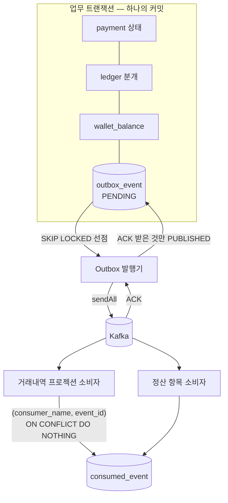

[1편](/posts/parity-pay-invariants/)에서 여섯 불변조건 중 INV-004("같은 업무 참조의 금융 효과는 한 번만 발생한다")는 저장소 트리거가 아니라 애플리케이션 계층에 있어야 한다고 썼다. 요청 식별의 문제이기 때문이다. 이 글은 그 문장이 HTTP 요청이 아니라 **이벤트**에 적용될 때 무엇이 필요한지를 다룬다. 결제가 승인되면 거래내역 프로젝션이 갱신되고 판매자 정산 항목이 생겨야 하는데, 그 두 소비자는 Kafka 건너편에 있다.

DB와 브로커에 동시에 쓰는 문제는 답이 알려져 있다. Transactional Outbox다. 이 글에서 하려는 것은 그 패턴을 소개하는 것이 아니라, 패턴을 구현한 뒤 **프로세스를 죽이고, 브로커를 내리고, 발행기와 소비자를 여러 대 띄웠을 때 실제로 무엇이 지켜지고 무엇이 깨졌는지**를 적는 것이다. 지켜진 것보다 깨진 것이 더 많은 지면을 차지한다.

## 문제: 두 저장소에 하나의 사실을 쓴다

결제 승인 트랜잭션은 결제 상태, 원장 분개, 잔액 스냅샷을 PostgreSQL에 커밋한다. 그 다음 `PaymentApproved` 이벤트를 Kafka에 보내야 한다. 이 둘은 하나의 트랜잭션이 될 수 없다. 순서를 어떻게 잡아도 창이 남는다.

| 순서 | 창 | 결과 |
| --- | --- | --- |
| DB 커밋 → 브로커 발행 | 커밋 직후 프로세스가 죽거나 브로커가 거부 | 결제는 승인됐는데 거래내역도 정산 항목도 영영 생기지 않는다 |
| 브로커 발행 → DB 커밋 | 발행 직후 커밋이 실패 | 승인되지 않은 결제의 이벤트가 소비된다. 정산 항목이 유령이 된다 |

두 창 모두 "드물다". 그리고 드물다는 것은 결제 도메인에서 변명이 되지 않는다. 1편에서 애플리케이션 코드가 맞을 때만 지켜지는 정합성의 한계를 적었는데, 이 창은 코드가 맞아도 열린다.

검토한 방법은 넷이다.

| 방법 | 버린 이유 |
| --- | --- |
| 커밋 후 직접 발행 (`@TransactionalEventListener(AFTER_COMMIT)`) | 위 표의 첫 번째 창이 그대로 남는다. 커밋과 발행 사이의 종료를 막을 방법이 없다 |
| 2PC / XA | 브로커와 DB 양쪽의 지원, 코디네이터 운영, 준비 상태에서 멈춘 트랜잭션 처리까지 1인 프로젝트가 감당할 복잡성이 아니다 |
| CDC (Debezium) | 폴링 지연은 줄지만 커넥터·스키마 레지스트리·binlog 운영이 붙는다. 이 프로젝트의 지연 요구(초 단위)에 비해 비용이 크다 |
| Transactional Outbox | 이벤트를 업무와 같은 DB 트랜잭션에 적는다. 발행은 별도 프로세스가 한다. 폴링 지연, 테이블 정리, 중복 발행이 대가다 |

Outbox를 골랐고([ADR-005](https://github.com/polynomeer/parity-pay/blob/main/docs/adr/005-transactional-outbox.md)), 대가 세 가지를 받아들였다. 대가를 받아들였다는 것은 그것들이 실제로 어떻게 나타나는지 확인해야 한다는 뜻이다. 그 확인이 이 글의 뒷부분이다.

## 구현: 커밋된 의도는 잃지 않는다



`outbox_event` 테이블은 이벤트 식별자, 종류와 버전, Aggregate 식별자, 파티션 키, JSONB payload, 상태(`PENDING`·`PUBLISHED`·`FAILED`), 시도 횟수와 다음 시도 시각, 마지막 오류를 가진다. 발행기 폴링을 위해 `status = 'PENDING'`인 행만 담는 부분 인덱스를 둔다.

Outbox에 적는 메서드는 `Propagation.MANDATORY`다. 업무 트랜잭션 밖에서 호출되면 예외다. "이벤트를 같은 트랜잭션에 적는다"는 규칙을 주석이 아니라 전파 속성이 강제한다.

발행기는 500ms마다 돈다. 한 라운드는 다음과 같다.

1. `FOR UPDATE SKIP LOCKED`로 배치를 선점한다. 발행기가 여러 대여도 같은 행을 둘이 집지 않고, 잠긴 행은 건너뛰므로 서로 기다리지 않는다.
2. 배치를 한 번에 브로커로 보낸다.
3. **브로커가 받았다고 답한 이벤트만** `PUBLISHED`로 바꾼다. 실패한 이벤트는 개별적으로 시도 횟수를 올리고 지수 백오프에 jitter를 더해 `next_attempt_at`을 뒤로 민다. 최대 시도를 넘기면 `FAILED`로 바꿔 운영자 조회 대상으로 남긴다.
4. 선점과 상태 갱신은 하나의 트랜잭션이다. 중간에 죽으면 배치는 통째로 `PENDING`으로 남고 다음 라운드가 다시 가져간다.

3번이 이 구현에서 가장 중요한 결정이다. 전송 직후 `PUBLISHED`로 표시하면 처리량은 오르지만 "보냈는데 브로커가 못 받은" 창이 생긴다. ACK 뒤에 표시하면 "브로커는 받았는데 표시 전에 죽은" 창이 생기고, 이 경우 같은 이벤트가 두 번 발행된다. 두 창 중 후자를 골랐다. 유실은 되돌릴 수 없지만 중복은 소비자가 흡수할 수 있기 때문이다. 이것이 at-least-once의 뜻이고, 발행기 주석에 "버그가 아니라 전제"라고 적어 두었다.

## 소비자: 중복은 정상 조건이다

발행이 at-least-once이면 소비자는 같은 이벤트를 두 번 받는 것을 정상으로 다뤄야 한다. 브로커 ACK 유실 말고도 소비자 재시작과 파티션 재분배가 중복을 만든다([ADR-006](https://github.com/polynomeer/parity-pay/blob/main/docs/adr/006-at-least-once-idempotent-consumer.md)).

모든 소비자는 같은 문장으로 시작한다.

```java
@Transactional(propagation = Propagation.MANDATORY)
public boolean markConsumed(String consumerName, EventId eventId) {
    int inserted = jdbcTemplate.update(
            """
            INSERT INTO consumed_event (consumer_name, event_id, consumed_at)
            VALUES (?, ?, ?)
            ON CONFLICT (consumer_name, event_id) DO NOTHING
            """,
            consumerName, eventId.value(), Timestamp.from(clock.instant()));
    return inserted == 1;
}
```

반환값이 0이면 이미 처리한 이벤트이므로 아무것도 하지 않고 **성공으로** 끝낸다. 소비 기록과 업무 결과(프로젝션 행, 정산 항목)는 같은 로컬 트랜잭션이다. 커밋 후 ACK가 유실돼 같은 이벤트가 다시 와도 결과가 두 번 생기지 않는다.

"조회 후 없으면 삽입"이 아니라 `ON CONFLICT DO NOTHING`의 반환 행 수를 쓰는 이유는 동시 소비 때문이다. 같은 이벤트를 두 인스턴스가 동시에 잡으면, 조회 후 삽입은 둘 다 "없음"을 보고 둘 다 처리한다. `ON CONFLICT`는 두 번째 트랜잭션을 첫 번째가 커밋할 때까지 대기시킨 뒤 0행을 돌려준다. 첫 번째가 롤백하면 두 번째가 1행을 받아 처리한다. 어느 쪽도 예외로 끝나지 않는다. 이 점이 중요하다. 소비자가 예외를 던지면 Kafka가 그 이벤트를 다시 배달하고 같은 일이 반복된다. **"막았다"와 "실패했다"는 다르다.**

방어선은 하나 더 있다. 거래내역 프로젝션과 정산 항목에는 업무 참조에 대한 유니크 제약이 있다. 소비 이력이 어떤 이유로든 사라져도 결과 중복은 제약이 막는다. 소비 이력을 강제로 지운 뒤 재소비하는 테스트가 이것을 확인한다. 방어선이 두 개인 이유는 첫 번째가 실패하는 경우를 상상할 수 있어서가 아니라, 실제로 지워보고 두 번째가 혼자 버티는 것을 봤기 때문이다.

## 실험 1: 트랜잭션 경계

가장 먼저 확인할 것은 "같은 트랜잭션"이 실제로 같은 트랜잭션인가다.

- **업무 롤백** (T-003): 잔액 부족으로 결제가 실패하면 `PaymentApproved`는 `outbox_event`에 남지 않는다. 0건.
- **커밋 후 발행 전 종료** (F-003): 발행기를 멈춘 채 결제를 커밋하면 이벤트는 `PENDING`으로 남고, 발행기를 다시 돌리면 이어서 발행되어 소비까지 도달한다.
- **브로커 부재**: 브로커를 내린 채 발행을 시도하면 이벤트는 유실되는 대신 백오프 재시도를 거쳐 `FAILED`가 되고, 적체는 `paritypay.outbox.oldest_pending_age_seconds`로 드러난다.

세 번째가 처음부터 이렇게 동작한 것은 아니다. 트래픽 중 브로커를 SIGKILL했을 때 이벤트 126건이 `attempt_count = 0`으로 멈췄다. 백오프도 실패 기록도 없이 같은 배치를 계속 재시도했다. 배치 전송으로 바꾸면서 `send()` 호출을 try 밖에 뒀고, 브로커가 없어 메타데이터를 못 받으면 그 자리에서 던지는 예외가 발행 트랜잭션 전체를 롤백시켰다. 발행 테스트는 `MessageBroker` 포트를 목으로 바꿔놓고 있었고, 목은 시킨 대로만 던진다. 실제 어댑터가 브로커 없이 어떻게 실패하는지는 아무도 본 적이 없었다. 브로커 없이 실패하는 방식을 확인하는 테스트 4건을 추가했다([4편 결함 C](/posts/parity-pay-experiments-and-defects/)).

이보다 앞선 결함도 있었다. 20분 부하 동안 이벤트 22,572건이 전부 `PENDING`이었다. 발행 0건. 스케줄 메서드가 같은 빈의 `@Transactional` 메서드를 직접 호출해 프록시를 우회했고, 선점 쿼리는 `MANDATORY`라 매 라운드가 예외로 끝났다. 모든 테스트가 발행 메서드를 주입된 빈으로 호출했기 때문에 프록시를 거쳤고, 운영에서 실제로 도는 경로는 한 번도 실행된 적이 없었다. 트랜잭션 경계를 `OutboxPublishTransaction`이라는 별도 빈으로 분리하고 스케줄 경로를 직접 실행하는 회귀 테스트를 넣었다(결함 B). Outbox 패턴을 아는 것과 Outbox가 운영 경로에서 도는 것은 다른 일이었다.

## 실험 2: 발행기를 여러 대 띄우면

ADR에는 "`FOR UPDATE SKIP LOCKED`로 다중 인스턴스에 대비되어 있다"고 적혀 있었다. JVM을 1·2·4대 띄워 같은 적체 20,000건을 비우게 하고, 브로커에 실제로 들어간 것을 읽어 확인했다(M-001).

**유실 0건, 중복 0건.** 잠금은 주장한 것을 지켰다. 깨진 것은 순서였다. 4대에서 50건이 역전됐다. 배치가 여러 발행기에 나뉘면 전송이 병렬로 진행되고, 같은 결제의 승인과 취소가 다른 배치에 들어가면 어느 쪽이 먼저 브로커에 닿을지는 경쟁이 정한다.

순서가 왜 문제인지는 소비자 코드를 다시 읽고서야 알았다. 정산 소비자는 취소 이벤트를 받았을 때 그 결제의 판매 항목이 이미 있는지로 처리를 가른다. 취소가 구매확정보다 먼저 도착하면 "확정 전 취소"로 오해하고 버린다. 10,000원 결제에 4,000원 취소일 때 판매자에게 3,600원이 더 나간다. 이 금액을 테스트로 고정했다(결함 F).

조치는 선점 쿼리를 바꾸는 것이었다. 파티션 키마다 **가장 앞선 미발행 이벤트 하나만** 후보가 된다.

```sql
SELECT o.event_id, o.event_type, ..., o.partition_key, o.payload::text, o.occurred_at
  FROM outbox_event o
 WHERE o.status = 'PENDING'
   AND o.next_attempt_at <= ?
   AND NOT EXISTS (
       SELECT 1
         FROM outbox_event earlier
        WHERE earlier.partition_key = o.partition_key
          AND earlier.status = 'PENDING'
          AND (earlier.occurred_at, earlier.event_id) < (o.occurred_at, o.event_id))
 ORDER BY o.occurred_at
 LIMIT ?
 FOR UPDATE OF o SKIP LOCKED
```

앞선 형제가 아직 `PENDING`이면 그것을 잡은 발행기가 아직 커밋하지 않았다는 뜻이다. 커밋은 브로커 ACK 뒤에 일어나므로, 뒤 이벤트가 후보가 되는 시점에는 앞 이벤트가 이미 브로커에 있다. 발행기가 몇 대든 한 Aggregate 안의 순서가 유지된다. 변경 후 9회 실행 전부 역전 0건.

대가는 head-of-line 대기다. 한 이벤트가 계속 실패하면 같은 Aggregate의 뒤 이벤트도 멈춘다. 이 비용을 적체가 몇 개의 Aggregate에 흩어져 있는지에 따라 쟀다(M-003, 발행기 1대).

| 적체가 흩어진 Aggregate 수 | 순서 규칙 없음 | 순서 규칙 있음 |
| ---: | ---: | ---: |
| 1,000 | 2,646.2건/초 | 2,503.6건/초 (1.06배) |
| 10 | 2,812.7건/초 | 130.2건/초 (21.6배) |
| 1 | 2,947.6건/초 | 26.6건/초 (110.8배) |

적체가 흩어져 있으면 비용이 없고, 한 지갑에 몰리면 초당 26.6건이 상한이다. 설정(`max-rounds-per-poll`, `poll-interval-ms`)으로 3배까지 올릴 수 있고 그 뒤로는 배치 왕복 비용 약 12ms가 상한이다. 기본값은 바꾸지 않았다. 흔한 조건(적체가 흩어짐)에서 손해를 보는 설정이기 때문이다. 이 교환을 받아들인 이유는 단순하다. 순서를 포기하면 판매자 정산 금액이 틀리고, 한 지갑이 초당 26건 넘게 이벤트를 만드는 상황은 드물며, 그때도 이벤트는 밀릴 뿐 사라지지 않는다. 대신 한 파티션 키에 몰린 미발행 건수의 최댓값을 `paritypay.outbox.max_partition_pending`으로 내보내고, 100건을 5분 넘게 유지하면 경보가 울리게 했다. 100건은 M-003의 26.6건/초에서 나온 값이다. 정상이면 약 4초에 사라진다.

측정하다 하나 더 나왔다(M-004). 파티션 키 100종에서 처리량이 절반이었다. 정렬 키가 `(occurred_at, event_id)`라 인덱스 순서와 달라 정렬 노드가 끼었고, 그 노드가 LIMIT의 약 1.3배를 미리 당겨오는 탓에 후보가 그보다 적으면 남은 적체 전체를 훑었다. 정렬 키에서 `event_id`를 빼자 스캔이 LIMIT에서 멈췄다. 파티션 키 100종·적체 20,000건에서 131.9ms 대 0.94ms.

| 파티션 키 | 고치기 전 | 고친 뒤 | 순서 규칙 없음(기준) |
| ---: | ---: | ---: | ---: |
| 1,000 | 2,503.6 | 2,847.2 | ~2,800 |
| 100 | 1,284.7 | 2,769.8 | ~2,800 |
| 10 | 130.2 | 144.8 | ~2,800 |
| 1 | 26.6 | 27.7 | ~2,900 |

적체가 100종 이상에 흩어져 있으면 순서 보장의 비용은 측정되지 않는다. 남은 차이는 쿼리가 아니라 head-of-line 직렬화이고, 그것은 순서를 지키는 대가 자체다. 이 선점 문장은 상수로 두고 `OutboxClaimPlanTest`가 `EXPLAIN`으로 정렬 노드가 다시 생기지 않는지 감시한다. 테스트가 문장을 베껴 두면 본문만 바뀌었을 때 시험이 조용히 무의미해지기 때문에, 같은 상수를 쓴다.

한 가지 더. 인스턴스를 늘리는 이유는 처리량이 아니라 가용성이었다. 2대 중앙값이 1대보다 낮게 나왔고 같은 구성 안에서 5배 넘게 흔들렸다. 이 규모에서 발행 처리량은 이미 병목이 아니다.

## 실험 3: 소비자를 여러 대 띄우면

첫 시험(F-004·T-008)은 같은 봉투를 **차례로** 세 번 전달하는 것이었다. 거래내역 1줄, 소비 이력 1건. 그런데 차례로 오는 중복은 두 번째 호출이 이미 커밋된 소비 이력을 보므로 쉬운 경우이고, 조회 후 삽입으로 구현했어도 통과했을 시험이다.

그래서 `ConsumerMultiInstanceTest`는 같은 이벤트를 8개 트랜잭션에서 **동시에** 소비한다(M-002). 재분배 직후 같은 이벤트가 두 인스턴스에 걸치는 상황이다.

| 확인한 것 | 결과 |
| --- | --- |
| 동시 8건 소비 → 거래내역 | 1줄, 소비 이력 1건 |
| 소비 이력을 지운 채 동시 8건 | 1줄 (업무 유니크 키가 단독으로 막음) |
| 서로 다른 소비자 2종이 같은 이벤트를 동시에 | 각자 1건씩, 서로 막지 않음 |
| 예외로 실패한 소비 | 0건 |

여기서는 결함이 나오지 않았다. 설계가 주장하던 대로 동작한다.

그런데 위 두 시험의 중복은 **우리가 만들어서** 넣은 것이다. 진짜 중복은 Kafka가 만든다. 소비자 두 대를 띄우고 소비 도중 한 대를 `SIGKILL`해, 커밋되지 않은 오프셋이 살아남은 인스턴스에 다시 배달되게 했다(M-005).

| 실행 | 이벤트 | 거래내역 행 | 고유 참조 | 실제 중복 전달 |
| ---: | ---: | ---: | ---: | ---: |
| 1 | 20,000 | 20,000 | 20,000 | **1,172** |
| 2 | 20,000 | 20,000 | 20,000 | 0 |
| 3 | 20,000 | 20,000 | 20,000 | 0 |
| 4 | 40,000 | 40,000 | 40,000 | **762** |

중복 1,934건이 실제로 도착했고 거래내역은 이벤트 수와 정확히 같다. 유실도 없다. 죽은 인스턴스가 처리 중이던 것도 살아남은 쪽이 이어서 처리했다.

4회 중 2회는 중복을 만들지 못했다. 오프셋은 poll 배치를 다 처리한 뒤 커밋되므로 죽는 순간이 배치 사이에 떨어지면 미커밋 구간이 없다. 재현이 타이밍에 달려 있다는 것도 결과이고, 그래서 실험 스크립트는 중복 0건인 실행을 "증명하지 못함"으로 표시한다. 그런 실행을 성공으로 세면 시험이 스스로를 속인다.

## 처리량: 폴링의 대가는 지연이 아니라 처리량으로 먼저 왔다

Outbox의 대가로 폴링 지연을 예상했다. 실제로 먼저 나타난 것은 처리량이었다. 건별 동기 전송이 병목이었고(P-003), 배치 전송과 적체 시 연속 배치로 같은 조건에서 56.9 → 536.7건/초를 쟀다(P-005). 연속 배치의 조건은 "가득 찬 배치"가 아니라 "발행된 것이 있음"이다. 선점 쿼리가 파티션 키마다 선두 하나만 집어가므로 한 Aggregate에 적체가 몰리면 배치는 작지만 남은 일은 많고, 가득 참을 조건으로 두면 그 적체가 폴링당 한 건씩만 빠진다.

확인 시점은 바꾸지 않았다. 전송 직후 표시하면 처리량은 더 오르지만 유실 창이 생긴다. 그 교환은 하지 않았다.

## 한계와 운영에서 추가할 것

- **exactly-once가 아니다.** 커밋된 발행 의도를 잃지 않는 것까지이고, 중복은 소비자가 흡수한다. 소비자 밖으로 나가는 부작용(외부 API 호출, 메일)이 있으면 그 부작용도 멱등해야 하고, 이 프로젝트에는 그런 소비자가 없다.
- **폴링 지연.** 500ms 폴링이라 이벤트가 소비자에 닿기까지 최소 그만큼 걸린다. 초 단위 지연이 허용되는 프로젝션과 정산에는 충분하고, 그보다 빠른 반응이 필요하면 CDC로 가야 한다. 그때 사라지는 것은 폴링과 선점 쿼리이고, 남는 것은 중복과 순서다.
- **한 Aggregate에 몰린 적체는 초당 26.6건이 상한이다.** 설정으로 3배까지, 그 뒤는 배치 왕복 비용이다. 이 상한이 문제가 되는 작업부하는 아직 없고, 생기면 지표가 먼저 알려준다.
- **테이블 정리를 하지 않았다.** `PUBLISHED` 행이 쌓인다. 운영이라면 보존 기간 뒤 삭제나 파티셔닝이 필요하다.
- **스키마 진화를 다루지 않았다.** 이벤트에 `event_version`이 있고 발행 전에 봉투 스키마를 검증하지만, 소비자가 구버전과 신버전을 함께 받는 상황은 실험하지 않았다.
- **브로커 클러스터 장애(브로커 한 대 종료, ISR 감소)는 다루지 않았다.** 브로커는 Kafka API 호환 Redpanda 단일 노드(docker compose)라서, 이 글의 브로커 장애는 "브로커 전체가 없음" 하나뿐이다.

## 실무 경험과의 관계

[폴링 배치를 SQS 이벤트 파이프라인으로 바꾼 기록](/posts/polling-to-sqs-pipeline/)에서 중복은 메시지 ID를 처리 결과와 같은 트랜잭션에 기록해서 막고, 순서는 큐가 아니라 데이터의 상태 전이로 다룬다고 썼다. 소비 측의 원리는 여기와 같다. `consumed_event`의 `(consumer_name, event_id)`가 그 글의 메시지 ID 기록이다.

그 글이 다루지 않은 것이 발행 측이다. DB 커밋과 큐 전송 사이의 창을 실무에서는 문제로 다루지 않았고, 다루지 않아도 되는 이유가 있었는지 아니면 드물어서 보이지 않았는지는 지금 확인할 수 없다. 이 프로젝트에서는 그 창을 Outbox로 닫고, 닫았다는 주장을 프로세스 종료와 브로커 부재로 확인했다.

또 하나 다른 점은 순서다. MDS에서는 순서 문제를 상태 전이로 흡수했다. 수정 이벤트가 등록 이벤트보다 먼저 와도 상태가 맞지 않으면 처리하지 않고 재시도로 넘긴다. 여기서는 발행 측에서 순서를 지키는 쪽을 택했다. 정산 소비자가 순서에 의존하는데 그 의존을 소비자에서 풀려면 "취소가 먼저 왔다"를 보류 상태로 들고 있어야 하고, 그 보류 상태는 새 불변조건과 새 복구 경로를 만든다. 발행 측에서 직렬화하는 비용(head-of-line)이 더 싸다고 판단했고, 그 비용을 쟀다. 두 방법 중 어느 것이 옳다기보다, 순서 의존이 어디에 있는지를 먼저 찾아야 어느 쪽에서 풀지 정할 수 있다.

## 정리

- DB 커밋과 브로커 발행은 한 트랜잭션이 아니다. 어느 순서든 창이 남고, Outbox는 그 창을 "커밋된 의도는 잃지 않는다"로 바꾼다. 대가는 폴링 지연, 테이블 정리, 중복 발행이다.
- ACK 받은 것만 `PUBLISHED`로 표시한다. 유실 창 대신 중복 창을 고른 것이고, 중복은 소비자가 `ON CONFLICT DO NOTHING`의 반환 행 수와 업무 유니크 키 두 겹으로 흡수한다. "막았다"는 성공으로 끝나야 한다. 예외로 끝나면 재배달이 반복된다.
- 발행기 다중화에서 잠금은 유실과 중복을 막았지만 순서는 아무도 요구사항으로 적지 않았다. 순서가 정산 금액을 바꾼다는 것은 소비자 코드에서 나왔다. 파티션 키별 선두만 선점해 순서를 지키고, 그 대가(한 지갑에 몰리면 26.6건/초)를 쟀다.
- 실제 중복은 우리가 만든 중복과 다르다. SIGKILL로 만든 중복 1,934건이 도착했고 결과는 정확히 한 번이었다. 중복이 안 만들어진 실행은 "증명하지 못함"으로 센다.
- Outbox를 아는 것과 Outbox가 운영 경로에서 도는 것은 다르다. 22,572건이 전부 `PENDING`이었던 20분이 그 차이다.
