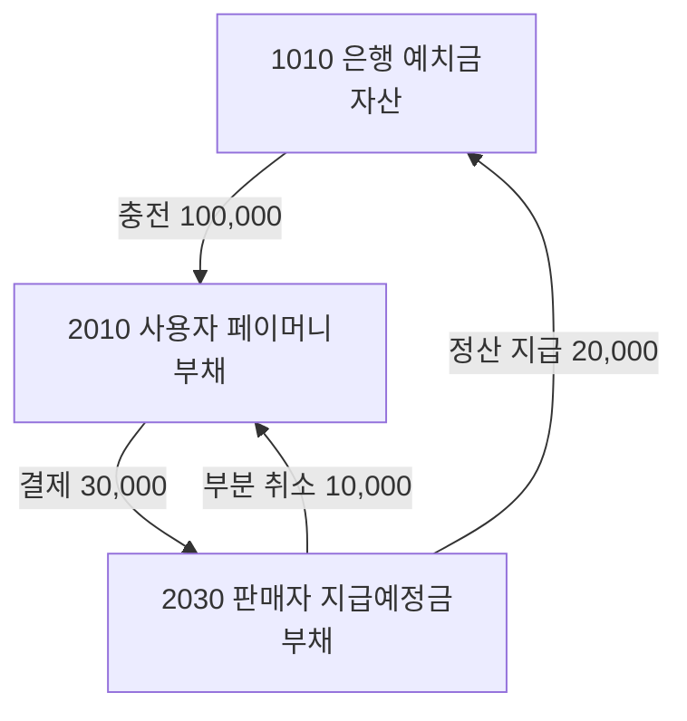

[1편](/posts/parity-pay-invariants/)에서 원장 불변조건 둘(차변=대변, 확정 원장 불변)을 PostgreSQL 트리거로 내렸다고 썼고, [6편](/posts/parity-pay-reconciliation/)에서 보정은 새 분개로만 한다고 썼다. 두 글 모두 원장이 이미 있다는 전제 위에 있다. 이 글은 그 전제를 다룬다. 왜 잔액 컬럼이 아니라 이중부기인지, 계정 체계와 분개 카탈로그가 무엇을 정하는지, 규칙을 어디에서 몇 겹으로 강제하는지, 그리고 그 원장이 실제로 얼마나 비싼지다.

## 잔액 컬럼 하나로는 안 되는 이유

가장 단순한 결제 시스템은 지갑마다 `balance` 컬럼 하나를 두고 충전이면 더하고 결제면 뺀다. 거래내역이 필요하면 부호 있는 금액(`+100,000`, `-30,000`)을 한 줄씩 남긴다. 이 구조로도 정상 흐름은 동작한다. 검토한 대안과 버린 이유는 이렇다.

| 방법 | 버린 이유 |
| --- | --- |
| 잔액 컬럼 + 부호 있는 거래내역 | 한 줄이 한쪽만 말한다. 사용자 잔액에서 30,000원이 빠졌다는 기록은 있는데 그 돈이 판매자에게 갔는지, 수수료로 잡혔는지, 어디로도 안 갔는지를 같은 구조로 표현할 수 없다. 상대 계정이 없으므로 "돈이 사라졌다"를 탐지할 방법이 기록 자체에 없다 |
| 잔액 변경 로그 | 무엇이 바뀌었는지는 남지만 왜 바뀌었는지, 시스템 전체 자산과 부채가 맞는지는 알 수 없다. 감사와 재구축에 부족하다 |
| 이중부기 원장 | 모든 금융 효과가 둘 이상의 항목으로 기록되고 차변 합계와 대변 합계가 같다. 돈은 계정 사이를 이동할 뿐 생기거나 사라지지 않는다. 대가는 계정 체계와 분개 설계 비용, 그리고 개발자가 회계 의미를 이해해야 한다는 것 |

이중부기를 고른 결정적 이유는 마지막 줄의 "전체"다. 결제 30,000원은 사용자 잔액이 줄어든 사건이 아니라 **사용자에 대한 지급 의무가 판매자에 대한 지급 의무로 이전된** 사건이다. 돈은 법인 밖으로 나가지 않았다. 이것을 한 줄로 적으면 이전의 한쪽만 남고, 두 줄로 적으면 "이 거래의 차변과 대변이 같은가"와 "모든 거래를 합쳤을 때 전 계정 순합이 0인가"라는 두 검사가 생긴다. 후자는 부호 있는 거래내역으로는 만들 수 없는 검사다.

## 계정 체계: 법인의 관점에서 본 돈

이중부기는 계정 체계가 없으면 시작할 수 없다. ParityPay의 계정은 12개이고, 차변·대변은 ParityPay 법인의 관점이다. MVP에 필수인 것은 셋이다.

| 코드 | 계정 | 분류 | 정상 잔액 | 소유자 차원 |
| --- | --- | --- | --- | --- |
| 1010 | 은행 예치금 | 자산 | 차변 | 법인·외부계좌 |
| 2010 | 사용자 페이머니 | 부채 | 대변 | 사용자·지갑 |
| 2030 | 판매자 지급예정금 | 부채 | 대변 | 판매자 |

사용자 페이머니가 **부채**인 것이 이 관점의 핵심이다. 사용자가 충전한 100,000원은 법인의 돈이 아니라 법인이 사용자에게 갚아야 할 의무다. 그래서 충전은 자산(은행 예치금)과 부채(사용자 페이머니)가 함께 늘고, 결제는 부채가 사용자에서 판매자로 옮겨가고, 정산 지급은 자산과 부채가 함께 줄어든다.



나머지 계정(PG 미수금, 판매자 미수금, 결제 보류금, 수수료 수익, 정산 조정 계정 등)은 해당 업무를 구현할 때 활성화한다. 계정마다 **소유자 차원**이 있다. PG 미수금은 기관별 계정이다. 어느 PG에게 받을 돈인지 구분되지 않으면 정산도 대사도 할 수 없다.

같은 "결제 30,000원"이라도 결제 수단에 따라 분개의 성격이 다르다는 것을 계정 체계가 드러낸다. 페이머니 결제(JE-003)는 부채가 이전되는 거래다. 카드 결제(JE-013)는 PG 미수금 자산과 판매자 지급예정금 부채가 함께 늘어나는 거래이고, 사용자 페이머니는 줄지 않는다. 환불도 결제한 곳으로 돌아간다. 카드로 받았으면 카드로 돌려주므로 페이머니는 늘지 않는다. 계정 체계 없이 "결제 취소"라는 한 기능으로 구현했다면 이 차이는 `if`문 어딘가에 묻혔을 것이다.

## 분개 카탈로그가 사양이다

원장 설계서에는 분개 14종(JE-001~014)이 표로 정의돼 있고, 규칙은 하나다. **카탈로그에 없는 분개를 코드에서 만들지 않는다.** 새 업무를 추가하려면 코드보다 먼저 카탈로그에 분개를 정의한다. `JournalFactory`는 카탈로그의 JE 번호와 1:1로 대응하는 메서드를 가진다.

현재 구현된 것은 7종(충전, 결제 승인, 부분 취소, 수수료 인식, 정산 지급, 정산 후 환불, 운영 보정)이다. 송금, 출금, 외부 PG 결제, 미확인 입금은 카탈로그에만 있고 구현하지 않았다.

카탈로그가 사양이라는 것이 실제로 도움이 된 순간이 있었다. 정산 지급이 끝난 뒤 취소가 들어오는 경우다. 판매자 지급예정금(2030)은 이미 지급으로 0이 됐는데, 기존 취소 분개(JE-004)는 그 계정을 차변으로 잡는다. 계정 잔액이 음수가 된다. 이 경우는 설계 문서의 어디에도 "언제 발생하는가"로 적혀 있지 않았다. 그런데 카탈로그에는 JE-009 "정산 후 환불"이 있었다. 판매자 미수금(1030) 차변, 사용자 페이머니 대변. 판매자에게 이미 지급했으므로 사용자 환불 의무와 판매자 회수 채권을 기록하는 분개다. **분개는 있었고, 언제 써야 하는지가 빠져 있었다.** 남은 지급예정금을 확인해 부족분을 판매자 미수금으로 잡도록 했다. 카탈로그가 없었다면 이 경우를 만났을 때 "2030이 음수가 되네, 0으로 클램프하자"로 끝났을 가능성이 크다.

## 강제는 세 층이다

원장 규칙을 지키는 코드가 한 곳이면 그 한 곳을 우회하는 경로가 규칙을 깬다. 그래서 같은 규칙을 세 층에서 강제한다. 층마다 막는 대상이 다르다.

**첫째 층: `Money` 값 객체.** 금액은 최소 화폐 단위의 `long`이다. `double`과 `float`는 쓰지 않는다. 음수 허용 여부는 사용 맥락이 아니라 생성자가 정한다. `Money.of`는 0 이상, `Money.positive`는 0 초과(원장 항목 금액용). `minus`의 결과가 음수이면 예외다. 잔액 계산에서 음수 금액이 조용히 만들어지지 않게 하기 위해서다. 통화가 다른 두 금액은 더할 수도 비교할 수도 없다. 덧셈은 `Math.addExact`라 오버플로도 예외다.

**둘째 층: `Journal` 생성자.** 아직 전기되지 않은 분개는 `Journal` 레코드이고, 생성 시점에 검증하므로 **균형이 맞지 않는 Journal 객체는 존재할 수 없다.** 항목이 둘 미만이면, 통화가 섞이면(INV-007), 차변 합과 대변 합이 다르면(INV-001), 합이 0이면 `UnbalancedJournalException`이다. 항목 금액이 양수인 것(INV-002)은 `JournalLine`이 `Money.positive`로 보장한다. 이 층의 역할은 빠른 실패다. 잘못된 분개를 만든 코드가 DB에 닿기 전에, 어떤 항목이 왜 틀렸는지 메시지와 함께 죽는다.

**셋째 층: DB 제약과 트리거.** 애플리케이션이 우회되는 경우를 막는다. 배치 스크립트, 운영자 SQL, 다른 언어로 만든 도구, 그리고 둘째 층을 쓰지 않은 미래의 코드다.

- `ledger_entry.amount > 0` CHECK 제약.
- `(reference_type, reference_id, transaction_type)` 유니크 제약. 같은 업무 참조로 같은 종류의 분개를 두 번 전기할 수 없다. [5편](/posts/parity-pay-outbox/)에서 소비자의 두 번째 방어선이라고 쓴 "업무 유니크 키"가 이것이고, INV-004의 최종 방어선이다.
- 커밋 시점 균형 검사. 1편에서 다뤘다. 항목을 여러 번 INSERT하는 중간 상태는 허용하되 커밋되는 순간의 불균형은 거부하는 지연 제약 트리거다. `ledger_entry`와 `ledger_transaction` 양쪽에 걸려 있어 항목 없이 거래만 넣는 것도 막힌다.
- 불변 트리거. `ledger_entry`는 UPDATE와 DELETE를 무조건 거부한다. `ledger_transaction`은 조금 다르다. 허용하는 변경이 정확히 하나 있다.

```sql
IF OLD.status = 'POSTED' AND NEW.status = 'REVERSED'
   AND NEW.transaction_id = OLD.transaction_id
   AND NEW.transaction_type = OLD.transaction_type
   AND NEW.reference_type = OLD.reference_type
   AND NEW.reference_id = OLD.reference_id
   AND NEW.currency = OLD.currency
   AND NEW.effective_at = OLD.effective_at
   AND NEW.created_at = OLD.created_at THEN
    RETURN NEW;
END IF;
RAISE EXCEPTION 'INV-006: ledger_transaction % is immutable once posted', OLD.transaction_id;
```

`POSTED`에서 `REVERSED`로 상태만 바뀌고 다른 모든 컬럼이 그대로일 때만 통과한다. `REVERSED`는 원거래를 수정했다는 뜻이 아니라 별도 역분개가 연결됐음을 표시하는 것이고, 그 표시 외의 어떤 변경도 막는다. "상태 컬럼은 바꿀 수 있다"가 아니라 "이 전이 하나만 가능하다"로 좁혀 둔 것이다.

세 층이 겹치는 것은 낭비가 아니다. 첫째·둘째 층은 개발자에게 좋은 오류 메시지를 주고, 셋째 층은 개발자가 없을 때 규칙을 지킨다. 1편에서 적은 대로, 셋째 층이 진짜라는 첫 증거는 테스트 코드가 원장 정리에 `DELETE`를 못 쓰고 `TRUNCATE`를 써야 했던 것이다.

## 한 건씩 맞는 것과 전체가 맞는 것은 다르다

카탈로그의 분개 7종이 각각 균형인 것은 단위 테스트로 확인된다. 그런데 그것은 "각 분개가 맞다"는 주장이고, "어떤 순서로 어떤 금액을 섞어도 원장 전체가 맞다"는 다른 주장이다. 후자를 jqwik 속성 기반 테스트로 확인했다(`LedgerJournalPropertiesTest`).

| 속성 | 확인하는 것 |
| --- | --- |
| `everyJournalIsBalanced` | 카탈로그가 만드는 모든 분개가 균형·양수·단일 통화다 (INV-001·002·007) |
| `anySequenceLeavesTheLedgerBalanced` | 임의의 분개 시퀀스를 전기해도 전 계정 순합이 0이다 |
| `reversalCancelsTheOriginalExactly` | 역분개는 원거래의 계정별 효과를 정확히 상쇄한다 (ADR-009) |

생성기가 한쪽 분개 종류로 쏠려 쉬운 경우만 통과하는 것을 막으려고 `Statistics.coverage`로 각 종류가 일정 비율 이상 나오도록 강제했다. 속성 테스트에서 생성기의 분포를 확인하지 않으면 "천 번 통과"가 "같은 경우 천 번"일 수 있다.

두 번째 속성이 이 원장 설계의 핵심 주장이다. 돈은 계정 사이를 이동할 뿐 생기거나 사라지지 않는다는 것을, 카탈로그의 어떤 조합에 대해서도 확인한 것이다.

## 원장은 진실이고 스냅샷은 조회다

원장이 진실이면 잔액을 조회할 때마다 원장을 합산해야 한다. 그 비용을 피하려고 `wallet_balance` 스냅샷을 두고, 원장 전기와 같은 트랜잭션에서만 갱신한다. 스냅샷을 별도 경로로 수정하는 코드는 없다([ADR-008](https://github.com/polynomeer/parity-pay/blob/main/docs/adr/008-ledger-balance-snapshot.md)).

검토한 대안은 셋이었다. 원장 실시간 합산(진실 모델은 단순하지만 데이터가 늘수록 조회가 느려짐), 잔액만 저장(빠르지만 감사·재구축이 약함), 비동기 투영(쓰기는 가볍지만 결제 직후 잔액 일관성이 복잡해짐). 같은 트랜잭션 갱신은 셋의 중간이다. 조회는 빠르고 재구축은 가능하되, 원장과 스냅샷이라는 이중 표현을 검증해야 한다는 대가가 있다. 그 검증이 INV-010이고, 6편의 내부 대사가 그것이다.

가용 잔액과 원장 잔액의 관계는 한 식으로 고정돼 있다. `availableBalance + pendingBalance = ledgerBalance`. 둘이 다른 경우는 보류금이 있을 때뿐이다.

이 결정의 비용을 실제로 쟀다(M-006). 지갑 하나의 원장을 합산하는 시간이다.

| 계정의 항목 수 | 1,170 | 10,000 | 100,000 | 500,000 |
| --- | ---: | ---: | ---: | ---: |
| 집계 시간 | 0.37ms | 2.28ms | 16.60ms | 43.37ms |

한 지갑을 검증하거나 재구축하는 비용은 문제가 아니었다. 50만 건에서 43ms면 스냅샷이 의심될 때 언제든 원장에서 다시 만들 수 있다. 문제는 **전 지갑을 훑는 쪽**이었다. INV-010 탐지가 전체 항목 수에 선형이라 200만 건에서 867ms, INV-001 탐지는 3,642ms였고, 이 두 질의가 게이지를 읽을 때마다 돌고 있었다. 원장은 append-only라 이 비용은 단조 증가한다. [4편 결함 G](/posts/parity-pay-experiments-and-defects/)가 이것이다. "원장이 진실"이라는 설계는 원장을 읽는 비용을 누가 언제 내는가를 같이 정해야 한다. 지갑 단위는 요청 시점에, 전체는 캐시된 주기 계산으로 냈다.

한 가지 더 남긴다. 스냅샷과 원장 재생값을 비교하는 검증 API는 처음에 인증만 걸린 채 누구에게나 열려 있었고, 남의 지갑 잔액까지 보였다. INV-010 불일치는 회원이 할 수 있는 일이 없는 문제이고 확인도 재구축도 운영자 절차이므로, 운영자 전용으로 닫았다. 정합성 도구를 만드는 데 집중하다가 그 도구가 노출하는 것을 놓친 경우다.

## 한계와 운영에서 추가할 것

- **단일 통화다.** INV-007이 한 거래 안의 통화 혼용을 막지만, 시스템 전체가 KRW 하나다. 외화가 들어오면 환율 적용 시점과 환차손 계정이 필요하고, 그것은 카탈로그에 없다.
- **분개 14종 중 7종만 구현했다.** 송금, 출금, 외부 PG 결제와 환불, 미확인 입금은 카탈로그에만 있다. 특히 외부 PG 결제는 자산·부채가 함께 늘어나는 다른 성격의 거래라 구현하면 계정 체계가 실제로 시험된다.
- **일별 균형 검증 배치가 없다.** 설계서는 일별로 거래별 균형과 계정별 잔액을 검증한다고 적었지만, 지금은 상시 지표(30초 캐시)로 대체하고 있다. 값이 0이 아니면 즉시 경보이므로 일별 배치보다 빠르지만, 특정 일자 마감 시점의 잔액을 고정하는 절차는 없다.
- **정산 조정 계정(9010)은 정의만 있다.** 차이를 숨기는 영구 계정이 되지 않으려면 해소 계획과 만료 경보가 필요한데, 계정 자체를 아직 쓰지 않았다.
- **회계 지식이 진입 장벽이다.** "사용자 페이머니는 부채"를 이해해야 분개를 읽을 수 있다. 이 프로젝트에서는 설계서가 그 역할을 했지만, 팀이라면 온보딩 비용이다.

## 실무 경험과의 관계

실무에서 다룬 정산은 지분율과 정산 기준 데이터였다. [지분율 시스템](/series/batch-structure-improvement/)에서는 80만 건의 비율을 정확히 삭제하고 재등록하는 것이 문제였고, [MDS](/posts/settlement-write-guard/)에서는 정산이 도는 동안 기준 데이터가 바뀌지 않게 하는 것이 문제였다. 둘 다 정산의 **입력**을 정확하게 유지하는 일이었고, 돈의 이동 자체를 분개로 기록하는 원장을 설계한 적은 없다.

[2021년의 결제대행 연동](/posts/payment-gateway-2021-retrospective/)에서 던지지 않았던 질문 중 하나가 "나중에 설명할 수 있는가"였다. 결제가 이루어졌다는 사실은 남았겠지만, 그 돈이 어느 계정에서 어느 계정으로 갔는지, 취소가 원거래를 고쳤는지 새 기록을 남겼는지는 묻지 않았다. 이중부기 원장을 만들고 나서 그 질문의 답이 구조에서 나온다는 것을 알았다. 모든 이동이 두 줄이고 확정 기록은 고칠 수 없으면, 어떤 시점의 잔액도 재구축할 수 있고 어떤 변경도 새 줄로 남는다. 설명 가능성은 나중에 붙이는 기능이 아니라 기록 구조의 성질이었다.

## 정리

- 잔액 컬럼과 부호 있는 거래내역은 한쪽만 말한다. 이중부기는 모든 이동을 두 줄로 적어 "이 거래가 맞는가"와 "전체가 맞는가"라는 두 검사를 만든다.
- 계정 체계는 법인의 관점이다. 사용자 페이머니는 부채이고, 결제는 부채의 이전이다. 같은 금액의 결제도 수단에 따라 분개의 성격이 다르고, 계정 체계가 그 차이를 드러낸다.
- 카탈로그에 없는 분개는 만들지 않는다. 카탈로그에 있었지만 언제 쓰는지 빠져 있던 분개(정산 후 취소)를 구현 중에 찾았다.
- 규칙은 `Money`, `Journal`, DB 세 층에서 강제한다. 앞의 두 층은 개발자에게 오류를 설명하고, 셋째 층은 개발자가 없을 때 규칙을 지킨다. `ledger_transaction`에 허용된 변경은 `POSTED → REVERSED` 하나뿐이다.
- 각 분개가 맞는 것과 임의 시퀀스 후 전 계정 순합이 0인 것은 다른 주장이다. 후자를 속성 테스트로 확인했고, 생성기 분포를 강제했다.
- 원장이 진실이면 원장을 읽는 비용을 누가 언제 내는지도 정해야 한다. 지갑 하나는 50만 건에서 43ms, 전체를 훑는 지표는 200만 건에서 3.6초였다.
