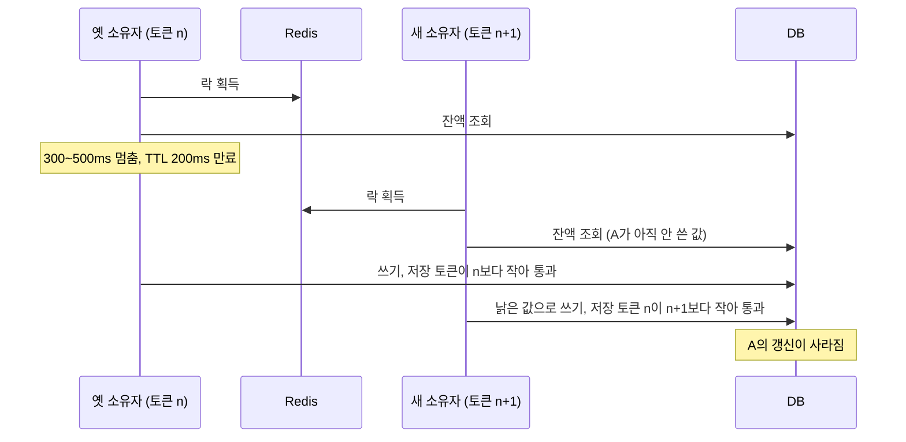

[2편](/posts/parity-pay-lock-hold-time/)에서 잔액 차감에 `SELECT FOR UPDATE`와 조건부 원자 UPDATE를 비교해 후자를 골랐다고 썼다. [ADR-004](https://github.com/polynomeer/parity-pay/blob/main/docs/adr/004-atomic-balance-update.md)의 대안 목록에는 하나가 더 있었다. 분산락. "DB 업데이트와 원자성이 자동 보장되지 않고 운영 실패 모드가 추가된다"는 이유로 뺐는데, 그 문장은 추론이지 측정이 아니었다.

이 질문은 개인적으로도 답해야 할 것이었다. 실무의 [지분율 시스템](/series/batch-structure-improvement/)에서 SETNX + TTL + 소유 토큰 분산락을 설계했고, [4부](/posts/bulk-insert-with-lock-part4/)에서 "락이 있어도 레이스가 난 이유", [5부](/posts/bulk-insert-with-lock-part5/)에서 "배타적 락과 조건부 해제"를 적었다. 그때 다루지 않은 질문이 있다. 락 lease(락을 쥘 수 있는 기한. 이 시간이 지나면 락 서버가 락을 스스로 풀어 준다)가 작업보다 먼저 끝나면 무슨 일이 나는가. TTL은 "작업의 예상 최대 소요 시간에 여유를 둔 값"으로 잡았고, 그것으로 충분했는지는 확인한 적이 없다.

그래서 이번에는 "락이 있으니 안전하다"고 믿는 구현을 일부러 만들었다. 이 글의 다섯 실험은 본 설계의 결함을 찾는 실험이 아니다. 실험 경로(`experiment-lock` 프로필)는 실험 뒤 채택하지 않았고, 기본 경로는 한 줄도 바뀌지 않았으며, 여기서 나온 것은 결함 번호를 받지 않는다. 깨지도록 만든 것이 깨진 것이기 때문이다.

## 실험의 공통 조건

지갑 모듈의 잔액 저장소를 `@Primary` 데코레이터로 감싸 차감 메서드 하나만 바꿨다. Redis `SET key token NX PX ttl` 락 안에서 조회 → (멈춤) → 계산 → 조건 없는 UPDATE 순서로 처리한다. `NX`는 키가 없을 때만 쓰고, `PX`는 만료 시간을 밀리초로 준다([SET](https://redis.io/docs/latest/commands/set/)). 해제는 "내 토큰일 때만 DEL"(조건부 해제)이고 트랜잭션 완료 뒤다. 토큰은 지갑별 `INCR`로 단조 증가한다. 5부의 설계를 그대로 옮긴 셈이다.

| 항목 | 값 |
| --- | --- |
| 락 TTL | 200ms (보충 실험 1초) |
| 락 안 멈춤 | 300~500ms 균등 난수 `Thread.sleep` — GC 정지·네트워크 지연 흉내 |
| Watchdog | 66ms마다 "내 토큰이면 PEXPIRE 200" (TTL/3) |
| 부하 | 스레드 16개가 지갑 4개에 1,000원 결제를 쉬지 않고. 60초 × 3회 |
| 초기 잔액 | 지갑당 60,000원 → 승인 가능 정확히 60건, 4지갑 240건 |
| Redis | redis:7-alpine, 스냅샷·AOF 없음, Lettuce 명령 타임아웃 500ms |

소유 겹침은 로그가 아니라 표로 센다. 락을 잡을 때·쓸 때·풀 때의 시각과 토큰을 별도 커넥션 풀로 `experiment_lock_hold`에 남기고(업무 트랜잭션이 롤백돼도 남는다), 같은 지갑의 두 행이 `[acquired_at, released_at]`에서 겹치는 쌍을 SQL로 센다. 정합성 지표는 셋이다. drift = 잔액 스냅샷 − 원장 계산값(INV-010), 초과 승인 = 승인 건수 − 60(INV-003), 그리고 원장 음수 지갑 수다.

멈춤이 항상 TTL보다 길다는 것은 실무 조건이 아니다. 실무의 GC 정지는 가끔이다. [프로세스가 멈추는 원인](/posts/why-a-process-pauses/)은 GC 말고도 여럿이다. 하지만 한 번이면 충분하고 언제 올지 모르므로, "가끔"을 "항상"으로 바꿔 무엇이 깨지는지를 3회 안에 보는 것이 이 실험의 설계다.

## 실험 1: lease가 만료되면 이중 소유가 되는가

TTL 200ms 안에서 300~500ms 멈춘다(M-024).

| run | 승인 (가능 240) | 소유 겹침 쌍 | 최대 동시 소유자 | 해제 시 STOLEN | drift | 초과 승인 | 원장 음수 지갑 |
| ---: | ---: | ---: | ---: | ---: | ---: | ---: | ---: |
| 1 | 590 | **1,714** | 3 | 1,135 | **350,000원** | **350** | 4/4 |
| 2 | 580 | 1,697 | 4 | 1,131 | 340,000원 | 340 | 4/4 |
| 3 | 586 | 1,710 | 3 | 1,131 | 346,000원 | 346 | 4/4 |

재현됐다. 3회 모두. 한 지갑을 동시에 "쥐고 있다"고 믿은 스레드가 최대 3~4개였고, 지갑마다 60건만 승인 가능한데 141~149건이 승인됐다. 원장은 4/4 지갑이 −81,000~−89,000원이다.

두 가지가 눈에 띈다. 첫째, 해제 시점에 "내 토큰이 아니다"(STOLEN)가 1,131~1,135건이다. 거의 모든 홀드가 만료 뒤 남의 락을 풀려고 했고, 조건부 해제가 그것을 막았다. 그러나 그때는 이미 잔액을 쓴 뒤다. 5부에서 "해제는 반드시 조건부로"라고 썼는데, 조건부 해제가 막는 것은 **남의 락을 지우는 사고**이지 남의 구간에 쓴 사고가 아니다. Redis 문서도 토큰을 비교하는 해제 스크립트의 목적을 만료 뒤 늦게 온 클라이언트가 "deleting the key created by another client"하는 것을 막는 데 둔다([SET - Patterns](https://redis.io/docs/latest/commands/set/)). 소유 토큰이 해제를 지키는 것과 쓰기를 지키는 것은 다른 일이고, 5부의 설계는 앞의 것만 했다.

둘째, 지갑 화면으로는 알 수 없다. 스냅샷은 0에서 멈춰 "잔액을 다 썼다"로 보인다. 15초 예비 실행에서는 스냅샷이 +30,000인 채 원장이 이미 −14,000이었다. 어긋남은 원장과 대조해야만 보이고, 그래서 [6편](/posts/parity-pay-reconciliation/)의 내부 대사(INV-010)가 필요하다. 락이 깨져도 오류는 나지 않았다.

## 실험 2: Watchdog은 무엇을 해결하고 무엇을 못 하는가

락 보유 중 TTL/3마다 연장하는 스레드를 켠다. 두 변형을 쟀다. 하나는 그대로, 하나는 하니스가 pay-api 프로세스에 `SIGSTOP` 400ms를 1.5초마다 총 35회 보낸다. 프로세스 전체가 멈추므로 stop-the-world(모든 스레드가 함께 멈추는 정지)와 같은 조건이다(M-025).

| 변형 | 승인 | 연장 횟수 | 소유 겹침 쌍 | 해제 시 STOLEN | drift | 초과 승인 | 처리량 |
| --- | ---: | ---: | ---: | ---: | ---: | ---: | ---: |
| 연장, 3회 | **240 · 240 · 240** | ~3,300 | 0 (아티팩트 1) | 0 | **0** | **0** | 9.7/s |
| 연장 + SIGSTOP 400ms × 35, 3회 | 321~323 | ~2,475 | **131~132** | 128~131 | **81,000~83,000원** | **81~83** | 8.7/s |

Watchdog은 "트랜잭션이 lease보다 오래 걸리는" 만료를 없앴다. 승인 정확히 240, drift 0. 표의 겹침 1은 이중 소유가 아니라 기록 순서의 아티팩트다(3µs·17µs, 둘 다 RELEASED). 400ms 단위의 진짜 겹침과는 자릿수가 다르다.

그러나 **Watchdog은 같은 프로세스의 스레드다.** 프로세스가 멈추면 연장도 멈춘다. 400ms 정지가 35번 오는 동안 겹침 131~132쌍, 초과 승인 81~83건이 돌아왔다. 정지 1회당 겹침 약 3.7쌍, 지갑 4개에서 정지 순간 락을 쥐고 있던 홀드가 거의 전부 만료된 것이다. Watchdog이 해결하는 것은 느린 작업이고 못 하는 것은 멈춘 프로세스인데, lease를 만료시키는 원인 중 정말 위험한 쪽(STW GC, 네트워크 단절, 프로세스 정지)은 후자다.

비용도 있다. 락이 제대로 배타적이 되자 처리량이 19.2/s에서 9.7/s로 절반이 됐다. 지갑당 락 보유 300~500ms가 곧 지갑당 처리 상한이다.

## 실험 3: fencing token은 어디에 걸어야 하는가

[fencing token](/posts/kleppmann-distributed-locking/)은 락을 잡을 때마다 1씩 커지는 번호를 받아, 저장소가 더 작은 번호의 쓰기를 거부하게 하는 방식이다. Kleppmann은 이것이 안전하려면 "the lock service generates strictly monotonically increasing tokens"여야 한다고 적었다(락 서비스가 엄격하게 단조 증가하는 토큰을 발급해야 한다, [How to do distributed locking](https://martin.kleppmann.com/2016/02/08/how-to-do-distributed-locking.html)). 이 실험에서는 만료된 소유자의 늦은 쓰기를 DB가 거부하게 했고, 두 구현을 쟀다(M-026).

- c-1 쓰기 시점 fencing. 흔히 설명되는 형태. 잔액 UPDATE 직전에 "저장된 토큰 < 내 토큰"이면 토큰을 올리고 쓰고, 아니면 거부.
- c-2 읽는 순간 새기기. 락을 잡은 직후 별도 짧은 트랜잭션에서 "저장된 토큰 < 내 토큰"일 때만 토큰을 올리고 잔액을 `FOR SHARE`([공유 잠금](/posts/lock-types-and-waits/)을 걸고 읽기)로 읽는다. 쓰기는 "저장된 토큰 = 내 토큰"일 때만 통과.

| 변형 | 승인 | fencing 거부 | 잃어버린 갱신 쌍 | drift | 초과 승인 |
| --- | ---: | ---: | ---: | ---: | ---: |
| c-1 쓰기 시점, 3회 | 590~593 | **1 · 0 · 0** | 864~876 | **350,000~353,000원** | **350~353** |
| c-2 읽는 순간, 3회 | **6 · 4 · 4** | **1,153~1,165** | 0 | **0** | **0** |

**c-1은 실험 1과 구별되지 않는다.** 3회 1,505건 중 거부 1건. 이유는 순서다. lease가 만료된 옛 소유자는 먼저 시작했으므로 먼저 쓴다. 그 시점에 저장된 토큰은 아직 자기 것보다 작아서 통과하고, 새 소유자는 그 전에 읽어 둔 낡은 값으로 뒤에 쓴다. 새 소유자의 토큰이 더 크니 이것도 통과한다. 쓰기 시점 fencing이 막는 것은 "새 소유자가 이미 쓴 뒤에 오는 옛 소유자의 쓰기"뿐인데, 트랜잭션이 lease보다 길어서 만료되는 상황에서는 그 순서가 거의 나오지 않는다(3회에 1번). 교과서 그림(옛 소유자가 새 소유자의 쓰기 뒤에 깨어남)은 lease 만료의 한 가지 경우이지 전형이 아니다.

c-1에서 실제로 많이 나온 순서를 그리면 이렇다. 두 쓰기가 모두 토큰 검사를 통과한다.

c-2는 정합성을 지켰다. drift 0, 초과 승인 0, [잃어버린 갱신](/posts/isolation-levels-and-anomalies/) 0. 토큰을 읽는 순간 새기면 "내가 읽은 뒤 누가 새로 읽었는가"를 쓰기 시점에 알 수 있고, `FOR SHARE`가 "옛 소유자가 쓰고 아직 커밋하지 않은 값을 새 소유자가 못 보는" 창을 닫는다.

그러나 c-2는 일을 거의 못 했다. 1,159건 중 승인 4~6건. lease가 항상 작업보다 짧으면 모든 소유자가 쓰기 전에 다음 소유자에게 추월당한다. 그것이 fencing이 정확히 하라고 만든 일이다. fencing은 안전(safety)을 주지 실행 보장(liveness)을 주지 않고, lease가 작업보다 짧은 시스템은 fencing을 붙이면 "틀리게 승인"에서 "전부 거부"로 바뀐다. 고칠 것은 fencing이 아니라 lease다.

그래서 lease를 작업보다 길게 잡아 봤다. TTL 1초, 멈춤 300~500ms. c-2는 3회 모두 거부 0·승인 240·drift 0이었다. 그런데 같은 TTL의 실험 1 경로가 3회 중 2회 만료됐다. 3회차에는 336~463ms만 쥔 홀드 4건이 1,000ms lease 안에서 STOLEN이 되어 초과 승인 4건이 났다. 홀드 시각은 클라이언트가 응답을 받은 뒤 찍히고 lease는 Redis가 `SET`을 실행한 순간부터 흐른다. 그 사이 Redis가 수백 ms 멈추면(이날 Docker VM은 메모리 압박으로 다른 컨테이너가 죽던 상태였다) 소유자는 자기 lease가 이미 절반 넘게 탄 뒤에야 락을 받았다는 것을 알 수 없다. lease의 시계는 락 서버의 것이다. "작업보다 충분히 긴 lease"는 락 서버와 네트워크의 멈춤까지 포함해야 하는데, 그 상한은 아무도 모른다.

## 실험 4: 락 없는 기본 경로에 같은 멈춤을 주면

기본 경로(조건부 원자 UPDATE)에 같은 300~500ms 멈춤을 UPDATE 앞에 주입했다(M-027).

| run | 승인 | 동시 구간 겹침 쌍 (락 없음) | drift | 초과 승인 | 처리량 | p95 |
| ---: | ---: | ---: | ---: | ---: | ---: | ---: |
| 1 | **240** | 5,212 | **0** | **0** | 30.3/s | 588ms |
| 2 | 240 | 6,752 | 0 | 0 | **38.5/s** | **506ms** |
| 3 | 240 | 6,340 | 0 | 0 | 36.8/s | 536ms |

실험 5의 대조군 3회를 합쳐 **여섯 번 전부 승인 정확히 240, drift 0, 초과 승인 0이다.** 락이 없으니 "동시에 잔액을 만지는 구간"은 겹친다. 같은 지갑에서 겹친 쌍이 5,212~6,771로 실험 1의 세 배가 넘는다. 그런데도 어긋나지 않았다. 조건 `available_amount >= ?`는 쓰는 순간 DB가 행 잠금 아래에서 검사하고, 그 앞에 얼마나 오래 멈춰 있었든 검사에는 영향이 없다. 멈춤은 지연일 뿐이다.

처리량 36.8~38.5/s는 락 경로(19.2/s)의 두 배, 제대로 배타적인 락(Watchdog 9.7/s)의 네 배다. p95(95번째 백분위 응답 시간) 506~536ms는 주입한 멈춤의 상한에 수십 ms를 더한 값이다. 대기가 없기 때문이다. 락 경로의 p95 1.5초(실험 1)·4.2~4.7초(실험 2)는 앞 소유자의 멈춤을 줄 서서 기다린 값이다.

## 실험 5: 락 서버가 죽으면

부하 중 20초에 Redis를 `docker kill`, 40초에 `docker start`. 락 획득이 실패하면 결제는 어떻게 되는가, 락 서버가 비워진 채 돌아오면 무엇이 달라지는가(M-028).

| 변형 | 단절 중 503 | 단절 중 락 없는 홀드 | 단절 중 겹침 쌍 | drift | 초과 승인 |
| --- | ---: | ---: | ---: | ---: | ---: |
| fail-closed, 3회 | 20,108~22,075 | 0 | 0 | 343,000~360,000원 (실험 1과 같음) | 343~360 |
| fail-open, 3회 | 0 | **480~771** | **1,115~2,245** | **475,000~491,000원** | **475~491** |
| c-2 fencing + fail-closed, 3회 | 21,270~24,183 | 0 | 0 | **0** | **0** |
| 대조군, 3회 | 0 | (락 없음이 정상) | 전·중·후 동일 | **0** | **0** |

fail-closed(락을 못 잡으면 요청을 거절)는 단절 20초 동안 잔액 쓰기 0건, 2만 건이 즉시 503이다. 락 서버가 곧 결제 가용성이 된다. fail-open("락 서버가 없으면 그냥 진행")은 단절 20초 동안 766~771건이 락 없이 읽고 썼고, 겹침 쌍은 락이 있던 20초의 4배, 초과 승인은 실험 1보다 35~40% 많다. fail-open은 락이 없는 것과 같고, 락 서버 장애를 정합성 장애로 바꾼다.

**c-2 fencing + fail-closed에서는 Redis 재기동 뒤 결제가 거부됐다.** 단절 중 drift 0은 맞다. 그런데 Redis가 비워진 채 돌아오자 토큰 카운터가 1부터 다시 시작하는데 DB의 fence 표는 단절 전 값(지갑마다 96)을 기억하고 있어, 재기동 뒤 지갑마다 정확히 96건, 3회 모두 합계 384건이 읽기 시점 fencing에서 거부됐다. 카운터가 96을 넘어설 때까지 그 지갑은 결제가 되지 않았다. 단조 토큰의 "단조"는 락 서버의 수명 안에서만 성립하고, 락 서버가 상태를 잃으면 fencing은 안전한 쪽(전부 거부)으로 넘어진다. 안전하지만 가용성 사고다. 카운터를 영속화하거나 DB에서 발급해야 하는데, 후자라면 락 서버가 왜 필요한지 다시 물어야 한다.

대조군은 Redis를 죽이고 살리는 60초 동안 아무것도 달라지지 않았다. 세 구간의 홀드 수와 겹침 쌍이 같고 승인 240·drift 0이다. 결제 경로가 Redis에 의존하지 않으므로 Redis가 죽어도 영향이 없다.

## 종합: ADR-004를 확정하는 실측

| 조건 (같은 부하, 같은 300~500ms 멈춤) | 소유 겹침 | drift | 초과 승인 | 승인/60초 (가능 240) | 처리량 |
| --- | ---: | ---: | ---: | ---: | ---: |
| (a) SETNX+TTL 락, 조회→계산→저장 | 1,697~1,714 | 340,000~350,000원 | 340~350 | 580~590 | 19.2/s |
| (b) + Watchdog | 0 | 0 | 0 | 240 | 9.7/s |
| (b) + Watchdog + 프로세스 정지 | 131~132 | 81,000~83,000원 | 81~83 | 321~323 | 8.7/s |
| (c-1) + 쓰기 시점 fencing | 1,713~1,732 | 350,000~353,000원 | 350~353 | 590~593 | 19.1/s |
| (c-2) + 읽는 순간 fencing | 1,722~1,770 | 0 | 0 | **4~6** | 19.1/s (거의 전부 거부) |
| (d) 분산락 없음, 조건부 원자 UPDATE | (락 없음) | **0** | **0** | **240** | **36.8~38.5/s** |
| (e) Redis 단절, fail-open | 1,115~2,245 | 475,000~491,000원 | 475~491 | 715~731 | — |
| (e) Redis 단절, 대조군 | (락 없음) | 0 | 0 | 240 | 37.9~38.4/s, 전·중·후 동일 |

분산락으로 정합성을 지키려면 (1) lease가 어떤 정지보다 길거나, (2) Watchdog이 프로세스 정지까지 이기거나, (3) fencing이 읽기부터 쓰기까지 걸려 있어야 하고, (3)은 lease가 짧은 순간 가용성을 버린다. 셋 다 이 실험에서 성립하지 않았다. 조건부 원자 UPDATE는 "언제 읽었는가"를 묻지 않는다. 조건은 쓰는 순간 DB가 검사하고, 멈춤은 지연일 뿐 정합성에 닿지 않는다. ADR-004의 Outcome에 이 표를 붙였고 결정은 바뀌지 않았다.

## 한계

- **멈춤이 항상 TTL보다 길다.** 실무 조건이 아니라 "한 번 오면 무엇이 깨지는가"를 3회 안에 보기 위한 조건이다. 실험 2의 SIGSTOP 변형(35회 중 정지 순간에만 만료)이 실무에 더 가깝다.
- **지갑 4개에 스레드 16개**는 극단적 경합이다. 경합이 낮으면 겹침도 낮지만, 0이 되지는 않는다.
- **Watchdog은 직접 만든 것이다.** Redisson의 실제 구현과 세부가 다를 수 있다. 다만 "같은 프로세스의 스레드"라는 한계는 구현과 무관하다.
- **단일 Redis 노드**다. RedLock 같은 다중 노드 구성은 재지 않았고, 재더라도 실험 3의 "lease의 시계는 락 서버의 것"은 노드 수와 무관하다.
- **환경이 나빴다.** 이날 Docker VM은 다른 컨테이너가 메모리 4.5GB를 쥐고 있어 Redpanda·mock-bank가 OOM으로 여러 번 죽었고 Redis도 수백 ms 멈춘 흔적이 있다. 정합성 지표(겹침·drift·초과)는 시간에 민감하지 않지만 처리량·p95는 상대 비교로만 읽어야 한다. 실험 4의 1회차 max 9.4초가 그 흔적이다.
- **거부된 요청에 재시도를 붙이지 않았다.** c-2의 "전부 거부"는 재시도가 있으면 다르게 보이겠지만, 재시도 결과도 다시 lease에 달려 있다.

## 실무 경험과의 관계

이 글은 시리즈에서 실무와 가장 직접 맞닿는 편이다. 지분율 시스템의 락은 실험 1의 구현과 같은 모양이었다. SETNX + TTL + 소유 토큰, 조건부 해제. [5부](/posts/bulk-insert-with-lock-part5/)에서 소유 토큰은 "다른 작업의 락을 훼손하지 않음"을 지켰다. 이 실험이 보여준 것은 그 토큰이 해제를 지킨 것이지 쓰기를 지킨 것은 아니라는 점이다. 만료된 소유자의 쓰기를 막는 장치는 없었다. 그것이 문제가 되지 않았거나, 됐는데 몰랐거나 둘 중 하나이고, 지금은 확인할 수 없다.

문제가 되지 않았을 가능성이 높은 이유는 있다. 배치는 한 대에서 예측 가능한 시간에 돌았고, TTL은 작업의 예상 최대 소요 시간에 여유를 둔 값이었으며, 5부에서 락과 별개로 작업 상태(`DELETING`·`REGISTERING`·`COMPLETED`)를 저장소에 남겨 "락은 없는데 상태가 `DELETING`에 오래 머문다" 같은 상황을 분리해 볼 수 있게 했다. 돌이켜보면 그 상태 저장소가 실험 4의 조건부 UPDATE에 가까운 것이었다. 락이 아니라 저장소의 상태가 "지금 이 작업을 해도 되는가"를 판정하는 방향이고, 락은 그 판정의 경합을 줄이는 보조 장치였다. 당시에는 그렇게 이해하지 않았다. 락이 주고 상태가 보조라고 생각했다.

두 도메인의 차이도 분명하다. 지분율 배치는 "삭제 후 재등록"이라는 다단계 작업의 상호 배제였고, 그것은 단일 행의 WHERE 조건으로 환원되지 않는다. 락이 필요했다. 잔액 차감은 단일 행 조건이라 락이 필요 없다. 이 실험의 결론은 "분산락을 쓰지 말라"가 아니다. 단일 행 조건으로 환원되는 문제에 분산락을 쓰면 정합성은 얻지 못하고 가용성만 잃는다는 것이다. 다단계 작업에 락을 쓸 때는 lease 만료 뒤 쓰기를 막는 장치(읽기부터 쓰기까지 걸린 fencing, 또는 각 단계의 상태 조건)가 락과 별도로 있어야 하고, 지분율 시스템에서 그 역할을 한 것은 락이 아니라 상태 저장소였다.

## 정리

- 조건부 해제와 소유 토큰은 해제를 지킬 뿐 쓰기를 지키지 않는다. lease가 만료되면 정합성은 조용히 깨지고, 스냅샷은 정상으로 보이며 원장만 음수가 된다.
- Watchdog은 느린 작업을 막지만 멈춘 프로세스는 못 막는다. 쓰기 시점 fencing은 옛 소유자가 먼저 쓰는 순서를 막지 못하고, 읽는 순간 fencing은 lease가 짧으면 전부 거부한다.
- 락 서버 장애는 fail-closed면 가용성 사고, fail-open이면 정합성 사고, fencing이면 재기동 뒤 거부 사고가 된다.
- 단일 행 조건으로 환원되는 문제에는 DB가 쓰는 순간 조건을 검사하게 하는 편이 맞았다. 같은 멈춤 아래 여섯 번 전부 정확히 240건이었고 처리량은 락의 2배였다.

## 참고

- [Martin Kleppmann - How to do distributed locking (2016)](https://martin.kleppmann.com/2016/02/08/how-to-do-distributed-locking.html)
- [Redis - SET](https://redis.io/docs/latest/commands/set/)
