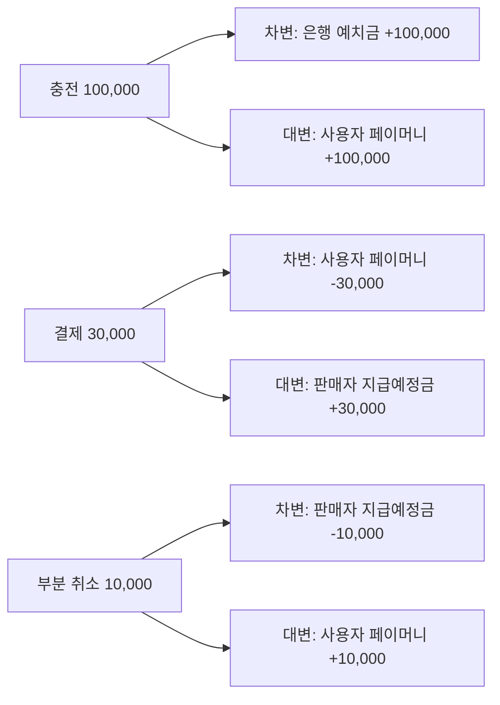

[GitHub 저장소](https://github.com/polynomeer/parity-pay)

ParityPay는 플랫폼 내장형 페이머니를 구현한 개인 프로젝트다. 사용자가 은행 계좌에서 페이머니를 충전하고, 주문을 결제하고, 취소하고, 판매자에게 정산되는 흐름을 백엔드로 만들었다. 기능 목록만 보면 흔한 결제 API 연동 과제처럼 보인다. 이 프로젝트의 목표는 그 기능들이 정상 요청에서 동작하는 것이 아니라, **중복 요청, 동시 잔액 차감, 외부기관 승인 후 응답 유실, 이벤트 중복 전달, 프로세스 재시작이 겹쳐도 돈의 기록이 정확한가**를 검증하는 것이었다.

이 글은 시리즈의 첫 편으로, 왜 이 프로젝트를 시작했는지, "정확하다"를 어떻게 검증 가능한 문장으로 바꿨는지, 그리고 그 문장들을 어디에서 강제하기로 했는지를 정리한다.

## 왜 결제를 다시 만들었는가

실무에서 다뤄온 것은 음원 유통과 정산이었다. 지분율 데이터 80만 건을 삭제하고 재등록하는 배치에서 분산락이 있는데도 레이스가 났고, 그걸 [상태 전이 모델과 소유 토큰으로 막았다](/series/batch-structure-improvement/). 정산이 도는 동안 기준 데이터가 바뀌는 문제를 [상태 플래그와 AOP로 차단했다](/posts/settlement-write-guard/). 두 사례 모두 "정합성을 사람의 호출 순서가 아니라 시스템이 강제한다"는 원칙을 배운 자리였다.

그런데 두 사례에는 공통된 한계가 있었다. 강제의 위치가 애플리케이션이었다. 상태 플래그 검사는 AOP가 하고, 분산락은 Redis가 들고, 상태 전이는 서비스 코드가 판단한다. 애플리케이션 코드가 맞으면 정합성이 지켜지고, 코드 경로 하나가 검사를 빠뜨리면 뚫린다. 정산 중 수정 차단 글에서 "수정 측의 밀리초 단위 창은 받아들였다"고 쓴 것도 이 한계의 한 형태다.

결제와 원장은 이 한계를 받아들일 수 없는 도메인이다. 잔액이 음수가 되거나 같은 결제가 두 번 차감되면 "드물다"는 변명이 통하지 않는다. 그래서 질문을 바꿔보고 싶었다. **정합성 규칙을 애플리케이션이 아니라 저장소가 강제하게 만들면, 코드가 틀려도 규칙이 지켜지는가.** 이 질문에 답하려면 실무 코드로는 할 수 없는 실험이 필요했다. 프로세스를 죽이고, 응답을 유실시키고, 같은 요청을 백 번 보내고, 원장을 직접 UPDATE해보는 실험이다.

이력서에 "결제처럼 실패하면 안 되는 흐름을 더 정확하고 견고하게 만들고 싶다"고 적은 지향점을, 말이 아니라 실험 결과로 뒷받침하려는 목적도 있었다.

## "정확하다"를 검증 가능한 문장으로

"돈의 기록이 정확하다"는 테스트할 수 없다. 테스트하려면 참·거짓을 판정할 수 있는 문장이어야 한다. 프로젝트 초반에 가장 오래 걸린 일이 이 문장들을 쓰는 것이었다. 결과는 열 개의 불변조건(INV-001~010)이고, 그중 핵심 여섯 개가 이렇다.

| ID | 불변조건 | 무엇을 막는가 |
| --- | --- | --- |
| INV-001 | 모든 확정 원장 거래의 차변 합계와 대변 합계가 같다 | 돈이 생기거나 사라지는 것 |
| INV-003 | 지갑 가용 잔액은 음수가 되지 않는다 | 잔액 이상의 승인 |
| INV-004 | 같은 업무 참조의 금융 효과는 한 번만 발생한다 | 중복 요청, 중복 이벤트로 인한 이중 차감 |
| INV-005 | 누적 취소 완료액과 처리 중 금액은 승인액을 넘지 않는다 | 승인액 이상의 환불 |
| INV-006 | 확정 원장은 수정·삭제하지 않는다. 취소와 보정은 역분개 또는 보정 분개로만 한다 | 사후 조작, 감사 불가 |
| INV-010 | 잔액 스냅샷은 같은 시점의 원장 계산값과 일치한다 | 조회용 잔액과 실제 기록의 괴리 |

이 여섯 문장이 프로젝트의 사양이다. 기능은 이 문장들을 깨지 않는 범위에서만 존재한다. 예를 들어 "부분 취소" 기능은 INV-005를 만족하는 방식으로만 구현될 수 있고, 만족하지 못하는 구현은 기능이 동작해도 틀린 것이다.

문장으로 쓰고 나니 세 가지가 따라왔다.

1. **어디서 강제할지 정할 수 있다.** INV-001과 INV-006은 원장 테이블의 성질이므로 DB 제약으로 내릴 수 있다. INV-004는 요청 식별의 문제라 애플리케이션 계층에 있어야 한다. 문장이 없으면 이 배치를 논할 수 없다.
2. **실험이 설계된다.** "INV-004가 지켜지는가"는 "같은 멱등 키로 100번 보내면 잔액이 한 번만 움직이는가"라는 실험으로 바뀐다. 불변조건 하나에 실험 하나 이상이 대응한다.
3. **모니터링 임계값이 필요 없다.** 불변조건 위반 지표는 평소 0이어야 하고, 0이 아니면 그 자체가 장애다. "응답 시간이 얼마 이상이면 경보"처럼 임계값을 고민할 필요가 없다.

## 규칙을 저장소로 내리기

여섯 불변조건 중 원장에 관한 둘(INV-001, INV-006)은 PostgreSQL 트리거로 구현했다. 애플리케이션 코드가 맞아도, 배치 스크립트가 실수해도, 운영자가 SQL을 직접 쳐도 깨지지 않게 하기 위해서다.

INV-001은 지연 제약 트리거다. 원장 항목은 여러 번 INSERT되므로 항목 하나를 넣는 순간에는 차변과 대변이 맞지 않는다. 그래서 검사를 커밋 시점으로 미룬다.

```sql
CREATE CONSTRAINT TRIGGER tg_ledger_entry_balance
    AFTER INSERT ON ledger_entry
    DEFERRABLE INITIALLY DEFERRED
    FOR EACH ROW
    EXECUTE FUNCTION ledger_transaction_must_balance();
```

`ledger_transaction_must_balance()`는 해당 거래의 항목이 두 개 이상인지, 차변 합과 대변 합이 같은지 확인하고, 아니면 예외를 던져 트랜잭션 전체를 롤백시킨다. 중간 상태는 허용하되 커밋되는 순간의 불균형은 거부된다.

INV-006은 더 단순하다. `ledger_entry`에 대한 UPDATE와 DELETE를 트리거가 무조건 거부한다. `ledger_transaction`은 POSTED에서 REVERSED로 상태를 표시하는 한 가지 변경만 허용하고 나머지는 거부한다.

이 결정이 실제로 작동한다는 첫 증거는 테스트 코드에서 나왔다. 통합 테스트가 원장 테이블을 정리하려고 `DELETE`를 쓰자 트리거가 막았고, `TRUNCATE`로 바꿔야 했다. 규칙이 테스트 코드까지 구속한다는 것은 규칙이 진짜라는 뜻이다.

INV-003(잔액 비음수)은 트리거가 아니라 조건부 원자 UPDATE로 강제한다.

```sql
UPDATE wallet_balance
SET available_amount = available_amount - :amount,
    version = version + 1
WHERE wallet_id = :walletId
  AND available_amount >= :amount
  AND version = :expectedVersion;
```

영향받은 행이 0이면 잔액 부족이거나 버전 충돌이고, 둘을 구분해서 처리한다. "조회한 뒤 계산해서 저장"하는 방식은 두 요청이 같은 잔액을 읽고 둘 다 승인할 수 있다. 조건을 WHERE에 넣으면 DB가 한 요청만 통과시킨다. [정산 중 수정 차단](/posts/settlement-write-guard/)에서 "갱신이 곧 확인"이라고 쓴 것과 같은 원리이고, 여기서는 그것을 애플리케이션 상태가 아니라 돈에 적용한다.

## 원장과 잔액을 둘 다 두는 이유

원장이 시스템 오브 레코드다. 모든 금융 효과는 `LedgerTransaction` 하나와 둘 이상의 `LedgerEntry`로 기록되고, 잔액 컬럼만 바꾸는 코드는 존재하지 않는다. 충전은 은행 예치금 자산 증가와 사용자 페이머니 부채 증가로, 결제는 사용자 부채 감소와 판매자 지급예정금 증가로 기록된다. 취소는 원거래를 고치지 않고 반대 방향의 새 분개를 추가한다.



충전, 결제, 부분 취소 시나리오에서 원장 거래는 3건이고 수정된 행은 0건이다.

그런데 잔액을 조회할 때마다 원장을 합산하면 느리다. 그래서 `wallet_balance`에 스냅샷을 두고, 원장과 스냅샷이 일치한다는 것을 INV-010으로 보장한다. 이 이중 표현은 조회를 빠르게 하는 대신 "둘이 어긋날 수 있다"는 새 위험을 만들고, 그 위험을 검증하는 작업(스냅샷 손상 후 원장에서 재구축)이 필요하다. 지갑 하나를 원장 50만 건에서 재구축하는 데 43ms였다. 이 정도면 스냅샷이 의심될 때 언제든 원장에서 다시 만들 수 있다.

## 무엇을 더 검증했는가

이 시리즈가 이후 다룰 것은 여섯 불변조건이 실제 장애 아래에서 지켜졌는지다. 부하와 장애 실험 26종을 돌렸고, 결함 12건을 찾았다. 그중 문서나 코드를 읽어서 나온 것은 하나도 없다. 여섯 건은 "대비되어 있다"고 문서에 적혀 있던 것이었다.

- 같은 지갑에 동시 결제가 몰릴 때 잔액 행 락을 필요 이상으로 오래 쥐고 있었다. 31ms 트랜잭션 중 17ms를 잠근 채 DB가 실제로 일한 시간은 2.31ms였다.
- 외부 은행이 출금을 처리한 뒤 응답이 유실됐을 때, 실패로 확정하지 않고 UNKNOWN으로 보존해 조회로 수렴시켰다. 설계 문서에 없던 경로(외부 호출 직전 중단으로 PROCESSING에 갇히는 거래)도 여기서 발견됐다.
- Outbox 발행기를 4대 띄우자 유실도 중복도 없었지만 20,000건 중 50건의 순서가 뒤집혔고, 그 순서가 판매자 정산 금액을 바꿨다.
- 두 빌드의 성능을 순차로 비교했더니 경합 없는 대조군까지 4.8배 빨라졌다. 코드가 아니라 기계 상태를 재고 있었다.

각각을 따로 다룬다. 통과한 실험보다 틀렸던 가설과 측정 방법의 실수를 더 자세히 적을 생각이다. 그쪽이 다음에 같은 종류의 시스템을 만들 때 실제로 쓸모 있는 기록이기 때문이다.

## 실무 경험과의 관계

실무에서 한 일과 이 프로젝트가 같은 것은 아니다. 지분율 배치와 MDS 정산은 실제 트래픽과 실제 돈이 걸린 시스템이었고, ParityPay는 Mock 은행과 Mock PG를 상대로 하는 개인 프로젝트다. 규제, 고객 확인, 키 관리, 다중 리전 같은 실제 금융 서비스의 요구사항은 다루지 않았고 다뤘다고 주장하지 않는다.

대신 실무에서는 할 수 없었던 것을 했다. 실무 시스템에서 프로세스를 죽여가며 멱등성을 확인하거나, 원장을 UPDATE해서 트리거가 막는지 보거나, 같은 부하를 조건을 바꿔 여섯 번 돌리는 일은 하기 어렵다. 실무에서 원칙으로 배운 것(상태를 명시하라, 갱신이 곧 확인이 되게 하라, 계측 없이 조치하지 마라)을 한 단계 더 엄밀하게 밀어붙이면 어디까지 가는지, 그리고 어디서 새 문제가 나오는지를 보는 것이 이 프로젝트의 자리다.
