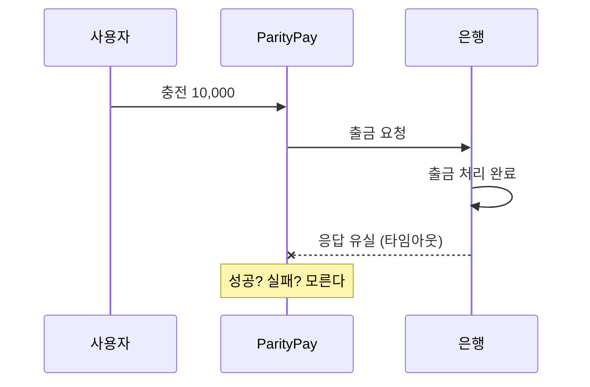
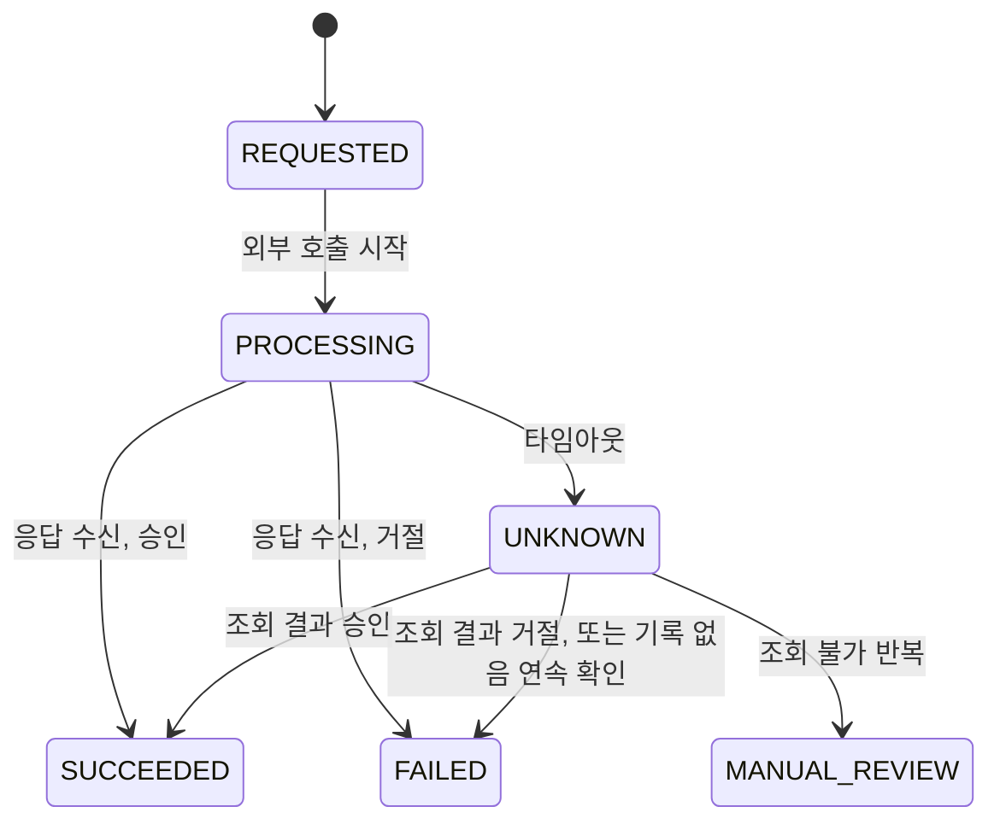

외부기관을 호출하는 결제 시스템에는 세 번째 결과가 있다. 성공도 실패도 아닌 "모른다"다. 이 글은 ParityPay가 그 상태를 어떻게 다뤘는지, 왜 그것이 예외 처리가 아니라 상태 모델의 문제인지, 그리고 실험이 설계 문서에 없던 구멍을 어떻게 드러냈는지 정리한 기록이다.

## 문제: 응답이 없다는 것은 실패가 아니다

충전 요청의 흐름은 단순하다. 사용자가 10,000원 충전을 요청하면 은행에 출금을 요청하고, 은행이 승인하면 우리 쪽 잔액과 원장에 반영한다.

은행은 출금을 처리했다. 사용자 계좌에서 10,000원이 빠졌다. 그런데 응답이 네트워크 어딘가에서 사라졌다. 우리 쪽에서 보이는 것은 타임아웃뿐이다.

이 시점에서 할 수 있는 선택은 셋이고, 둘은 틀렸다.

- **실패로 처리한다.** 사용자는 실패 화면을 보고, 계좌에서는 돈이 빠져 있다. 사용자가 다시 시도하면 두 번 빠진다.
- **같은 요청을 다시 보낸다.** 은행이 멱등 처리를 완벽히 해주지 않으면 두 번 출금된다. 외부 시스템의 멱등성에 우리 돈의 정확성을 거는 일이다.
- **모른다고 기록하고, 나중에 물어본다.** 이것이 답이다.

세 번째가 답인 이유는 단순하다. 타임아웃은 "실패했다"는 정보가 아니라 "결과를 못 받았다"는 정보다. 둘을 같은 것으로 취급하는 코드(`catch (TimeoutException e) { markFailed(); }`)는 정보를 잃는 코드다. 잃은 정보는 사용자의 이중 청구나 우리 쪽 미수금으로 돌아온다.

## 결정: UNKNOWN을 상태로 만든다

ParityPay는 충전, 결제, 취소, 정산 지급 네 경로 모두에 `UNKNOWN` 상태를 뒀다. 외부 호출이 타임아웃되면 거래를 `UNKNOWN`으로 저장하고, 사용자에게는 `202 Accepted`와 조회 위치를 돌려준다. 이 시점에 내부 잔액과 원장에는 아무 효과가 없고, 외부에는 출금 기록이 있을 수도 있다. 이 차이가 복구와 대사의 대상이다.

복구 작업이 주기적으로 `UNKNOWN` 거래를 집어 외부에 상태를 조회한다. 조회 결과에 따라 처리가 갈리는데, 여기서 신경 쓴 것은 "모른다"를 몇 단계로 나누느냐였다.

| 외부 조회 결과 | 처리 |
| --- | --- |
| 성공 | 확정. 정상 흐름과 같은 트랜잭션 경로로 잔액·원장·이벤트가 함께 커밋된다 |
| 실패 | 확정. 예약한 자원을 풀고 `FAILED` |
| **기록 없음** | 한 번으로 단정하지 않는다. 연속 3회 확인 후에야 실패로 확정 |
| **조회 불가** | 아무것도 확정하지 않는다. 백오프 후 재시도, 한계 초과 시 사람에게 |

"기록 없음"과 "조회 불가"를 구분하는 것이 핵심이다.

"기록 없음"은 외부가 "그런 거래는 없다"고 답한 것이다. 요청이 외부에 도달하기 전에 끊겼다면 이게 정답이다. 하지만 외부 시스템이 비동기로 기록을 반영하는 중이라 아직 안 보이는 것일 수도 있다. 한 번의 "없음"으로 실패 확정하고 예약 자원을 풀면, 몇 초 뒤 외부에 기록이 나타났을 때 우리는 이미 사용자에게 실패라고 말한 뒤다. 그래서 연속 확인을 요구한다.

"조회 불가"는 외부가 아예 답하지 않는 것이다. 이때 무언가를 확정하는 것은 추측이다. 아무것도 하지 않고 기다리는 것이 유일하게 안전한 동작이고, 기다림에 한계가 오면 자동화를 멈추고 사람에게 넘긴다. 자동 복구는 안전하게 확정할 수 있을 때만 한다.

복구 자체가 멱등해야 한다는 것도 중요하다. 복구 작업이 실행 중에 죽고 다시 실행돼도, 같은 거래가 두 번 확정되면 안 된다. 성공 확정은 "승인 원장이 이미 있는지 확인하고 없으면 한 번만 전기"하는 방식이고, 실험에서 복구를 3회 반복해도 잔액 1회, 원장 1건, 외부 출금 1건이었다.

## 취소는 한 가지가 더 있다

환불 응답이 유실됐을 때는 규칙이 하나 더 붙는다. 취소를 요청하면 취소 금액을 먼저 예약한다(`processingCancellationAmount`). 누적 취소액이 승인액을 넘지 않는다는 INV-005를 지키기 위해서다. 환불 응답이 유실되어 `UNKNOWN`이 되면, **이 예약을 풀지 않는다.** 푸는 순간 같은 금액을 다시 환불 요청할 수 있게 되고, 외부에서 첫 환불이 실제로 처리됐다면 이중 환불이 된다.

예약은 조회로 최종 상태가 확정될 때 처리된다. 성공이면 취소 분개와 함께 확정되고, 명시적 거절이면 즉시 풀어 다시 취소할 수 있게 하며, 기록 없음이 연속 확인되면 그때 푼다. "모르는 동안에는 아무것도 되돌리지 않는다"는 원칙이 여기서는 예약을 유지하는 형태로 나타난다.

## 실험이 찾은 것 1: 설계 문서에 없던 경로

응답 유실 시나리오(F-006)는 예상대로 동작했다. `PROCESSING → UNKNOWN → SUCCEEDED`. 그런데 프로세스를 실제로 죽이는 실험에서 다른 것이 나왔다.

외부 호출 **직전**에 프로세스가 죽으면 거래는 `UNKNOWN`이 아니라 `PROCESSING`으로 남는다. 타임아웃 처리 코드가 실행될 기회조차 없었기 때문이다. 그리고 아무 복구 작업도 `PROCESSING`을 보고 있지 않았다. 설계 문서는 "타임아웃이면 UNKNOWN"만 정의했고, "타임아웃에 도달하기 전에 죽으면"은 없었다.

복구 대상 쿼리에 오래된 `PROCESSING`을 포함시켰다. 이 경로는 문서를 아무리 읽어도 안 나온다. 실제로 죽여봐야 나온다.

## 실험이 찾은 것 2: 확정 지연은 상수였고, 프론트엔드가 틀린 값을 갖고 있었다

"복구가 얼마나 걸리는가"는 오래 미측정으로 남아 있었다. 스케줄 주기 설정값만 알고 있었고 아무도 그 값을 필요로 하지 않았다. 프론트엔드가 "폴링을 언제까지 할지" 정해야 하면서 필요해졌다.

클라이언트가 겪는 시간을 쟀다. 요청을 보낸 순간부터 `GET`이 종결 상태를 보여줄 때까지. 각 12건.

| 경로 | 결과 | 중앙값 | 최소~최대 |
| --- | --- | ---: | ---: |
| 응답만 유실 (외부에 기록 있음) | SUCCEEDED | **34.9초** | 33.4~35.2 |
| 요청 전 단절 (외부에 기록 없음) | FAILED | **45.0초** | 44.6~45.2 |

분포가 아니라 사실상 상수다. 편차 1초 미만. 이 지연은 부하나 경합이 아니라 설정이 정한다.

- 성공 확정 ≈ `grace`(30초) + 스케줄 주기 한 틱(0~5초). 복구 작업은 30초보다 어린 거래를 아예 보지 않는다. 정상 처리 중인 요청을 가로채지 않기 위해서다.
- 실패 확정 ≈ `grace` + 세 틱. "기록 없음"을 3회 연속 확인해야 하고, 백오프(2초, 4초)가 주기(5초)보다 짧아서 백오프가 아니라 주기가 속도를 정한다.

이 측정이 프론트엔드 설계를 고쳤다. 프론트엔드 문서는 폴링 한계의 예시로 30초를 적어두고 있었다. 측정하지 않은 값이라고 명시해두긴 했지만, 30초는 부정확한 것이 아니라 **틀린** 값이었다. `grace`가 30초라 복구는 그 전에 시작조차 하지 않는다. 30초에서 포기하는 화면은 매번 답이 오기 직전에 포기한다. 폴링 한계를 90초로 다시 정했다.

## 실험이 찾은 것 3: 적체 시 초당 10건이 상한이었다

위 측정은 한가한 시스템에서 한 건씩 잰 것이다. 미확정이 수백 건 쌓이면 어떻게 되는지를 따로 쟀다(M-012). 1,000건에서 45%가 클라이언트의 90초 안에 답을 받지 못했다. 돈은 정확히 한 번 들어와 있었다. 문제는 정확성이 아니라 지연이었다.

원인은 복구 작업 네 개가 모두 `@Scheduled` 틱마다 배치 50건을 **한 번** 조회하고 끝나는 구조였다. 50건 조회는 0.4초에 끝나고 스레드는 4.5초를 놀았다. 처리량이 기계나 기관이 아니라 틱 구조로 고정됐다. 정확히 초당 10건.

배치가 가득 찼으면 다음 틱을 기다리지 않고 이어서 처리하도록 바꿨다. 1,000건 기준 최대 확정 시간 130.6초 → 42.1초, 90초 초과 450건 → 0건. 상한이 틱 구조에서 배치 조회 비용으로 옮겨갔다.

이 결함은 같은 프로젝트에서 두 번째로 찾은 것이었다. Outbox 발행기가 똑같이 틱당 한 배치만 보내던 것을 앞선 실험에서 고쳤는데, 복구 작업 네 개가 같은 구조로 남아 있었다. 같은 결함을 두 번 찾았다는 것은, 첫 번째 때 "다른 곳에도 같은 구조가 있는가"를 묻지 않았다는 뜻이다.

## 실험이 찾은 것 4: 취소만 HTTP 계약에서 빠져 있었다

적체 실험을 취소 경로에도 돌리려고 클라이언트가 취소 확정을 어떻게 기다리는지 봤다. 기다리지 않고 있었다. 서버 쪽을 보니 이유가 있었다. 취소 API가 환불 응답이 유실된 `UNKNOWN` 취소에도 `201 Created`로 답했고, 취소를 조회할 `GET`이 없어 기다릴 곳이 없었다. 충전과 결제는 같은 상황에 `202 + Location`으로 답한다. 취소만 그 규칙에서 빠져 있었다.

증상은 이렇다. 환불 응답이 유실되면 화면은 "취소됨"으로 바뀐다. 실제 취소는 `UNKNOWN`이고 복구가 확정하기 전이다. 환불이 외부에서 거절됐다면 사용자는 취소됐다고 믿는데 돈은 돌아오지 않는다.

서비스 단 테스트(F-007)는 `UNKNOWN` 보존을 확인하고 있었다. HTTP 상태 코드와 화면은 아무도 보지 않았다. 테스트가 있었는데 계약의 한 층 아래만 본 것이다. 서버는 `UNKNOWN` 취소에 `202`를 돌려주고 조회 API를 추가했으며, 클라이언트는 `202`를 받으면 확정 전까지 주문 상태를 바꾸지 않게 고쳤다.

## 클라이언트가 지키는 절반

서버가 `UNKNOWN`을 아무리 잘 다뤄도, 클라이언트가 타임아웃을 받고 "실패했습니다. 다시 시도하세요" 버튼을 보여주면 끝이다. 다시 시도하는 것이 바로 이중 청구를 만드는 행동이기 때문이다. 그래서 프론트엔드에서는 `202`, `5xx`, 네트워크 오류를 확정 거절(`4xx` 업무 오류)과 다른 타입으로 분리했다. 전자는 "결과를 모른다"이고 재시도 버튼이 아니라 조회 폴링으로 이어진다. 후자만 "실패했다"다.

멱등 키도 같은 맥락이다. 재시도마다 새 멱등 키를 만드는 클라이언트 앞에서는 서버의 멱등성이 아무 의미가 없다. 서버는 두 요청을 서로 다른 의도로 볼 수밖에 없다. 멱등 키는 "사용자의 의도가 끝날 때까지" 재사용되어야 하고, 이것을 타입으로 강제해 화면이 즉석 UUID를 넘기면 컴파일이 막히게 했다.

## 실무 경험과의 관계

이 글의 원칙은 실무에서 온 것이 아니다. 2021년에 결제대행 API를 연동할 때는 이 질문들이 내 지도에 없었다. 그 이야기는 [별도 글](/posts/payment-gateway-2021-retrospective/)로 뺐다.

실무와 이어지는 부분은 다른 데 있다. [정산 중 수정 차단](/posts/settlement-write-guard/)에서 "정산 중"이라는 상태를 명시해 시스템이 판단하게 했고, [SQS 파이프라인](/posts/polling-to-sqs-pipeline/)에서 순서 역전을 상태 전이로 다뤘다. `UNKNOWN`도 같은 계열이다. "모른다"를 예외 처리의 분기가 아니라 상태 모델의 정식 노드로 만들면, 그 상태에서 허용되는 동작(조회)과 금지되는 동작(재전송, 예약 해제)을 코드로 정할 수 있다. 상태를 암묵적으로 두면 타임아웃 핸들러 안의 판단에 돈의 정확성을 맡기게 된다.

## 정리

- 타임아웃은 "실패"가 아니라 "결과를 못 받았다"다. 둘을 같게 취급하는 코드는 정보를 잃고, 잃은 정보는 이중 청구로 돌아온다.
- `UNKNOWN`은 예외 분기가 아니라 상태다. 그 상태에서 할 수 있는 것은 조회뿐이고, 재전송과 자원 해제는 금지다.
- "기록 없음"과 "조회 불가"는 다르다. 전자는 연속 확인 후 실패 확정, 후자는 아무것도 확정하지 않고 사람에게.
- 문서에 없는 경로(호출 직전 중단), 틀린 상수(폴링 30초), 구조적 상한(틱당 한 배치), 계약 누락(취소의 201)은 전부 실제로 죽이고, 재고, 클라이언트를 연결해봐야 나왔다. 문서와 코드를 읽어서 나온 것은 하나도 없다.
