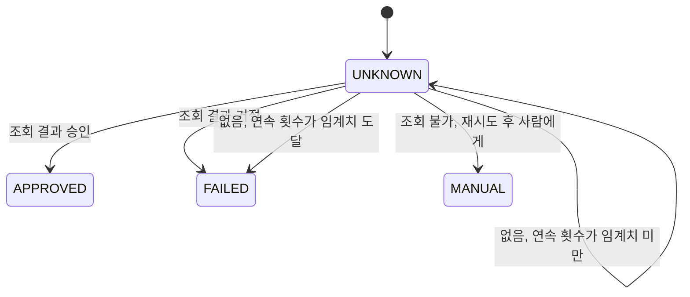
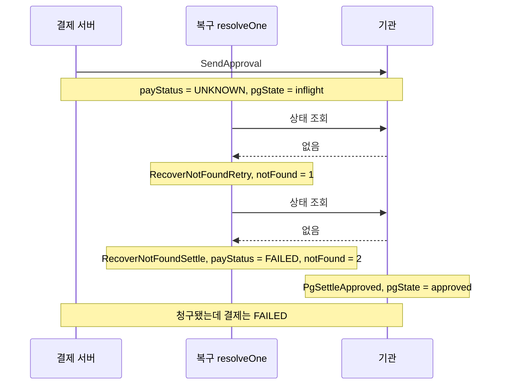

이 시리즈는 실험으로 결함을 찾아 왔다. 41종을 돌려 14건을 찾았고 [9편](/posts/parity-pay-external-isolation/)에서 격리 장치를 채택했으며 [11편](/posts/parity-pay-retry-jitter/)에서 지터를 다시 쟀다.

그런데 실험에는 구조적인 한계가 하나 있다. **시각이 맞아떨어지는 순간에만 드러나는 경로는 우연에 기대서만 밟힌다.** 41종을 백 번 돌려도 그 순간이 안 오면 안 온다. 그리고 안 왔다는 것과 없다는 것을 구별할 방법이 없다.

그래서 순서를 전부 밟는 도구가 필요했다. TLA+의 모델 검사기 TLC는 Lamport가 explicit-state 모델 검사기라고 소개하는 도구다([TLA+ Tools](https://lamport.azurewebsites.net/tla/tools.html)). 이 글처럼 모델이 작으면 도달 가능한 상태를 전부 밟는다. Lamport는 TLA+의 쓸모를 이렇게 적었다.

> "TLA+ and its tools are useful for eliminating fundamental design errors, which are hard to find and expensive to correct in code." ([The TLA+ Home Page](https://lamport.azurewebsites.net/tla/tla.html))

코드에서 찾기 어렵고 고치기 비싼 설계 오류를 걸러내는 데 쓴다는 뜻이다. 이 글은 그 도구를 UNKNOWN 해소 규칙에 대 본 기록이다.

## 무엇을 명세로 옮겼나

`PaymentRecoveryService.resolveOne`의 분기다. 조회 결과가 승인이면 확정하고, 거절이면 실패로 확정하고, 없음이면 연속 횟수를 세다 임계치에서 실패로 확정하고, 조회 자체가 안 되면 재시도하다 사람에게 넘긴다.

UNKNOWN에서 출발하는 전이로 그리면 갈래는 다섯이다.



상태는 여섯 개다.

| 변수 | 뜻 |
| --- | --- |
| `payStatus` | PROCESSING · UNKNOWN · APPROVED · FAILED · MANUAL |
| `pgState` | none · **inflight** · approved · declined |
| `ledger` | 전기된 원장 건수 |
| `notFound` | 연속 "없음" 횟수 |
| `attempts` | 조회 시도 횟수 |
| `queryUp` | 상태 조회가 가능한가 |

이 명세에서 실험과 갈리는 지점은 `inflight`다. **기관이 요청을 받았고, 승인할 것이고, 아직 기록하지 않은 창**이다. 실제 기관은 내부 처리가 끝나야 기록하므로 이 창이 존재한다.

불변조건은 넷이다.

| 이름 | 뜻 |
| --- | --- |
| `ExactlyOnce` | 원장 전기 ≤ 1 (INV-004) |
| `NoFalseFailure` | 기관이 승인했는데 결제가 FAILED 인 상태가 없다 |
| `NoFalseSuccess` | 기관에 기록이 없는데 APPROVED 인 상태가 없다 |
| `LedgerImpliesCharge` | 원장이 있으면 기관에도 승인이 있다 |

## TLC가 5단계 만에 답했다

```
State 2: SendApproval        payStatus = UNKNOWN, pgState = inflight
State 3: RecoverNotFoundRetry  notFound = 1
State 4: RecoverNotFoundSettle payStatus = FAILED, notFound = 2
State 5: PgSettleApproved      pgState = approved
```

**고객은 청구됐는데 결제는 실패로 확정됐다.**

복구가 두 번 조회했고 두 번 다 기관에 기록이 없었다. 기관이 아직 처리 중이었기 때문이다. 연속 2회면 확정이므로 실패로 적었고, 그 다음에 기관이 승인을 기록했다.

복구 쪽과 기관 쪽을 나란히 놓으면 두 번의 "없음"이 모두 `inflight` 창 안에 떨어진다.



## 이건 몰랐던 위험이 아니다

`handleNotFound`의 주석이 정확히 이것을 적어 두었다.

> 한 번의 "없음"으로 거절을 확정하지 않습니다. 외부가 요청을 받고 기록하기 직전일 수도 있고, 그 상태에서 거절로 적으면 청구된 결제를 실패로 알리게 됩니다.

임계치가 그 완화책이다. 그래서 임계치를 바꿔 가며 같은 불변조건을 다시 검사했다.

| 임계치 | 결과 | 생성 상태 |
| ---: | --- | ---: |
| 2 | 위반 (깊이 5) | 42 |
| 3 | 위반 | 82 |
| 5 | 위반 | 210 |
| 8 | 위반 | 502 |

**임계치를 올려도 경로는 없어지지 않고 탐색만 깊어진다.** 모델에서 `inflight`가 임의로 길 수 있기 때문이다. 임계치는 그 창보다 오래 기다릴 확률을 올리지만, 그 확률은 0이 되지 않는다.

이 구별이 중요하다고 생각한다. "임계치를 3으로 올렸으니 안전하다"와 "임계치를 3으로 올려 확률을 낮췄고 경로는 남아 있다"는 다른 문장이고, 실험으로는 앞의 것과 뒤의 것을 구별할 수 없다.

## 나머지 셋은 안 깨진다

`NoFalseFailure`를 빼고 돌리면 98개 상태를 전부 밟고 위반이 없다. 원장 이중 전기도, 청구 없는 승인도 없다.

그러니 이 규칙이 지키기로 한 것 중 무너지는 것은 하나뿐이다. INV-004(원장 이중 전기 없음)는 이 모델 안에서는 증명됐다.

## 처치 갈래도 검사했다

전이 하나만 바꿨다. 연속 "없음"을 `FAILED`로 확정하는 대신 사람에게 넘긴다.

넷 다 깨지지 않는다. 98개 상태 전수 탐색이다.

그런데도 **코드는 바꾸지 않았다.** `docs/09` §7은 "재요청 또는 보류"를 둘 다 허용하고 구현은 확정 쪽을 골랐다. 처치 갈래로 바꾸면 자동 확정을 포기하는 대신 운영자가 볼 건이 늘어나는데, 그 비용은 이 모델이 재는 것이 아니다. 모델 검사가 답한 것은 "이 갈래가 그 불변조건을 지키는가"이지 "어느 쪽이 나은가"가 아니다. 그래서 이 글을 쓰는 김에 바꿀 일이 아니라 설계 판단으로 남겼다.

## 실험이 못 찾은 이유는 운이 아니었다

처음에는 "타이밍이 안 맞아서 못 밟았겠지"라고 생각했다. 아니었다. 시험 대역 `MockPgBehavior`의 상태를 세어 보면 넷이다.

| 모드 | 기관 기록 |
| --- | --- |
| `NORMAL` | 즉시 있음 |
| `EXPLICIT_DECLINE` | 거절로 있음 |
| `TIMEOUT_BEFORE_APPROVAL` | **영원히 없음** |
| `TIMEOUT_AFTER_APPROVAL` | 끊기기 전에 이미 있음 |

**반례가 사는 상태가 대역에 없다.** "받았고, 승인할 것이고, 아직 기록하지 않은" 창에 해당하는 모드가 넷 중 어디에도 없다.

기존 시험 `notFoundIsConfirmedBeforeSettlingAsFailed`는 `TIMEOUT_BEFORE_APPROVAL`을 쓴다. 주석도 "외부에는 아무 기록도 없습니다"라고 적혀 있다. 즉 "없음"이 실제로 옳은 경우만 확인하고, 그 시험은 통과하는 게 맞다.

그래서 41종을 몇 번 돌리든 이 경로에는 닿지 않는다. 우연의 문제가 아니라 도달 불가능이다. 대역의 상태 공간이 현실보다 좁으면 그 차이만큼은 시험으로 확인한 것이 아니라 가정한 것이 된다.

## 한계

- 명세는 코드가 아니다. 손으로 옮긴 것이고 옮기면서 틀리면 검사도 틀린다. 검사한 것은 `resolveOne`의 분기 구조이지 트랜잭션 경계·잠금·DB 제약이 아니다. TLC가 "위반 없음"이라고 해도 그것은 명세에 대한 문장이다.
- 결제 하나짜리 모델이다. 복구 작업 여러 대, 리더 재선출, 배치 경합은 들어 있지 않다.
- 시간이 없다. grace·백오프·lease는 전이 순서로만 표현된다. 임계치를 올리면 실제로는 창이 좁아지는데 이 모델은 그 크기를 재지 않는다. 경로가 남는다는 것만 말한다.
- 98개 상태는 작다. 모델이 작아서 전수 검사가 끝난 것이고, 큰 모델에서 같은 방법이 끝난다는 뜻은 아니다.
- 실험을 대체하지 않는다. 모델 검사는 내가 적은 규칙에 대해 답한다. 스레드가 몇 개에서 고갈되는지, p99가 몇 ms인지, 기관이 초당 몇 건을 받는지는 여전히 재야 안다.

## 정리

- 실험 41종·시험 328개가 "청구됐는데 실패로 확정" 경로를 못 찾은 이유는 타이밍이 아니라 시험 대역에 그 상태가 없어서였다. TLC는 같은 경로에 5단계 만에 도달했다.
- 임계치를 2에서 8로 올려도 위반은 남는다. 확률은 낮아지지만 경로는 남아 있고, 드물어진 것과 안전해진 것은 다르다.
- 나머지 세 불변조건은 98개 상태 전수 탐색에서 깨지지 않았다. INV-004는 이 모델 안에서 증명됐다.
- 처치 갈래(연속 "없음"을 사람에게 넘김)는 네 불변조건을 다 지키지만, 운영 부담과의 교환은 모델 밖의 판단이라 코드는 두었다.
- 대역의 상태 공간이 현실보다 좁은 만큼은 가정이다. 그 가정을 세어 보는 일을 여태 하지 않았다.

## 참고

- [ParityPay](https://github.com/polynomeer/parity-pay) — 명세는 `formal/`, 결과는 `reports/11-performance-failure-report.md`의 M-030, 원본은 `reports/data/t7-model-checking/`
- [3편 - UNKNOWN 상태](/posts/parity-pay-unknown-state/) — 이 규칙을 설계한 글
- [9편 - 느린 기관 앞에서 결제 서버를 지키기](/posts/parity-pay-external-isolation/)
- [The TLA+ Home Page](https://lamport.azurewebsites.net/tla/tla.html) — Leslie Lamport
- [TLA+ Tools](https://lamport.azurewebsites.net/tla/tools.html) — TLC 모델 검사기 소개
