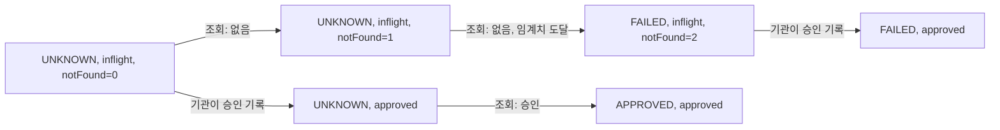

[ParityPay 12편](/posts/parity-pay-model-checking/)은 이런 상황에서 시작한다. 부하·장애 실험 41종과 통합 시험 328개를 돌렸는데도 "고객은 청구됐는데 결제는 실패로 확정된" 경로를 한 번도 밟지 못했다. 그 경로는 기관이 요청을 받았지만 아직 기록하지 않은 짧은 창 안에서 조회가 두 번 일어나야 드러난다. 시험은 그 순간이 오기를 기다릴 수밖에 없다. 반면 TLC는 같은 경로를 5단계 만에 찾았다.

이 글은 그 글에 나오는 용어를 처음부터 설명한다. 모델 검사, TLA+, TLC, 상태 공간, 불변조건, 반례다.

## 시험은 실행 하나를 본다

시험은 프로그램을 한 번 실행하고 결과를 확인한다. 동시에 움직이는 것이 둘 이상이면 실행할 때마다 사건의 순서가 달라질 수 있다. 시험이 보는 것은 그중 하나다.

경쟁 상태(race condition)가 시험에서 잘 안 잡히는 이유가 여기 있다. Learn TLA+는 이런 오류가 본질적으로 드물고, 대부분의 실행은 문제없이 끝난다고 설명한다([Learn TLA+: Conceptual Overview](https://learntla.com/intro/conceptual-overview.html)). 시험을 백 번 돌려도 나쁜 순서가 한 번도 안 나올 수 있다. 그리고 "안 나왔다"와 "없다"는 다른 말이다.

## 모델 검사는 가능한 순서를 전부 밟는다

모델 검사(model checking)는 접근이 반대다. 시스템을 실행하지 않고, 시스템이 할 수 있는 동작을 수학적으로 적은 **명세**(specification)를 입력으로 받는다. 그리고 그 명세로 만들 수 있는 동작을 전부 만들어 본다. Learn TLA+의 표현으로는 모델 검사기가 명세에서 가능한 모든 동작을 생성하고, 그것들이 우리가 정한 속성을 전부 만족하는지 본다.

- **TLA+**는 명세를 적는 언어다. Lamport는 TLA+를 프로그램과 시스템, 특히 동시·분산 시스템을 모델링하는 고수준 언어라고 소개한다([The TLA+ Home Page](https://lamport.azurewebsites.net/tla/tla.html)).
- **TLC**는 TLA+ 명세를 검사하는 모델 검사기다. Lamport는 TLC를 안전 속성과 활성 속성을 모두 검사하는 explicit-state 모델 검사기라고 적는다([TLA+ Tools](https://lamport.azurewebsites.net/tla/tools.html)). explicit-state는 상태를 하나하나 실제 값으로 만들어 저장하면서 탐색한다는 뜻이다. 자세한 사용법은 『Specifying Systems』 14장 "The TLC Model Checker"에 있다([Specifying Systems](https://lamport.azurewebsites.net/tla/book.html)).

## 상태와 상태 공간

**상태**(state)는 변수들의 값 한 벌이다. ParityPay 모델이라면 `payStatus = UNKNOWN, pgState = inflight, notFound = 1, ...`이 상태 하나다. 상태에서 상태로 넘어가는 한 걸음을 **전이**(transition, TLA+에서는 action)라고 한다.

초기 상태에서 출발해 전이를 따라 도달할 수 있는 상태 전체가 **상태 공간**(state space)이다. TLC는 이 그래프를 따라가며 상태를 전부 밟는다.



상태 공간은 쉽게 커진다. 변수가 늘거나 값의 범위가 넓어질 때마다 곱으로 늘어난다. 이를 상태 폭발(state explosion)이라고 부른다. Learn TLA+도 계좌와 이체를 얼마든지 더할 수 있다면 가능한 동작은 무한하므로 전부 검사할 수는 없다고 적는다. 그래서 실제로는 계좌 수나 재시도 횟수 같은 상수를 작게 고정한 **모델**을 검사한다. 12편에서 임계치를 2에서 8로 올리자 생성 상태가 42개에서 502개로 늘어난 것도 같은 현상이다.

## 불변조건과 반례

**불변조건**(invariant)은 모든 상태에서 참이어야 하는 식이다. Learn TLA+는 불변조건을 프로그램의 모든 단계에서 참이어야 하는 것으로 정의하고, TLC가 가능한 모든 상태에서 그것을 확인한다고 설명한다([Learn TLA+: Invariants](https://learntla.com/core/invariants.html)). 12편의 `NoFalseFailure`를 TLA+로 쓰면 이 정도다.

```text
NoFalseFailure == ~(payStatus = "FAILED" /\ pgState = "approved")
```

"결제가 FAILED인데 기관에는 승인이 있는" 상태가 없어야 한다는 뜻이다. 결제 도메인에서 불변조건을 어떻게 고르는지는 [ParityPay 1편](/posts/parity-pay-invariants/)에 정리했다.

불변조건이 깨지는 상태를 만나면 TLC는 그 상태까지 가는 경로를 출력한다. 각 단계에서 어떤 전이가 일어났고 변수가 어떤 값이 됐는지를 차례로 보여 준다. 이 경로가 **반례**(counterexample, error trace)다. 위 그림의 S0 → S1 → S2 → S3이 12편에서 TLC가 보여 준 반례와 같은 모양이다. 반례는 "틀렸다"는 판정에서 그치지 않는다. 어떤 순서로 틀리는지를 재현 가능한 형태로 준다. 그래서 고칠 곳을 바로 찾을 수 있다.

## 모델 검사가 답하지 않는 것

- 검사 대상은 코드가 아니라 명세다. 명세를 손으로 옮기다 틀리면 검사 결과도 틀린다.
- "위반 없음"은 그 모델의 크기 안에서만 성립한다. 상수를 작게 잡은 모델에서 통과했다고 큰 시스템에서도 통과한다는 보장은 없다.
- 지연 시간, 처리량, 스레드 수 같은 수치는 재지 않는다. 그런 것은 여전히 [백분위](/posts/percentile-statistics/)로 재고 부하 실험으로 확인해야 한다.

그래서 모델 검사는 시험을 대체하지 않는다. 시험은 [단위·통합 시험](/posts/unit-test-integration-test/)으로 코드가 의도대로 동작하는지 보고, 모델 검사는 의도 자체, 즉 설계의 순서 문제를 본다.

## 정리

- 시험은 실행 하나를 확인하고, 모델 검사는 작은 모델 안에서 도달 가능한 상태를 전부 확인한다. 드문 순서에서만 나오는 결함은 후자가 잘 잡는다.
- 상태 공간은 변수와 상수 범위에 따라 곱으로 커지므로, 상수를 작게 고정한 모델을 검사하고 그 크기를 결과와 함께 적는다.
- 불변조건이 깨지면 TLC는 그 상태까지 가는 경로, 즉 반례를 준다. 반례는 고칠 곳과 재현 순서를 함께 알려 준다.
- 명세와 코드 사이의 차이는 검사 밖에 남는다. 이 차이는 시험과 실험으로 메운다.

## 참고

- [The TLA+ Home Page](https://lamport.azurewebsites.net/tla/tla.html) — Leslie Lamport
- [TLA+ Tools](https://lamport.azurewebsites.net/tla/tools.html) — TLC 소개
- [Specifying Systems](https://lamport.azurewebsites.net/tla/book.html) — Leslie Lamport, 14장 "The TLC Model Checker"
- [Learn TLA+: Conceptual Overview](https://learntla.com/intro/conceptual-overview.html) — Hillel Wayne
- [Learn TLA+: Invariants](https://learntla.com/core/invariants.html) — Hillel Wayne
- [ParityPay 12편 - 모델 검사](/posts/parity-pay-model-checking/)
- [ParityPay 1편 - 불변조건](/posts/parity-pay-invariants/)
