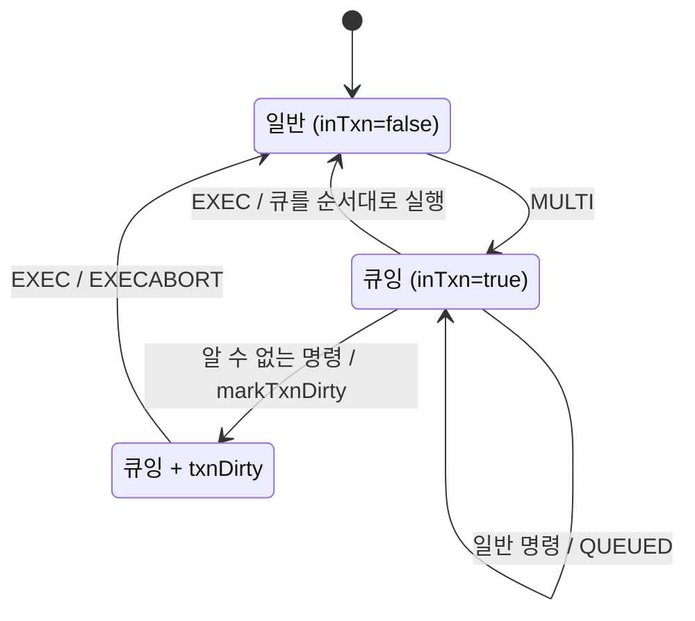

## Redis를 단순 key-value 이상으로 만드는 것들

문자열 조회와 저장만 구현하면 "메모리 key-value 서버"는 만들 수 있다. 하지만 Redis가 실제로 유용한 이유는 그 위에 트랜잭션, pub/sub, 스크립팅 같은 기능이 얹혀 있기 때문이다.

`redis-lite-java`는 그중 다음 세 묶음을 구현한다.

- `MULTI / EXEC / DISCARD`
- `SUBSCRIBE / UNSUBSCRIBE / PUBLISH`
- `EVAL / EVALSHA / SCRIPT`

이 글에서는 기능 자체보다, 왜 이런 방식으로 구현했는지를 본다.

## 1. Redis 트랜잭션은 RDBMS 트랜잭션과 다르다

관계형 DB를 먼저 배운 입장에서는 `MULTI/EXEC`를 보고 rollback, undo log, [isolation](/posts/isolation-levels-and-anomalies/)을 떠올리기 쉽다. 하지만 Redis 트랜잭션은 명령을 큐에 쌓아 두었다가 `EXEC`에서 한꺼번에 실행하는 모델에 가깝다. Redis 문서는 롤백을 지원하지 않으며, 그 이유로 단순성과 성능에 주는 영향을 든다([Transactions](https://redis.io/docs/latest/develop/using-commands/transactions/)).

이 구현의 연결 상태도 그 모델을 따른다.

```java
private boolean inTxn = false;
private boolean txnDirty = false;
private boolean bypassTxn = false;
private final List<List<String>> txnQueue = new ArrayList<>();
```

`MULTI`가 들어오면 명령을 실행하지 않고 큐에 쌓는 모드(queueing mode)로 들어간다.

```java
if (ctx.isInTxn() && !ctx.isBypassTxn()) {
    ctx.queueTxn(argv);
    return RespWriter.simpleString("QUEUED");
}
```

일반 명령은 곧바로 실행되지 않고 `QUEUED`만 반환한다.

그리고 `EXEC` 시점에 큐를 순서대로 실행한다.

```java
for (List<String> a : queued) {
    ByteBuffer r = dispatchImmediate(a, ctx);
    replies.add(r);
}
```

이 구조에서 읽을 수 있는 점은 세 가지다.

- Redis 트랜잭션은 DB-style rollback 중심이 아니다.
- 중요한 것은 중간에 다른 클라이언트 명령이 끼어들지 않게 순서대로 실행하는 것이다.
- single-threaded [이벤트 루프](/posts/nio-and-event-loop/)와 잘 맞는다.

두 번째 항목은 Redis 문서의 보장과 같다. 트랜잭션 실행 도중에는 다른 클라이언트의 요청이 처리되지 않는다([Transactions](https://redis.io/docs/latest/develop/using-commands/transactions/)).

## 2. txnDirty가 의미하는 것

트랜잭션 도중 알 수 없는 커맨드가 들어오면 `txnDirty`를 표시한다.

```java
if (c == null) {
    if (ctx.isInTxn()) {
        ctx.markTxnDirty();
        return RespWriter.error("ERR unknown command ...");
    }
}
```

그리고 `EXEC` 시점에 dirty 상태면 abort한다.

```java
if (ctx.isTxnDirty()) {
    ctx.endTxn();
    return RespWriter.error("EXECABORT Transaction discarded because of previous errors.");
}
```

실제 Redis도 2.6.5부터 같은 방식으로 동작한다. 명령을 큐에 쌓는 단계에서 오류를 감지하면 `EXEC` 때 트랜잭션 실행을 거부하고 큐를 버린다. 반면 `EXEC` 이후 실행 중에 난 오류는 따로 처리하지 않고, 나머지 명령은 그대로 실행된다([Transactions](https://redis.io/docs/latest/develop/using-commands/transactions/)). 그래서 Redis가 택한 것은 실행 중 rollback이 아니라, 큐잉 단계에서 오류를 일찍 드러내고 `EXEC` 시점에 중단하는 쪽이다.

`MULTI`부터 `EXEC`까지 연결 상태가 바뀌는 흐름을 그리면 다음과 같다.



## 3. Pub/Sub는 broker 하나로 풀 수 있다

Pub/Sub는 이 프로젝트에서 가장 직관적인 구조를 가진다.

```java
private final Map<String, Set<ClientConn>> channels = new HashMap<>();
```

즉, 핵심 아이디어는 단순하다.

- 채널 이름
- 그 채널을 구독한 연결 집합

`SUBSCRIBE`는 set에 connection을 넣고, `PUBLISH`는 그 set을 순회하며 메시지를 push한다.

```java
for (ClientConn c : targets) {
    c.push(RespWriter.arrayMessage(channel, payload));
    n++;
}
```

이 구조는 Redis pub/sub의 전달 방식과 그대로 맞닿아 있다. 메시지를 저장하지 않고 지금 연결된 구독자에게만 밀어 넣는 메모리 기반 fan-out(한 메시지를 여러 수신자에게 복제)이다. Redis 문서는 이를 [at-most-once](/posts/kafka-delivery-guarantees/) 전달이라고 부른다. 구독자가 처리하지 못한 메시지는 다시 오지 않는다([Redis Pub/sub](https://redis.io/docs/latest/develop/pubsub/)).

## 4. 왜 push queue가 필요한가

Pub/Sub 메시지는 요청-응답과 다르게, 클라이언트가 어떤 명령을 보내지 않아도 서버가 먼저 내려보내야 한다.

그래서 `ClientConn.push()`가 따로 존재한다.

```java
public void push(ByteBuffer response) {
    enqueue(response);
    key.interestOps(key.interestOps() | SelectionKey.OP_WRITE);
}
```

`push()`는 [요청 처리 흐름](/posts/redis-lite-java-request-flow/)에서 본 write queue에 메시지를 넣고 `OP_WRITE` 관심을 켠다. 그래서 Redis 연결은 단순 요청-응답 소켓이 아니라, 서버가 비동기적으로 메시지를 밀어 넣을 수 있는 스트림이다. RESP 명세도 RESP2 연결이 채널을 구독하면 프로토콜이 push 방식으로 바뀐다고 설명한다([RESP 명세](https://redis.io/docs/latest/develop/reference/protocol-spec/)).

요청이 와야 응답하는 일반 HTTP API 서버와 다른 점이 여기다.

## 5. Lua는 "서버 안에서 명령을 조합하는 방식"이다

Lua 지원은 이 프로젝트에서 가장 흥미로운 부분 중 하나다. 구현은 `luaj` 라이브러리를 붙였다. 눈여겨볼 부분은 스크립트 실행 자체보다, `redis.call()`로 서버 내부 명령을 스크립트 안에서 조합하게 한 것이다.

실제 Redis도 `redis.call()`과 `redis.pcall()`로 명령을 호출하며, 둘은 오류를 클라이언트에 바로 돌려주느냐 스크립트 안에서 처리하게 하느냐만 다르다([Scripting with Lua](https://redis.io/docs/latest/develop/programmability/eval-intro/)).

```java
LuaTable redis = new LuaTable();
redis.set("call", new RedisCall(limits));
redis.set("pcall", new RedisPCall(limits));
g.set("redis", redis);
```

따라서 Lua는 별도의 외부 스크립트 엔진이라기보다, Redis 명령 실행기 위에 얹힌 서버 내 제어 계층으로 보는 편이 맞다.

## 6. 왜 sandbox와 limit이 필요한가

Lua는 강력하지만, single-threaded 서버에서 위험하기도 하다. 스크립트가 너무 오래 돌거나 너무 많은 명령을 실행하면 메인 루프 전체를 막아버릴 수 있다. Redis 문서도 스크립트 실행 중에는 서버의 모든 활동이 막히고, 원자성이 여기서 나온다고 설명한다([Scripting with Lua](https://redis.io/docs/latest/develop/programmability/eval-intro/)).

그래서 이 구현은 명시적으로 리소스 제한을 둔다.

```java
this.lua = new LuaEngine(db, broker, 5_000L, 10_000, 1_000);
```

그리고 각 `redis.call` 경계에서 다음을 체크한다.

- 실행 시간
- 누적 바이트 수
- 호출 횟수

실제 Redis에서도 오래 도는 스크립트는 데이터를 바꾸지 않았을 때만 `SCRIPT KILL`로 중단할 수 있다([Scripting with Lua](https://redis.io/docs/latest/develop/programmability/eval-intro/)). Redis가 단일 스레드 실행 모델인 이상, 서버 안에서 도는 코드가 길어지면 그만큼 다른 클라이언트의 응답이 늦어진다. 이 문제는 [Redis 단일 스레드가 멈추는 순간](/posts/redis-single-thread-stalls/)에서 따로 다룬다.

## 7. 왜 지원 명령을 제한했는가

`RedisCall.invoke()`를 보면 지원 명령을 switch로 제한한다.

```java
switch (cmd) {
    case "GET":
    case "SET":
    case "DEL":
    case "EXISTS":
    case "HGET":
    case "HSET":
    case "PEXPIRE":
    case "PTTL":
    case "PUBLISH":
```

이 제한은 기능 부족으로도 볼 수 있지만, 교육용 구현에서는 의미 있는 선택이다. 스크립팅으로 "무엇이든 할 수 있게" 만드는 것보다, 스크립트가 서버 내부 명령 모델과 어떻게 연결되는지를 보여주는 것이 먼저이기 때문이다.

## 8. 구현 과정에서 드러나는 설계 철학

이 프로젝트의 고급 기능 구현을 보면 공통된 철학이 있다.

### 트랜잭션

rollback을 정교하게 만들기보다, Redis답게 queue + exec 모델을 택함

### Pub/Sub

메시지 브로커를 복잡하게 만들기보다, channel -> subscribers 맵으로 핵심 fan-out만 구현함

### Lua

진짜 임베디드 스크립팅 엔진의 힘을 보여주되, 안전장치와 지원 범위를 명시적으로 둠

세 기능 모두 범위를 넓히기보다 Redis가 왜 이런 실행 모델을 택했는지를 드러내는 쪽을 골랐다.

## 시리즈 정리

`redis-lite-java`를 읽고 나면 Redis를 다음처럼 다시 보게 된다.

- Redis는 단순 캐시가 아니다.
- Redis는 단일 스레드 이벤트 루프 위에서 커맨드를 직렬 실행하는 서버다.
- Redis의 핵심은 프로토콜, keyspace, 명령 모델, 그리고 그 위에 올라가는 조합 가능성이다.

실제 Redis는 여기서 persistence, replication, [cluster](/posts/redis-cluster-vs-sentinel/), eviction, richer data structure까지 훨씬 넓어진다. 그래도 그 기능들을 읽기 전에 알아야 할 뼈대는 이 레포가 보여주는 수준에서 대부분 확인할 수 있다.

## 참고

- [Transactions](https://redis.io/docs/latest/develop/using-commands/transactions/) — Redis 공식 문서, 큐잉과 EXEC, 오류 처리, 롤백을 지원하지 않는 이유
- [Redis Pub/sub](https://redis.io/docs/latest/develop/pubsub/) — Redis 공식 문서, at-most-once 전달 의미
- [Scripting with Lua](https://redis.io/docs/latest/develop/programmability/eval-intro/) — Redis 공식 문서, 스크립트의 원자적 실행, `redis.call()`과 `redis.pcall()`, `SCRIPT KILL`
- [Redis serialization protocol specification](https://redis.io/docs/latest/develop/reference/protocol-spec/) — Redis 공식 문서, pub/sub 구독 시 push 방식으로 바뀌는 요청-응답 모델
