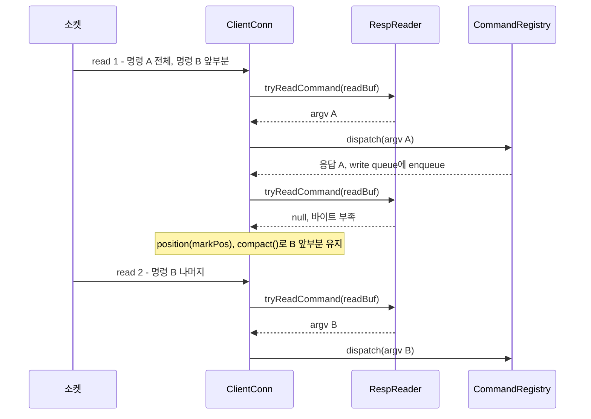

## Redis 요청은 어떻게 흘러가는가

Redis를 단순히 "메모리 DB"라고만 보면 절반만 본 셈이다. 실제로는 네트워크 요청을 받아 프로토콜을 파싱하고, 커맨드를 직렬적으로 실행한 뒤, 다시 응답 프레임으로 내보내는 서버다.

`redis-lite-java`는 그 흐름을 `Reactor -> ClientConn -> RespReader -> CommandRegistry -> RespWriter`라는 비교적 선명한 파이프라인으로 드러낸다.

## 1. Reactor가 서버의 메인 루프를 담당한다

핵심 루프는 `Reactor.start()` 안에 있다.

```java
while (true) {
    long nowMs = Clocks.monoMillis();
    long delayMs = db.nextExpiryDelayMillis(nowMs);
    if (delayMs < 0) delayMs = 1000;

    selector.select(Math.max(1, Math.min(delayMs, 1000)));

    Iterator<SelectionKey> it = selector.selectedKeys().iterator();
    while (it.hasNext()) {
        SelectionKey key = it.next();
        it.remove();
        if (!key.isValid()) continue;

        if (key.isAcceptable()) {
            handleAccept();
        } else if (key.isReadable()) {
            ((ClientConn) key.attachment()).handleRead();
        } else if (key.isWritable()) {
            ((ClientConn) key.attachment()).handleWrite();
        }
    }

    nowMs = Clocks.monoMillis();
    db.expireDue(nowMs, EXPIRE_BATCH_LIMIT);
}
```

이 코드에서 볼 점은 세 가지다.

- `Selector` 기반 [NIO 이벤트 루프](/posts/nio-and-event-loop/)를 사용한다.
- 읽기/쓰기/accept를 하나의 루프에서 처리한다.
- 매 루프 끝에서 TTL 만료도 같이 정리한다.

네트워크 처리와 keyspace 정리(maintenance)가 하나의 스레드에서 함께 돌아간다. TTL 만료 처리는 [keyspace 글](/posts/redis-lite-java-keyspace/)에서 자세히 본다.

## 2. 연결별 상태는 ClientConn이 가진다

Redis는 연결마다 독립적인 상태를 일부 유지한다. 이 프로젝트에서도 그 점을 `ClientConn`이 맡는다.

```java
private final ByteBuffer readBuf = ByteBuffer.allocate(READ_BUF_SIZE);
private final Deque<ByteBuffer> writeQueue = new ArrayDeque<>();
private final RespReader respReader = new RespReader();

private final Set<String> subscriptions = new HashSet<>();

private boolean inTxn = false;
private boolean txnDirty = false;
private boolean bypassTxn = false;
private final List<List<String>> txnQueue = new ArrayList<>();
```

여기에는 단순 네트워크 버퍼뿐 아니라, Redis적인 상태도 들어 있다.

- 읽기 버퍼
- 쓰기 큐
- pub/sub 구독 채널
- `MULTI/EXEC` 상태

"연결"은 단순 소켓 핸들이 아니라 프로토콜 세션 상태를 가진 객체다.

## 3. 읽기 이벤트가 오면 RESP 프레임을 파싱한다

`handleRead()`는 다음 순서로 동작한다.

1. 소켓에서 read buffer로 읽는다.
2. `flip()`해서 읽기 모드로 바꾼다.
3. 가능한 만큼 RESP command frame을 계속 파싱한다.
4. 파싱이 성공한 argv를 `CommandRegistry.dispatch()`에 넘긴다.
5. 응답이 있으면 write queue에 쌓는다.
6. 남은 바이트는 `compact()`로 유지한다.

이 루프가 파이프라이닝(응답을 기다리지 않고 여러 명령을 연달아 보내는 것)을 처리한다. RESP 명세도 클라이언트가 한 번의 write로 여러 명령을 보내고, 응답은 나중에 한꺼번에 읽을 수 있다고 설명한다([RESP 명세](https://redis.io/docs/latest/develop/reference/protocol-spec/)).

```java
while (true) {
    int markPos = readBuf.position();
    List<String> argv = respReader.tryReadCommand(readBuf);
    if (argv == null) {
        readBuf.position(markPos);
        break;
    }
    ByteBuffer resp = CommandRegistry.dispatch(argv, this);
    if (resp != null) enqueue(resp);
}
```

한 번의 read 안에 여러 명령이 들어올 수 있고, 반대로 프레임 하나가 아직 덜 들어왔을 수도 있다. `tryReadCommand()`가 `null`을 반환하면 "바이트가 아직 부족하다"는 의미로 보고, 다음 read까지 기다린다.

한 번의 read에 명령 A 전체와 명령 B의 앞부분이 들어오고, 다음 read에 B의 나머지가 들어온 경우를 그리면 다음과 같다.



## 4. RESP Reader는 최소한의 Redis 프로토콜 해석기다

`RespReader`는 RESP(Redis Serialization Protocol) 전체를 다 지원하기보다, 커맨드 입력에 필요한 형태인 "Array of Bulk Strings"만 처리한다. RESP 명세에서도 클라이언트는 명령을 bulk string으로만 이루어진 array로 보낸다([RESP 명세](https://redis.io/docs/latest/develop/reference/protocol-spec/)).

예를 들어 다음 프레임은 argv `[PING, PONG]`이 된다.

```text
*2\r\n
$4\r\nPING\r\n
$4\r\nPONG\r\n
```

파싱 로직은 의외로 단순하다.

- 첫 글자가 `*`인지 확인
- 요소 개수를 읽음
- 각 요소가 `$len\r\n...\r\n` 형식인지 확인
- 모두 완성되면 `List<String>` 반환

이 구현은 덜 들어온 프레임(incomplete frame)을 오류가 아닌 정상 상태로 본다. 파이프라이닝과 부분 수신은 에러가 아니라 네트워크에서 자연스럽게 일어나는 일이기 때문이다.

## 5. Command Registry가 프로토콜을 의미 있는 명령으로 바꾼다

RESP 파싱 결과는 단지 문자열 배열일 뿐이다. 이제 이 argv를 실제 명령으로 매핑해야 한다.

```java
String name = argv.get(0).toUpperCase();
Command c = CMDS.get(name);
```

여기서 `CommandRegistry`는 다음 역할을 한다.

- 명령 이름을 구현체에 매핑
- 알 수 없는 명령 처리
- `MULTI/EXEC/DISCARD` 예외 처리
- 트랜잭션 상태일 때 즉시 실행 대신 queue 처리

Redis의 인터페이스는 이름으로 구분되는 커맨드의 집합이다. 이 프로젝트는 그것을 명령 이름에서 구현체로 가는 맵 하나로 직접 표현한다.

## 6. 트랜잭션은 실행을 미루는 방식으로 구현된다

`MULTI` 상태에 들어가면 대부분의 명령은 바로 실행되지 않고 `txnQueue`에 쌓인다.

```java
if (ctx.isInTxn() && !ctx.isBypassTxn()) {
    ctx.queueTxn(argv);
    return RespWriter.simpleString("QUEUED");
}
```

이 구현은 트랜잭션을 "undo/rollback 가능한 DB 트랜잭션"으로 만들기보다, Redis답게 명령을 큐에 쌓았다가 EXEC에서 일괄 실행하는 모델로 표현한다.

이 점은 관계형 DB 트랜잭션과 Redis 트랜잭션을 구분하는 데도 도움이 된다. 큐잉과 오류 처리는 [확장 기능 글](/posts/redis-lite-java-advanced-features/)에서 다시 본다.

## 7. 응답은 write queue를 통해 비동기적으로 나간다

응답을 즉시 `write()`하지 않고 `Deque<ByteBuffer>`에 넣어 둔 뒤, writable 이벤트에서 flush한다.

```java
while (!writeQueue.isEmpty()) {
    ByteBuffer buf = writeQueue.peekFirst();
    ch.write(buf);
    if (buf.hasRemaining()) break;
    writeQueue.pollFirst();
}
```

이 구조가 필요한 이유는 non-blocking I/O에서는 한 번의 write로 모든 바이트가 다 나간다는 보장이 없기 때문이다. `SocketChannel.write()` Javadoc은 이렇게 적는다. "A socket channel in non-blocking mode, for example, cannot write any more bytes than are free in the socket's output buffer." non-blocking 모드의 소켓 채널은 소켓 출력 버퍼에 남은 공간보다 많이 쓸 수 없다는 뜻이다([SocketChannel](https://docs.oracle.com/en/java/javase/21/docs/api/java.base/java/nio/channels/SocketChannel.html)). 그래서 partial write(일부 바이트만 쓰인 write)를 정상 흐름으로 처리해야 한다. 위 코드는 버퍼에 바이트가 남으면 루프를 멈추고, 남은 바이트를 다음 writable 이벤트에서 이어서 보낸다.

## 8. RESP Writer는 서버 쪽 프로토콜 인코더다

`RespWriter`는 Redis 응답 타입을 직접 만든다.

- `+OK`
- `-ERR ...`
- `$len\r\n...\r\n`
- `:1`
- `*N\r\n...`

서버는 내부적으로 문자열이나 숫자를 다루지만, 바깥으로는 RESP 프레임으로 말해야 한다. RESP 명세에서 첫 바이트가 타입을 정한다. `+`는 simple string, `-`는 오류, `:`는 정수, `$`는 bulk string, `*`는 array다. 명세는 RESP를 ASCII 제어 문자를 쓰는 바이너리 프로토콜로 정의한다([RESP 명세](https://redis.io/docs/latest/develop/reference/protocol-spec/)).

## 이 구현이 보여주는 Redis의 중요한 특징

이 요청 처리 흐름을 따라가면 Redis가 빠른 이유를 조금 더 구체적으로 이해할 수 있다.

1. 프로토콜이 단순하다.
2. 이벤트 루프가 직렬적이다.
3. 연결 상태와 커맨드 실행이 명시적이다.
4. 락 대신 실행 모델로 경쟁을 줄인다.

실제 Redis는 이보다 복잡하다. 그래도 Redis가 프로토콜 서버이자 이벤트 루프 기반 명령 실행기라는 뼈대는 이 최소 구현에서도 그대로 보인다.

[다음 글](/posts/redis-lite-java-keyspace/)에서는 이 요청이 실제로 어떤 자료구조 위에서 처리되는지, 즉 `MemoryDb`, `Record`, `ExpiryHeap`, `OpenHashStringMap`을 중심으로 메모리 keyspace 설계를 본다.

## 참고

- [Redis serialization protocol specification](https://redis.io/docs/latest/develop/reference/protocol-spec/) — Redis 공식 문서, 명령 프레임 형식, 타입별 첫 바이트, 파이프라이닝
- [SocketChannel (Java SE 21)](https://docs.oracle.com/en/java/javase/21/docs/api/java.base/java/nio/channels/SocketChannel.html) — JDK Javadoc, non-blocking 모드의 `write()`
