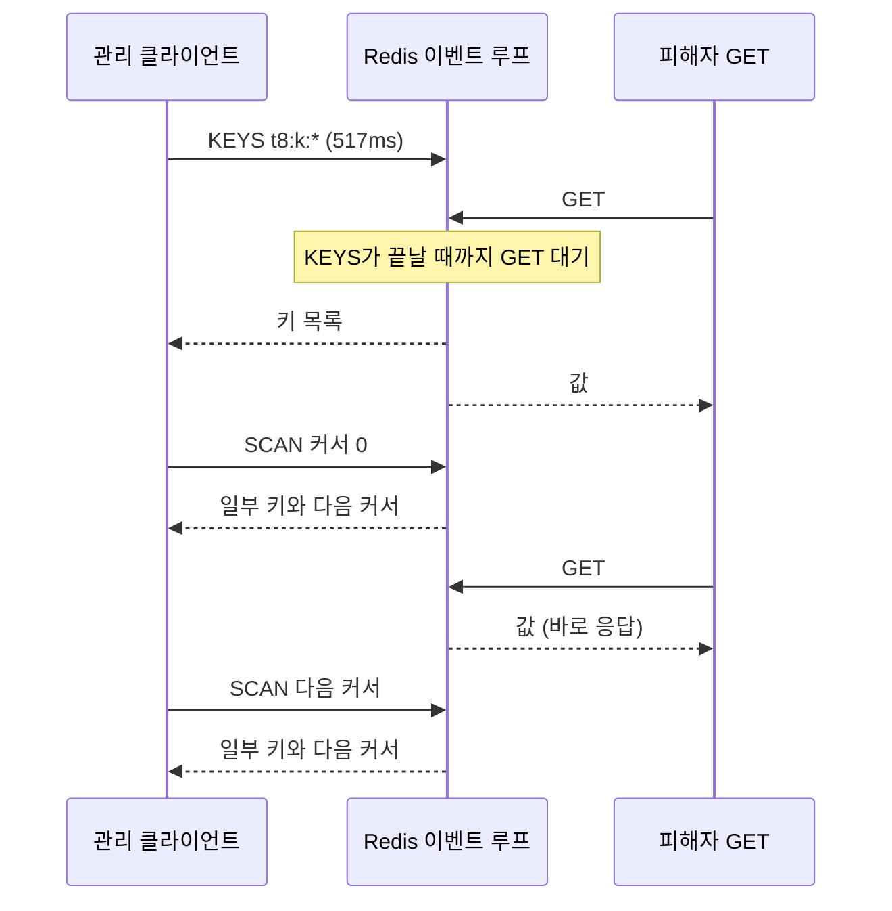

Redis 단일 스레드가 멈추는 순간이라는 제목으로 쓸 내용을 [redis-lite-java 시리즈](/series/redis-lite-java/)에서 구현 관점으로 다룬 적이 있다. 이 글은 그것을 실제 서버에서 재 본 기록이다.

Redis는 명령을 한 스레드의 [이벤트 루프](/posts/nio-and-event-loop/)에서 차례로 실행한다. Redis 문서는 그 결과를 이렇게 적는다. "A consequence of being single thread is that when a request is slow to serve all the other clients will wait for this request to be served."(단일 스레드이므로 요청 하나가 느리면 다른 모든 클라이언트가 그 요청이 끝나기를 기다린다.)([Diagnosing latency issues](https://redis.io/docs/latest/operate/oss_and_stack/management/optimization/latency/)) 이 글은 그 기다림을 명령별로 쟀다.

저장소는 [data-ops-lab](https://github.com/polynomeer/data-ops-lab)이고 재실행은 한 줄이다.

```bash
./.venv/bin/python experiments/redis/run.py --repeat 3
```

## 어떻게 쟀는가

핫 키 하나에 `GET`만 반복하는 스레드 4개를 실험 내내 돌리고, 조건이 활성화된 동안의 샘플을 그 조건 이름으로 모았다. **측정값은 느린 명령이 얼마나 걸리는가가 아니라 그동안 관계없는 클라이언트가 얼마나 기다렸는가다.** 나머지 시스템이 실제로 내는 비용은 후자이기 때문이다.

Redis 7.4.10, `cpus: 1, mem_limit: 512m`, `lazyfree-lazy-user-del no`, `hz 10`.

## 결과 (3회 중앙값)

| 조건 | 명령 시간 | 피해자 p50 | 피해자 p99 | 피해자 max | 기준선 대비 |
| --- | ---: | ---: | ---: | ---: | ---: |
| 기준선 | - | 0.42 ms | **3.26 ms** | 23.0 ms | 1.0배 |
| `KEYS t8:k:*` | 517 ms | 0.41 | **19.97** | 95.7 | **6.1배** |
| `SCAN` 전체 순회 | 1,933 ms | 0.35 | **1.96** | 12.2 | **0.6배** |
| `LRANGE key 0 -1` (100만) | 864 ms | 0.47 | **36.93** | 85.0 | **11.3배** |
| `DEL` 100만 원소 리스트 | 1.3 ms | 0.49 | 3.77 | 13.7 | 1.2배 |
| `UNLINK` 같은 리스트 | 2.4 ms | 0.48 | 2.82 | 9.3 | 0.9배 |
| `DEL` 100만 멤버 Set | **121.4 ms** | 0.46 | 3.69 | **119.9** | 1.1배 |
| 키 25만 개 동시 만료 | - | 0.44 | **7.38** | 65.3 | **2.3배** |

## SCAN은 더 오래 걸리면서 아무도 안 막는다

`KEYS`와 `SCAN`을 나란히 놓으면 이렇다.

```text
KEYS    517 ms 만에 끝나고   피해자 p99 19.97 ms  (기준선의 6.1배)
SCAN  1,933 ms 걸리는데      피해자 p99  1.96 ms  (기준선 이하)
```

SCAN은 **3.7배 오래 걸리면서 남을 전혀 막지 않는다.** 커서로 쪼개 여러 번 호출하므로, 그 사이사이에 다른 클라이언트의 명령이 실행된다. KEYS는 한 번의 명령으로 50만 키를 훑으므로 그동안 이벤트 루프를 독점한다. 아래는 이 실험의 피해자 `GET`이 두 경우에 어디서 기다리는지를 그린 것이다.



빨리 끝나는 것과 남을 막지 않는 것은 다른 목표이고, 공유 자원 위에서는 대개 후자가 맞다. 같은 구조를 [Tomcat 스레드 고갈 실험](/posts/tomcat-thread-exhaustion/)에서도 봤다. [벌크헤드](/posts/bulkhead/)는 총 처리량을 늘리지 않고 한 상대가 자원을 독점하지 못하게 할 뿐인데, 그것이 요점이었다.

## LRANGE 0 -1이 KEYS보다 나쁘다

피해자 p99가 36.93ms로 KEYS의 19.97ms보다 높다. 실무에서는 이쪽이 더 위험하다. `KEYS`는 안 쓰면 그만이지만, **`LRANGE 0 -1`은 애플리케이션 코드에 자연스럽게 들어간다.** "이 리스트 전부 가져와서 필터링" 같은 코드가 리뷰를 통과하기 쉽다.

`HGETALL`, `SMEMBERS`, `ZRANGE 0 -1`도 같은 계열이다. 컬렉션이 작을 때 넣은 코드가, 컬렉션이 커지면서 조용히 이 자리로 온다.

## "큰 DEL은 위험하다"가 성립하는 조건

예상이 빗나간 부분이다. 100만 원소 리스트를 `DEL`하는 데 1.3ms였고 `UNLINK`와 구별되지 않았다.

`lazyfree-lazy-user-del`이 `no`라 동기 삭제가 맞다. 원인은 리스트의 저장 방식이었다. Redis의 리스트는 quicklist라는 연결 리스트이고, 각 노드는 원소 여러 개를 연속된 메모리에 담는 listpack이다. 노드 크기 상한은 `list-max-listpack-size`가 정하고, 기본값 `-2`는 8KB다([redis.conf, 7.4.0](https://github.com/redis/redis/blob/7.4.0/redis.conf#L1951-L1953)). 작은 정수 100만 개는 노드 수천 개가 되므로, 해제 횟수는 100만이 아니라 수천이다.

그래서 조건을 하나 더 만들었다. 서로 다른 문자열 100만 개를 담은 Set은 hashtable 인코딩이고, 멤버마다 할당이 하나다.

```text
DEL 리스트(100만 원소, listpack 묶음)     1.3 ms
DEL Set(100만 멤버, hashtable)          121.4 ms    약 93배
```

**경고는 원소 수가 아니라 할당 수에 대한 것이었다.** 같은 "100만 개"인데 자료구조 인코딩에 따라 두 자릿수가 갈린다. Redis 소스도 같은 기준을 쓴다. 7.4.0의 `lazyfreeGetFreeEffort`는 해제 비용을 quicklist면 노드 수(`ql->len`)로, hashtable Set이면 멤버 수(`dictSize`)로 센다([lazyfree.c](https://github.com/redis/redis/blob/7.4.0/src/lazyfree.c#L129-L141)). `redis.conf`는 원소 수백만 개짜리 값의 `DEL`이 서버를 오래 멈출 수 있다고 경고하는데, 리스트에서는 그렇지 않았다.

인코딩은 `OBJECT ENCODING`으로 확인할 수 있다. 그 값이 `listpack`·`intset`·`quicklist`면 걱정이 덜하고, `hashtable`·`skiplist`면 크기에 비례해 위험하다.

## 120ms 멈춤이 p99에 안 잡힌다

Set의 `DEL` 행을 다시 보면 두 값이 어긋난다.

```text
피해자 p99   3.69 ms   (기준선 3.26 ms와 차이 없음)
피해자 max 119.9 ms   (명령 시간 121.4 ms와 거의 같음)
```

누군가의 `GET`이 명령 전체를 기다렸는데 p99는 멀쩡하다. 한 번뿐인 사건이라서다. 그 구간의 샘플 수천 개 중 영향을 받은 것은 몇 개이고, 99번째 백분위는 그것을 보지 못한다.

[백분위 통계](/posts/percentile-statistics/)에서 다룬 문제가 여기서 구체적으로 나타난다. **일회성 정지에는 p99가 아니라 max, 또는 임계값을 넘은 샘플 수가 맞는 통계다.** 배포 중 한 번, 하루에 몇 번 일어나는 정지는 백분위 대시보드에 나타나지 않는다.

거꾸로 `KEYS`와 `LRANGE`는 실행되는 동안 계속 막으므로 p99가 잘 잡는다. 사건의 모양에 따라 봐야 할 통계가 다르다.

## 대량 만료는 꾸준히 비싸다

키 25만 개를 같은 순간에 만료시키자 피해자 p99가 7.38ms로 기준선의 2.3배가 됐다. 그리고 이 조건이 가장 재현성이 높았다(7.38, 5.76, 7.56).

Redis 문서에 따르면 능동 만료는 100ms마다(초당 10회, `hz 10`) TTL이 걸린 키를 20개씩 표본으로 확인한다. 표본의 25%를 넘는 키가 이미 만료돼 있으면 이 과정을 반복하고, 그동안 서버가 멈출 수 있다([Latency generated by expires](https://redis.io/docs/latest/operate/oss_and_stack/management/optimization/latency/)). max 65ms는 그 반복과 맞는 값이고, p99가 완만한 것은 비용이 여러 주기에 퍼졌기 때문으로 본다. TTL에 지터(무작위 편차)를 주라는 조언의 근거가 여기 있고, [캐시 스탬피드 실험](/posts/cache-stampede-experiment/)의 마지막 권고와 같은 자리다.

## 실무로 옮기면

1. **`KEYS`를 쓰지 않는다.** 대신 `SCAN`을 쓰고, 총 시간이 길어지는 것은 남을 막지 않기 위해 받아들이는 설계다.
2. **`LRANGE 0 -1`, `HGETALL`, `SMEMBERS`를 컬렉션 크기와 함께 본다.** 지금 작다는 것은 근거가 아니다.
3. **큰 컬렉션을 지울 때 `OBJECT ENCODING`을 먼저 본다.** `hashtable`이면 `UNLINK`를 쓰거나 `lazyfree-lazy-user-del`을 켠다. `listpack` 계열이면 `DEL`로 충분하다.
4. **일회성 정지를 찾을 때는 max와 임계값 초과 건수를 본다.** p99만 보면 없는 것처럼 보인다.
5. **TTL에 지터를 준다.** 같은 순간 만료가 꾸준한 세금이 된다.

## 측정에서 고친 것 둘

**`UNLINK` 측정에 리스트 생성 시간이 섞였다.** 처음에는 측정 창 안에서 100만 원소를 넣고 지웠다. 5,450ms가 나왔는데 대부분이 생성 시간이었고, `DEL`과 비교할 수 없는 값이었다. 준비를 측정 밖으로 빼자 둘 다 1~2ms로 수렴했고, 그제서야 "차이가 없다"는 실제 결과가 보였다.

**기준선을 시드 직후에 쟀다.** 150만 객체를 쓴 직후라 그 여파가 "조용한" 구간에 섞였다. 그 탓에 `SCAN`의 p99가 기준선보다 낮게 나오는 모순이 생겼다. 15초 안정화 후 10초간 재도록 바꿨다.

조건 사이의 유휴 구간을 모은 `idle` 버킷은 p99가 29.2ms다. 그 구간에 하니스가 키 수십만 개를 쓰고 있었기 때문이다. 기준선으로 쓰면 안 되는 값이고 보고서에 그렇게 적었다. [T9](/posts/cache-stampede-experiment/)에서 예외를 삼켜 실패가 가장 빠른 요청이 됐던 것과 같은 계열의 실수다. 비교 기준이 무엇을 포함하고 있는지 확인하지 않으면, 그 기준이 결론을 정해 버린다.

## 한계

- **Docker Desktop on macOS다.** 피해자의 기준선 p99 3.26ms와 max 23ms는 대부분 VM 스케줄링이지 Redis가 아니다. 조건 간 비교는 같은 클라이언트·같은 스택이라 유효하지만, 리눅스 베어메탈이면 바닥이 훨씬 낮다.
- **Redis에 CPU 1개다.** 명령 실행이 단일 스레드라 현실적인 모양이지만, lazy free의 백그라운드 스레드가 쓸 CPU가 없다.
- **3회 반복이다.** 순서는 안정적이었고 `KEYS`의 p99는 9.5~22.0ms로 흔들렸다. 개별 숫자에 그만큼의 폭이 있다.
- **영속화를 재지 않았다.** `RDB` fork와 `AOF` 재작성은 별도의 정지 원인이다.
- **클러스터가 없다.** 슬롯 간 동작이나 리샤딩 중의 지연은 여기서 말할 수 없다.
- **`DEL` 계열은 실행당 한 번뿐이다.** max가 그 한 번을 잡았지만 분포를 말하려면 반복이 훨씬 많아야 한다.

## 정리

- 빨리 끝나는 것과 남을 안 막는 것은 다른 목표다. `SCAN`은 `KEYS`보다 3.7배 오래 걸리면서 피해자를 기준선 이하로 유지했다.
- 관리 명령보다 애플리케이션 코드에 들어오는 `LRANGE 0 -1` 계열이 더 위험하다.
- 큰 `DEL`의 비용은 원소 수가 아니라 할당 수를 따른다. 같은 100만 개가 인코딩에 따라 1.3ms와 121.4ms로 갈린다.
- 일회성 정지는 p99에 안 잡힌다(p99 3.69ms, max 119.9ms). max나 임계값 초과 건수를 봐야 한다.

## 참고

- [data-ops-lab](https://github.com/polynomeer/data-ops-lab) — 원본은 `reports/data/t8-redis.json`, 표는 `reports/01-experiment-report.md`
- [Redis: Keyspace - SCAN guarantees](https://redis.io/docs/latest/commands/scan/)
- [Redis: Lazy freeing](https://redis.io/docs/latest/operate/oss_and_stack/management/config/)
- [Redis: Diagnosing latency issues](https://redis.io/docs/latest/operate/oss_and_stack/management/optimization/latency/) — 단일 스레드와 느린 명령, 능동 만료
- Redis 7.4.0 소스: [redis.conf](https://github.com/redis/redis/blob/7.4.0/redis.conf), [lazyfree.c](https://github.com/redis/redis/blob/7.4.0/src/lazyfree.c)
- [백분위 통계](/posts/percentile-statistics/), [캐시 스탬피드 실험](/posts/cache-stampede-experiment/)
