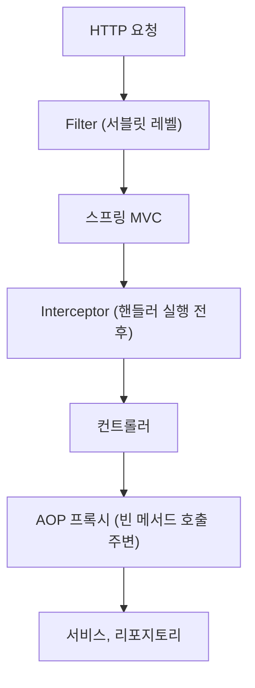

## 세 가지가 모두 필요한 이유

웹 애플리케이션에서 공통 처리를 넣는 지점은 하나가 아니다. 요청이 서블릿 컨테이너에 들어온 직후 처리할 일도 있고, 컨트롤러 직전에 처리할 일도 있고, 서비스 메서드 호출 주변에서 처리할 일도 있다.

그래서 Filter, Interceptor, AOP는 서로 대체재라기보다 적용 지점이 다른 도구에 가깝다. 세 지점을 요청 흐름에 놓으면 다음과 같다.

## Filter

Filter는 서블릿 스펙 레벨에서 동작한다. 스프링 MVC보다 앞단이다.

주 용도:

- 인코딩 처리
- CORS
- 공통 헤더 처리
- 요청/응답 로깅
- 아주 초기 단계의 인증 처리

스프링 컨트롤러에 도달하기 전에 다뤄야 하는 작업에 적합하다. Filter는 체인 아래로 넘기는 요청·응답 객체 자체를 바꿀 수도 있다([HandlerInterceptor Javadoc](https://docs.spring.io/spring-framework/docs/current/javadoc-api/org/springframework/web/servlet/HandlerInterceptor.html)).

## Interceptor

Interceptor는 스프링 MVC의 핸들러 실행 전후에 동작한다. 컨트롤러 매핑 정보, 핸들러 정보에 접근할 수 있다는 점이 Filter와 다르다.

주 용도:

- 로그인 체크
- 권한 확인
- 특정 컨트롤러 그룹에 대한 로깅
- 요청 처리 시간 측정

컨트롤러 수준 문맥이 필요하면 Interceptor가 적합하다.

다만 같은 Javadoc은 "Interceptors are not ideally suited as a security layer"라고 적는다. Interceptor의 경로 매칭이 컨트롤러 경로 매칭과 어긋날 수 있기 때문이고, 대신 Spring Security처럼 서블릿 필터 체인에 통합된 방식을 권한다([Security 필터 체인](/posts/security-filter-chain/)). 그래서 위의 로그인 체크와 권한 확인은 보안 경계가 아닌 보조 검사로 둔다.

## AOP

[AOP](/posts/aop/)는 HTTP 요청 흐름이 아니라 메서드 호출 단위의 횡단 관심사(여러 클래스에 걸친 공통 처리)에 가깝다. Spring AOP는 런타임 프록시로 구현되고 조인 포인트는 항상 메서드 실행이다([Spring AOP Concepts](https://docs.spring.io/spring-framework/reference/core/aop/introduction-defn.html)). 그래서 컨트롤러뿐 아니라 서비스, 리포지토리 등 빈 전반에 걸쳐 적용할 수 있다.

주 용도:

- 서비스 메서드 로깅
- 성능 측정
- 공통 정책 검사
- 트랜잭션

요청 경로보다는 메서드 실행 자체를 기준으로 적용한다. 같은 객체 안의 내부 호출에는 적용되지 않는다([프록시의 한계](/posts/proxy-limits/)).

## 선택 기준

### 요청 자체를 다뤄야 하면 Filter

예: 모든 요청에 추적 ID를 심거나 응답 헤더를 붙이는 경우

### 컨트롤러 호출 전후를 다뤄야 하면 Interceptor

예: 특정 API 그룹에만 로그인 여부를 보조로 확인하는 경우

### 비즈니스 메서드 전반의 공통 처리는 AOP

예: 서비스 계층의 실행 시간 측정, 공통 감사 로그

## 자주 하는 실수

- 인증 로직을 무조건 AOP에 넣음
- 예외 응답 가공을 Filter에서 해결하려고 함
- 컨트롤러/서비스 공통 로깅을 모두 Interceptor 하나로 해결하려고 함

도구가 겹쳐 보여도 관찰 가능한 정보와 실행 시점이 다르다.

## 한 줄로 정리

- Filter: 서블릿 레벨
- Interceptor: 스프링 MVC 레벨
- AOP: 빈 메서드 레벨

## 정리

같은 로깅이라도 모든 요청이 대상이면 Filter, 특정 컨트롤러 그룹이면 Interceptor, 서비스 메서드면 AOP다. 보안은 가능한 한 앞단인 필터 체인에 둔다.

## 참고

- [Spring Framework Javadoc — HandlerInterceptor](https://docs.spring.io/spring-framework/docs/current/javadoc-api/org/springframework/web/servlet/HandlerInterceptor.html)
- [Spring Framework Reference — AOP Concepts](https://docs.spring.io/spring-framework/reference/core/aop/introduction-defn.html)
