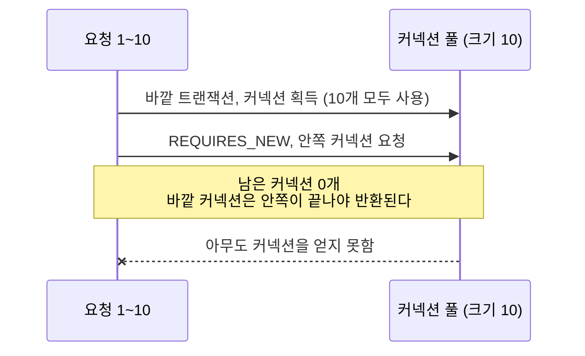

`@Transactional(propagation = ...)`의 일곱 값을 표로 외우는 것과, 그중 하나를 골랐을 때 커넥션이 몇 개 잡히고 예외가 어디까지 번지는지 아는 것은 다르다. 후자를 모르면 `REQUIRES_NEW` 하나로 [커넥션 풀](/posts/connection-pool/)을 고갈시키거나, 잡아서 무시한 예외 때문에 바깥 트랜잭션이 통째로 롤백되는 일을 만난다.

## 일곱 가지가 답하는 질문은 둘이다

전파 옵션은 기존 트랜잭션이 있을 때와 없을 때 각각 무엇을 할지를 정한다.

| 옵션 | 기존 트랜잭션이 있으면 | 없으면 |
| --- | --- | --- |
| `REQUIRED` (기본) | 참여 | 새로 시작 |
| `SUPPORTS` | 참여 | 트랜잭션 없이 실행 |
| `MANDATORY` | 참여 | 예외 |
| `REQUIRES_NEW` | **기존을 보류하고 새로 시작** | 새로 시작 |
| `NOT_SUPPORTED` | 보류하고 트랜잭션 없이 실행 | 트랜잭션 없이 실행 |
| `NEVER` | 예외 | 트랜잭션 없이 실행 |
| `NESTED` | **세이브포인트를 만든다** | 새로 시작 |

실무에서 실제로 쓰는 것은 `REQUIRED`, `REQUIRES_NEW`, `NESTED` 셋이고, 사고도 이 셋에서 난다.

## REQUIRED의 함정: 예외는 잡아도 롤백된다

`REQUIRED`로 참여한 메서드는 바깥과 같은 물리 트랜잭션이다. 별개의 트랜잭션처럼 보이지만 아니다. 안쪽이 예외를 던지면 스프링은 그 트랜잭션을 `rollback-only`로 표시한다. 바깥에서 그 예외를 잡아 삼켜도 표시는 남아 있고, 바깥이 커밋을 시도하는 순간 `UnexpectedRollbackException`이 난다. 커밋을 호출한 쪽이 커밋되었다고 오해하지 않게 하려는 의도된 동작이다([Spring: Transaction Propagation](https://docs.spring.io/spring-framework/reference/data-access/transaction/declarative/tx-propagation.html)).

```java
@Transactional                      // 바깥
public void process() {
    try {
        inner.doSomething();        // @Transactional(REQUIRED), 여기서 예외
    } catch (Exception e) {
        log.warn("무시하고 계속");   // 무시했다고 생각하지만
    }
    // 커밋 시점에 UnexpectedRollbackException
}
```

"일부 실패는 무시하고 나머지는 저장"을 하려면 전파를 바꾸거나(`REQUIRES_NEW`, `NESTED`) 트랜잭션 경계를 밖으로 빼야 한다. 예외를 잡는 것만으로는 안 된다.

## REQUIRES_NEW의 비용: 커넥션 두 개

`REQUIRES_NEW`는 기존 트랜잭션을 보류하고 새 커넥션을 얻는다. 보류된 쪽은 커넥션을 쥔 채 기다린다. 그래서 한 요청이 커넥션을 둘 잡는다.

풀 크기가 10일 때 동시 요청 10개가 각각 `REQUIRES_NEW`를 만나면, 열 개가 바깥 커넥션을 쥔 채 안쪽 커넥션을 기다린다. 아무도 내놓지 않으므로 **데드락**이다. 커넥션 풀 고갈은 부하가 풀 크기를 넘어서야 생긴다고 생각하기 쉽지만, 이 경우는 동시 요청 수가 풀 크기에 닿기만 해도 멈출 수 있다.



스프링 문서도 같은 시나리오를 경고한다. "Do not use `PROPAGATION_REQUIRES_NEW` unless your connection pool is appropriately sized, exceeding the number of concurrent threads by at least 1." (풀 크기가 동시 스레드 수보다 최소 1 커야 한다.) 이것은 데드락을 피하는 최소 조건이고, 안쪽이 기다리지도 않게 하려면 더 필요하다. 중첩 깊이를 N이라 하면 필요한 커넥션은 요청당 N개이므로, 풀 크기는 `동시 요청 수 × 중첩 깊이`보다 커야 한다.

## NESTED는 새 트랜잭션이 아니다

`NESTED`는 JDBC 세이브포인트(트랜잭션 안에서 되돌아갈 지점)를 쓴다. 물리 트랜잭션도 커넥션도 하나다. 안쪽이 실패하면 세이브포인트까지만 되돌리고 바깥은 계속한다. 다만 **바깥이 롤백되면 안쪽도 같이 사라진다.** 진짜 독립이 필요하면 `REQUIRES_NEW`여야 한다. 스프링 문서에 따르면 이 설정은 JDBC 리소스 트랜잭션에서만 동작한다. 아래 표의 JPA 제약이 이것이다.

| | `REQUIRES_NEW` | `NESTED` |
| --- | --- | --- |
| 커넥션 | 두 개 | 하나 |
| 바깥이 롤백되면 | 안쪽은 남는다 | 안쪽도 사라진다 |
| 지원 | 대부분 | JDBC 세이브포인트 필요, JPA에서는 제약이 있다 |

## 이 설명이 깨지는 곳

- 자기 호출(self-invocation)에서는 전파가 적용되지 않는다. 같은 클래스의 메서드를 `this`로 부르면 프록시를 지나지 않아 `@Transactional`이 무시된다. 별도로 정리했다([프록시의 한계](/posts/proxy-limits/)).
- 읽기 전용 플래그는 전파와 독립이다. `readOnly = true`는 참여하는 트랜잭션에는 적용되지 않는다. 바깥이 쓰기 트랜잭션이면 안쪽의 `readOnly`는 무시된다. 격리 수준과 타임아웃도 같다. 이 불일치를 거부하려면 트랜잭션 매니저의 `validateExistingTransaction`을 `true`로 둔다.
- JPA에서는 영속성 컨텍스트가 트랜잭션마다 따로 논다. `JpaTransactionManager`는 `REQUIRES_NEW`로 보류할 때 바깥의 `EntityManager`를 떼어 두었다가, 안쪽이 끝나면 1차 캐시를 가진 그대로 다시 붙인다([JpaTransactionManager v6.2.0 `doSuspend`/`doResume`](https://github.com/spring-projects/spring-framework/blob/v6.2.0/spring-orm/src/main/java/org/springframework/orm/jpa/JpaTransactionManager.java#L520-L542)). 그래서 안쪽이 커밋한 변경을, 바깥이 이미 읽어 둔 엔티티로 다시 조회하면 1차 캐시의 옛 값이 나올 수 있다([영속성 컨텍스트](/posts/jpa-architecture/)).
- 기본 롤백 규칙은 unchecked 예외(`RuntimeException`과 그 하위 타입, 그리고 `Error`)뿐이다. checked 예외는 커밋된다. `rollbackFor`를 지정하지 않으면 `IOException`을 던져도 커밋이다([Spring: Rolling Back](https://docs.spring.io/spring-framework/reference/data-access/transaction/declarative/rolling-back.html)).

## 무엇을 재면 확인되는가

전파의 비용은 지표로 보인다.

1. `REQUIRES_NEW` 중첩이 있는 경로에 부하를 걸고 `hikaricp_connections_pending`과 `active`를 본다. 풀 크기를 10/20/50으로 바꿔 p99가 어떻게 움직이는지.
2. 같은 부하에서 중첩을 제거한 뒤 다시 잰다.
3. 커넥션 대기가 DB 쪽인지 애플리케이션 쪽인지는 `pg_stat_activity`와 풀 지표를 같이 봐야 갈린다.

[spring-ops-lab](https://github.com/polynomeer/spring-ops-lab)의 S2 시나리오가 이것이다. `/api/nested-tx`가 `REQUIRES_NEW`로 커넥션 두 개를 쥐는 엔드포인트이고, "풀을 늘리면 왜 더 나빠지는가"를 격자로 잰다. S1에서 [Tomcat 스레드 고갈](/posts/tomcat-thread-exhaustion/)을 재면서 본 것과 같은 구조다. 상한이 있는 자원을 한 요청이 여러 개 쥐면 동시성은 산술로 무너진다.

## 실무와의 접점

[ParityPay 2편](/posts/parity-pay-lock-hold-time/)에서 잔액 UPDATE가 행을 잠근 뒤 열두 문장과 커밋 fsync가 전부 잠금 안에서 일어나 보유 시간이 17ms였고, 그중 DB가 실제로 일한 시간은 2.31ms였다. 그 잠금 위에 `REQUIRES_NEW`가 커넥션 하나를 더 쥐게 한다. 그래서 트랜잭션 경계를 바꿀 때는 코드가 깔끔해지는지보다 이 경계 안에서 어떤 자원을 얼마나 오래 쥐는지를 먼저 본다.

## 정리

- 예외를 잡는 것으로는 `REQUIRED`의 롤백을 막지 못한다. 일부 실패를 허용하려면 전파나 경계를 바꿔야 한다.
- `REQUIRES_NEW`는 동시 요청 수가 풀 크기에 닿기만 해도 데드락이 날 수 있다. 풀 크기는 데드락을 피하려면 최소 `동시 스레드 + 1`, 대기를 없애려면 `동시 요청 × 중첩 깊이`보다 커야 한다.
- `NESTED`는 커넥션을 아끼지만 바깥 롤백에서 독립하지 못하고, JDBC 리소스 트랜잭션에서만 동작한다.

## 참고

- [Spring: Transaction Propagation](https://docs.spring.io/spring-framework/reference/data-access/transaction/declarative/tx-propagation.html)
- [Spring: Rolling Back a Declarative Transaction](https://docs.spring.io/spring-framework/reference/data-access/transaction/declarative/rolling-back.html)
- [Spring Framework v6.2.0 `JpaTransactionManager` 소스](https://github.com/spring-projects/spring-framework/blob/v6.2.0/spring-orm/src/main/java/org/springframework/orm/jpa/JpaTransactionManager.java#L520-L542)
- [HikariCP: About Pool Sizing](https://github.com/brettwooldridge/HikariCP/wiki/About-Pool-Sizing)
- [트랜잭션 정리](/posts/transaction/), [ACID 정리](/posts/acid/)
