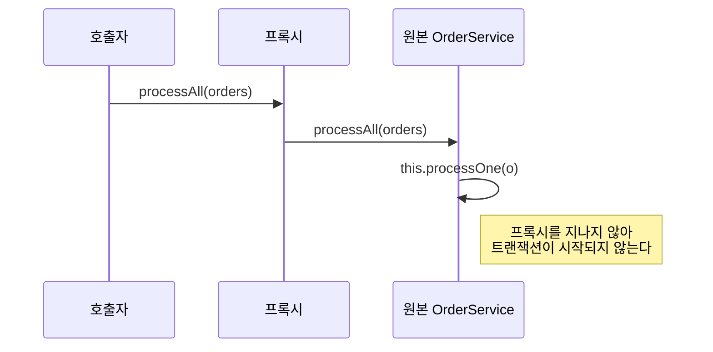

`@Transactional`을 붙였는데 트랜잭션이 안 걸린다. `@Cacheable`을 붙였는데 캐시가 안 된다. `@Async`를 붙였는데 같은 스레드에서 돈다. 증상은 다르지만 원인은 하나다. **그 호출이 프록시를 지나지 않았다.** [스프링 AOP](/posts/aop/)는 프록시 기반이고, 세 증상 모두 이 사실에서 나온다.

## 프록시가 하는 일

스프링은 `@Transactional`이 붙은 빈을 감싸는 대리 객체(프록시)를 만들어 컨테이너에 등록한다. 주입받는 쪽은 원본이 아니라 이 대리 객체를 받는다.

```text
호출자 → [프록시] → 트랜잭션 시작 → [원본 객체의 메서드] → 커밋/롤백
```

부가 기능은 프록시에 있지 원본 객체에 있지 않다. 그래서 **프록시를 거치지 않는 호출에는 부가 기능이 없다.** 프록시 모드에서는 프록시를 거쳐 들어오는 외부 호출만 가로챈다([Spring: Using @Transactional](https://docs.spring.io/spring-framework/reference/data-access/transaction/declarative/annotations.html)).

## self-invocation: 가장 흔한 사고

```java
@Service
public class OrderService {

    public void processAll(List<Order> orders) {
        for (Order o : orders) {
            processOne(o);        // this.processOne(...) - 프록시를 지나지 않는다
        }
    }

    @Transactional
    public void processOne(Order o) { ... }   // 트랜잭션이 걸리지 않는다
}
```

`processOne` 앞에 `this`가 생략돼 있고, `this`는 프록시가 아니라 원본 객체다. 컴파일도 되고 실행도 되며 예외도 나지 않는다. 그냥 조용히 트랜잭션 없이 실행된다.

호출 경로를 그리면 `processOne`이 프록시를 다시 지나지 않는 것이 보인다.



해결은 셋 중 하나다.

| 방법 | 설명 |
| --- | --- |
| 클래스를 분리 | `processOne`을 다른 빈으로 옮긴다. 대개 이것이 맞다 |
| 자기 자신을 주입 | `@Lazy`로 자기 프록시를 주입받아 호출. 순환 참조를 감수 |
| `AopContext.currentProxy()` | `@EnableAspectJAutoProxy(exposeProxy = true)` 필요. 코드가 AOP에 묶인다 |

분리가 기본이다. 스프링 문서도 이것을 먼저 권한다. "The best approach (the term "best" is used loosely here) is to refactor your code such that the self invocation does not happen."([Spring: Understanding AOP Proxies](https://docs.spring.io/spring-framework/reference/core/aop/proxying.html)) self-invocation이 일어나지 않게 리팩터링하는 것이 가장 낫다는 뜻이다. 나머지 둘은 "왜 프록시를 우회하고 싶은가"를 다시 묻게 만드는 신호에 가깝다.

## JDK 동적 프록시와 CGLIB

두 가지 구현이 있다. 스프링 프레임워크는 대상이 인터페이스를 구현하면 JDK 동적 프록시를, 아니면 CGLIB을 쓴다([Spring: Proxying Mechanisms](https://docs.spring.io/spring-framework/reference/core/aop/proxying.html)).

JDK 동적 프록시는 인터페이스를 구현한 새 클래스를 만든다. 인터페이스에 선언된 메서드만 프록시된다. 인터페이스가 없으면 쓸 수 없다.

CGLIB은 대상 클래스를 상속한 서브클래스를 런타임에 만든다. 인터페이스가 없어도 되지만 상속의 제약을 그대로 받는다.

- `final` 클래스는 상속할 수 없다. 프록시 생성이 실패한다.
- `final` 메서드는 오버라이드할 수 없다. 예외 없이 그 메서드만 프록시되지 않는다.
- `private` 메서드도 같다. 오버라이드 대상이 아니다.
- 생성자는 보통 두 번 호출되지 않는다. 프록시 인스턴스를 Objenesis(생성자를 거치지 않고 객체를 만드는 라이브러리)로 만들기 때문이다. 다만 JVM이 생성자 우회를 허용하지 않으면 두 번 호출될 수 있다.

Spring Boot는 2.0부터 CGLIB을 기본으로 쓴다(`proxyTargetClass=true`). `spring.aop.proxy-target-class`의 기본값이 `true`다([Spring Boot: Application Properties](https://docs.spring.io/spring-boot/appendix/application-properties/index.html)). 인터페이스가 있어도 클래스 기반이다. 인터페이스를 만들면 JDK 프록시가 되던 시절의 조언이 지금은 맞지 않는다.

## 코틀린에서 특히 자주 만난다

코틀린은 클래스와 메서드가 기본적으로 `final`이다. `open`을 붙이지 않으면 CGLIB이 프록시를 만들 수 없다. `kotlin-spring` 플러그인이 `@Component`, `@Transactional` 등이 붙은 곳을 자동으로 `open`으로 만들어 주는 이유가 이것이다([Kotlin: All-open compiler plugin](https://kotlinlang.org/docs/all-open-plugin.html)). 플러그인이 빠진 프로젝트에서 "트랜잭션이 안 걸린다"가 나오면 여기부터 본다.

## 이 설명이 깨지는 곳

- AspectJ 위빙은 프록시가 아니다. 컴파일 타임이나 로드 타임에 바이트코드를 고치므로 self-invocation도 `final`도 문제가 되지 않는다. 대신 빌드와 기동에 단계가 추가된다. 스프링 AOP의 한계가 실제로 막히는 경우에 고려한다.
- 프록시는 `this` 참조를 바꾸지 않는다. 원본 객체가 자기 참조를 다른 곳에 넘기면(리스너 등록 등) 그 참조에는 부가 기능이 없다.
- `@PostConstruct` 안에서는 프록시가 아직 완성되지 않았을 수 있다. 초기화 콜백에서 트랜잭션에 의존하는 코드는 피하라고 `@Transactional` 문서도 적는다.
- 서로 다른 aspect의 실행 순서는 지정하지 않으면 정해져 있지 않다. `@Order` 값이 낮을수록 우선한다([Spring: Advice Ordering](https://docs.spring.io/spring-framework/reference/core/aop/ataspectj/advice.html)). 트랜잭션과 캐시가 함께 붙으면 어느 쪽이 바깥인지가 동작을 바꾼다.

## 무엇을 재면 확인되는가

동작 여부는 성능이 아니라 사실 확인이라 관찰로 끝난다.

1. `TransactionSynchronizationManager.isActualTransactionActive()`를 메서드 안에서 찍어 본다. self-invocation이면 `false`다.
2. 주입받은 빈의 클래스 이름을 찍어 `$$SpringCGLIB$$`가 붙는지 본다.
3. `logging.level.org.springframework.transaction=TRACE`로 트랜잭션 경계 로그를 켠다.

[spring-internals-lab](/posts/spring-internals-lab-proxy-aop/)에서 프록시 생성 과정을 소스 수준으로 따라간 적이 있다. 이 글은 그것을 "무엇이 안 되는가"의 목록으로 뒤집은 것이다.

## 실무와의 접점

[정산 중 수정 차단](/posts/settlement-write-guard/)에서 AOP로 경량 락을 걸었다. 그 설계가 성립한 전제가 "모든 진입이 프록시를 지난다"였다. 같은 클래스 안에서 부르는 경로가 하나라도 있었다면 그 락은 조용히 비어 있었을 것이다. 프록시는 진입점에만 있으므로, 진입점이 여럿이면 그중 하나만 새도 보호가 사라진다. 그래서 **AOP로 무언가를 강제할 때는 우회 경로가 없는지 확인하는 일이 설계에 포함된다.**

## 정리

- 부가 기능은 프록시에 있다. 프록시를 지나지 않는 호출에는 부가 기능이 없다.
- self-invocation은 예외 없이 조용히 무시된다. 기본 해결은 클래스 분리다.
- Spring Boot의 기본은 CGLIB이다. `final` 클래스는 실패하고, `final`·`private` 메서드는 조용히 프록시되지 않는다. 코틀린에서는 `kotlin-spring` 플러그인이 이 제약을 풀어 준다.

## 참고

- [Spring: Understanding AOP Proxies](https://docs.spring.io/spring-framework/reference/core/aop/proxying.html)
- [Spring: Using @Transactional](https://docs.spring.io/spring-framework/reference/data-access/transaction/declarative/annotations.html)
- [Spring: Advice Ordering](https://docs.spring.io/spring-framework/reference/core/aop/ataspectj/advice.html)
- [Spring Boot: Application Properties](https://docs.spring.io/spring-boot/appendix/application-properties/index.html)
- [Kotlin: All-open compiler plugin](https://kotlinlang.org/docs/all-open-plugin.html)
- [Spring Boot: proxyTargetClass default](https://docs.spring.io/spring-boot/reference/using/auto-configuration.html)
- [AOP 정리](/posts/aop/), [Filter, Interceptor, AOP 정리](/posts/filter-interceptor-aop/)
