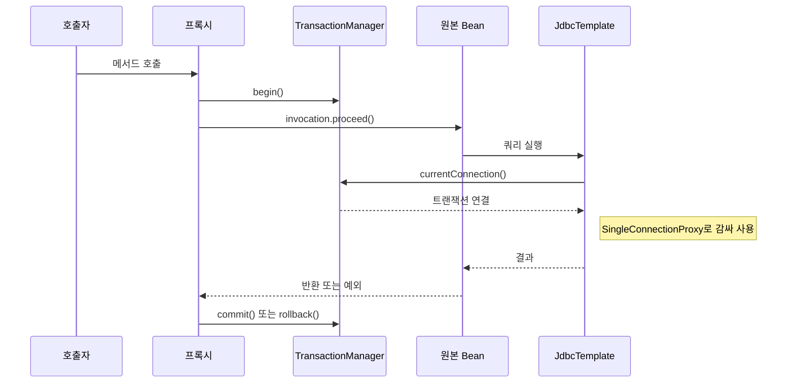

[GitHub 저장소](https://github.com/polynomeer/spring-lite)

이 글의 코드 링크는 커밋 `bd8ea3f` 기준이다. 이후 저장소에 전파 옵션과 rollback 규칙이 추가돼 지금 `main`과는 다르다.

## `@Transactional`을 다시 보게 만든 건 결국 프록시였다

트랜잭션을 공부할 때는 자꾸 DB 쪽으로 먼저 시선이 간다. 커밋, 롤백, [전파](/posts/transaction-propagation/), [격리 수준](/posts/isolation-levels-and-anomalies/) 같은 단어가 더 눈에 띄기 때문이다. 그런데 `spring-lite`를 만들고 따라가면서 제일 먼저 바뀐 건 시선의 순서였다. DB보다 먼저 프록시를 봐야 했다.

구조를 아주 단순하게 줄이면 이렇다.

- `TransactionalBeanPostProcessor`가 대상 Bean을 찾는다.
- 프록시를 만든다.
- 메서드 호출을 가로채서 `begin -> commit/rollback`을 감싼다.
- 그 안에서 `JdbcTemplate`이 현재 트랜잭션 연결을 재사용한다.

`@Transactional`은 애노테이션 하나로 동작하지 않는다. **후처리기, 프록시, 트랜잭션 매니저, JDBC 추상화가 같이 맞물려야** 동작한다.

메서드 하나를 호출했을 때 이 넷이 맞물리는 순서는 다음과 같다.

## 진입점은 `TransactionalBeanPostProcessor`다

이 클래스는 [`BeanPostProcessor`](/posts/spring-internals-lab-bean-lifecycle/) 구현체다. 그래서 Bean 초기화가 끝난 뒤(`postProcessAfterInitialization`)에 개입한다([소스](https://github.com/polynomeer/spring-lite/blob/bd8ea3fb4e3a4855bd912c450b67e30757a22924/spring-lite-tx/src/main/java/lite/spring/tx/support/TransactionalBeanPostProcessor.java#L17-L35)).

하는 일은 둘이다.

- 클래스 또는 메서드에 `@Transactional`이 있는지 검사
- 필요하면 원본 Bean 대신 프록시를 반환

트랜잭션은 컨테이너 바깥에서 붙는 기능이 아니라 **Bean lifecycle 후반에 후처리기로 얹히는 기능**이다. Spring에서 `@Transactional`이 메서드에 "내장된" 기능처럼 보이지만, 실제로는 외부 호출 경로에 프록시가 끼어드는 방식이다.

## `ProxyFactory`는 타입 구조에 따라 프록시를 고른다

`ProxyFactory.createProxy()`는 먼저 대상이 인터페이스를 구현했는지 본다([소스](https://github.com/polynomeer/spring-lite/blob/bd8ea3fb4e3a4855bd912c450b67e30757a22924/spring-lite-aop/src/main/java/lite/spring/aop/support/ProxyFactory.java#L24-L59)).

- 인터페이스가 있으면 JDK Dynamic Proxy
- 없으면 ByteBuddy + Objenesis 기반 클래스 프록시

프록시는 추상 개념이 아니라 타입 구조에 따라 달라지는 런타임 객체 생성 전략이다. 실제 Spring도 같은 기준으로 JDK 동적 프록시와 CGLIB을 고른다([Spring: Proxying Mechanisms](https://docs.spring.io/spring-framework/reference/core/aop/proxying.html)).

클래스 기반 프록시 쪽은 세 단계로 만든다.

- 원본 클래스를 subclassing
- `InvocationHandler` 같은 중간 진입점 주입
- `Object` 메서드나 final/static 메서드는 제외

코드로 보면 "메서드 호출을 중간에서 가로채는 별도 객체"라는 설명이 구체적인 단계가 된다. final 메서드가 제외되는 이유는 [프록시의 한계](/posts/proxy-limits/)에서 다뤘다.

## AOP는 결국 인터셉터 체인이다

`spring-lite-aop`는 일부러 모델을 작게 잡았다. `Advisor`, `Pointcut`, `@Aspect`를 크게 확장하기보다 아래 두 타입이 중심이다.

- `MethodInterceptor`
- `MethodInvocation`

그리고 `SimpleMethodInvocation.proceed()`가 인터셉터를 순서대로 통과한 뒤 마지막에 실제 대상 메서드를 호출한다([소스](https://github.com/polynomeer/spring-lite/blob/bd8ea3fb4e3a4855bd912c450b67e30757a22924/spring-lite-aop/src/main/java/lite/spring/aop/support/ProxyFactory.java#L90-L101)). 인덱스가 인터셉터 수보다 작으면 다음 인터셉터를 부르고, 다 지나면 리플렉션으로 대상 메서드를 부른다.

이 구조로 보면 [AOP](/posts/aop/)는 세 요소로 줄어든다.

1. 현재 호출 컨텍스트를 들고 있는 객체가 있고
2. 그 앞뒤를 감싸는 인터셉터가 있고
3. 마지막에 실제 메서드가 호출된다

Spring AOP가 복잡해 보여도 핵심은 이 체인을 얼마나 풍부하게 일반화했는가에 가깝다.

## `@Transactional` 인터셉터는 다섯 단계다

`TransactionalBeanPostProcessor` 안의 인터셉터가 하는 일은 다음과 같다([소스](https://github.com/polynomeer/spring-lite/blob/bd8ea3fb4e3a4855bd912c450b67e30757a22924/spring-lite-tx/src/main/java/lite/spring/tx/support/TransactionalBeanPostProcessor.java#L37-L55)).

1. 이 메서드가 transactional 대상인지 다시 확인
2. `transactionManager.begin()`
3. `invocation.proceed()`
4. 성공하면 `commit()`
5. 예외가 나면 `rollback()`

전형적인 around advice(대상 메서드 앞뒤를 모두 감싸는 advice)다. 트랜잭션을 DB 기술로만 보면 놓치기 쉽지만, 구조로는 메서드 실행을 감싸는 cross-cutting concern(여러 모듈에 반복해서 걸치는 관심사)이다.

`requiresTransactionProxy()`는 클래스와 메서드를 모두 본다. 그래서 Spring에서 익숙한 "클래스 전체 트랜잭션"과 "특정 메서드만 트랜잭션"이 같은 구조 안에서 처리된다.

## `JdbcTemplate`이 여기서 갑자기 중요해진다

트랜잭션이 프록시에서 시작된다고 해서 JDBC와 따로 노는 건 아니다. 실제 DB 작업과 맞물리려면 호출 체인 아래쪽에서 같은 연결을 써야 한다.

`JdbcTemplate`에서 이 일을 하는 것은 `obtainConnectionIfNeeded()`다([소스](https://github.com/polynomeer/spring-lite/blob/bd8ea3fb4e3a4855bd912c450b67e30757a22924/spring-lite-jdbc/src/main/java/lite/spring/jdbc/JdbcTemplate.java#L60-L66)).

- `TransactionManager.currentConnection()`이 있으면 그것을 사용
- 없으면 `DataSource.getConnection()`

그래서 선언적 트랜잭션에서 확인할 것은 "트랜잭션이 시작됐다"는 사실보다 **그 경계 안의 코드가 같은 [커넥션](/posts/connections-and-sessions/)을 공유하는가**다.

## `SingleConnectionProxy`는 연결이 중간에 닫히지 않게 막는다

트랜잭션 연결이 이미 있을 때 `JdbcTemplate`은 `SingleConnectionProxy`로 감싼다.

처음엔 이 부분이 자잘한 유틸리티처럼 보였다. 그런데 `JdbcTemplate` 쪽에서는 평범하게 `try-with-resources`를 쓰더라도, 트랜잭션이 소유한 연결은 중간에 닫히면 안 된다.

그래서 이 프록시의 `close()`는 아무 일도 하지 않는다([소스](https://github.com/polynomeer/spring-lite/blob/bd8ea3fb4e3a4855bd912c450b67e30757a22924/spring-lite-jdbc/src/main/java/lite/spring/jdbc/SingleConnectionProxy.java#L17-L19)). 닫는 척하지만 실제 소유권은 트랜잭션 매니저가 가진다는 약속을 구현한 것이다. `@Transactional`은 이렇게 아래 레이어의 규약까지 맞춰야 성립한다.

## 트랜잭션 문제는 세 질문으로 줄어든다

`spring-lite` 기준으로 트랜잭션을 다시 요약하면 이렇다.

- 컨테이너가 Bean을 만든다.
- 후처리기가 transactional Bean을 감지한다.
- 프록시가 원본 Bean을 감싼다.
- 메서드 호출 시 트랜잭션 경계를 연다.
- `JdbcTemplate`은 현재 연결을 재사용한다.

이걸 보고 나서 실제 Spring 이슈도 결국 몇 개 질문으로 압축해서 보게 됐다.

- 프록시를 통과했는가
- 같은 연결을 쓰고 있는가
- 예외가 어디까지 전파되어 rollback 경계에 닿는가

## 물론 학습용으로 줄인 만큼 보이지 않는 것도 있다

이 구현은 학습용으로는 충분하지만, 실제 Spring과 비교하면 일부러 단순화한 부분도 많다.

- 전파 옵션이 단순하다.
- 단일 DataSource 가정이 강하다.
- [self-invocation](/posts/proxy-limits/) 문제는 그대로 남는다.
- advisor/pointcut 분리는 얇다.

그래도 이 제한 덕분에 구조가 잘 보였다. 실제 Spring의 `@Transactional`도 기능은 많지만, 동작의 기반은 프록시와 호출 경계다.

## 정리

Spring의 `@Transactional`을 이해할 때 필요한 것은 "트랜잭션이 적용된다"는 현상을 외우는 일보다, **왜 이 기능이 프록시 없이는 성립할 수 없는지**를 납득하는 일에 가까웠다. 메서드 실행을 감싸려면 호출 경로에 끼어들 객체가 필요하고, 그 객체가 프록시다.

다음 글은 이 컨테이너와 프록시 위에 웹 요청 파이프라인이 어떻게 올라가는지, `DispatcherServlet`과 `HandlerMapping` 쪽을 다룬다.

## 참고

- [spring-lite `ProxyFactory` (bd8ea3f)](https://github.com/polynomeer/spring-lite/blob/bd8ea3fb4e3a4855bd912c450b67e30757a22924/spring-lite-aop/src/main/java/lite/spring/aop/support/ProxyFactory.java)
- [spring-lite `TransactionalBeanPostProcessor` (bd8ea3f)](https://github.com/polynomeer/spring-lite/blob/bd8ea3fb4e3a4855bd912c450b67e30757a22924/spring-lite-tx/src/main/java/lite/spring/tx/support/TransactionalBeanPostProcessor.java)
- [spring-lite `JdbcTemplate` (bd8ea3f)](https://github.com/polynomeer/spring-lite/blob/bd8ea3fb4e3a4855bd912c450b67e30757a22924/spring-lite-jdbc/src/main/java/lite/spring/jdbc/JdbcTemplate.java)
- [Spring: Proxying Mechanisms](https://docs.spring.io/spring-framework/reference/core/aop/proxying.html)
