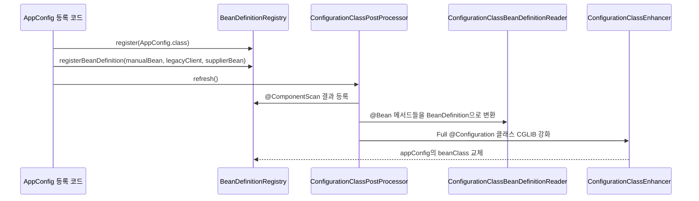

[GitHub 저장소](https://github.com/polynomeer/spring-internals-lab)

## 이번 글의 질문

Spring에서 빈을 등록하는 경로는 하나가 아니다.

- `@Component` 스캔
- `@Configuration`의 `@Bean`
- `registerBeanDefinition()` 직접 등록
- 정적 팩토리 메서드
- `Supplier` 기반 등록

겉으로 보기에는 결국 모두 "빈 하나 등록"처럼 보인다. 하지만 컨테이너 내부에서는 이들이 같은 모양으로 저장되지 않는다. 이번 글의 핵심 질문은 이것이다.

> 등록 경로가 다르면 `BeanDefinition` 메타데이터는 어떻게 달라지는가?

이 질문이 중요한 이유는 Spring이 빈 인스턴스를 바로 저장하는 컨테이너가 아니라, 먼저 "어떻게 만들 것인가"를 메타데이터로 저장하는 컨테이너이기 때문이다.

## `BeanDefinition`은 객체가 아니라 생성 계획이다

`BeanDefinition`은 실제 빈이 아니다. 빈을 만들기 위한 계획서에 가깝다.

보통 여기에는 다음 정보가 들어간다.

- 어떤 클래스를 기반으로 만들지
- scope가 singleton인지 prototype인지
- 팩토리 메서드로 만들지
- 어느 factory bean을 통해 만들지
- lazy 초기화인지
- 이 빈이 애플리케이션 빈인지 인프라 빈인지

즉, `BeanDefinition`은 "객체"보다 "생성 전략"에 더 가깝다.

아래 표로 보면 감이 더 분명하다.

| 질문 | `BeanDefinition`이 들고 있는 정보 |
| --- | --- |
| 무엇을 만들 것인가 | `beanClassName` |
| 누가 만들 것인가 | `factoryBeanName` |
| 어떤 메서드로 만들 것인가 | `factoryMethodName` |
| 미리 객체를 공급할 수 있는가 | `instanceSupplier` |
| 언제 만들 것인가 | `lazyInit`, scope |
| 어떤 종류의 빈인가 | `role` |

그래서 Spring은 `getBean()`을 호출하기 전에도 이미 많은 정보를 알고 있다. 아직 객체는 없어도, 그 객체를 만드는 규칙은 알고 있다.

## 이번 글에서 사용하는 실험 코드

`spring-internals-lab`의 `experiments/bean-definition-inspector` 모듈은 바로 이 메타데이터 차이를 관찰하기 위한 실험이다.

핵심 코드는 다음과 같다.

```java
AnnotationConfigApplicationContext context = new AnnotationConfigApplicationContext();

context.register(AppConfig.class);

context.registerBeanDefinition("manualBean", new RootBeanDefinition(ManualBean.class));

RootBeanDefinition legacyClientDefinition = new RootBeanDefinition(LegacyClient.class);
legacyClientDefinition.setFactoryMethodName("create");
context.registerBeanDefinition("legacyClient", legacyClientDefinition);

context.registerBeanDefinition("supplierBean",
        BeanDefinitionBuilder.genericBeanDefinition(SupplierBean.class, SupplierBean::new)
                .getBeanDefinition());

context.refresh();
```

이 짧은 코드 안에 등록 경로가 다섯 가지나 들어 있다.

- `AppConfig.class` 등록
- `@ComponentScan`으로 잡히는 컴포넌트
- `@Bean` 메서드
- 직접 등록한 `RootBeanDefinition`
- 정적 팩토리 메서드
- `Supplier` 기반 등록

이 상태에서 컨텍스트의 `BeanDefinition`만 읽어 보면, 같은 "빈 등록"이라도 내부 모양이 다르다는 사실이 드러난다.

## 실험을 보는 도구

이 모듈의 `BeanDefinitionInspector`는 `ConfigurableListableBeanFactory`에서 메타데이터만 읽는다.

```java
for (String beanName : beanFactory.getBeanDefinitionNames()) {
    BeanDefinition definition = beanFactory.getBeanDefinition(beanName);

    boolean hasInstanceSupplier = definition instanceof AbstractBeanDefinition abd
            && abd.getInstanceSupplier() != null;
}
```

중요한 점은 여기서 **어떤 빈도 인스턴스화하지 않는다**는 것이다. `getBean()`을 호출하지 않고 `getBeanDefinition()`만 읽는다. 즉 이번 글은 "실행된 객체"가 아니라 "실행 전에 준비된 생성 메타데이터"를 보는 글이다.

## 큰 흐름부터 보면 이렇다



핵심은 `refresh()` 이전과 이후에 등록 경로가 다르게 흘러간다는 점이다.

- 직접 등록한 `manualBean`, `legacyClient`, `supplierBean`은 이미 registry에 들어가 있다.
- `@Component`와 `@Bean`은 `ConfigurationClassPostProcessor`가 `refresh()` 과정에서 해석해서 추가 등록한다.
- `@Configuration` 클래스 자체도 `refresh()` 중간에 CGLIB 서브클래스로 치환될 수 있다.

즉, Spring의 등록 단계는 단순 `put(name, beanDefinition)` 한 번으로 끝나지 않는다.

## 실제 관찰 결과

실험 결과를 요약하면 아래 표와 같다.

| beanName | 등록 방식 | `beanClass` | `factoryBean` | `factoryMethod` | `instanceSupplier` | `role` |
| --- | --- | --- | --- | --- | --- | --- |
| `notificationService` | `@Component` | `NotificationService` | 없음 | 없음 | false | APPLICATION |
| `paymentService` | `@Bean` instance 메서드 | `null` | `appConfig` | `paymentService` | false | APPLICATION |
| `manualBean` | 직접 등록 | `ManualBean` | 없음 | 없음 | false | APPLICATION |
| `legacyClient` | 정적 팩토리 메서드 | `LegacyClient` | 없음 | `create` | false | APPLICATION |
| `supplierBean` | `Supplier` | `SupplierBean` | 없음 | 없음 | true | APPLICATION |
| `appConfig` | `@Configuration` | `AppConfig$$SpringCGLIB$$...` | 없음 | 없음 | false | APPLICATION |

이 표에서 특히 중요한 건 세 가지다.

1. `@Bean` instance 메서드는 `beanClass`가 비어 있을 수 있다.
2. `@Configuration` 클래스의 `beanClass`는 원본이 아니라 강화된 CGLIB 서브클래스로 바뀔 수 있다.
3. `Supplier` 기반 등록은 팩토리 메서드 없이도 별도 생성 전략을 담을 수 있다.

## 왜 `@Bean`은 `beanClass`가 `null`일 수 있는가

가장 먼저 걸리는 부분은 `paymentService`다. 빈은 분명 존재하는데 `beanClass`가 비어 있다.

처음 보면 이상하다. 하지만 `@Bean` instance 메서드는 구조상 이렇게 표현하는 편이 더 정확하다.

```java
if (metadata.isStatic()) {
    beanDef.setBeanClass(sam.getIntrospectedClass());
    beanDef.setUniqueFactoryMethodName(methodName);
}
else {
    beanDef.setFactoryBeanName(configClass.getBeanName());
    beanDef.setUniqueFactoryMethodName(methodName);
}
```

instance `@Bean` 메서드는 "어떤 클래스의 객체를 직접 new 한다"보다 "어떤 설정 객체의 어떤 메서드를 호출해서 만든다"가 핵심이다. 그래서 Spring은 `beanClass`를 억지로 확정하기보다 다음 두 정보만 남긴다.

- `factoryBeanName=appConfig`
- `factoryMethodName=paymentService`

즉 이 빈의 정체는 "paymentService 타입의 객체"가 아니라, 더 정확히는 "`appConfig.paymentService()` 호출 결과로 만들어지는 객체"다.

## 정적 팩토리 메서드는 왜 다르게 보이는가

`legacyClient`는 정적 팩토리 메서드 기반이다.

```java
RootBeanDefinition legacyClientDefinition = new RootBeanDefinition(LegacyClient.class);
legacyClientDefinition.setFactoryMethodName("create");
```

이 경우에는 `factoryBeanName`이 없다. 이유는 간단하다. 정적 메서드는 인스턴스가 필요 없기 때문이다.

즉 다음 두 경우는 모양이 매우 비슷하다.

- 정적 팩토리 메서드 기반 빈
- `static @Bean` 메서드

둘 다 "어떤 객체를 통해 호출할지"가 아니라 "어느 클래스의 어떤 메서드를 호출할지"가 핵심이다. 그래서 `beanClass`와 `factoryMethodName`만으로도 생성 전략을 표현할 수 있다.

이 차이를 정리하면 아래와 같다.

| 방식 | `beanClass` | `factoryBeanName` | `factoryMethodName` |
| --- | --- | --- | --- |
| `@Bean` instance 메서드 | 대개 비어 있음 | 있음 | 있음 |
| 정적 팩토리 메서드 | 있음 | 없음 | 있음 |
| `static @Bean` 메서드 | 있음 | 없음 | 있음 |

즉 "`@Bean`이면 다 똑같다"가 아니라, **instance냐 static이냐에 따라 `BeanDefinition` 모양이 갈린다**고 봐야 한다.

## `Supplier` 기반 등록은 무엇을 보여주는가

`Supplier` 방식은 아예 "생성 함수"를 메타데이터에 심어 두는 경우다.

```java
context.registerBeanDefinition("supplierBean",
        BeanDefinitionBuilder.genericBeanDefinition(SupplierBean.class, SupplierBean::new)
                .getBeanDefinition());
```

이 경우 Spring은 factory method 이름 없이도 객체 생성 전략을 저장할 수 있다. 즉 `BeanDefinition`은 "클래스 + 메서드 이름" 조합만 담는 단순 구조가 아니다. 필요하면 **실제 인스턴스 공급 함수**도 들고 있을 수 있다.

이 지점이 중요한 이유는 Spring이 생각보다 유연한 등록 모델을 갖고 있다는 사실을 보여주기 때문이다.

- 컴포넌트 스캔
- 설정 클래스
- 프로그래밍 방식 등록
- 공급 함수 기반 등록

이 네 가지가 모두 최종적으로는 `BeanDefinition`이라는 같은 축으로 모인다.

## `@Configuration` 클래스가 왜 CGLIB 클래스로 바뀌는가

이번 실험에서 가장 중요한 관찰은 `appConfig`의 `beanClass`가 원본 `AppConfig`가 아니라 `AppConfig$$SpringCGLIB$$...`로 바뀌어 있다는 점이다.

이건 인스턴스가 생성된 뒤에 프록시가 씌워진 게 아니다. `BeanDefinition` 단계에서 아예 `beanClass` 자체가 교체된다.


왜 이렇게 하느냐는 질문이 중요하다.

`@Configuration(proxyBeanMethods=true)`의 목적은 설정 클래스 내부에서 `@Bean` 메서드끼리 호출하더라도 매번 새 객체를 만들지 않고, 컨테이너가 관리하는 싱글턴을 돌려주게 하는 것이다.

예를 들어 이런 상황이다.

```java
@Configuration
class AppConfig {
    @Bean
    PaymentService paymentService() {
        return new PaymentService(notificationService());
    }

    @Bean
    NotificationService notificationService() {
        return new NotificationService();
    }
}
```

원본 클래스 그대로라면 `paymentService()` 안에서 `notificationService()`를 직접 호출할 때 plain Java method call이 발생한다. 그러면 컨테이너를 통하지 않고 새 객체가 만들어질 수 있다.

그래서 Spring은 `AppConfig` 자체를 서브클래스로 바꿔서 `notificationService()` 호출을 가로채고, 이미 등록된 싱글턴이 있으면 그 객체를 돌려준다.

핵심은 이 메커니즘이 **인스턴스 생성 이후 장식이 아니라, 인스턴스화 대상 클래스 자체를 바꾸는 작업**이라는 점이다.

## 인프라 빈도 `BeanDefinition`으로 등록된다

실험 테스트는 애플리케이션 빈만 보지 않는다. 내부 인프라 빈도 함께 본다.

예를 들어 다음과 같은 빈들이 등록된다.

- `internalConfigurationAnnotationProcessor`
- `internalAutowiredAnnotationProcessor`
- `internalEventListenerProcessor`
- `internalEventListenerFactory`

이들의 `role`은 `ROLE_INFRASTRUCTURE`다.

즉 Spring 내부 확장 포인트조차 컨테이너 밖에 있는 마법이 아니라, 결국 registry 안에 들어간 `BeanDefinition`으로 관리된다.

이 관찰은 중요하다. 왜냐하면 Spring을 "애플리케이션 빈 + 보이지 않는 프레임워크 로직"으로 나누기보다, **프레임워크 자신도 일부를 빈으로 등록해 동작한다**고 이해하게 만들기 때문이다.

## mini-spring의 `BeanDefinition`은 어디까지 줄여 놓았는가

`spring-internals-lab`은 같은 주제를 `mini-spring/mini-container`에서도 다룬다. 이쪽 `BeanDefinition`은 훨씬 작다.

```java
public record BeanDefinition(
        Class<?> beanClass,
        Scope scope,
        String factoryBeanName,
        String factoryMethodName,
        boolean primary
) {
    public boolean hasFactoryMethod() {
        return factoryMethodName != null;
    }
}
```

이 축소 구현이 보여주는 포인트는 분명하다.

- 최소한 `beanClass`와 scope는 필요하다.
- 팩토리 메서드 기반 생성까지 가려면 `factoryBeanName`과 `factoryMethodName`이 필요하다.
- 타입 기반 조회 충돌을 다루려면 `primary` 같은 선택 규칙이 필요하다.

반대로 실제 Spring과 비교하면 아직 빠진 것도 있다.

| 실제 Spring | mini-spring 상태 |
| --- | --- |
| `instanceSupplier` 지원 | 없음 |
| `role` 구분 | 없음 |
| lazy init | 없음 |
| 다양한 BeanDefinition 구현체 | 단일 record 형태 |
| parent/child definition | 없음 |

즉 `mini-spring`은 `BeanDefinition`의 모든 기능을 복제하려는 것이 아니라, 생성 전략을 설명하는 데 필요한 핵심 축만 남긴 상태다.

## `SimpleBeanFactory`를 보면 메타데이터가 실제 생성으로 이어지는 방식이 보인다

`mini-container`의 `SimpleBeanFactory`는 `BeanDefinition`을 이렇게 사용한다.

```java
public Object getBean(String name) {
    Object singleton = singletonObjects.get(name);
    if (singleton != null) {
        return singleton;
    }

    BeanDefinition definition = beanDefinitionMap.get(name);
    if (definition.scope() == Scope.PROTOTYPE) {
        return createBean(name, definition);
    }

    Object created = createBean(name, definition);
    singletonObjects.put(name, created);
    return created;
}
```

그리고 생성 시점에는 `BeanDefinition`을 보고 분기한다.

```java
private Object instantiate(String name, BeanDefinition definition) {
    if (definition.hasFactoryMethod()) {
        return instantiateViaFactoryMethod(name, definition);
    }

    Constructor<?> constructor = selectConstructor(name, definition.beanClass());
    Object[] arguments = resolveArguments(constructor);
    return constructor.newInstance(arguments);
}
```

이 코드는 Spring 내부 구조를 아주 직접적으로 보여준다.

- registry에는 metadata가 있고
- runtime에는 singleton cache가 있고
- `getBean()`은 먼저 cache를 보고
- 없으면 metadata를 읽어 생성 전략을 결정한다

즉 컨테이너는 `Map<String, Object>`만 있는 구조가 아니다. 그 앞단에 반드시 `Map<String, BeanDefinition>`이 있어야 한다.

## 왜 이 단계가 중요한가

`BeanDefinition`을 이해하지 못하면 이후 주제들도 전부 흐릿해진다.

- `refresh()`가 왜 "객체 생성"이 아니라 "메타데이터 후처리 + 객체 생성"인지
- `BeanFactoryPostProcessor`가 왜 인스턴스가 아니라 정의를 건드리는지
- `@Configuration` 강화가 왜 등록 단계에서 벌어지는지
- 자동 설정이 왜 결국 BeanDefinition 후보를 더 넣는 문제인지

이 모든 주제가 결국 등록 단계와 연결된다.

그래서 `BeanDefinition`은 Spring 초반부 개념이 아니라, 끝까지 반복해서 등장하는 기반 구조라고 보는 편이 맞다.

## 정리

이번 글에서 확인한 핵심은 네 가지다.

1. Spring은 빈 객체보다 먼저 생성 메타데이터를 저장한다.
2. 등록 경로가 다르면 `BeanDefinition` 모양도 달라진다.
3. `@Bean` instance 메서드, static 메서드, 정적 팩토리 메서드는 서로 다른 생성 전략으로 표현된다.
4. `@Configuration` 클래스 강화 같은 중요한 작업도 인스턴스 단계가 아니라 `BeanDefinition` 단계에서 이미 시작된다.

결국 `BeanDefinition`은 "부가 정보"가 아니다. Spring 컨테이너가 객체를 만들기 전에 이미 알고 있어야 하는 규칙의 집합이다.

다음 글에서는 이 메타데이터가 `refresh()` 과정에서 실제 빈 생성 파이프라인으로 어떻게 연결되는지, 그리고 왜 `BeanFactoryPostProcessor`와 `BeanPostProcessor`가 서로 다른 단계에서 개입하는지 이어서 보겠다.
