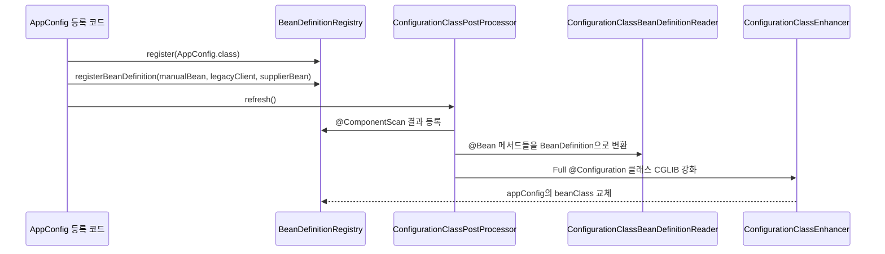

[GitHub 저장소](https://github.com/polynomeer/spring-lab)

## 이번 글의 질문

Spring에서 빈을 등록하는 경로는 하나가 아니다.

- `@Component` 스캔
- `@Configuration`의 `@Bean`
- `registerBeanDefinition()` 직접 등록
- 정적 팩토리 메서드
- `Supplier` 기반 등록

겉으로 보기에는 결국 모두 "빈 하나 등록"처럼 보인다. 하지만 컨테이너 내부에서는 이들이 같은 모양으로 저장되지 않는다. 그래서 이번 글은 다음 질문에서 출발한다.

> 등록 경로가 다르면 `BeanDefinition` 메타데이터는 어떻게 달라지는가?

[IoC 컨테이너](/posts/ioc-di/)로서 Spring은 빈 인스턴스를 바로 저장하지 않는다. 먼저 "어떻게 만들 것인가"를 메타데이터로 저장한다. 등록 경로의 차이는 바로 이 메타데이터에 남는다.

## `BeanDefinition`은 객체가 아니라 생성 계획이다

`BeanDefinition`은 실제 빈이 아니다. 빈을 만들기 위한 계획서에 가깝다. [Javadoc](https://docs.spring.io/spring-framework/docs/current/javadoc-api/org/springframework/beans/factory/config/BeanDefinition.html)도 이 인터페이스를 "A BeanDefinition describes a bean instance, which has property values, constructor argument values, and further information supplied by concrete implementations."라고 설명한다(빈 인스턴스를 기술하는 정보이며, 프로퍼티 값과 생성자 인자 값, 구현체가 덧붙이는 정보를 담는다). 같은 문서는 이 인터페이스의 주된 목적이 `BeanFactoryPostProcessor`가 프로퍼티 값과 메타데이터를 들여다보고 수정할 수 있게 하는 것이라고 적는다.

보통 여기에는 다음 정보가 들어간다.

- 어떤 클래스를 기반으로 만들지
- scope가 singleton인지 prototype인지
- 팩토리 메서드로 만들지
- 어느 factory bean을 통해 만들지
- lazy 초기화인지
- 이 빈이 애플리케이션 빈인지 인프라 빈인지

각 정보가 답하는 질문으로 바꿔 보면 아래와 같다.

| 질문 | `BeanDefinition`이 들고 있는 정보 |
| --- | --- |
| 무엇을 만들 것인가 | `beanClassName` |
| 누가 만들 것인가 | `factoryBeanName` |
| 어떤 메서드로 만들 것인가 | `factoryMethodName` |
| 미리 객체를 공급할 수 있는가 | `instanceSupplier` |
| 언제 만들 것인가 | `lazyInit`, scope |
| 어떤 종류의 빈인가 | `role` |

그래서 Spring은 `getBean()`을 호출하기 전에도 이미 많은 정보를 알고 있다. 아직 객체는 없어도, 그 객체를 만드는 규칙은 알고 있다.

## 이번 글에서 사용하는 실험 코드

`spring-internals-lab`의 `experiments/bean-definition-inspector` 모듈은 바로 이 메타데이터 차이를 관찰하기 위한 실험이다.

핵심 코드는 다음과 같다.

```java
AnnotationConfigApplicationContext context = new AnnotationConfigApplicationContext();

context.register(AppConfig.class);

context.registerBeanDefinition("manualBean", new RootBeanDefinition(ManualBean.class));

RootBeanDefinition legacyClientDefinition = new RootBeanDefinition(LegacyClient.class);
legacyClientDefinition.setFactoryMethodName("create");
context.registerBeanDefinition("legacyClient", legacyClientDefinition);

context.registerBeanDefinition("supplierBean",
        BeanDefinitionBuilder.genericBeanDefinition(SupplierBean.class, SupplierBean::new)
                .getBeanDefinition());

context.refresh();
```

이 짧은 코드 안에 등록 경로가 다섯 가지나 들어 있다.

- `AppConfig.class` 등록
- `@ComponentScan`으로 잡히는 컴포넌트
- `@Bean` 메서드
- 직접 등록한 `RootBeanDefinition`
- 정적 팩토리 메서드
- `Supplier` 기반 등록

이 상태에서 컨텍스트의 `BeanDefinition`만 읽어 보면, 같은 "빈 등록"이라도 내부 모양이 다르다는 사실이 드러난다.

## 실험을 보는 도구

이 모듈의 `BeanDefinitionInspector`는 `ConfigurableListableBeanFactory`에서 메타데이터만 읽는다.

```java
for (String beanName : beanFactory.getBeanDefinitionNames()) {
    BeanDefinition definition = beanFactory.getBeanDefinition(beanName);

    boolean hasInstanceSupplier = definition instanceof AbstractBeanDefinition abd
            && abd.getInstanceSupplier() != null;
}
```

이 도구는 어떤 빈도 인스턴스화하지 않는다. `getBean()`을 호출하지 않고 `getBeanDefinition()`만 읽는다. 그래서 아래 결과는 생성된 객체가 아니라 생성 전에 준비된 메타데이터를 보여 준다.

## 등록 경로별 처리 시점


```mermaid
sequenceDiagram
    participant App as AppConfig 등록 코드
    participant Registry as BeanDefinitionRegistry
    participant CCPP as ConfigurationClassPostProcessor
    participant Reader as ConfigurationClassBeanDefinitionReader
    participant Enhancer as ConfigurationClassEnhancer

    App->>Registry: register(AppConfig.class)
    App->>Registry: registerBeanDefinition(manualBean, legacyClient, supplierBean)
    App->>CCPP: refresh()
    CCPP->>Registry: @ComponentScan 결과 등록
    CCPP->>Reader: @Bean 메서드들을 BeanDefinition으로 변환
    CCPP->>Enhancer: Full @Configuration 클래스 CGLIB 강화
    Enhancer-->>Registry: appConfig의 beanClass 교체
```

다이어그램에서 보듯 등록 경로마다 registry에 들어가는 시점이 다르다.

- 직접 등록한 `manualBean`, `legacyClient`, `supplierBean`은 `refresh()` 전에 이미 registry(`BeanDefinition`을 이름으로 보관하는 저장소)에 들어가 있다.
- `@Component`와 `@Bean`은 `ConfigurationClassPostProcessor`가 [`refresh()`](/posts/spring-internals-lab-refresh/) 과정에서 해석해서 추가 등록한다.
- `@Configuration` 클래스 자체도 `refresh()` 중간에 CGLIB 서브클래스(런타임에 생성한 하위 클래스)로 치환될 수 있다.

그래서 Spring의 등록 단계는 `put(name, beanDefinition)` 한 번으로 끝나지 않는다.

## 실제 관찰 결과

실험 결과를 요약하면 아래 표와 같다.

| beanName | 등록 방식 | `beanClass` | `factoryBean` | `factoryMethod` | `instanceSupplier` | `role` |
| --- | --- | --- | --- | --- | --- | --- |
| `notificationService` | `@Component` | `NotificationService` | 없음 | 없음 | false | APPLICATION |
| `paymentService` | `@Bean` instance 메서드 | `null` | `appConfig` | `paymentService` | false | APPLICATION |
| `manualBean` | 직접 등록 | `ManualBean` | 없음 | 없음 | false | APPLICATION |
| `legacyClient` | 정적 팩토리 메서드 | `LegacyClient` | 없음 | `create` | false | APPLICATION |
| `supplierBean` | `Supplier` | `SupplierBean` | 없음 | 없음 | true | APPLICATION |
| `appConfig` | `@Configuration` | `AppConfig$$SpringCGLIB$$...` | 없음 | 없음 | false | APPLICATION |

표에서 다른 행과 모양이 갈리는 곳은 세 군데다.

1. `@Bean` instance 메서드는 `beanClass`가 비어 있을 수 있다.
2. `@Configuration` 클래스의 `beanClass`는 원본이 아니라 강화된 CGLIB 서브클래스로 바뀔 수 있다.
3. `Supplier` 기반 등록은 팩토리 메서드 없이도 별도 생성 전략을 담을 수 있다.

## 왜 `@Bean`은 `beanClass`가 `null`일 수 있는가

가장 먼저 걸리는 부분은 `paymentService`다. 빈은 분명 존재하는데 `beanClass`가 비어 있다.

이유는 `@Bean` 메서드를 `BeanDefinition`으로 바꾸는 `ConfigurationClassBeanDefinitionReader`에 있다. 아래는 그 분기를 줄여 옮긴 것이다([v6.2.0 소스](https://github.com/spring-projects/spring-framework/blob/v6.2.0/spring-context/src/main/java/org/springframework/context/annotation/ConfigurationClassBeanDefinitionReader.java#L217-L231)).

```java
if (metadata.isStatic()) {
    beanDef.setBeanClass(sam.getIntrospectedClass());
    beanDef.setUniqueFactoryMethodName(methodName);
}
else {
    beanDef.setFactoryBeanName(configClass.getBeanName());
    beanDef.setUniqueFactoryMethodName(methodName);
}
```

static 메서드는 설정 클래스 자체를 `beanClass`로 기록한다. instance 메서드는 `beanClass`를 설정하지 않고 설정 빈의 이름만 기록한다. instance `@Bean` 메서드로 객체를 만들려면 어떤 클래스를 new 할지보다 어느 설정 객체의 어느 메서드를 호출할지를 알아야 하기 때문이다. 그래서 `paymentService`에는 다음 두 정보만 남는다.

- `factoryBeanName=appConfig`
- `factoryMethodName=paymentService`

컨테이너 입장에서 이 빈은 `appConfig.paymentService()`를 호출한 결과로 만들어지는 객체다.

## 정적 팩토리 메서드는 왜 다르게 보이는가

`legacyClient`는 정적 팩토리 메서드 기반이다.

```java
RootBeanDefinition legacyClientDefinition = new RootBeanDefinition(LegacyClient.class);
legacyClientDefinition.setFactoryMethodName("create");
```

이 경우에는 `factoryBeanName`이 없다. 정적 메서드는 호출할 인스턴스가 필요 없기 때문이다.

그래서 다음 두 경우는 모양이 매우 비슷하다.

- 정적 팩토리 메서드 기반 빈
- `static @Bean` 메서드

둘 다 "어떤 객체를 통해 호출할지"가 아니라 "어느 클래스의 어떤 메서드를 호출할지"가 핵심이다. 그래서 `beanClass`와 `factoryMethodName`만으로도 생성 전략을 표현할 수 있다.

세 방식을 나란히 놓으면 아래와 같다.

| 방식 | `beanClass` | `factoryBeanName` | `factoryMethodName` |
| --- | --- | --- | --- |
| `@Bean` instance 메서드 | 대개 비어 있음 | 있음 | 있음 |
| 정적 팩토리 메서드 | 있음 | 없음 | 있음 |
| `static @Bean` 메서드 | 있음 | 없음 | 있음 |

같은 `@Bean`이라도 메서드가 instance인지 static인지에 따라 `BeanDefinition` 모양이 갈린다.

## `Supplier` 기반 등록은 무엇을 보여주는가

`Supplier` 방식은 아예 "생성 함수"를 메타데이터에 심어 두는 경우다.

```java
context.registerBeanDefinition("supplierBean",
        BeanDefinitionBuilder.genericBeanDefinition(SupplierBean.class, SupplierBean::new)
                .getBeanDefinition());
```

이 경우 Spring은 factory method 이름 없이도 객체 생성 전략을 저장할 수 있다. `BeanDefinition`은 "클래스 + 메서드 이름" 조합만 담는 구조가 아니고, 필요하면 인스턴스 공급 함수 자체도 들고 있다.

이 덕분에 등록 방식이 여러 갈래여도 저장 형식은 하나로 모인다.

- 컴포넌트 스캔
- 설정 클래스
- 프로그래밍 방식 등록
- 공급 함수 기반 등록

이 네 가지가 모두 최종적으로는 `BeanDefinition`이라는 같은 축으로 모인다.

## `@Configuration` 클래스가 왜 CGLIB 클래스로 바뀌는가

이번 실험에서 가장 눈에 띄는 관찰은 `appConfig`의 `beanClass`가 원본 `AppConfig`가 아니라 `AppConfig$$SpringCGLIB$$...`로 바뀌어 있다는 점이다.

인스턴스가 생성된 뒤에 [프록시](/posts/proxy-limits/)가 씌워진 것이 아니다. `BeanDefinition` 단계에서 아예 `beanClass` 자체가 교체된다.


```mermaid
flowchart LR
    A["AppConfig BeanDefinition 등록"] --> B["ConfigurationClassPostProcessor 처리"]
    B --> C["@Bean 메서드 분석"]
    C --> D["enhanceConfigurationClasses()"]
    D --> E["AppConfig$$SpringCGLIB$$... 로 beanClass 교체"]
    E --> F["이후 일반 Bean 생성 파이프라인 사용"]
```

클래스를 바꾸는 이유는 `@Configuration(proxyBeanMethods=true)`에 있다. 이 설정의 목적은 설정 클래스 내부에서 `@Bean` 메서드끼리 호출하더라도 매번 새 객체를 만들지 않고, 컨테이너가 관리하는 싱글턴을 돌려주게 하는 것이다. [`@Configuration` Javadoc](https://docs.spring.io/spring-framework/docs/current/javadoc-api/org/springframework/context/annotation/Configuration.html#proxyBeanMethods%28%29)은 이 기능이 메서드 가로채기를 필요로 하고, 그것을 런타임에 생성한 CGLIB 서브클래스로 구현한다고 적는다. 기본값은 `true`이고, `false`로 두면 CGLIB 서브클래스 처리를 하지 않는다.

예를 들어 이런 상황이다.

```java
@Configuration
class AppConfig {
    @Bean
    PaymentService paymentService() {
        return new PaymentService(notificationService());
    }

    @Bean
    NotificationService notificationService() {
        return new NotificationService();
    }
}
```

원본 클래스 그대로라면 `paymentService()` 안에서 `notificationService()`를 호출할 때 평범한 Java 메서드 호출이 일어난다. 이 호출은 컨테이너를 거치지 않으므로 새 객체가 만들어질 수 있다.

그래서 Spring은 `AppConfig` 자체를 서브클래스로 바꿔서 `notificationService()` 호출을 가로채고, 이미 등록된 싱글턴이 있으면 그 객체를 돌려준다. 이 작업은 만들어진 인스턴스를 감싸는 것이 아니라, 인스턴스화할 클래스 자체를 바꾸는 것이다.

## 인프라 빈도 `BeanDefinition`으로 등록된다

실험 테스트는 애플리케이션 빈만 보지 않는다. 내부 인프라 빈도 함께 본다.

예를 들어 다음과 같은 빈들이 등록된다.

- `internalConfigurationAnnotationProcessor`
- `internalAutowiredAnnotationProcessor`
- `internalEventListenerProcessor`
- `internalEventListenerFactory`

이들의 `role`은 `ROLE_INFRASTRUCTURE`다. [Javadoc](https://docs.spring.io/spring-framework/docs/current/javadoc-api/org/springframework/beans/factory/config/BeanDefinition.html#ROLE_INFRASTRUCTURE)은 이 값을 내부 동작에만 쓰이고 사용자와는 관계없는 빈을 표시하는 힌트로 설명한다.

Spring 내부 확장 포인트도 컨테이너 밖에서 따로 돌지 않고, registry 안의 `BeanDefinition`으로 관리된다. 그래서 Spring은 "애플리케이션 빈 + 보이지 않는 프레임워크 로직"으로 나뉘어 있다기보다, 프레임워크 자신도 일부를 빈으로 등록해 동작한다고 보는 편이 실제 구조에 맞다.

## mini-spring의 `BeanDefinition`은 어디까지 줄여 놓았는가

`spring-internals-lab`은 같은 주제를 `mini-spring/mini-container`에서도 다룬다. 이쪽 `BeanDefinition`은 훨씬 작다.

```java
public record BeanDefinition(
        Class<?> beanClass,
        Scope scope,
        String factoryBeanName,
        String factoryMethodName,
        boolean primary
) {
    public boolean hasFactoryMethod() {
        return factoryMethodName != null;
    }
}
```

이 축소 구현에서 필드마다 맡은 역할은 다음과 같다.

- 최소한 `beanClass`와 scope는 필요하다.
- 팩토리 메서드 기반 생성까지 가려면 `factoryBeanName`과 `factoryMethodName`이 필요하다.
- 타입 기반 조회 충돌을 다루려면 `primary` 같은 선택 규칙이 필요하다.

반대로 실제 Spring과 비교하면 아직 빠진 것도 있다.

| 실제 Spring | mini-spring 상태 |
| --- | --- |
| `instanceSupplier` 지원 | 없음 |
| `role` 구분 | 없음 |
| lazy init | 없음 |
| 다양한 BeanDefinition 구현체 | 단일 record 형태 |
| parent/child definition | 없음 |

`mini-spring`은 `BeanDefinition`의 모든 기능을 복제하려는 것이 아니라, 생성 전략을 설명하는 데 필요한 핵심 축만 남긴 상태다.

## `SimpleBeanFactory`를 보면 메타데이터가 실제 생성으로 이어지는 방식이 보인다

`mini-container`의 `SimpleBeanFactory`는 `BeanDefinition`을 이렇게 사용한다.

```java
public Object getBean(String name) {
    Object singleton = singletonObjects.get(name);
    if (singleton != null) {
        return singleton;
    }

    BeanDefinition definition = beanDefinitionMap.get(name);
    if (definition.scope() == Scope.PROTOTYPE) {
        return createBean(name, definition);
    }

    Object created = createBean(name, definition);
    singletonObjects.put(name, created);
    return created;
}
```

그리고 생성 시점에는 `BeanDefinition`을 보고 분기한다.

```java
private Object instantiate(String name, BeanDefinition definition) {
    if (definition.hasFactoryMethod()) {
        return instantiateViaFactoryMethod(name, definition);
    }

    Constructor<?> constructor = selectConstructor(name, definition.beanClass());
    Object[] arguments = resolveArguments(constructor);
    return constructor.newInstance(arguments);
}
```

두 메서드를 이어 읽으면 컨테이너의 구조가 드러난다.

- registry에는 metadata가 있고
- runtime에는 singleton cache가 있고
- `getBean()`은 먼저 cache를 보고
- 없으면 metadata를 읽어 생성 전략을 결정한다

그래서 컨테이너는 `Map<String, Object>`만으로는 만들 수 없고, 그 앞단에 `Map<String, BeanDefinition>`이 있어야 한다.

## 이후 주제와 이어지는 지점

다음 질문들은 모두 `BeanDefinition`을 전제로 한다.

- `refresh()`가 왜 "객체 생성"이 아니라 "메타데이터 후처리 + 객체 생성"인지
- `BeanFactoryPostProcessor`가 왜 인스턴스가 아니라 정의를 건드리는지
- `@Configuration` 강화가 왜 등록 단계에서 벌어지는지
- 자동 설정이 왜 결국 BeanDefinition 후보를 더 넣는 문제인지

그래서 `BeanDefinition`은 Spring 초반부에 한 번 보고 지나가는 개념이 아니라, 이후 글에서도 계속 다시 등장한다.

## 정리

실험에서 확인한 답은 이렇다. 등록 경로가 다르면 `BeanDefinition`의 `beanClass`, `factoryBeanName`, `factoryMethodName`, `instanceSupplier` 조합이 달라진다. `@Bean` 메서드는 instance인지 static인지에 따라 모양이 갈리고, `@Configuration` 클래스는 인스턴스가 생기기 전에 `beanClass`부터 CGLIB 서브클래스로 바뀐다.

다음 글에서는 이 메타데이터가 `refresh()` 과정에서 실제 빈 생성 파이프라인으로 어떻게 연결되는지, 그리고 왜 `BeanFactoryPostProcessor`와 `BeanPostProcessor`가 서로 다른 단계에서 개입하는지 이어서 보겠다.

## 참고

- [`BeanDefinition` Javadoc](https://docs.spring.io/spring-framework/docs/current/javadoc-api/org/springframework/beans/factory/config/BeanDefinition.html) — Spring Framework API 문서
- [`@Configuration` Javadoc, `proxyBeanMethods`](https://docs.spring.io/spring-framework/docs/current/javadoc-api/org/springframework/context/annotation/Configuration.html#proxyBeanMethods%28%29) — Spring Framework API 문서
- [`ConfigurationClassBeanDefinitionReader` (v6.2.0)](https://github.com/spring-projects/spring-framework/blob/v6.2.0/spring-context/src/main/java/org/springframework/context/annotation/ConfigurationClassBeanDefinitionReader.java) — Spring Framework 소스
