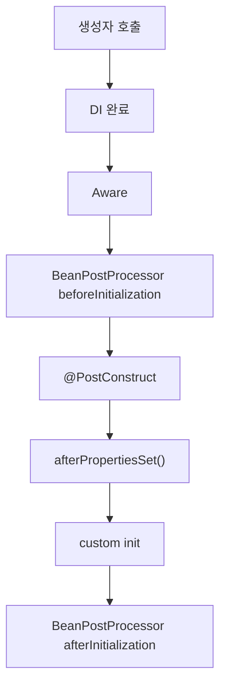

[GitHub 저장소](https://github.com/polynomeer/spring-internals-lab)

## Bean lifecycle은 한 줄로 끝나지 않는다

Spring에서 Bean 생명주기를 단순하게 설명하면 보통 이렇게 말한다.

1. 생성
2. 의존성 주입
3. 초기화
4. 사용
5. 소멸

이 설명은 틀리진 않지만 너무 평평하다. 실제로는 이 사이에 `Aware`, `BeanPostProcessor`, `@PostConstruct`, `InitializingBean`, custom init, `@PreDestroy`, `DisposableBean` 같은 훨씬 세밀한 계층이 있다.

이번 글의 질문은 단순하다.

> 빈 하나는 생성자 호출부터 소멸까지 어떤 순서로 콜백을 거치는가?

## 실험용 Bean은 콜백을 거의 다 붙여 둔다

`spring-internals-lab`의 `bean-lifecycle-recorder`는 이 질문을 아주 정직하게 다룬다.

```java
public class LifecycleTarget implements
        BeanNameAware, BeanFactoryAware, ApplicationContextAware, InitializingBean, DisposableBean {

    @PostConstruct
    public void postConstruct() { ... }

    @Override
    public void afterPropertiesSet() { ... }

    public void customInit() { ... }

    @PreDestroy
    public void preDestroy() { ... }

    @Override
    public void destroy() { ... }

    public void customDestroy() { ... }
}
```

여기에 `@Autowired` 세터와 커스텀 `BeanPostProcessor`, `InstantiationAwareBeanPostProcessor`, `SmartInitializingSingleton`까지 같이 걸어 둔다.

즉 생명주기에서 눈에 띄는 거의 모든 훅을 한 Bean에 몰아 넣고 실제 순서를 본다.

## 실제 관찰 순서

실험 결과는 다음과 같았다.

```text
InstantiationAwareBPP:beforeInstantiation
constructor
InstantiationAwareBPP:afterInstantiation
@Autowired
BeanNameAware
BeanFactoryAware
ApplicationContextAware
BPP:beforeInitialization
@PostConstruct
afterPropertiesSet
customInitMethod
BPP:afterInitialization
SmartInitializingSingleton:afterSingletonsInstantiated
event:ContextRefreshedEvent
--- close() ---
@PreDestroy
destroy
customDestroyMethod
```

이 순서를 한 번에 보면 Spring이 lifecycle을 얼마나 잘게 쪼개는지 보인다.

## `Aware`도 다 같은 `Aware`가 아니다

처음 보기엔 `BeanNameAware`, `BeanFactoryAware`, `ApplicationContextAware`가 같은 성격처럼 보인다. 실제로는 처리 위치가 다르다.

- `BeanNameAware`, `BeanClassLoaderAware`, `BeanFactoryAware`는 factory 내부 코드가 직접 호출한다.
- `ApplicationContextAware`는 `ApplicationContextAwareProcessor`라는 `BeanPostProcessor`가 처리한다.

즉 "Aware 콜백"이라는 표면상 묶음 아래에서도 계층 분리가 있다.

이 차이는 중요하다. `ApplicationContextAware`는 `BeanFactory`가 아니라 `ApplicationContext` 개념에 속하므로, 더 상위 계층의 후처리기로 처리하는 편이 구조적으로 맞다.

## `@PostConstruct`는 왜 `afterPropertiesSet()`보다 먼저일까

실험 결과만 보면 순서를 외우면 된다.

- `@PostConstruct`
- `afterPropertiesSet()`
- custom init method

하지만 더 중요한 건 이유다.

`@PostConstruct`는 `BeanPostProcessor` 계층에서 처리된다. 정확히는 `CommonAnnotationBeanPostProcessor`가 초기화 전 단계에서 실행한다.

반면 `afterPropertiesSet()`과 custom init method는 `invokeInitMethods()` 단계에서 호출된다.

즉 이건 "초기화 콜백끼리 우선순위가 있다"기보다, **서로 다른 계층에서 처리되기 때문에 순서가 그렇게 보이는 것**이다.



즉 `@PostConstruct`가 먼저인 이유는 "애노테이션이라서"가 아니라, 그 처리를 담당하는 컴포넌트가 lifecycle 파이프라인의 더 앞단에 있기 때문이다.

## 커스텀 `BeanPostProcessor`가 `@PostConstruct`보다 먼저 실행될 수도 있다

실험에서 가장 흥미로운 포인트가 이 부분이었다.

직관적으로는 Spring 내부의 `CommonAnnotationBeanPostProcessor`가 사용자가 만든 평범한 `BeanPostProcessor`보다 먼저 실행될 것 같지만, 실제 관찰은 반대였다.

이유는 등록 알고리즘 때문이다.

- `CommonAnnotationBeanPostProcessor`는 `PriorityOrdered`이기도 하다.
- 동시에 `MergedBeanDefinitionPostProcessor`이기도 하다.
- Spring은 이런 내부 후처리기를 마지막에 다시 등록하면서 목록 맨 뒤로 민다.

결과적으로 순서 없는 일반 커스텀 `BeanPostProcessor`가 앞쪽에 남고, `@PostConstruct` 처리기는 뒤로 밀린다.

이 사례가 중요한 이유는 "우선순위 인터페이스"만 보고 실제 실행 순서를 단정하면 틀릴 수 있다는 점을 보여주기 때문이다.

## `InstantiationAwareBeanPostProcessor`는 더 앞단에 있다

이름이 비슷해서 `BeanPostProcessor`와 같은 층처럼 보이지만, `InstantiationAwareBeanPostProcessor`는 훨씬 앞단까지 개입한다.

- 인스턴스화 전
- 인스턴스화 직후
- 프로퍼티 주입 전후

특히 before-instantiation에서 non-null을 반환하면, 일반적인 생성자 호출과 초기화 파이프라인 자체를 우회할 수 있다.

이건 나중에 AOP 프록시를 이해할 때 매우 중요하다. 프록시는 종종 "원본 객체를 만든 뒤 감싼다"보다 더 이른 지점에서 개입한다.

## 소멸 단계도 나름의 순서가 있다

close 시점 소멸 순서는 다음과 같았다.

1. `@PreDestroy`
2. `DisposableBean.destroy()`
3. custom destroy method

이 역시 우연이 아니다. `DisposableBeanAdapter`가 이 순서로 조율한다.

즉 Spring은 종료 훅도 제각각 호출하지 않고, 하나의 어댑터로 수렴시켜 순서를 보장한다.

## `SmartInitializingSingleton`은 개별 Bean 초기화와 다른 층이다

`SmartInitializingSingleton.afterSingletonsInstantiated()`는 앞의 콜백들과 성격이 다르다.

- 특정 Bean 하나의 초기화 훅이 아니다.
- 모든 singleton 선생성이 끝난 뒤 한 번 호출된다.

즉 이 인터페이스는 "이 Bean이 준비됐다"보다 "컨테이너 전체가 준비됐다"에 가깝다.

그래서 `ContextRefreshedEvent` 직전쯤 등장하는 것이 자연스럽다.

## mini-spring은 왜 아직 이 주제를 충분히 재현하지 않았는가

`mini-container`는 아직 lifecycle 파이프라인을 완전히 구현하지 않았다. 현재는 다음 정도만 있다.

- 인스턴스 생성
- 생성자 주입
- 단순 `BeanPostProcessor` 체인 일부

반대로 실제 Spring과 비교하면 아직 빠진 것이 많다.

- `Aware` 계층
- `InstantiationAwareBeanPostProcessor`
- `@PostConstruct`, `@PreDestroy`
- custom init/destroy
- `SmartInitializingSingleton`

이 차이가 보여주는 건, Bean lifecycle이 단순한 부가기능 모음이 아니라 **컨테이너 확장 포인트의 핵심 집합**이라는 점이다.

## 정리

이번 글에서 확인한 핵심은 네 가지다.

1. Bean lifecycle은 생성, 주입, 초기화, 소멸 사이에 훨씬 많은 계층이 있다.
2. `@PostConstruct`, `afterPropertiesSet()`, custom init은 서로 다른 처리 계층에서 나온다.
3. `BeanPostProcessor` 실행 순서는 이름만으로 추측하면 틀릴 수 있다.
4. 소멸 단계도 `DisposableBeanAdapter`를 통해 정해진 순서로 조율된다.

결국 Spring의 lifecycle은 "객체 생성 후 콜백 몇 개 호출"이 아니라, **확장 지점을 어디에 꽂을 것인지 세밀하게 쪼개 둔 파이프라인**이다.

다음 글에서는 이 확장 지점이 프록시와 AOP에 어떻게 이어지는지 본다.
