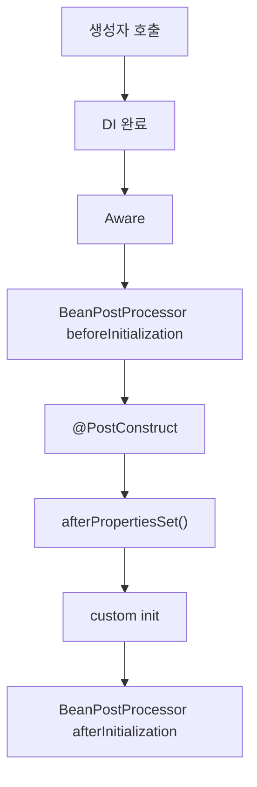

[GitHub 저장소](https://github.com/polynomeer/spring-lab)

## Bean lifecycle은 한 줄로 끝나지 않는다

Spring에서 [Bean 생명주기](/posts/spring-lifecycle/)를 단순하게 설명하면 보통 이렇게 말한다.

1. 생성
2. 의존성 주입
3. 초기화
4. 사용
5. 소멸

이 설명은 틀리진 않지만 너무 평평하다. 실제로는 이 사이에 `Aware`, `BeanPostProcessor`, `@PostConstruct`, `InitializingBean`, custom init, `@PreDestroy`, `DisposableBean` 같은 훨씬 세밀한 계층이 있다.

그래서 이번 글은 다음 질문을 실험으로 확인한다.

> 빈 하나는 생성자 호출부터 소멸까지 어떤 순서로 콜백을 거치는가?

## 실험용 Bean은 콜백을 거의 다 붙여 둔다

`spring-internals-lab`의 `bean-lifecycle-recorder`는 콜백마다 이름을 기록해 호출 순서를 남긴다.

```java
public class LifecycleTarget implements
        BeanNameAware, BeanFactoryAware, ApplicationContextAware, InitializingBean, DisposableBean {

    @PostConstruct
    public void postConstruct() { ... }

    @Override
    public void afterPropertiesSet() { ... }

    public void customInit() { ... }

    @PreDestroy
    public void preDestroy() { ... }

    @Override
    public void destroy() { ... }

    public void customDestroy() { ... }
}
```

여기에 `@Autowired` 세터와 커스텀 `BeanPostProcessor`, `InstantiationAwareBeanPostProcessor`, `SmartInitializingSingleton`까지 같이 걸어 둔다.

생명주기에서 눈에 띄는 거의 모든 훅을 한 Bean에 몰아 넣었기 때문에, 훅 사이의 상대 순서를 한 번의 실행으로 볼 수 있다.

## 실제 관찰 순서

실험 결과는 다음과 같았다.

```text
InstantiationAwareBPP:beforeInstantiation
constructor
InstantiationAwareBPP:afterInstantiation
@Autowired
BeanNameAware
BeanFactoryAware
ApplicationContextAware
BPP:beforeInitialization
@PostConstruct
afterPropertiesSet
customInitMethod
BPP:afterInitialization
SmartInitializingSingleton:afterSingletonsInstantiated
event:ContextRefreshedEvent
--- close() ---
@PreDestroy
destroy
customDestroyMethod
```

[`BeanFactory` Javadoc](https://docs.spring.io/spring-framework/docs/current/javadoc-api/org/springframework/beans/factory/BeanFactory.html)이 "The full set of initialization methods and their standard order"로 제시하는 목록(초기화 메서드 전체와 그 표준 순서)도 같은 순서다. 이 목록에 `@PostConstruct`는 따로 없다. 아래에서 보듯 `postProcessBeforeInitialization` 안에서 처리되기 때문이다.

## `Aware`도 다 같은 `Aware`가 아니다

처음 보기엔 `BeanNameAware`, `BeanFactoryAware`, `ApplicationContextAware`가 같은 성격처럼 보인다. 실제로는 처리 위치가 다르다.

- `BeanNameAware`, `BeanClassLoaderAware`, `BeanFactoryAware`는 factory 내부 코드(`AbstractAutowireCapableBeanFactory.invokeAwareMethods()`)가 직접 호출한다([v6.2.0 소스](https://github.com/spring-projects/spring-framework/blob/v6.2.0/spring-beans/src/main/java/org/springframework/beans/factory/support/AbstractAutowireCapableBeanFactory.java#L1811-L1826)).
- `ApplicationContextAware`는 `ApplicationContextAwareProcessor`라는 `BeanPostProcessor`가 처리한다.

`BeanFactory` Javadoc도 `ApplicationContextAware`에는 application context에서 실행될 때만 적용된다는 단서를 붙인다. 같은 "Aware 콜백"이라도 처리 계층이 나뉘어 있다. `ApplicationContextAware`는 `BeanFactory`가 아니라 `ApplicationContext` 개념에 속하므로, 더 상위 계층의 후처리기로 처리하는 편이 구조적으로 맞다고 본다.

## `@PostConstruct`는 왜 `afterPropertiesSet()`보다 먼저일까

실험 결과의 초기화 순서는 다음과 같다.

- `@PostConstruct`
- `afterPropertiesSet()`
- custom init method

이 순서는 처리 위치에서 나온다. `@PostConstruct`는 `BeanPostProcessor` 계층에서 처리된다. 정확히는 `CommonAnnotationBeanPostProcessor`가 초기화 전 단계(`postProcessBeforeInitialization`)에서 실행한다.

반면 `afterPropertiesSet()`과 custom init method는 `invokeInitMethods()` 단계에서 호출된다. `initializeBean()`은 Aware 호출, `applyBeanPostProcessorsBeforeInitialization()`, `invokeInitMethods()`, `applyBeanPostProcessorsAfterInitialization()`를 이 순서로 부른다([v6.2.0 소스](https://github.com/spring-projects/spring-framework/blob/v6.2.0/spring-beans/src/main/java/org/springframework/beans/factory/support/AbstractAutowireCapableBeanFactory.java#L1789-L1808)).

그래서 초기화 콜백끼리 우선순위가 매겨져 있다기보다, 서로 다른 계층에서 처리되기 때문에 이 순서가 나온다.


```mermaid
flowchart TD
    A["생성자 호출"] --> B["DI 완료"]
    B --> C["Aware"]
    C --> D["BeanPostProcessor beforeInitialization"]
    D --> E["@PostConstruct"]
    E --> F["afterPropertiesSet()"]
    F --> G["custom init"]
    G --> H["BeanPostProcessor afterInitialization"]
```

`@PostConstruct`가 먼저인 이유는 애노테이션이라서가 아니라, 그 처리를 담당하는 컴포넌트가 파이프라인의 더 앞단에 있기 때문이다.

## 커스텀 `BeanPostProcessor`가 `@PostConstruct`보다 먼저 실행될 수도 있다

직관적으로는 Spring 내부의 `CommonAnnotationBeanPostProcessor`가 사용자가 만든 평범한 `BeanPostProcessor`보다 먼저 실행될 것 같지만, 실제 관찰은 반대였다.

원인은 등록 알고리즘에 있다([v6.2.0 소스](https://github.com/spring-projects/spring-framework/blob/v6.2.0/spring-context/src/main/java/org/springframework/context/support/PostProcessorRegistrationDelegate.java#L236-L287)).

- `CommonAnnotationBeanPostProcessor`는 상위 클래스 `InitDestroyAnnotationBeanPostProcessor`를 통해 `PriorityOrdered`를 구현한다.
- 같은 상위 클래스를 통해 `MergedBeanDefinitionPostProcessor`도 구현한다. 등록 코드는 이런 후처리기를 `internalPostProcessors` 목록에 따로 모은다.
- `PriorityOrdered`, `Ordered`, 일반 후처리기를 차례로 등록한 뒤, 마지막에 `internalPostProcessors`를 다시 등록한다. `addBeanPostProcessor()`는 이미 있는 후처리기를 기존 위치에서 지우고 목록 끝에 붙이므로, 이 재등록이 내부 후처리기를 맨 뒤로 민다.

결과적으로 순서 없는 일반 커스텀 `BeanPostProcessor`가 앞쪽에 남고, `@PostConstruct` 처리기는 뒤로 밀린다. `PriorityOrdered` 같은 우선순위 인터페이스만 보고 실제 실행 순서를 단정하면 틀릴 수 있다.

## `InstantiationAwareBeanPostProcessor`는 더 앞단에 있다

이름이 비슷해서 `BeanPostProcessor`와 같은 층처럼 보이지만, `InstantiationAwareBeanPostProcessor`는 훨씬 앞단까지 개입한다.

- 인스턴스화 전
- 인스턴스화 직후
- 프로퍼티 주입 전후

특히 before-instantiation에서 non-null을 반환하면 일반적인 생성자 호출과 초기화 파이프라인을 건너뛴다. [Javadoc](https://docs.spring.io/spring-framework/docs/current/javadoc-api/org/springframework/beans/factory/config/InstantiationAwareBeanPostProcessor.html)은 이때 생성 과정이 short-circuit(중간 단계 생략)되고, 이후에는 `postProcessAfterInitialization` 콜백만 적용된다고 적는다.

같은 문서는 이 인터페이스의 대표 용도로 특정 빈의 기본 인스턴스화를 막고 특별한 `TargetSource`를 쓰는 프록시를 만드는 경우를 든다. 그래서 [AOP 프록시](/posts/spring-internals-lab-proxy-aop/)는 원본 객체를 만든 뒤 감싸는 방식 말고도, 이보다 이른 지점에서 개입할 수 있다.

## 소멸 단계도 나름의 순서가 있다

close 시점 소멸 순서는 다음과 같았다.

1. `@PreDestroy`
2. `DisposableBean.destroy()`
3. custom destroy method

이 순서는 `DisposableBeanAdapter.destroy()`가 정한다([v6.2.0 소스](https://github.com/spring-projects/spring-framework/blob/v6.2.0/spring-beans/src/main/java/org/springframework/beans/factory/support/DisposableBeanAdapter.java#L198-L260)). `DestructionAwareBeanPostProcessor.postProcessBeforeDestruction()`, `DisposableBean.destroy()`, custom destroy method 순으로 부르고, `@PreDestroy`는 이 첫 단계에서 처리된다. Spring은 종료 훅을 하나의 어댑터에 모아 순서를 고정한다.

## `SmartInitializingSingleton`은 개별 Bean 초기화와 다른 층이다

`SmartInitializingSingleton.afterSingletonsInstantiated()`는 앞의 콜백들과 성격이 다르다.

- 특정 Bean 하나의 초기화 훅이 아니다.
- 모든 singleton 선생성이 끝난 뒤 한 번 호출된다.

[Javadoc](https://docs.spring.io/spring-framework/docs/current/javadoc-api/org/springframework/beans/factory/SmartInitializingSingleton.html)은 이 콜백이 singleton 선생성 단계가 끝나는 시점에 호출되며, 그때는 모든 일반 singleton 빈이 이미 생성되어 있음을 보장한다고 적는다. 그래서 이 인터페이스는 "이 Bean이 준비됐다"보다 "컨테이너 전체가 준비됐다"에 가깝고, 실험에서도 `ContextRefreshedEvent` 바로 앞에 찍혔다.

## mini-spring은 왜 아직 이 주제를 충분히 재현하지 않았는가

`mini-container`는 아직 lifecycle 파이프라인을 완전히 구현하지 않았다. 현재는 다음 정도만 있다.

- 인스턴스 생성
- 생성자 주입
- 단순 `BeanPostProcessor` 체인 일부

반대로 실제 Spring과 비교하면 아직 빠진 것이 많다.

- `Aware` 계층
- `InstantiationAwareBeanPostProcessor`
- `@PostConstruct`, `@PreDestroy`
- custom init/destroy
- `SmartInitializingSingleton`

빠진 항목들은 모두 컨테이너가 외부 코드를 끼워 넣는 확장 포인트다. Bean lifecycle은 부가기능 모음이라기보다 이 확장 포인트의 집합이다.

## 정리

질문에 대한 답은 위의 관찰 순서 그대로다. 그 순서를 만드는 것은 콜백 사이의 우선순위가 아니라 처리 위치다. Aware 일부는 factory가 직접, 나머지는 후처리기가 호출한다. `@PostConstruct`는 `postProcessBeforeInitialization` 안에서, `afterPropertiesSet()`과 custom init은 `invokeInitMethods()`에서 실행된다. 후처리기끼리의 순서는 인터페이스 이름이 아니라 등록 알고리즘이 정한다.

다음 글에서는 이 확장 지점이 프록시와 AOP에 어떻게 이어지는지 본다.

## 참고

- [`BeanFactory` Javadoc](https://docs.spring.io/spring-framework/docs/current/javadoc-api/org/springframework/beans/factory/BeanFactory.html) — 초기화와 소멸 메서드의 표준 순서
- [`InstantiationAwareBeanPostProcessor` Javadoc](https://docs.spring.io/spring-framework/docs/current/javadoc-api/org/springframework/beans/factory/config/InstantiationAwareBeanPostProcessor.html) — Spring Framework API 문서
- [`SmartInitializingSingleton` Javadoc](https://docs.spring.io/spring-framework/docs/current/javadoc-api/org/springframework/beans/factory/SmartInitializingSingleton.html) — Spring Framework API 문서
- [`AbstractAutowireCapableBeanFactory` (v6.2.0)](https://github.com/spring-projects/spring-framework/blob/v6.2.0/spring-beans/src/main/java/org/springframework/beans/factory/support/AbstractAutowireCapableBeanFactory.java) — Spring Framework 소스
- [`PostProcessorRegistrationDelegate` (v6.2.0)](https://github.com/spring-projects/spring-framework/blob/v6.2.0/spring-context/src/main/java/org/springframework/context/support/PostProcessorRegistrationDelegate.java) — Spring Framework 소스
- [`DisposableBeanAdapter` (v6.2.0)](https://github.com/spring-projects/spring-framework/blob/v6.2.0/spring-beans/src/main/java/org/springframework/beans/factory/support/DisposableBeanAdapter.java) — Spring Framework 소스
