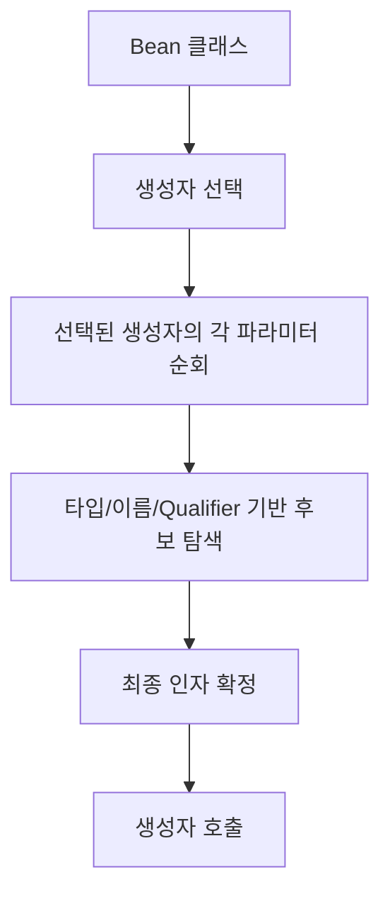
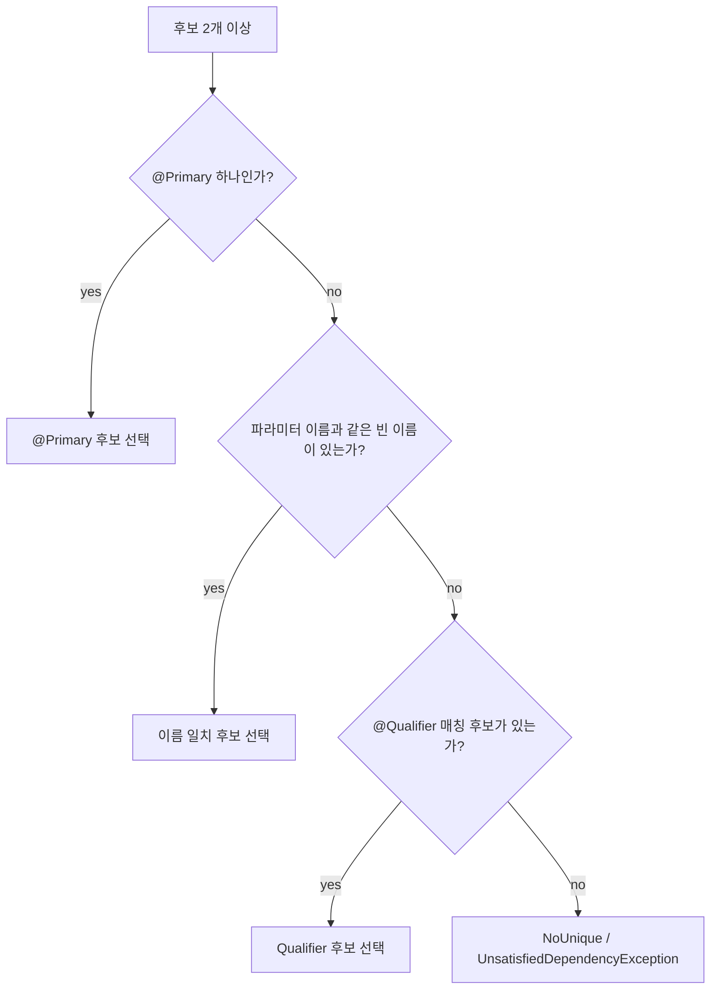

[GitHub 저장소](https://github.com/polynomeer/spring-internals-lab)

## 이번 글의 질문

의존성 주입은 흔히 한 덩어리로 설명되지만, 실제로는 두 단계로 나뉜다.

1. 어떤 생성자를 쓸 것인가
2. 그 생성자의 각 파라미터를 무엇으로 채울 것인가

여기에 후보가 여러 개일 때는 또 별도 규칙이 붙는다.

- `@Primary`
- `@Qualifier`
- 파라미터 이름 일치
- 순환 참조 여부

이번 글은 `dependency-resolution-matrix`와 `circular-dependency-lab` 실험을 함께 묶어서, **생성자 선택과 후보 선택은 다른 문제**라는 점부터 분명히 정리한다.

## 먼저 생성자 선택이 있고, 그다음 후보 선택이 있다

많이 놓치는 지점이 이 부분이다. Spring은 처음부터 "이 타입의 Bean 뭐 넣지?"를 고민하지 않는다. 먼저 "이 클래스는 어떤 생성자로 만들지?"를 결정한다.



즉 생성자 선택과 의존성 탐색은 분리된 단계다.

## 생성자 선택 규칙은 생각보다 보수적이다

실험에서 가장 흥미로운 결과는 이 케이스다.

```java
public class MultiConstructorNoAutowiredBean {
    public MultiConstructorNoAutowiredBean() { ... }
    public MultiConstructorNoAutowiredBean(Dependency dependency) { ... }
}
```

직관적으로는 "등록된 `Dependency`가 있으니 파라미터 있는 생성자를 고르겠지"라고 생각하기 쉽다. 실제로는 그렇지 않다.

Spring은 생성자가 여러 개인데 `@Autowired`가 하나도 없으면, 휴리스틱으로 가장 그럴듯한 생성자를 고르지 않는다. 기본 생성자가 있으면 거기로 떨어진다.

이 규칙을 표로 정리하면 이렇다.

| 상황 | 선택 결과 |
| --- | --- |
| 생성자 1개 | 그 생성자 |
| 생성자 여러 개 + `@Autowired` 1개 | 그 생성자 |
| 생성자 여러 개 + `@Autowired(required=true)` 여러 개 | 예외 |
| 생성자 여러 개 + `@Autowired` 없음 + 기본 생성자 있음 | 기본 생성자 |
| 생성자 여러 개 + `@Autowired` 없음 + 기본 생성자 없음 | 모호성 예외 |

이 규칙은 꽤 보수적이다. Spring은 "적당히 추론해서 맞히기"보다 "명시가 없으면 안전한 기본값으로 후퇴"하는 쪽을 택한다.

## 왜 이런 보수성이 필요한가

생성자 주입은 객체 구조를 강하게 결정한다. 만약 Spring이 다음 같은 휴리스틱을 쓴다고 가정해 보자.

- 가장 파라미터가 많은 생성자 선택
- 가장 많이 매칭되는 생성자 선택
- 가장 구체적인 타입의 생성자 선택

이 규칙들은 언뜻 편해 보이지만, 코드가 조금만 변해도 어떤 생성자가 선택될지 달라진다. 그래서 Spring은 모호한 상황에서 추측을 최소화한다.

즉 `@Autowired`는 단순한 편의 애노테이션이 아니라, **생성자 선택에 대한 명시적 의사 표시**다.

## 후보 선택은 또 다른 단계다

생성자가 정해진 뒤에는 각 파라미터를 채워야 한다. 이때는 `DefaultListableBeanFactory` 쪽 규칙이 들어온다.

가장 단순한 경우는 쉽다.

- 후보가 0개면 예외
- 후보가 1개면 그 Bean 주입

문제는 후보가 여러 개인 경우다.

실험과 소스 확인을 바탕으로 정리하면 대략 다음 흐름이다.



실제로는 우선순위/정렬 규칙이 더 있지만, 실무에서 가장 자주 마주치는 건 이 구간이다.

## `@Primary`와 `@Qualifier`는 같은 문제를 다른 방식으로 푼다

두 애노테이션은 같은 상황에서 등장하지만 성격이 다르다.

| 애노테이션 | 의도 |
| --- | --- |
| `@Primary` | "기본 후보는 이거다" |
| `@Qualifier` | "이번 주입 지점은 이 후보를 원한다" |

즉 `@Primary`는 공급자 쪽 힌트고, `@Qualifier`는 소비자 쪽 힌트다.

이 구분이 중요하다. `@Primary`를 남발하면 전체 기본값 구조가 꼬일 수 있고, `@Qualifier`를 남발하면 주입 지점마다 이름 의존이 강해진다.

## 파라미터 이름 일치도 실제 후보 선택 규칙이다

실험에서 의외였던 지점이 이것이다. 같은 타입의 빈이 여러 개일 때, 파라미터 이름이 빈 이름과 같으면 그 후보가 선택될 수 있다.

즉 아래처럼 동작할 수 있다.

```java
public OrderService(PaymentGateway stripeGateway) { ... }
```

동일 타입 후보가 여러 개 있는데 그중 하나가 `stripeGateway`라는 이름이면, 이름 자체가 힌트로 작동한다.

이 규칙은 실무에서 자주 의식되지는 않지만, 이름을 잘못 맞춰 둔 경우 예상 밖의 후보가 선택되는 원인이 될 수 있다.

## `Optional`, `List`, `ObjectProvider`는 실패 처리 전략이 다르다

실험에서는 단일 타입뿐 아니라 관용적 주입 형태도 같이 본다.

| 타입 | 후보 없음일 때 |
| --- | --- |
| `T` | 예외 |
| `Optional<T>` | `Optional.empty()` |
| `List<T>` | 빈 리스트 |
| `ObjectProvider<T>` | 주입은 성공, 실제 조회 시점까지 지연 |

특히 `ObjectProvider`는 "없어도 괜찮다"를 넘어서, **해석 시점 자체를 미룬다**는 점에서 다르다.

즉 이것들은 모두 "필수 아님"을 표현하지만, 의미는 조금씩 다르다.

## 순환 참조는 주입 방식에 따라 완전히 다른 결과가 난다

`circular-dependency-lab`은 의존성 탐색이 어디서 막히는지 더 선명하게 보여준다.

가장 단순한 생성자 순환은 실패한다.

```java
class A {
    A(B b) { }
}
class B {
    B(A a) { }
}
```

왜냐하면 생성자 주입에서는 인스턴스를 만들기 전에 인자가 다 필요하기 때문이다. 아직 존재하지 않는 객체를 생성자 인자로 줄 수는 없다.

반면 setter/field 기반 순환은 Spring이 조기 노출(early reference)로 풀 수 있다.


즉 생성자 순환과 setter 순환은 같은 "순환 참조"가 아니다. 생성 시점 분리가 가능한가가 핵심이다.

## `@Lazy`는 순환을 푸는 방식 자체가 다르다

한쪽 생성자 파라미터에 `@Lazy`를 붙이면, 실제 대상 대신 지연 프록시가 들어간다.

```java
class B {
    B(@Lazy A a) { ... }
}
```

이 경우에는 A를 즉시 만들 필요가 없다. 프록시만 생성자에 넣고, 실제 A 조회는 나중으로 미룬다.

즉 조기 노출과 `@Lazy`는 결과는 비슷해 보여도 경로가 다르다.

| 방식 | 핵심 메커니즘 |
| --- | --- |
| setter 순환 해결 | 조기 참조 캐시 |
| `@Lazy` 순환 해결 | 지연 프록시 |

이 차이를 모르면 "왜 어떤 순환은 풀리고 어떤 순환은 안 풀리는가"가 계속 추상적으로 남는다.

## mini-spring은 어디까지 재현했는가

`mini-spring/mini-container`는 이 주제를 꽤 직접적으로 드러낸다.

```java
private Constructor<?> selectConstructor(String name, Class<?> beanClass) { ... }
```

여기서는 다음을 직접 구현해 둔다.

- 단일 생성자 자동 선택
- `@MiniAutowired` 선택
- 기본 생성자 fallback
- `@MiniQualifier`
- `primary`

그리고 순환 참조는 `beanCreationPath`로 탐지한다.

```java
if (beanCreationPath.contains(name)) {
    throw new CircularDependencyException(describePath(name));
}
```

이 mini 구현이 보여주는 건 두 가지다.

1. 생성자 선택과 후보 선택은 분리된 로직이다.
2. 순환 해결은 탐지보다 훨씬 어렵다.

즉 mini는 "순환을 해결"하지 않고 "정확히 감지"하는 데 집중한다.

## 정리

이번 글의 핵심은 다음 세 가지다.

1. 생성자 선택과 후보 선택은 서로 다른 단계다.
2. `@Primary`, `@Qualifier`, 이름 일치는 모두 "후보 좁히기" 규칙이다.
3. 순환 참조는 주입 방식에 따라 실패 원인이 달라진다.

결국 의존성 주입은 "타입 맞는 Bean 넣기"보다 훨씬 구조적인 문제다. Spring은 생성자 선택, 후보 선택, 조기 노출, 지연 프록시를 각각 다른 계층에서 처리한다.

다음 글에서는 이렇게 선택된 Bean이 생성 이후 어떤 생명주기 콜백과 후처리기를 거치는지 본다.
