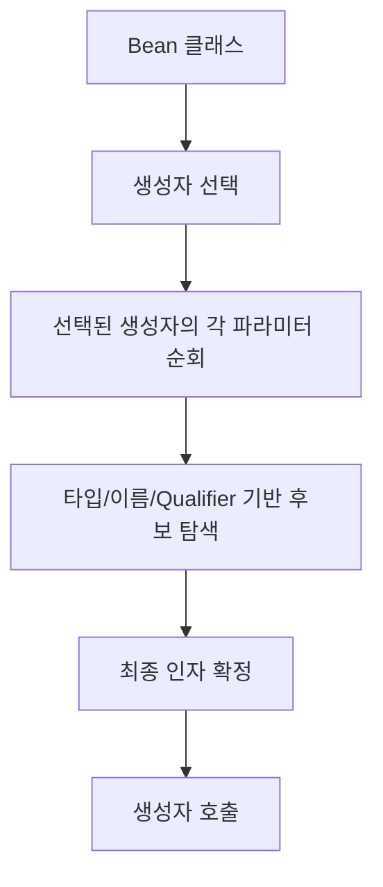
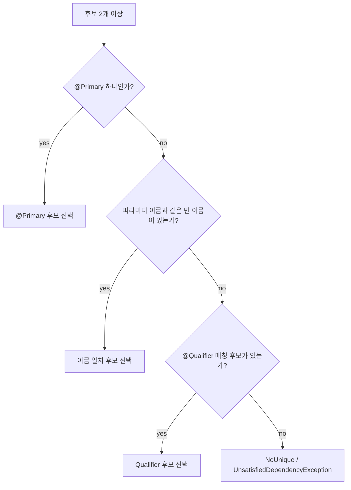

[GitHub 저장소](https://github.com/polynomeer/spring-lab)

## 이번 글의 질문

[의존성 주입](/posts/ioc-di/)은 흔히 한 덩어리로 설명되지만, 실제로는 두 단계로 나뉜다.

1. 어떤 생성자를 쓸 것인가
2. 그 생성자의 각 파라미터를 무엇으로 채울 것인가

같은 타입의 후보가 여러 개이면 별도 규칙이 더 붙는다.

- `@Primary`
- `@Qualifier`
- 파라미터 이름 일치
- 순환 참조 여부

이번 글은 `dependency-resolution-matrix`와 `circular-dependency-lab` 실험을 함께 묶어서, **생성자 선택과 후보 선택은 다른 문제**라는 점부터 확인한다.

## 먼저 생성자 선택이 있고, 그다음 후보 선택이 있다

Spring은 처음부터 "이 타입의 Bean 뭐 넣지?"를 고민하지 않는다. 먼저 "이 클래스는 어떤 생성자로 만들지?"를 결정한다.


```mermaid
flowchart TD
    A["Bean 클래스"] --> B["생성자 선택"]
    B --> C["선택된 생성자의 각 파라미터 순회"]
    C --> D["타입/이름/Qualifier 기반 후보 탐색"]
    D --> E["최종 인자 확정"]
    E --> F["생성자 호출"]
```

생성자가 정해져야 채울 파라미터 목록이 생기므로 생성자 선택이 먼저 온다.

## 생성자 선택 규칙은 생각보다 보수적이다

`dependency-resolution-matrix`에서 예상과 다르게 나온 케이스는 다음과 같다.

```java
public class MultiConstructorNoAutowiredBean {
    public MultiConstructorNoAutowiredBean() { ... }
    public MultiConstructorNoAutowiredBean(Dependency dependency) { ... }
}
```

직관적으로는 "등록된 `Dependency`가 있으니 파라미터 있는 생성자를 고르겠지"라고 생각하기 쉽다. 실제로는 그렇지 않다.

Spring은 생성자가 여러 개인데 `@Autowired`가 하나도 없으면, 휴리스틱으로 가장 그럴듯한 생성자를 고르지 않는다. 기본 생성자가 있으면 거기로 떨어진다.

실험 결과를 상황별로 모으면 다음과 같다.

| 상황 | 선택 결과 |
| --- | --- |
| 생성자 1개 | 그 생성자 |
| 생성자 여러 개 + `@Autowired` 1개 | 그 생성자 |
| 생성자 여러 개 + `@Autowired(required=true)` 여러 개 | 예외 |
| 생성자 여러 개 + `@Autowired` 없음 + 기본 생성자 있음 | 기본 생성자 |
| 생성자 여러 개 + `@Autowired` 없음 + 기본 생성자 없음 | 모호성 예외 |

공식 문서도 같은 규칙을 적고 있다. 생성자가 하나면 `@Autowired`가 필요 없고, 생성자가 여럿인데 기본 생성자가 없으면 "at least one of the constructors must be annotated with `@Autowired` in order to instruct the container which one to use"(어느 생성자를 쓸지 알려 주려면 적어도 하나에 `@Autowired`를 붙여야 한다)고 한다([Using @Autowired](https://docs.spring.io/spring-framework/reference/core/beans/annotation-config/autowired.html)). 같은 문서에 따르면 `required=false`인 `@Autowired`가 여럿이면 채울 수 있는 의존성이 가장 많은 생성자가 선택된다.

명시가 없을 때 Spring은 추론으로 맞히기보다 기본 생성자로 물러나는 쪽을 택한다.

## 왜 이런 보수성이 필요한가

생성자 주입은 객체 구조를 강하게 결정한다. 만약 Spring이 다음 같은 휴리스틱을 쓴다고 가정해 보자.

- 가장 파라미터가 많은 생성자 선택
- 가장 많이 매칭되는 생성자 선택
- 가장 구체적인 타입의 생성자 선택

이 규칙들은 언뜻 편해 보이지만, 코드가 조금만 변해도 어떤 생성자가 선택될지 달라진다. 그래서 Spring은 모호한 상황에서 추측을 최소화하고, 생성자가 여럿일 때 `@Autowired`를 생성자 선택을 명시하는 수단으로 쓴다.

## 후보 선택은 또 다른 단계다

생성자가 정해진 뒤에는 각 파라미터를 채워야 한다. 이때는 `DefaultListableBeanFactory` 쪽 규칙이 들어온다.

가장 단순한 경우는 쉽다.

- 후보가 0개면 예외
- 후보가 1개면 그 Bean 주입

문제는 후보가 여러 개인 경우다.

실험과 소스 확인을 바탕으로 그리면 대략 다음 흐름이다.


```mermaid
flowchart TD
    A["후보 2개 이상"] --> B{"@Primary 하나인가?"}
    B -- yes --> C["@Primary 후보 선택"]
    B -- no --> D{"파라미터 이름과 같은 빈 이름이 있는가?"}
    D -- yes --> E["이름 일치 후보 선택"]
    D -- no --> F{"@Qualifier 매칭 후보가 있는가?"}
    F -- yes --> G["Qualifier 후보 선택"]
    F -- no --> H["NoUnique / UnsatisfiedDependencyException"]
```

실제로는 우선순위/정렬 규칙이 더 있지만, 실무에서 가장 자주 마주치는 건 이 구간이다.

다만 `@Qualifier`의 위치는 그림과 다르게 읽어야 한다. 공식 문서에서 `@Qualifier`는 타입이 맞는 후보를 좁히는 수단이고, 이름 일치는 "If there is no other resolution indicator (such as a qualifier, a primary marker, or a fallback marker)"일 때 쓰는 마지막 대체 규칙이다([Fine-tuning Annotation-based Autowiring with Qualifiers](https://docs.spring.io/spring-framework/reference/core/beans/annotation-config/autowired-qualifiers.html)). 그래서 `@Qualifier`가 있으면 그 조건으로 먼저 후보가 걸러진다.

## `@Primary`와 `@Qualifier`는 같은 문제를 다른 방식으로 푼다

두 애노테이션은 같은 상황에서 등장하지만 성격이 다르다.

| 애노테이션 | 의도 |
| --- | --- |
| `@Primary` | "기본 후보는 이거다" |
| `@Qualifier` | "이번 주입 지점은 이 후보를 원한다" |

`@Primary`는 Bean을 제공하는 쪽에 붙는 힌트고, `@Qualifier`는 주입받는 쪽에 붙는 힌트다.

그래서 남용했을 때의 비용도 다르다. `@Primary`를 남발하면 전체 기본값 구조가 꼬일 수 있고, `@Qualifier`를 남발하면 주입 지점마다 이름 의존이 강해진다.

## 파라미터 이름 일치도 실제 후보 선택 규칙이다

같은 타입의 빈이 여러 개일 때, 파라미터 이름이 빈 이름과 같으면 그 후보가 선택될 수 있다.

예를 들어 아래 생성자를 보자.

```java
public OrderService(PaymentGateway stripeGateway) { ... }
```

동일 타입 후보가 여러 개 있는데 그중 하나가 `stripeGateway`라는 이름이면, 이름 자체가 힌트로 작동한다. 위 문서에 따르면 Spring 6.1부터 이 매칭에는 `-parameters` 컴파일러 플래그가 필요하다.

이 규칙은 실무에서 자주 의식되지는 않지만, 이름을 잘못 맞춰 둔 경우 예상 밖의 후보가 선택되는 원인이 될 수 있다.

## `Optional`, `List`, `ObjectProvider`는 실패 처리 전략이 다르다

실험에서는 단일 타입뿐 아니라 관용적 주입 형태도 같이 본다.

| 타입 | 후보 없음일 때 |
| --- | --- |
| `T` | 예외 |
| `Optional<T>` | `Optional.empty()` |
| `List<T>` | 빈 리스트 |
| `ObjectProvider<T>` | 주입은 성공, 실제 조회 시점까지 지연 |

네 형태 중 `Optional`, `List`, `ObjectProvider`는 모두 "필수 아님"을 표현한다. 그중 `ObjectProvider`는 후보를 찾는 시점 자체를 실제 조회 때로 미룬다는 점이 다르다.

## 순환 참조는 주입 방식에 따라 완전히 다른 결과가 난다

`circular-dependency-lab`은 의존성 탐색이 어디서 막히는지 보여준다.

가장 단순한 생성자 순환은 실패한다.

```java
class A {
    A(B b) { }
}
class B {
    B(A a) { }
}
```

왜냐하면 생성자 주입에서는 인스턴스를 만들기 전에 인자가 다 필요하기 때문이다. 아직 존재하지 않는 객체를 생성자 인자로 줄 수는 없다. 공식 문서도 이 경우 컨테이너가 순환을 런타임에 감지하고 `BeanCurrentlyInCreationException`을 던진다고 적는다([Dependency Injection](https://docs.spring.io/spring-framework/reference/core/beans/dependencies/factory-collaborators.html)).

반면 setter/field 기반 순환은 Spring이 조기 노출(early reference, 초기화 전 참조를 먼저 넘기는 것)로 풀 수 있다. 같은 문서는 이 방식을 권장하지 않는다.


```mermaid
flowchart LR
    A["A 인스턴스 생성"] --> B["A 조기 노출 가능"]
    B --> C["B 생성 중 A 필요"]
    C --> D["조기 참조 A 주입"]
    D --> E["B 완성"]
    E --> F["A 나머지 주입 후 완성"]
```

두 경우를 가르는 것은 생성과 주입을 시점상 나눌 수 있는가다.

## `@Lazy`는 순환을 푸는 방식 자체가 다르다

한쪽 생성자 파라미터에 `@Lazy`를 붙이면, 실제 대상 대신 지연 [프록시](/posts/spring-internals-lab-proxy-aop/)가 들어간다.

```java
class B {
    B(@Lazy A a) { ... }
}
```

이 경우에는 A를 즉시 만들 필요가 없다. 프록시만 생성자에 넣고, 실제 A 조회는 나중으로 미룬다.

조기 노출과 `@Lazy`는 결과는 비슷해 보여도 경로가 다르다.

| 방식 | 핵심 메커니즘 |
| --- | --- |
| setter 순환 해결 | 조기 참조 캐시 |
| `@Lazy` 순환 해결 | 지연 프록시 |

이 차이를 모르면 "왜 어떤 순환은 풀리고 어떤 순환은 안 풀리는가"가 계속 추상적으로 남는다.

## mini-spring은 어디까지 재현했는가

`mini-spring/mini-container`는 이 두 단계를 코드로 나눠 둔다.

```java
private Constructor<?> selectConstructor(String name, Class<?> beanClass) { ... }
```

여기서는 다음을 직접 구현해 둔다.

- 단일 생성자 자동 선택
- `@MiniAutowired` 선택
- 기본 생성자 fallback
- `@MiniQualifier`
- `primary`

그리고 순환 참조는 `beanCreationPath`로 탐지한다.

```java
if (beanCreationPath.contains(name)) {
    throw new CircularDependencyException(describePath(name));
}
```

이 mini 구현이 보여주는 건 두 가지다.

1. 생성자 선택과 후보 선택은 분리된 로직이다.
2. 순환 해결은 탐지보다 훨씬 어렵다.

그래서 mini는 순환을 해결하지 않고 감지해서 예외를 던지는 데서 멈춘다.

## 정리

의존성 주입은 타입이 맞는 Bean을 넣는 한 번의 동작이 아니다. Spring은 생성자 선택, 후보 선택, 조기 노출, 지연 프록시를 각각 다른 계층에서 처리한다.

[다음 글](/posts/spring-internals-lab-bean-lifecycle/)에서는 이렇게 선택된 Bean이 생성 이후 어떤 생명주기 콜백과 후처리기를 거치는지 본다.

## 참고

- [Using @Autowired](https://docs.spring.io/spring-framework/reference/core/beans/annotation-config/autowired.html) — Spring Framework Reference, 생성자 선택 규칙
- [Fine-tuning Annotation-based Autowiring with Qualifiers](https://docs.spring.io/spring-framework/reference/core/beans/annotation-config/autowired-qualifiers.html) — Spring Framework Reference, `@Qualifier`와 이름 기반 대체 매칭
- [Dependency Injection](https://docs.spring.io/spring-framework/reference/core/beans/dependencies/factory-collaborators.html) — Spring Framework Reference, Circular dependencies
