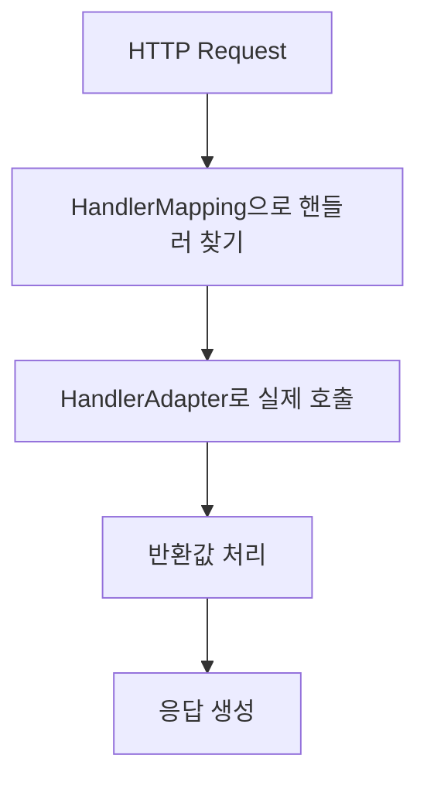
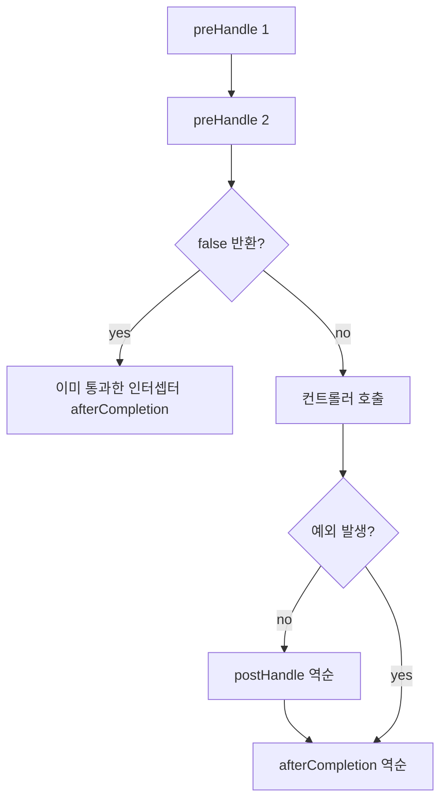

[GitHub 저장소](https://github.com/polynomeer/spring-internals-lab)

## 이번 글의 질문

Spring MVC를 처음 배울 때는 `@GetMapping`과 `@RequestBody`부터 보게 된다. 하지만 이 시점에는 아직 가장 중요한 질문이 비어 있다.

- 요청은 어떤 순서로 컨트롤러 메서드에 도달하는가
- `HandlerMapping`과 `HandlerAdapter`는 왜 분리되어 있는가
- 리터럴 경로와 변수 경로가 겹치면 누가 이기는가
- 인터셉터는 어디서 실행되고, 예외나 차단 상황에서는 무엇이 생략되는가

이번 글은 `dispatcher-servlet-trace`와 `mini-webmvc`를 바탕으로, MVC를 **Front Controller + 책임 분리 파이프라인**으로 정리한다.

## `DispatcherServlet` 자체는 의외로 단순하다

핵심 흐름만 줄이면 거의 이렇게 볼 수 있다.

```java
handler = getHandler(request);
adapter = getHandlerAdapter(handler);
mappedHandler.applyPreHandle(...);
result = adapter.handle(...);
mappedHandler.applyPostHandle(...);
processDispatchResult(...);
```

즉 `DispatcherServlet`은 모든 걸 직접 처리하기보다, 찾아서 위임한다.



즉 이 서블릿의 본질은 "모든 걸 하는 객체"가 아니라 **나머지 협력 객체들에게 일을 떠넘기는 Front Controller**다.

## `HandlerMapping`과 `HandlerAdapter`를 왜 굳이 나눌까

이 분리는 Spring MVC의 설계 감각을 가장 잘 드러낸다.

| 타입 | 질문 |
| --- | --- |
| `HandlerMapping` | 이 요청에 맞는 핸들러가 무엇인가 |
| `HandlerAdapter` | 그 핸들러를 실제로 어떻게 호출할 것인가 |

이 둘을 분리하지 않으면, 새로운 핸들러 형태가 생길 때마다 라우팅 로직까지 같이 수정해야 한다.

반대로 분리하면 다음이 가능하다.

- 애노테이션 기반 핸들러
- `HttpRequestHandler`
- 레거시 `Controller`

같은 요청 매핑 시스템 안에서 서로 다른 "호출 방식"을 공존시킬 수 있다.

즉 MVC의 유연성은 애노테이션 문법보다 먼저, **찾기와 실행을 나눈 설계**에서 나온다.

## 실제 관찰에서 드러난 세 가지 포인트

`dispatcher-servlet-trace` 실험으로 특히 명확해진 건 세 가지다.

### 1. 리터럴 경로가 변수 경로보다 우선한다

`/users/me`와 `/users/{id}`가 같이 있으면 등록 순서가 아니라 리터럴 경로가 우선된다.

이건 아주 중요하다. 만약 등록 순서에 의존했다면 컴포넌트 스캔 순서나 설정 구조가 바뀔 때 라우팅 결과도 흔들릴 수 있다.

즉 Spring은 "더 구체적인 패턴이 이긴다"는 고정 규칙을 택한다.

### 2. 매핑 못 찾으면 404로 끝난다

매칭되는 핸들러가 없으면 곧바로 404다. 특별한 컨트롤러 예외 처리 이전에, **핸들러 탐색 단계에서 종료**된다.

### 3. 처리하지 못한 예외는 그대로 전파될 수 있다

컨트롤러가 던진 모든 예외가 자동으로 예쁜 HTTP 응답이 되는 건 아니다. 적절한 `ExceptionResolver`가 처리하지 못하면 예외는 그대로 밖으로 나간다.

즉 MVC의 예외 처리는 "무조건 500 응답 생성"보다, **Resolver 체인을 통한 변환 시도**에 가깝다.

## 인터셉터는 양파 구조지만, 예외가 나면 일부 단계는 생략된다

인터셉터의 핵심 메서드는 세 가지다.

- `preHandle`
- `postHandle`
- `afterCompletion`

하지만 이 셋이 항상 다 호출되는 건 아니다.

| 상황 | 호출 결과 |
| --- | --- |
| 정상 처리 | `preHandle -> postHandle -> afterCompletion` |
| `preHandle=false` | 컨트롤러 미호출, 이미 통과한 인터셉터만 `afterCompletion` |
| 컨트롤러 예외 | `postHandle` 생략, `afterCompletion`은 실행 가능 |

이 구조는 트랜잭션의 `try/finally`와 비슷하다. `postHandle`은 정상 결과를 다듬는 훅이고, `afterCompletion`은 뒷정리 훅에 가깝다.



## JSON 응답도 자동이 아니라 협력 객체 덕분이다

실험에서 실제로 겪은 함정 중 하나가 이것이다. Jackson이 없으면 `@RestController`가 있다고 해서 JSON 응답이 저절로 만들어지지 않는다.

즉 아래는 다 별도 협력 객체의 역할이다.

- `@RequestBody` 역직렬화
- 객체를 JSON으로 직렬화
- `ResponseEntity` 처리

이건 MVC를 이해할 때 중요한 감각이다. `@RestController`는 기능 자체가 아니라, **여러 메시지 변환기와 반환값 처리기를 묶은 경험**에 가깝다.

## mini-webmvc는 구조의 핵심만 남긴다

`mini-webmvc`의 `MiniDispatcherServlet`은 아주 작은 반복문으로 시작한다.

```java
for (HandlerMapping mapping : handlerMappings) {
    HandlerMethod handler = mapping.getHandler(request);
    if (handler != null) return handler;
}
```

이 구현이 보여주는 사실은 단순하다.

- Front Controller 자체는 복잡하지 않다.
- 복잡성은 handler mapping, adapter, argument resolution, return value handling 쪽에 쌓인다.

즉 `DispatcherServlet`은 거대한 중앙 로직이라기보다, **작은 규칙들을 모아 흐름을 조율하는 coordinator**에 가깝다.

## 정리

이번 글의 핵심은 네 가지다.

1. `DispatcherServlet`의 본질은 Front Controller와 위임이다.
2. `HandlerMapping`과 `HandlerAdapter` 분리가 MVC 확장의 핵심이다.
3. 인터셉터는 정상/예외/차단 경로에서 서로 다르게 호출된다.
4. `@RestController` 경험은 여러 메시지 변환기와 처리기의 합성 결과다.

결국 Spring MVC는 "컨트롤러 메서드 호출 프레임워크"가 아니라, **라우팅, 호출, 변환, 예외 처리, 인터셉션을 분리한 파이프라인**이다.

다음 글에서는 마지막으로 Spring Boot 쪽을 본다. `SpringApplication`, 자동 설정, 조건부 설정이 어떻게 기존 컨테이너 위에 얇게 얹히는지 정리한다.
