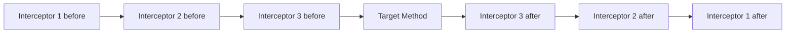
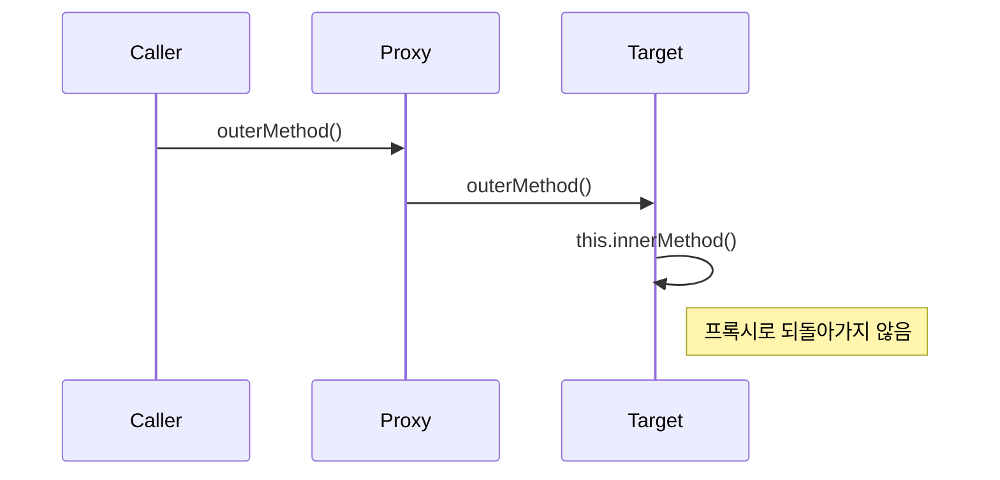

[GitHub 저장소](https://github.com/polynomeer/spring-internals-lab)

## 이번 글의 질문

Spring AOP를 이해할 때 가장 먼저 잡아야 하는 건 `@Aspect` 문법이 아니다. 그보다 더 아래 질문이 있다.

- 언제 JDK 프록시를 쓰고 언제 CGLIB을 쓰는가
- 인터셉터 체인은 어떻게 진행되는가
- `final`, `private`, self-invocation은 왜 AOP를 우회하는가
- 수동 `ProxyFactory`와 자동 프록시 생성기는 어떻게 연결되는가

이번 글은 `proxy-playground`, `method-timing-post-processor`, `mini-aop`, `mini-auto-proxy`를 묶어서 **AOP의 실체는 프록시 + 인터셉터 체인**이라는 점을 정리한다.

## 프록시 선택 규칙은 생각보다 단순하다

기본 원칙은 이렇다.

| 대상 | 기본 선택 |
| --- | --- |
| 인터페이스 구현 | JDK 동적 프록시 |
| 인터페이스 없음 | CGLIB 계열 서브클래스 프록시 |

`ProxyFactory` 실험에서도 이 규칙이 그대로 재현된다.

```java
ProxyFactory pf = new ProxyFactory(new GreetableImpl());  // 인터페이스 있음
ProxyFactory pf2 = new ProxyFactory(new PlainGreeter());  // 인터페이스 없음
```

이 규칙이 중요한 이유는 이후 제약도 같이 따라오기 때문이다.

- JDK 프록시는 원본 클래스로 캐스팅할 수 없다.
- CGLIB 프록시는 서브클래스이므로 원본 타입처럼 보일 수 있다.
- `final` 클래스와 `final` 메서드는 CGLIB에서도 제약이 생긴다.

## 인터셉터 체인은 양파 구조다

AOP의 실체를 가장 잘 보여주는 타입은 `ReflectiveMethodInvocation`이다.

```java
public Object proceed() throws Throwable {
    if (++index == interceptors.size()) {
        return method.invoke(target, arguments);
    }
    return interceptors.get(index).invoke(this);
}
```

즉 구조는 이렇다.



실험에서도 `Logging -> Authorization -> Timing` 순서가 정확히 이런 양파 구조로 실행된다.

이 그림 하나로 AOP의 절반은 설명된다. 트랜잭션도, 측정도, 예외 변환도 결국은 **target invocation 앞뒤를 감싸는 인터셉터**다.

## `final`과 `private`는 왜 우회되는가

실험 결과는 명확하다.

- `final` 메서드: 인터셉터를 거치지 않는다.
- `private` 메서드: 애초에 프록시 대상이 아니다.

이유는 언어 차원 제약 때문이다.

- CGLIB/ByteBuddy 방식은 메서드 오버라이드가 가능해야 가로챌 수 있다.
- `final`은 오버라이드가 불가능하다.
- `private`는 서브클래스 입장에서 보이지도 않는다.

즉 이건 Spring의 정책이 아니라, **프록시 방식이 택한 구현 전략의 결과**다.

## self-invocation이 안 되는 이유도 결국 객체가 둘이기 때문이다

이 문제는 문서에서 자주 읽지만, 코드로 보면 훨씬 명확하다.



즉 프록시는 바깥 호출만 볼 수 있다. target 내부의 `this.innerMethod()`는 다시 프록시를 통과하지 않는다.

이건 프록시를 누가 만들었는지와 무관하다.

- 수동 `ProxyFactory`
- 수동 `BeanPostProcessor`
- 자동 프록시 생성기

마지막에 만들어지는 게 "프록시 객체와 원본 객체의 분리"라면 self-invocation 문제는 그대로 남는다.

## 자동 프록시 생성기는 새 알고리즘이 아니라 타이밍 자동화다

`MethodTimingBeanPostProcessor`와 `DefaultAdvisorAutoProxyCreator`를 비교해 보면 이 점이 분명하다.

수동 버전은 대략 이렇다.

```java
if (!AopUtils.canApply(advisor, bean.getClass())) return bean;
ProxyFactory proxyFactory = new ProxyFactory(bean);
proxyFactory.addAdvisor(advisor);
return proxyFactory.getProxy();
```

자동 버전은 프레임워크가 같은 질문을 대신 묻는다.

- 이 Bean에 Advisor를 적용할 수 있는가
- 적용 가능하면 프록시를 만들 것인가

즉 자동 프록시 생성기가 하는 일은 새로운 AOP 원리를 추가하는 게 아니다. **같은 판정과 같은 프록시 생성을 컨테이너 파이프라인의 올바른 시점에서 대신 수행하는 것**에 가깝다.

## `BeanPostProcessor`로 만든 AOP와 자동 프록시의 공통점

공통점을 표로 정리하면 이렇다.

| 구분 | 수동 BPP | 자동 프록시 생성기 |
| --- | --- | --- |
| 프록시 생성 시점 | `postProcessAfterInitialization` | `postProcessAfterInitialization` |
| 대상 판정 | 직접 `canApply` 호출 | 내부에서 `canApply` 계열 호출 |
| 최종 산출물 | 프록시 | 프록시 |
| self-invocation 한계 | 있음 | 있음 |

즉 차이는 결과보다 **누가 wiring을 담당하느냐**다.

## `BeanPostProcessor`를 `@Bean`으로 만들 때 `static`이 안전한 이유

실험에서 실제로 걸린 함정도 있다. `BeanPostProcessor`를 `@Configuration` 안의 instance `@Bean` 메서드로 선언하면, Spring이 경고를 남긴다.

이유는 간단하다.

- `BeanPostProcessor`는 다른 Bean들이 생성되기 전에 먼저 등록돼야 한다.
- instance `@Bean` 메서드는 설정 클래스 인스턴스가 먼저 필요하다.
- 그러면 후처리기 등록 타이밍이 늦어질 수 있다.

즉 `static @Bean`은 단순 스타일 차이가 아니라, **후처리기 등록 시점을 앞당기기 위한 구조적 선택**이다.

## mini-spring은 AOP의 핵심만 남긴다

`mini-aop`와 `mini-auto-proxy`는 이 구조를 아주 직접적으로 보여준다.

- `MethodInterceptor`
- `MethodInvocation`
- `MiniProxyFactory`
- `MiniAutoProxyCreator`

특히 `MiniAutoProxyCreator`는 "후처리기와 프록시 생성이 만나는 지점"을 코드 구조로 드러낸다.

즉 Spring AOP를 이해할 때 핵심은 `@Aspect` 문법보다 먼저 다음 연결이다.

```text
Bean 생성 완료
→ BeanPostProcessor 개입
→ 조건 맞으면 프록시로 교체
→ 이후 모든 외부 호출은 인터셉터 체인 경유
```

## 정리

이번 글에서 확인한 핵심은 다섯 가지다.

1. Spring AOP의 기본 실체는 프록시와 인터셉터 체인이다.
2. JDK 프록시와 CGLIB 선택은 대상 구조에 따라 갈린다.
3. `final`, `private`, self-invocation은 프록시 방식의 구조적 한계다.
4. 자동 프록시 생성기는 새로운 원리보다 컨테이너 타이밍 자동화에 가깝다.
5. `BeanPostProcessor`는 AOP가 컨테이너에 올라타는 핵심 연결점이다.

이제 다음 글에서 이 구조 위에 `@Transactional`이 어떻게 올라가는지 본다. 결국 트랜잭션도 별도 마법이 아니라, 인터셉터 체인 위에 얹힌 하나의 어드바이스다.
