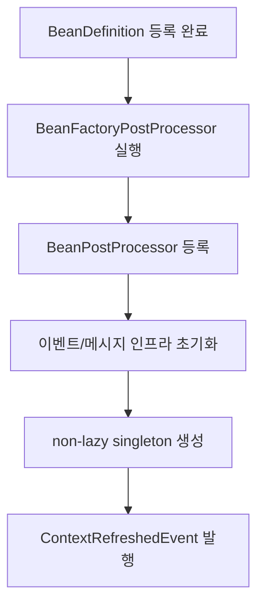
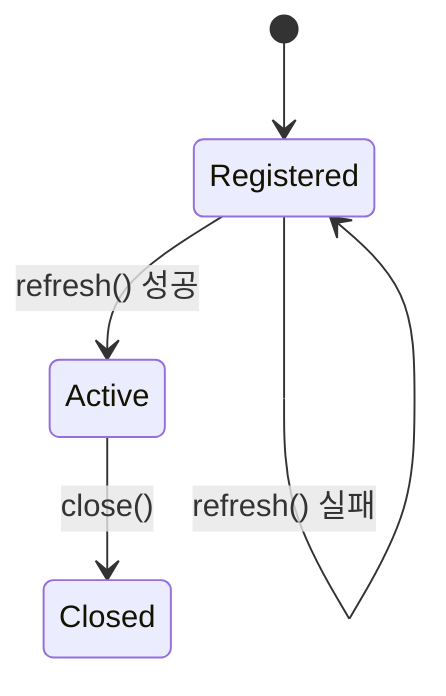

[GitHub 저장소](https://github.com/polynomeer/spring-internals-lab)

## 이번 글의 질문

`ApplicationContext.refresh()`는 Spring 컨테이너 초기화의 중심이다. 그런데 실무에서는 이 메서드를 직접 호출할 일보다 결과만 접할 일이 훨씬 많다. 그래서 다음 질문이 자주 흐릿하게 남는다.

- `BeanFactoryPostProcessor`와 `BeanPostProcessor`는 정확히 어느 순서로 실행되는가
- non-lazy singleton은 언제 실제로 만들어지는가
- `ContextRefreshedEvent`는 언제 발행되는가
- `refresh()` 전, 후, 실패 후, `close()` 후에 컨테이너는 어떻게 다른 상태인가

이번 글은 `spring-internals-lab`의 `context-refresh-visualizer` 실험과 소스 확인을 바탕으로, `refresh()`를 "Spring이 시작될 때 뭔가 많이 하는 메서드"가 아니라 **정해진 단계로 컨테이너를 조립하는 파이프라인**으로 본다.

## `refresh()`는 사실상 컨테이너 부팅 시퀀스다

Spring 문서를 읽으면 `refresh()`는 대략 12단계로 설명된다. 이름만 나열하면 다음과 같다.

1. `prepareRefresh`
2. `obtainFreshBeanFactory`
3. `prepareBeanFactory`
4. `postProcessBeanFactory`
5. `invokeBeanFactoryPostProcessors`
6. `registerBeanPostProcessors`
7. `initMessageSource`
8. `initApplicationEventMulticaster`
9. `onRefresh`
10. `registerListeners`
11. `finishBeanFactoryInitialization`
12. `finishRefresh`

중요한 건 이 단계들이 단순 정리용 목록이 아니라, 실제 실행 순서를 그대로 반영한다는 점이다.



즉 `refresh()`는 객체를 바로 만들기보다, 먼저 **정의를 다듬고**, 그다음 **후처리기를 등록하고**, 마지막에 **실제 singleton을 만든다**.

## 실험 코드는 아주 작다

`spring-internals-lab`의 `experiments/context-refresh-visualizer`는 이 순서를 관찰하기 위해 각 지점에 로그를 남긴다.

```java
AnnotationConfigApplicationContext context = new AnnotationConfigApplicationContext();
context.register(
        EagerSingleton.class,
        LazySingleton.class,
        PrototypeBean.class,
        LoggingBeanFactoryPostProcessor.class,
        LoggingBeanPostProcessor.class,
        LoggingApplicationListener.class
);
context.refresh();
```

여기서 핵심은 세 종류의 Bean을 같이 넣는 것이다.

- eager singleton
- lazy singleton
- prototype

그리고 후처리기와 이벤트 리스너를 같이 넣어서, 어떤 종류가 어느 단계에서 보이는지 비교한다.

## 실제 관찰 순서

실험 결과는 놀랄 만큼 단순했다.

```text
BFPP:invoked
constructor:eagerSingleton
BPP:before:eagerSingleton
BPP:after:eagerSingleton
event:ContextRefreshedEvent
```

이 결과만으로도 중요한 사실이 보인다.

1. `BeanFactoryPostProcessor`가 가장 먼저 실행된다.
2. eager singleton은 그 뒤에 생성된다.
3. `BeanPostProcessor`는 singleton 생성 전후에 개입한다.
4. `ContextRefreshedEvent`는 singleton 생성이 끝난 뒤 발행된다.

반대로 `LazySingleton`과 `PrototypeBean`은 이 로그에 아예 나타나지 않는다. 즉 `refresh()`는 "모든 Bean 생성"이 아니라, **non-lazy singleton 선생성**에 가깝다.

## `BeanFactoryPostProcessor`와 `BeanPostProcessor`는 이름만 비슷할 뿐 단계가 다르다

이 둘은 초보 단계에서 늘 헷갈린다. 하지만 `refresh()`에 끼워 보면 차이가 분명해진다.

| 타입 | 개입 대상 | 개입 시점 |
| --- | --- | --- |
| `BeanFactoryPostProcessor` | `BeanDefinition` | 빈 생성 전 |
| `BeanPostProcessor` | 실제 빈 인스턴스 | 빈 생성 전후 |

즉 전자는 메타데이터를 바꾸고, 후자는 객체를 바꾼다.

이 차이가 중요한 이유는 이후 주제와 직결되기 때문이다.

- `@Configuration` 후처리
- 조건부 등록
- `@Transactional` 프록시 적용
- `@Autowired` 처리

이 기능들은 전부 같은 타이밍에 작동하지 않는다. 어떤 것은 정의 단계에서, 어떤 것은 인스턴스 단계에서 개입한다.

## `finishBeanFactoryInitialization()`이 실제 Bean 생성의 중심이다

`refresh()`에서 "객체가 만들어지는" 핵심 구간은 11번째 단계인 `finishBeanFactoryInitialization()`이다.

여기서 Spring은 대략 이런 일을 한다.

- conversion service 같은 인프라 정리
- embedded value resolver 정리
- 남아 있는 singleton Bean 선생성

즉 앞 단계 대부분은 준비 작업이고, 실제 객체 그래프를 한꺼번에 채우는 시점은 거의 마지막이다.

이 구조가 좋은 이유는 명확하다. Bean 생성 전에 알아야 하는 규칙들을 최대한 먼저 확정할 수 있다.

- 어떤 BeanDefinition이 추가/삭제/수정됐는가
- 어떤 후처리기가 등록됐는가
- 어떤 이벤트 인프라가 준비됐는가

모든 규칙이 정해진 뒤에야 singleton 생성이 시작된다.

## lazy와 prototype이 여기서 빠지는 이유

실험에서 `lazySingleton`과 `prototypeBean` 생성 로그가 없었던 이유도 이 단계 구조로 설명된다.

| 종류 | `refresh()` 중 생성 여부 | 이유 |
| --- | --- | --- |
| non-lazy singleton | 생성됨 | 컨테이너 시작 시 준비 대상 |
| lazy singleton | 생성 안 됨 | 첫 `getBean()`까지 지연 |
| prototype | 생성 안 됨 | 요청할 때마다 새로 만들어야 함 |

즉 컨테이너가 "준비 완료"라고 말할 때, 실제로는 모든 Bean이 있는 게 아니라 **즉시 필요한 singleton만 준비된 상태**다.

## `refresh()` 전후의 컨텍스트 상태는 꽤 다르다

이 실험에서 같이 확인한 중요한 사실은 컨텍스트 상태 자체다.

| 시점 | `getBean()` 가능 여부 | 대표 결과 |
| --- | --- | --- |
| `refresh()` 전 | 불가 | `has not been refreshed yet` |
| `refresh()` 완료 후 | 가능 | 정상 조회 |
| `close()` 후 | 불가 | `has been closed already` |
| `refresh()` 실패 후 | 불가 | 다시 "has not been refreshed yet" 계열 메시지 |

특히 실패 후 메시지가 흥미롭다. 직관적으로는 "초기화 실패" 같은 메시지가 나올 것 같지만, 실제로는 Spring이 별도의 "실패 상태"를 세밀하게 들고 있지 않아서 결과적으로 "아직 refresh되지 않았다"에 가깝게 보인다.

즉 상태 머신이 꽤 단순하다.



실패 후에 다시 Registered처럼 보이는 이유도 이 그림으로 이해할 수 있다.

## `GenericApplicationContext`는 왜 refresh를 한 번만 허용하는가

`AnnotationConfigApplicationContext`는 내부적으로 `GenericApplicationContext` 기반이라 `refresh()`를 한 번만 허용한다.

이게 중요한 이유는 "Spring 컨텍스트는 언제든 재초기화 가능하다"는 막연한 인상을 깨기 때문이다. 적어도 이 계열 컨텍스트는 그렇지 않다.

이 설계는 꽤 합리적이다.

- 프로그래밍 방식 등록은 보통 "다 등록했으니 이제 시작"이라는 흐름이다.
- XML 기반 refreshable 컨텍스트처럼 "다시 로드"를 주 용도로 두지 않는다.
- 한 번 활성화된 뒤 상태를 더 단순하게 유지할 수 있다.

즉 `refresh()`는 재계산 가능한 일반 메서드가 아니라, **컨텍스트를 활성 상태로 전환하는 일회성 부팅 단계**에 가깝다.

## 부모-자식 컨텍스트는 이벤트 전파도 계층적이다

실험에서는 부모-자식 컨텍스트도 같이 본다. 여기서 흥미로운 점은 이벤트 전파 방향이다.

- 자식은 부모 Bean을 조회할 수 있다.
- 부모는 자식 Bean을 조회할 수 없다.
- 자식에서 발행한 이벤트는 부모 리스너까지 올라간다.

이건 Spring이 컨텍스트 계층을 "위로 집계되는 구조"로 다룬다는 뜻이다. 공통 로깅, 공통 감시 같은 리스너를 부모에 두면 자식 컨텍스트에서 일어나는 일도 함께 볼 수 있다.

## mini-spring에는 왜 이 단계가 아직 없는가

`mini-spring/mini-container`의 `SimpleBeanFactory`는 아직 `refresh()` 같은 상위 조율 계층이 없다.

즉 현재 mini 구현은 이 수준에 머무른다.

- 등록소
- singleton cache
- `getBean()`
- 생성자 기반 생성

반대로 아직 없는 것은 다음과 같다.

- `BeanFactoryPostProcessor`
- `BeanPostProcessor` 등록 파이프라인
- non-lazy singleton 선생성
- 이벤트 발행

이 차이는 중요하다. Spring이 단순 객체 팩토리보다 훨씬 큰 이유는, 객체 생성 전에 **확장 지점을 순서대로 조율하는 컨테이너 레벨 파이프라인**이 있기 때문이다.

## 정리

`refresh()`를 이해하면 Spring 컨테이너를 보는 시선이 달라진다.

1. Spring은 등록 즉시 객체를 만드는 시스템이 아니다.
2. 먼저 정의를 후처리하고, 그다음 후처리기를 등록하고, 마지막에 singleton을 생성한다.
3. `ContextRefreshedEvent`는 그 모든 초기화가 끝난 뒤에야 발행된다.
4. lazy/prototype은 `refresh()` 완료 시점에도 아직 생성되지 않았을 수 있다.

결국 `refresh()`는 "시작 버튼"이 아니라, **정의 단계와 인스턴스 단계를 분리해 컨테이너를 완성하는 조율 알고리즘**이다.

다음 글에서는 이 파이프라인 위에서 생성자 주입, `@Primary`, `@Qualifier`, 순환 참조가 어떻게 풀리는지 이어서 본다.
