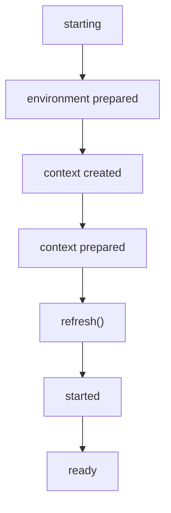

[GitHub 저장소](https://github.com/polynomeer/spring-internals-lab)

## Spring Boot를 별도 프레임워크처럼 보면 오해가 생긴다

Boot를 처음 쓰면 모든 것이 너무 쉽게 돌아간다.

```java
SpringApplication.run(App.class, args);
```

이 한 줄 때문에 Boot를 Framework와는 다른 거대한 마법처럼 느끼기 쉽다. 하지만 `spring-internals-lab`의 17~19주차를 따라가면 인상이 달라진다.

이번 글의 질문은 다음과 같다.

- `SpringApplication.run()`은 실제로 무슨 순서로 일을 하는가
- 자동 설정 후보는 어디서 오고, 왜 사용자 설정 뒤에 적용되는가
- `@ConditionalOnClass`, `@ConditionalOnMissingBean`, `@ConditionalOnProperty`는 내부적으로 무엇인가

핵심 결론은 간단하다.

> Spring Boot는 새 컨테이너를 만든다기보다, 기존 Spring 컨테이너 위에 조립 순서와 기본값을 얹는다.

## `SpringApplication`은 컨텍스트가 생기기 전부터 움직인다

`SpringApplication` 실험에서 가장 중요한 관찰은 이벤트 시점이다.

| 이벤트 | 이 시점에 있는 것 |
| --- | --- |
| `ApplicationStartingEvent` | 컨텍스트 없음, Environment도 없음 |
| `ApplicationEnvironmentPreparedEvent` | Environment 있음, 컨텍스트 없음 |
| `ApplicationContextInitializedEvent` | 컨텍스트 있음, Bean 조회는 아직 안 됨 |
| `ApplicationPreparedEvent` | BeanDefinition 일부 있음, `refresh()` 전 |
| `ApplicationStartedEvent` | `refresh()` 완료 |
| `ApplicationReadyEvent` | runner까지 완료 |

즉 Boot는 `ApplicationContext`가 생기기도 전에 이미 별도 이벤트 파이프라인을 돌린다.



이 구조를 보면 왜 일부 리스너는 `@Component`로 등록하면 너무 늦는지도 이해된다. 컨텍스트가 아직 없는데, 그 컨텍스트가 만들어 줄 Bean 리스너가 초기 이벤트를 받을 방법은 없다.

## Boot의 첫 번째 핵심은 `SpringApplication`

`SpringApplication.run()`이 하는 일을 줄이면 이렇다.

1. 초기 이벤트 발행
2. Environment 준비
3. 적절한 `ApplicationContext` 선택
4. 초기화기 적용
5. source 등록
6. `refresh()`
7. started / ready 이벤트 발행

즉 Boot는 컨테이너를 대체하지 않는다. 오히려 **컨테이너가 만들어지기 전과 후를 감싸는 상위 조율 계층**에 가깝다.

## 두 번째 핵심은 자동 설정 후보 탐색이다

자동 설정은 복잡한 리플렉션 스캔으로 시작하지 않는다. 18주차 실험에서 드러난 것처럼, 현재 Boot는 `.imports` 파일에서 후보 목록을 읽는다.

```text
META-INF/spring/org.springframework.boot.autoconfigure.AutoConfiguration.imports
```

이 파일은 놀랄 만큼 단순하다. 클래스 이름을 한 줄씩 적어 둔 텍스트 목록이다.

즉 Boot의 자동 설정 후보 탐색은 "클래스패스를 마구 뒤져서 찾아낸다"가 아니라, **모듈이 스스로 자신을 등록해 둔 목록을 읽는다**에 가깝다.

이 설계는 일관적이다.

- `ApplicationContextFactory`
- auto-configuration imports
- starter 모듈

전부 core가 세부 구현을 아는 대신, 모듈이 스스로 자신을 등록하는 구조다.

## 세 번째 핵심은 `DeferredImportSelector`다

자동 설정이 단순 `@Import`와 다른 가장 중요한 지점은 타이밍이다.

`@EnableAutoConfiguration`은 내부적으로 `DeferredImportSelector`를 사용한다. 이 말은 곧:

- 사용자 `@Configuration` 파싱을 먼저 끝내고
- 그다음 자동 설정 후보를 늦게 가져와
- 그 시점 상태를 보고 조건을 평가한다

는 뜻이다.


이게 중요한 이유는 `@ConditionalOnMissingBean` 때문이다. 사용자가 이미 등록한 Bean이 있는지 정확히 판단하려면, 사용자 설정이 먼저 끝나 있어야 한다.

즉 Boot 자동 설정은 단순 "나중에 추가 등록"이 아니라, **타이밍을 의도적으로 늦춘 import**다.

## 조건부 설정은 결국 `Condition` 인터페이스 하나로 수렴한다

`@ConditionalOnClass`, `@ConditionalOnBean`, `@ConditionalOnProperty`는 서로 완전히 다른 기능처럼 보이지만, 내부에서는 전부 `Condition` 평가로 수렴한다.

| 애노테이션 | 내부 질문 |
| --- | --- |
| `@ConditionalOnClass` | 특정 클래스가 있는가 |
| `@ConditionalOnMissingBean` | 특정 Bean이 아직 없는가 |
| `@ConditionalOnProperty` | 프로퍼티 값이 조건과 맞는가 |

즉 이름은 다르지만, 구조는 "현재 컨텍스트/환경 상태를 보고 이 후보를 등록할지 말지 결정한다"는 하나의 문제다.

이 통일성이 중요하다. Boot는 새로운 자동 설정 유형이 필요할 때마다 엔진을 새로 만들지 않는다. 그저 `Condition` 구현체를 더한다.

## `@ConditionalOnClass`는 클래스를 함부로 초기화하지 않는다

19주차 실험에서 특히 의미 있었던 포인트다. 클래스 존재 여부를 확인한다고 해서 그 클래스를 바로 초기화해 버리면 부작용이 커진다.

즉 Boot는 다음을 피하려 한다.

- static 초기화 블록 실행
- 불필요한 부수효과
- 선택적 의존성 부재 시 조기 실패

이건 7주차 컴포넌트 스캔에서 봤던 "Spring은 필요 이상으로 클래스를 건드리지 않는다"는 감각과 정확히 이어진다.

## `@ConditionalOnProperty`의 `matchIfMissing`은 기본값 정책을 만든다

실험에서 확인한 또 다른 포인트는 프로퍼티 조건이다.

- `havingValue = "true"`
- `matchIfMissing = true`

이 조합은 "명시적으로 끄지 않는 한 기본적으로 켜져 있다"는 정책을 만든다.

즉 Boot의 자동 설정은 단순 기술 메커니즘만이 아니라, **사용자 경험 기본값 정책**까지 함께 설계한다.

## 웹 서버 시작도 결국 기존 lifecycle 위에 올라탄다

17주차 후반 실험에서 확인한 흥미로운 사실도 있다. 내장 웹 서버는 컨텍스트가 어느 정도 끝난 뒤에 뜬다. 더 정확히는:

- 서버 객체 생성은 `onRefresh()` 근처
- 실제 시작은 `finishRefresh()` 쪽 lifecycle 처리

즉 Boot가 특별한 별도 서버 기동 엔진을 만드는 게 아니라, Spring의 기존 lifecycle 메커니즘 위에 서버 시작을 자연스럽게 얹는다.

이 점은 Boot를 이해할 때 중요하다. Boot는 새 원리보다 **기존 Spring 확장점을 조합하는 방식**에 가깝다.

## 왜 Boot가 얇다고 말할 수 있는가

지금까지 본 걸 다시 정리하면:

- 컨테이너는 여전히 `refresh()`가 만든다.
- AOP도 여전히 BeanPostProcessor와 프록시가 만든다.
- MVC도 여전히 `DispatcherServlet`이 처리한다.
- 트랜잭션도 여전히 인터셉터가 처리한다.

Boot가 더하는 것은 주로 다음이다.

- 시작 순서 조율
- 후보 탐색
- 기본값 제공
- 조건부 등록

즉 Boot는 Framework를 대체하지 않는다. **Framework를 조립하고 기본값으로 채워 주는 얇은 레이어**라고 보는 편이 정확하다.

## 정리

이번 글의 핵심은 다섯 가지다.

1. `SpringApplication`은 컨텍스트 바깥과 안쪽을 잇는 상위 조율 계층이다.
2. 자동 설정 후보는 `.imports` 파일처럼 매우 단순한 등록 메커니즘에서 온다.
3. `DeferredImportSelector`가 사용자 설정 이후라는 타이밍을 보장한다.
4. `@ConditionalOnXxx`는 결국 `Condition` 평가로 수렴한다.
5. Boot는 새 프레임워크보다 기존 Spring 메커니즘을 조립하는 얇은 기본값 계층에 가깝다.

이걸 기준으로 보면 Boot의 편리함도 덜 마법처럼 느껴진다. 새로운 원리를 추가하는 대신, 이미 있는 컨테이너, lifecycle, import, condition, event 시스템을 **사용자가 직접 wiring하지 않아도 되게 정교하게 배선해 둔 것**이 Boot의 핵심이다.
