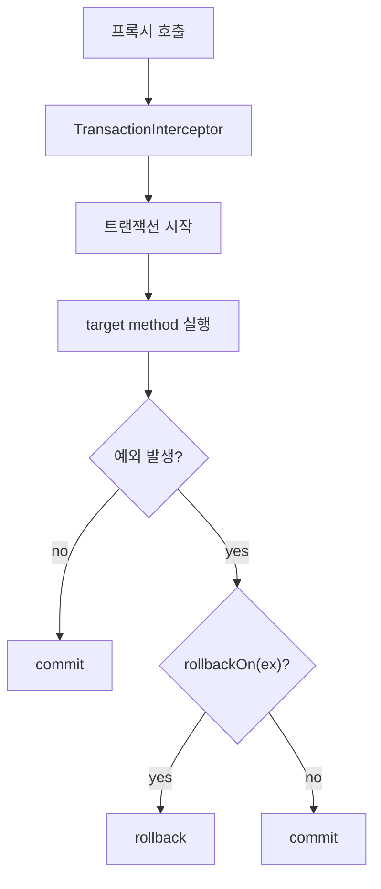
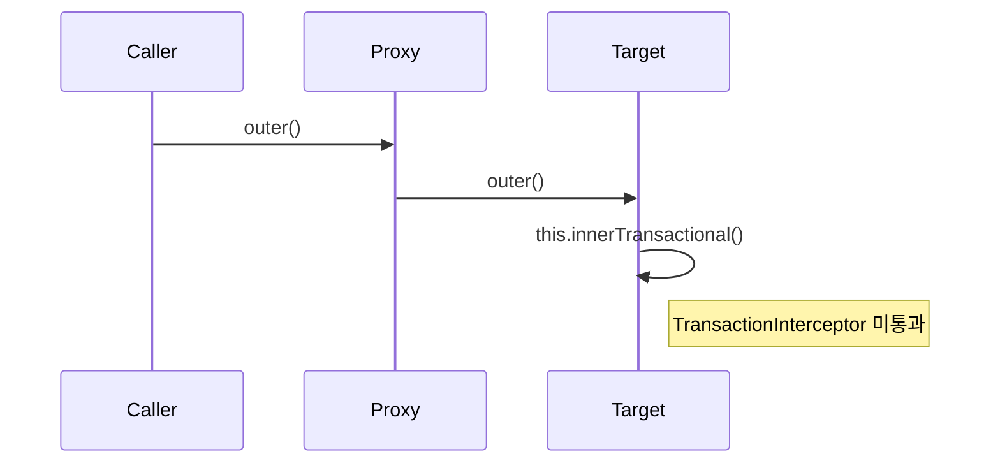
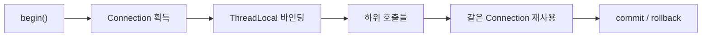

[GitHub 저장소](https://github.com/polynomeer/spring-internals-lab)

## `@Transactional`은 애노테이션이 아니라 인터셉터다

Spring을 오래 써도 `@Transactional`은 자꾸 마법처럼 느껴진다. 하지만 앞선 글에서 AOP 구조를 먼저 정리해 두면 이 기능도 훨씬 덜 추상적으로 보인다.

이번 글의 질문은 다음과 같다.

- `@Transactional`은 실제로 어디서 트랜잭션을 시작하는가
- 어떤 예외에서 롤백하고 어떤 예외에서는 커밋하는가
- `readOnly`는 실제로 무엇을 보장하는가
- self-invocation과 `private` 메서드에 붙은 `@Transactional`은 왜 조용히 무시되는가

핵심 결론부터 말하면, `@Transactional`은 결국 **트랜잭션 인터셉터 하나**다.

## 호출 흐름은 surprisingly small 하다

실제 구조를 단순화하면 이렇다.



즉 핵심은 `rollbackOn(Throwable)` 규칙이다. 예외가 났다는 사실만으로 롤백이 결정되지 않는다.

## checked 예외는 기본적으로 롤백되지 않는다

이건 실무에서 정말 자주 착각한다. `transaction-propagation-playground` 실험이 가장 강하게 보여준 결과도 이 부분이다.

```java
@Transactional
public void noRollbackOnCheckedExceptionByDefault(...) throws Exception {
    adjustBalance(...);
    throw new IOException("checked failure");
}
```

직관적으로는 예외가 났으니 롤백할 것 같지만, 실제로는 커밋된다.

기본 규칙은 다음과 같다.

| 예외 | 기본 동작 |
| --- | --- |
| `RuntimeException` | 롤백 |
| `Error` | 롤백 |
| checked `Exception` | 커밋 |

즉 `@Transactional`은 "예외면 롤백"이 아니라 "특정 종류의 예외면 롤백"이다.

## `rollbackFor`는 규칙 테이블을 바꾸는 장치다

이 기본 규칙을 뒤집는 방법이 `rollbackFor`다.

```java
@Transactional(rollbackFor = Exception.class)
public void rollbackOnCheckedExceptionWithRollbackFor(...) throws Exception { ... }
```

이제 checked 예외도 롤백한다.

즉 `rollbackFor`는 transaction manager의 특별 옵션이 아니라, 결국 **`rollbackOn(Throwable)` 판정 테이블을 더 넓히는 선언**으로 이해하면 된다.

## `readOnly=true`는 생각보다 약한 계약이다

많이 오해하는 부분이 또 있다. `readOnly=true`를 붙이면 쓰기 쿼리가 막힐 것 같지만, 기본 `DataSourceTransactionManager`에서는 그렇지 않을 수 있다.

실험 결과도 그랬다.

- `TransactionSynchronizationManager.isCurrentTransactionReadOnly()`는 `true`
- 그런데 실제 쓰기 쿼리는 성공

즉 `readOnly`는 기본적으로 **힌트**다.

이게 의미하는 바는 분명하다.

- transaction attribute에는 read-only 정보가 있다
- 하지만 실제 JDBC 드라이버/매니저가 강제하지 않을 수 있다
- ORM 최적화나 flush 전략 쪽에서 더 유용하게 쓰일 수 있다

즉 `readOnly=true`를 "DB 쓰기 차단 스위치"로 보면 오해가 생긴다.

## self-invocation이 안 되는 이유는 여기서도 같다

앞선 AOP 글에서 본 self-invocation 문제는 `@Transactional`에서도 그대로 재현된다.

```java
public void outer() {
    this.innerTransactionalMethod();
}
```

왜냐하면 `innerTransactionalMethod()` 호출은 프록시로 되돌아가지 않기 때문이다. 즉 `TransactionInterceptor` 자체를 통과하지 못한다.



이 문제는 transaction 기능의 특수성보다 **프록시 기반 AOP의 일반 성질**이다.

## `private` 메서드가 안 되는 이유도 동일하다

`private` 메서드는 프록시가 오버라이드할 수 없으므로 가로챌 수 없다. 즉 여기에 `@Transactional`을 붙여도 구조적으로 트랜잭션 경계가 만들어질 수 없다.

이건 "지원 안 하는 문법"이 아니라, **프록시 구현 전략상 개입 지점이 존재하지 않는 경우**다.

## 커넥션 공유는 어떻게 되는가

트랜잭션이 실제로 의미 있으려면 같은 작업 단위 안에서 같은 JDBC `Connection`을 써야 한다. `mini-transaction`이 이 점을 아주 잘 드러낸다.

간단히 요약하면:

- 트랜잭션 시작 시 커넥션을 얻는다.
- 그 커넥션을 현재 스레드에 바인딩한다.
- 같은 스레드의 하위 작업은 새 커넥션이 아니라 기존 커넥션에 참여한다.



즉 트랜잭션은 단순 begin/commit 로그가 아니라, **스레드 범위 자원 바인딩**과 함께 봐야 한다.

## mini-spring이 보여주는 핵심

`mini-transaction`의 `MiniTransactionInterceptor`는 뼈대를 거의 그대로 드러낸다.

```java
try {
    Object result = invocation.proceed();
    transactionManager.commit(status);
    return result;
} catch (Throwable ex) {
    transactionManager.rollback(status);
    throw ex;
}
```

물론 실제 Spring보다 단순하다.

- 예외 종류별 rollback 규칙 없음
- `readOnly`, `timeout` 없음
- rollback-only 전파 단순화

하지만 오히려 이 단순함 때문에 구조가 잘 보인다.

1. 인터셉터가 있다.
2. transaction manager가 있다.
3. 현재 스레드 커넥션 바인딩이 있다.

즉 `@Transactional`의 최소 구조는 이미 여기 다 들어 있다.

## 왜 checked 예외는 기본적으로 커밋일까

이건 설계 철학 문제다. checked 예외는 종종 "호출자가 처리 가능한 비즈니스적 예외"로 쓰이고, unchecked 예외는 시스템 오류로 쓰인다는 오래된 관례가 있다.

물론 현실의 코드베이스가 이 규칙을 항상 잘 따르진 않는다. 그래서 Spring은 기본값은 주되 `rollbackFor`로 뒤집을 수 있게 한다.

즉 Spring은 "무조건 한 가지 규칙"보다 **관례 기반 기본값 + 명시적 override**를 택한다.

## 정리

이번 글의 핵심은 다섯 가지다.

1. `@Transactional`의 실체는 `TransactionInterceptor`다.
2. 롤백 여부는 예외 발생 자체가 아니라 `rollbackOn(Throwable)` 규칙이 결정한다.
3. checked 예외는 기본적으로 커밋된다.
4. `readOnly=true`는 기본적으로 힌트에 가깝다.
5. self-invocation과 `private` 메서드 한계는 트랜잭션 특수성이 아니라 프록시 기반 AOP의 일반 한계다.

결국 `@Transactional`은 별도 마법이 아니라, 앞 글에서 본 프록시와 인터셉터 체인을 데이터 접근과 연결한 응용 사례다.

다음 글에서는 같은 방식으로 MVC 쪽을 본다. `DispatcherServlet`도 하나의 거대한 마법보다는, 여러 작은 책임을 분리해 조립한 결과에 가깝다.
