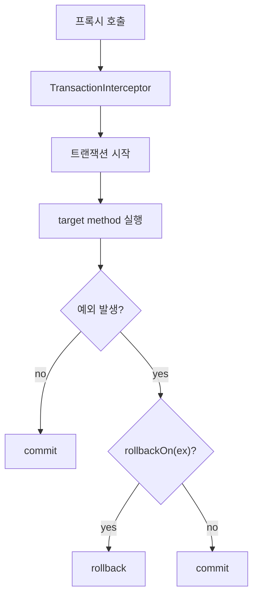
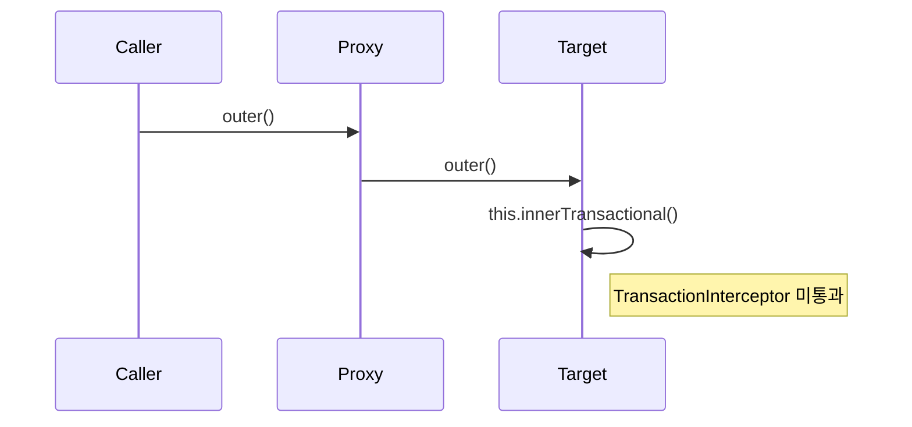
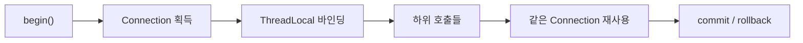

[GitHub 저장소](https://github.com/polynomeer/spring-lab)

## `@Transactional`은 애노테이션이 아니라 인터셉터다

Spring을 오래 써도 `@Transactional`은 자꾸 마법처럼 느껴진다. 하지만 [앞선 글](/posts/spring-internals-lab-proxy-aop/)에서 프록시와 AOP 구조를 먼저 정리해 두면 이 기능도 훨씬 덜 추상적으로 보인다.

이번 글의 질문은 다음과 같다.

- `@Transactional`은 실제로 어디서 트랜잭션을 시작하는가
- 어떤 예외에서 롤백하고 어떤 예외에서는 커밋하는가
- `readOnly`는 실제로 무엇을 보장하는가
- self-invocation과 `private` 메서드에 붙은 `@Transactional`은 왜 조용히 무시되는가

결론부터 말하면, `@Transactional`은 결국 **트랜잭션 인터셉터 하나**다.

## 호출 흐름은 생각보다 작다

실제 구조를 단순화하면 이렇다.


```mermaid
flowchart TD
    A["프록시 호출"] --> B["TransactionInterceptor"]
    B --> C["트랜잭션 시작"]
    C --> D["target method 실행"]
    D --> E{"예외 발생?"}
    E -- no --> F["commit"]
    E -- yes --> G{"rollbackOn(ex)?"}
    G -- yes --> H["rollback"]
    G -- no --> I["commit"]
```

그림에서 갈림길은 `rollbackOn(Throwable)` 판정 하나다. 예외가 났다는 사실만으로 롤백이 결정되지 않는다.

## checked 예외는 기본적으로 롤백되지 않는다

실무에서 자주 착각하는 부분이다. `transaction-propagation-playground` 실험이 가장 분명하게 보여준 결과도 이것이다.

```java
@Transactional
public void noRollbackOnCheckedExceptionByDefault(...) throws Exception {
    adjustBalance(...);
    throw new IOException("checked failure");
}
```

직관적으로는 예외가 났으니 롤백할 것 같지만, 실제로는 커밋된다.

기본 규칙은 다음과 같다([Spring 문서](https://docs.spring.io/spring-framework/reference/data-access/transaction/declarative/rolling-back.html)).

| 예외 | 기본 동작 |
| --- | --- |
| `RuntimeException` | 롤백 |
| `Error` | 롤백 |
| checked `Exception` | 커밋 |

그래서 `@Transactional`은 "예외면 롤백"이 아니라 "특정 종류의 예외면 롤백"으로 읽어야 한다.

## `rollbackFor`는 규칙 테이블을 바꾸는 장치다

이 기본 규칙을 뒤집는 방법이 `rollbackFor`다.

```java
@Transactional(rollbackFor = Exception.class)
public void rollbackOnCheckedExceptionWithRollbackFor(...) throws Exception { ... }
```

이제 checked 예외도 롤백한다.

`rollbackFor`는 transaction manager의 특별 옵션이 아니라, `rollbackOn(Throwable)` 판정 테이블을 더 넓히는 선언으로 이해하면 된다.

## `readOnly=true`는 생각보다 약한 계약이다

`readOnly=true`를 붙이면 쓰기 쿼리가 막힐 것 같지만, 기본 `DataSourceTransactionManager`에서는 그렇지 않을 수 있다.

실험 결과도 그랬다.

- `TransactionSynchronizationManager.isCurrentTransactionReadOnly()`는 `true`
- 그런데 실제 쓰기 쿼리는 성공

`readOnly`는 기본적으로 힌트이기 때문이다. `@Transactional` Javadoc은 이 속성을 이렇게 설명한다.

> "This just serves as a hint for the actual transaction subsystem; it will *not necessarily* cause failure of write access attempts."
> ([Transactional Javadoc](https://docs.spring.io/spring-framework/docs/current/javadoc-api/org/springframework/transaction/annotation/Transactional.html))

하위 시스템에 주는 힌트일 뿐이고, 쓰기 시도를 반드시 실패시키지는 않는다는 뜻이다. 그래서 다음과 같이 읽어야 한다.

- transaction attribute에는 read-only 정보가 있다
- 하지만 실제 JDBC 드라이버/매니저가 강제하지 않을 수 있다
- ORM 최적화나 flush 전략 쪽에서 더 유용하게 쓰일 수 있다

그래서 `readOnly=true`를 "DB 쓰기 차단 스위치"로 보면 오해가 생긴다.

## self-invocation이 안 되는 이유는 여기서도 같다

앞선 AOP 글에서 본 [self-invocation](/posts/proxy-limits/) 문제는 `@Transactional`에서도 그대로 재현된다.

```java
public void outer() {
    this.innerTransactionalMethod();
}
```

`this`로 부른 `innerTransactionalMethod()` 호출은 프록시로 되돌아가지 않는다. 그래서 `TransactionInterceptor`를 아예 통과하지 못한다. 공식 문서도 기본 proxy 모드에서는 프록시를 거친 외부 호출만 가로챈다고 적고 있다([Using @Transactional](https://docs.spring.io/spring-framework/reference/data-access/transaction/declarative/annotations.html)).


```mermaid
sequenceDiagram
    participant Caller
    participant Proxy
    participant Target

    Caller->>Proxy: outer()
    Proxy->>Target: outer()
    Target->>Target: this.innerTransactional()
    Note right of Target: TransactionInterceptor 미통과
```

이 문제는 트랜잭션 기능의 특수성이라기보다 프록시 기반 AOP의 일반 성질이다.

## `private` 메서드가 안 되는 이유도 동일하다

`private` 메서드는 프록시가 오버라이드할 수 없으므로 가로챌 수 없다. 그래서 여기에 `@Transactional`을 붙여도 트랜잭션 경계가 만들어지지 않는다. 같은 문서는 6.0부터 클래스 기반 프록시에서 `protected`와 package-visible 메서드까지 허용한다고 적는데, `private`은 여기에 없다.

"지원 안 하는 문법"이라기보다, 프록시 구현 전략상 개입 지점이 존재하지 않는 경우다.

## 커넥션 공유는 어떻게 되는가

트랜잭션이 실제로 의미 있으려면 같은 작업 단위 안에서 같은 JDBC `Connection`을 써야 한다. `mini-transaction`이 이 점을 잘 드러낸다. 흐름은 다음과 같다.

- 트랜잭션 시작 시 커넥션을 얻는다.
- 그 커넥션을 현재 스레드에 바인딩한다.
- 같은 스레드의 하위 작업은 새 커넥션이 아니라 기존 커넥션에 참여한다.


```mermaid
flowchart LR
    A["begin()"] --> B["Connection 획득"]
    B --> C["ThreadLocal 바인딩"]
    C --> D["하위 호출들"]
    D --> E["같은 Connection 재사용"]
    E --> F["commit / rollback"]
```

커넥션이 스레드에 묶여 있어서 하위 호출이 같은 트랜잭션에 참여한다. 그래서 트랜잭션은 begin/commit 로그만이 아니라 스레드 범위 자원 바인딩과 함께 봐야 한다. 여러 메서드가 이 커넥션을 공유하거나 새로 여는 규칙은 [트랜잭션 전파](/posts/transaction-propagation/)에서 다룬다.

## mini-spring이 보여주는 핵심

`mini-transaction`의 `MiniTransactionInterceptor`는 뼈대를 거의 그대로 드러낸다.

```java
try {
    Object result = invocation.proceed();
    transactionManager.commit(status);
    return result;
} catch (Throwable ex) {
    transactionManager.rollback(status);
    throw ex;
}
```

물론 실제 Spring보다 단순하다.

- 예외 종류별 rollback 규칙 없음
- `readOnly`, `timeout` 없음
- rollback-only 전파 단순화

대신 이 단순함 덕분에 구조가 잘 보인다.

1. 인터셉터가 있다.
2. transaction manager가 있다.
3. 현재 스레드 커넥션 바인딩이 있다.

`@Transactional`의 최소 구조는 이 세 가지로 이미 다 들어 있다.

## 왜 checked 예외는 기본적으로 커밋일까

이건 설계 관례의 문제다. checked 예외는 종종 "호출자가 처리 가능한 비즈니스적 예외"로 쓰이고, unchecked 예외는 시스템 오류로 쓰인다는 오래된 관례가 있다.

물론 현실의 코드베이스가 이 규칙을 항상 잘 따르진 않는다. 그래서 Spring은 기본값은 주되 `rollbackFor`로 뒤집을 수 있게 한다.

Spring은 "무조건 한 가지 규칙"보다 관례 기반 기본값과 명시적 override를 함께 두는 쪽을 택했다.

## 정리

앞의 질문 네 개는 모두 같은 구조로 답할 수 있다. 트랜잭션 시작 위치, 롤백 판정, self-invocation과 `private`의 한계는 프록시 앞의 인터셉터 하나에서 나오고, `readOnly`는 그 인터셉터가 하위 시스템에 넘기는 힌트일 뿐이다. 결국 `@Transactional`은 별도 마법이 아니라, 앞 글에서 본 프록시와 인터셉터 체인을 데이터 접근과 연결한 응용 사례다.

[다음 글](/posts/spring-internals-lab-dispatcher-servlet/)에서는 같은 방식으로 MVC 쪽을 본다. `DispatcherServlet`도 하나의 거대한 마법보다는, 여러 작은 책임을 분리해 조립한 결과에 가깝다.

## 참고

- [Rolling Back a Declarative Transaction](https://docs.spring.io/spring-framework/reference/data-access/transaction/declarative/rolling-back.html) — Spring Framework Reference
- [Using @Transactional](https://docs.spring.io/spring-framework/reference/data-access/transaction/declarative/annotations.html) — Spring Framework Reference
- [Transactional (Javadoc)](https://docs.spring.io/spring-framework/docs/current/javadoc-api/org/springframework/transaction/annotation/Transactional.html) — Spring Framework API
