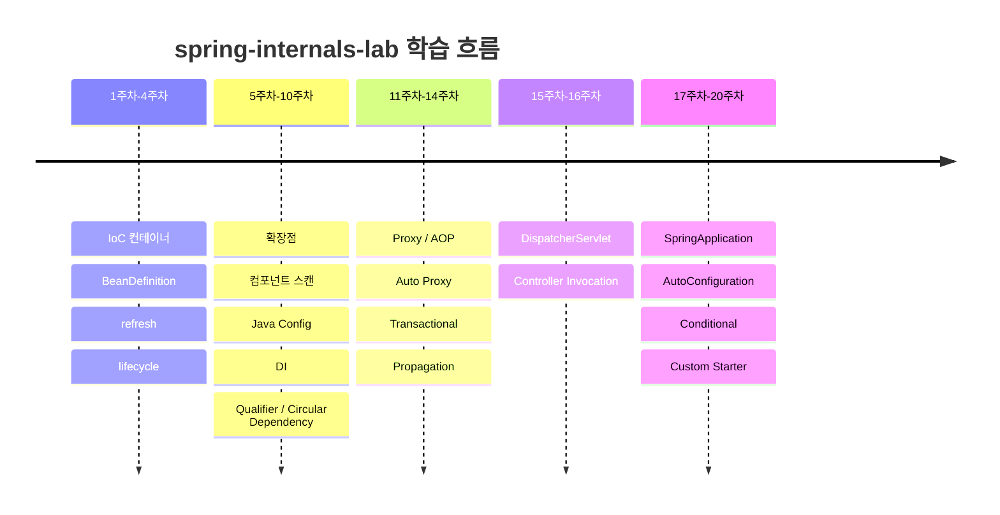
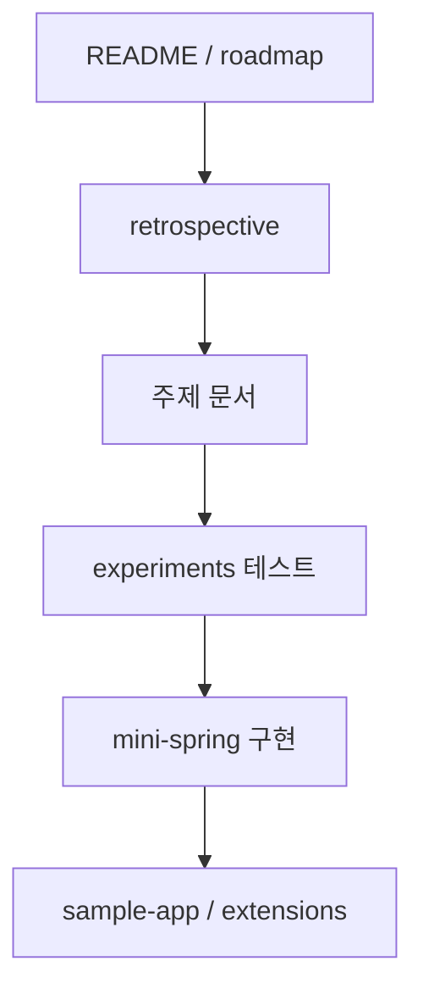

[GitHub 저장소](https://github.com/polynomeer/spring-internals-lab)

## 왜 이런 저장소가 따로 필요한가

Spring을 오래 써도 아래 질문은 의외로 끝까지 흐릿하게 남는다.

- Bean은 등록만 된 상태와 실제 생성된 상태가 어떻게 다른가
- `BeanPostProcessor`는 정확히 어느 타이밍에 개입하는가
- `@Transactional`은 왜 프록시를 통해서만 동작하는가
- `DispatcherServlet`은 요청을 어떤 단계로 분해해서 처리하는가
- Spring Boot는 Framework 위에 무엇을 추가하는가

이 질문들은 API 사용법만으로는 답하기 어렵다. 설정 클래스를 작성하고 애노테이션을 붙이는 쪽에서 보면 Spring은 너무 매끄럽게 동작한다. 하지만 장애 분석이나 설계 판단은 늘 그 아래 계층에서 벌어진다.

`spring-internals-lab`은 이 간극을 메우기 위한 학습 저장소다. 핵심은 단순하다. Spring을 추상 개념으로 외우지 않고, 실제 동작을 실험으로 관찰하고, 그 결과를 축소 구현으로 다시 만들며, 마지막에 설계 의도를 문서로 정리한다.

## 이 저장소가 반복하는 학습 루프

README에 적힌 학습 루프가 이 프로젝트의 핵심이다.

```text
공식 문서 → 질문 → 최소 예제 → 인터페이스 → 구현체 → 디버깅 → 공식 테스트 → 축소 구현 → 설계 의도 정리
```

이 순서를 그대로 따라가면 좋은 이유는 각 단계가 서로 다른 종류의 착각을 제거하기 때문이다.

| 단계 | 하는 일 | 막아 주는 착각 |
| --- | --- | --- |
| 공식 문서 | 개념과 계약을 먼저 확인 | 구현 세부를 일반 규칙으로 오해하는 일 |
| 최소 예제 | 아주 작은 코드로 실행 결과 확인 | "아마 이럴 것"이라는 추측 |
| 인터페이스/구현체 추적 | 어떤 추상화가 어떤 구현으로 닫히는지 확인 | 클래스 이름만 외우는 공부 |
| 디버깅/테스트 | 실제 호출 순서와 객체 상태 관찰 | 문서와 실제 실행이 항상 같을 것이라는 가정 |
| 축소 구현 | 메커니즘을 직접 재구성 | 내부 구조를 이해했다고 착각하는 일 |
| 설계 의도 정리 | 왜 그렇게 나뉘는지 언어로 설명 | 동작은 봤지만 이유를 설명 못하는 상태 |

즉 이 저장소는 "Spring 소스코드를 읽는다"보다 한 단계 더 나간다. 읽은 내용을 반드시 실행 결과와 구현 결과로 닫는다.

## 저장소 전체 구조

이 프로젝트는 하나의 애플리케이션이 아니라 역할별로 분리된 학습용 모듈 모음이다.

```text
spring-internals-lab
├── experiments/
├── mini-spring/
├── spring-extensions/
├── sample-app/
├── tools/
└── docs/
```

각 디렉터리가 맡는 역할은 명확하다.

| 디렉터리 | 역할 | 대표 예시 |
| --- | --- | --- |
| `experiments/` | 실제 Spring 또는 Spring Boot 위에서 동작을 관찰 | `ioc-container-lab`, `dispatcher-servlet-trace`, `transaction-propagation-playground` |
| `mini-spring/` | 핵심 메커니즘을 의존성 최소화 상태로 축소 재구현 | `mini-container`, `mini-aop`, `mini-webmvc`, `mini-transaction` |
| `spring-extensions/` | 실제 Spring 확장 포인트를 활용한 구현 | `current-user-argument-resolver`, `method-timing-post-processor` |
| `sample-app/` | 앞에서 배운 메커니즘을 실제 애플리케이션으로 조립 | `mini-order-platform`, `transactional-outbox-order` |
| `tools/` | 학습 과정을 돕는 보조 도구 | `jdi-tracer`, `learning-dashboard` |
| `docs/` | 매 주제별 분석 문서와 다이어그램 | `01-ioc-container` ~ `26-method-validation` |

이 분리가 중요한 이유는 실험, 재구현, 실전 조립이 서로 다른 질문에 답하기 때문이다.

## 한 번에 보면 구조가 더 잘 보인다


여기서 중요한 점은 `mini-spring`이 출발점이 아니라는 것이다. 먼저 실제 Spring을 보고, 그 뒤에 최소 구조를 다시 만든다. 이 순서가 뒤집히면 "내가 만든 단순 프레임워크"를 Spring에 억지로 투영하게 된다.

## `experiments`는 관찰 도구다

`experiments`는 가장 먼저 읽어야 하는 디렉터리다. 이름 그대로 가설을 코드로 검증하는 공간이다.

예를 들어 다음과 같은 모듈이 있다.

- `ioc-container-lab`
- `bean-lifecycle-recorder`
- `context-refresh-visualizer`
- `proxy-playground`
- `transaction-propagation-playground`
- `dispatcher-servlet-trace`
- `spring-application-lifecycle`

이 이름만 봐도 각 모듈의 질문이 드러난다.

| 모듈 | 확인하려는 질문 |
| --- | --- |
| `ioc-container-lab` | BeanFactory와 ApplicationContext는 어떻게 다른가 |
| `bean-lifecycle-recorder` | init, post-process, destroy는 어떤 순서로 실행되는가 |
| `context-refresh-visualizer` | `refresh()`는 어떤 단계를 거쳐 컨테이너를 완성하는가 |
| `proxy-playground` | JDK 동적 프록시와 서브클래스 프록시는 어디서 갈리는가 |
| `transaction-propagation-playground` | self-invocation, rollback 규칙, propagation은 어떻게 동작하는가 |
| `dispatcher-servlet-trace` | 요청이 HandlerMapping, Adapter, Resolver를 어떻게 통과하는가 |
| `spring-application-lifecycle` | Boot 이벤트와 웹 서버 시작 시점은 언제인가 |

이런 실험 모듈의 강점은 "실제 Spring이 진짜 그렇게 동작하는가"를 먼저 고정할 수 있다는 데 있다.

## `mini-spring`은 설명 가능한 크기로 줄여 놓은 구현이다

실험만으로는 구조 이해가 완결되지 않는다. 그래서 이 프로젝트는 같은 주제를 축소 구현으로 다시 한 번 다룬다.

대표 모듈은 다음과 같다.

- `mini-container`
- `mini-component-scan`
- `mini-java-config`
- `mini-aop`
- `mini-auto-proxy`
- `mini-transaction`
- `mini-webmvc`
- `mini-event`

이 모듈들의 공통점은 "Spring과 비슷해 보이는 프레임워크를 만든다"가 목표가 아니라는 점이다. 목표는 특정 메커니즘을 설명 가능한 크기로 줄이는 것이다.

예를 들어 트랜잭션을 이해할 때 이 프로젝트는 바로 `@Transactional` 구현 전체를 복제하지 않는다. 먼저 `mini-aop`에서 인터셉터 체인을 만들고, 그 위에 `mini-transaction`을 올린다. 이 구조는 트랜잭션이 독립 기능이 아니라 AOP 위에 얹힌 어드바이스라는 사실을 코드 구조 자체로 드러낸다.

## 이 저장소는 주차별로 범위를 닫아 간다

README에는 20주 로드맵이라고 적혀 있지만, 실제 문서와 회고를 보면 그 뒤 주제까지 이어진다. 그래도 큰 줄기는 1~20주차에서 잡혀 있다.



이 구조를 보면 왜 시리즈를 추상 개념별이 아니라 주차별 핵심 메커니즘 기준으로 나누는 게 좋은지도 알 수 있다. 각 문서가 하나의 질문을 닫기 때문이다.

## 숫자로 보면 프로젝트 크기가 감이 온다

README와 회고 문서 기준으로 드러나는 숫자는 이렇다.

- 핵심 20주 로드맵 완료
- 자동화 테스트 217개 통과
- 코드 모듈 22개 이상 운용
- 주차 문서 20개 이상 작성
- 이후 추가 주제 21~26번까지 확장

이 숫자가 중요한 이유는 "블로그용 미니 프로젝트" 수준이 아니라는 점을 보여주기 때문이다. 특히 테스트 수가 많다는 것은 이 저장소가 생각 정리가 아니라 관찰 결과를 재현 가능한 형태로 고정해 두고 있다는 뜻이다.

## 어떤 질문을 어떤 모듈로 검증하는가

이 저장소의 강점은 질문과 근거 코드가 비교적 명확하게 대응된다는 데 있다.

| 질문 | 실제 Spring에서 확인하는 모듈 | 축소 구현 모듈 |
| --- | --- | --- |
| Bean은 언제 만들어지는가 | `experiments/context-refresh-visualizer` | `mini-spring/mini-container` |
| Bean lifecycle 순서는 무엇인가 | `experiments/bean-lifecycle-recorder` | `mini-spring/mini-container` 확장 |
| `@Configuration`의 `@Bean` 메서드는 왜 싱글톤을 보장하는가 | `experiments/configuration-proxy-lab` | `mini-spring/mini-java-config` |
| 생성자 주입과 `@Qualifier` 충돌은 어떻게 풀리는가 | `experiments/dependency-resolution-matrix` | `mini-spring/mini-container` |
| self-invocation은 왜 프록시를 우회하는가 | `experiments/transaction-propagation-playground` | `mini-spring/mini-aop`, `mini-spring/mini-auto-proxy` |
| MVC 요청은 어떤 계층으로 분해되는가 | `experiments/dispatcher-servlet-trace` | `mini-spring/mini-webmvc` |
| Boot는 언제 이벤트를 발행하고 서버를 띄우는가 | `experiments/spring-application-lifecycle` | 축소 구현 대신 실제 소스/실험 중심 |

이 표가 중요한 이유는 시리즈 글을 쓸 때도 같은 방식으로 구조를 잡을 수 있기 때문이다. 하나의 글은 하나의 질문을 기준으로 쓰고, 그 질문에 대응하는 `experiments`와 `mini-spring`을 같이 읽으면 된다.

## 이 저장소를 읽는 가장 좋은 순서

처음부터 `mini-spring` 코드만 보면 오히려 이해가 잘 안 된다. 아래 순서가 더 낫다.

1. `README.md`로 전체 방법론과 범위를 읽는다.
2. `docs/retrospective/retrospective.md`로 이 프로젝트가 반복해서 발견한 설계 패턴을 먼저 본다.
3. 관심 주제의 `docs/<NN>-<topic>` 문서를 읽는다.
4. 같은 주제의 `experiments/` 테스트를 본다.
5. 마지막에 `mini-spring/` 구현을 본다.

이 순서가 좋은 이유는 아래와 같다.



정리하면, 문서가 질문을 제시하고, 실험이 사실을 고정하고, 축소 구현이 메커니즘을 설명한다.

## 코드 구조로 보면 이 프로젝트의 의도가 더 선명하다

아래는 README의 빌드 예시다.

```bash
./gradlew build
./gradlew :experiments:ioc-container-lab:test
./gradlew :mini-spring:mini-container:test --tests "*SimpleBeanFactoryTest"
```

이 명령만 봐도 구조가 읽힌다.

- 저장소 전체는 하나의 Gradle 멀티모듈 프로젝트다.
- 주제별 모듈을 독립적으로 테스트할 수 있다.
- `experiments`와 `mini-spring`이 같은 수준의 1급 학습 산출물이다.

즉, 이 레포는 "문서를 쓰기 위해 코드가 있는" 구조가 아니라, "코드 실험과 구현이 있고 문서는 그것을 설명하는" 구조에 가깝다.

## 왜 이런 방식이 Spring 학습에 특히 잘 맞는가

Spring은 기능이 많은 프레임워크이기도 하지만, 그보다 먼저 추상화 계층이 많은 프레임워크다.

- 컨테이너
- 빈 정의
- 후처리기
- 프록시
- 트랜잭션 경계
- MVC 디스패치
- Boot 자동 조립

문제가 생길 때도 대부분 "어느 계층에서 판단이 바뀌었는가"를 찾아야 한다. `spring-internals-lab`은 바로 그 계층을 억지로 드러내게 만든다.

예를 들어 `@Transactional` 하나를 이해하겠다고 해도 실제로는 다음 흐름을 따라가야 한다.


이걸 한 번이라도 실험과 축소 구현으로 보면, 트랜잭션을 더 이상 애노테이션 문법으로만 보지 않게 된다.

## 이 시리즈 1편이 맡는 역할

이번 글은 세부 메커니즘으로 들어가기 전, `spring-internals-lab`이라는 저장소가 어떤 질문을 어떤 방식으로 닫는지 구조를 잡는 글이다. 이후 편에서는 각 계층을 실제 코드 중심으로 따로 판다.

다음 편부터는 아래 순서로 내려갈 예정이다.

1. BeanDefinition과 등록 단계
2. `refresh()`와 Bean 생성 파이프라인
3. 의존성 주입과 `@Qualifier`
4. Bean lifecycle과 후처리기
5. 프록시와 AOP
6. `@Transactional`과 Connection 관리
7. `DispatcherServlet`과 MVC 요청 흐름
8. `SpringApplication`, 자동 설정, 조건부 설정

## 정리

`spring-internals-lab`의 가치는 "Spring 비슷한 걸 구현했다"는 데 있지 않다. 더 정확히는 다음 세 가지를 한 저장소에서 모두 수행한다는 데 있다.

- 실제 Spring에서 관찰한다.
- 핵심 구조만 남겨 다시 구현한다.
- 그 둘 사이의 설계 의도를 문서로 정리한다.

Spring을 깊게 이해하려면 결국 "이 애노테이션이 무슨 뜻인가"보다 "어떤 계층이 어떤 타이밍에 어떤 객체를 바꾸는가"를 봐야 한다. 이 저장소는 그 질문을 추상 설명이 아니라 재현 가능한 코드와 문서로 바꿔 둔 프로젝트다.
