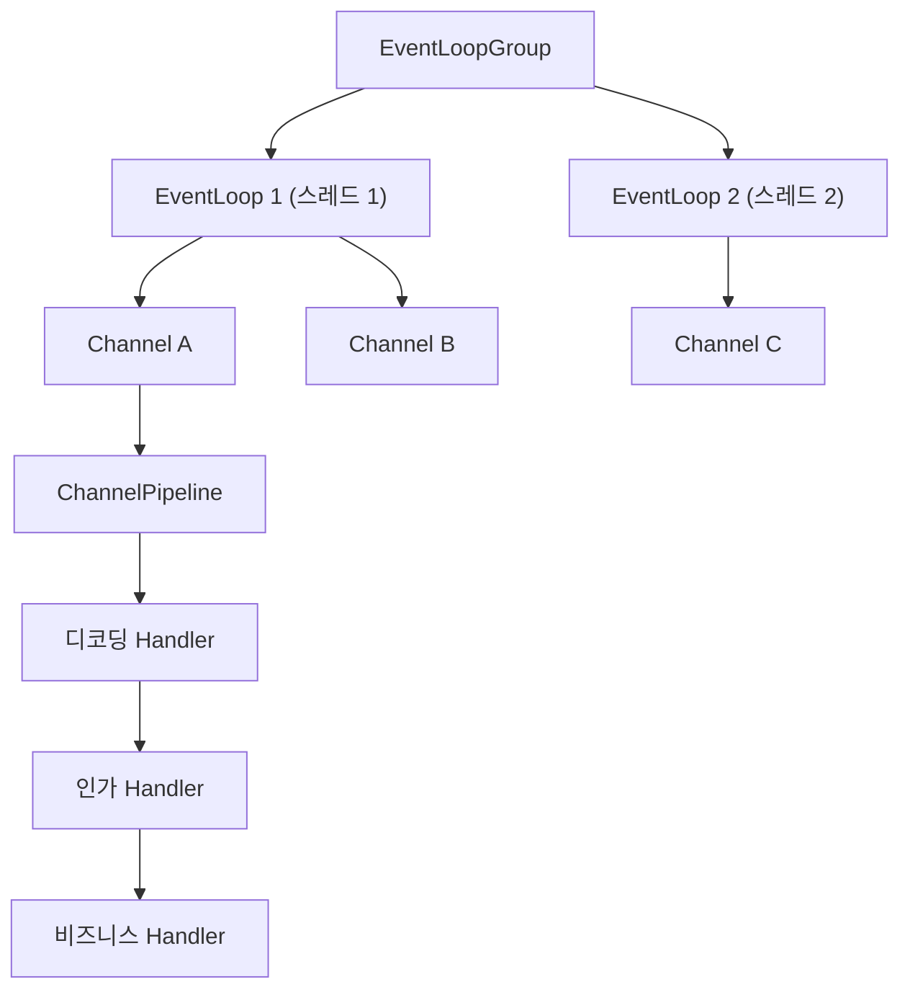

## Netty를 왜 배우는가

Netty는 Java에서 고성능 네트워크 서버와 클라이언트를 만들기 위한 프레임워크다. 단순한 소켓 라이브러리라기보다, [NIO](/posts/nio-and-event-loop/) 기반 네트워크 프로그래밍의 복잡도를 줄여 주는 실행 모델과 파이프라인 추상화를 제공한다.

고성능 API 서버, 메시징 시스템, 게임 서버, RPC 프레임워크에서 자주 등장한다.

## 등장 배경

전통적인 BIO(Blocking I/O) 모델은 연결마다 스레드를 할당하므로, 연결 수가 늘수록 스레드 비용이 급격히 커진다. Java NIO는 selector 하나로 여러 채널의 준비 상태를 감시해 이 문제를 줄였지만, `ByteBuffer` 관리와 이벤트 처리 코드를 직접 짜야 해서 복잡해지기 쉽다.

Netty는 이 지점을 해결하려고 등장했다.

- NIO의 확장성
- 이벤트 기반 처리
- 개발 생산성을 높이는 추상화

## 핵심 구조

Netty를 이해할 때 가장 먼저 봐야 할 구성은 다음 네 가지다.

- `EventLoopGroup`
- `Channel`
- `ChannelPipeline`
- `ChannelHandler`

네 요소의 관계는 다음과 같다.

### EventLoop

하나의 `EventLoop`는 보통 하나의 스레드에 대응한다. 여러 채널이 같은 이벤트 루프에 등록되고, 그 루프가 해당 채널들의 읽기/쓰기 이벤트를 처리한다([EventLoop Javadoc](https://netty.io/4.1/api/io/netty/channel/EventLoop.html)).

채널이 특정 이벤트 루프에 등록되면 그 채널의 I/O는 같은 스레드에서 처리된다. 그래서 락 경합을 줄이기 쉽다.

### Channel

채널은 연결 또는 I/O 대상의 추상화다. TCP 소켓, 서버 소켓 같은 개념을 감싼다.

### Pipeline과 Handler

Netty는 요청 처리를 파이프라인으로 조합한다. 채널마다 파이프라인이 하나씩 자동으로 만들어지고, 디코딩, 인가, 비즈니스 처리, 인코딩 같은 단계를 `ChannelHandler`로 나눠 순서대로 연결한다([ChannelPipeline Javadoc](https://netty.io/4.1/api/io/netty/channel/ChannelPipeline.html)).

이 구조 덕분에 네트워크 처리와 애플리케이션 로직을 분리하기 쉽다.

## 왜 성능이 좋은가

Netty는 다음 특징 때문에 고성능 시스템에서 자주 선택된다.

- 이벤트 루프 기반으로 스레드 수를 제어하기 쉽다.
- 채널당 스레드 고정이 아니라 루프 단위로 묶어서 처리한다.
- 파이프라인으로 네트워크 처리 단계를 분리할 수 있다.
- 버퍼와 [백프레셔](/posts/reactive-and-backpressure/)(소비자가 감당할 만큼만 받도록 생산 속도를 조절하는 것)를 세밀하게 다룰 수 있다.

다만 성능은 프레임워크 이름만으로 보장되지 않는다. 결국 프로토콜 설계, 버퍼 사용 방식, 블로킹 작업 분리 여부가 중요하다.

## 실무에서 주의할 점

### EventLoop를 블로킹하지 않기

이벤트 루프 스레드 하나가 여러 채널을 맡으므로, 그 안에서 DB 호출이나 외부 API 대기를 하면 같은 루프의 다른 채널이 모두 기다린다. 그래서 블로킹 작업은 별도 실행 모델로 분리해야 한다. `ChannelPipeline` Javadoc은 이런 핸들러를 `EventExecutorGroup`에 등록하는 예를 든다.

### ByteBuf 관리

Netty의 `ByteBuf`는 참조 카운트로 관리된다. 마지막으로 버퍼를 쓴 쪽이 `release()`를 호출해야 풀로 돌아가고, 호출하지 않으면 GC가 객체를 치워도 풀에는 반환되지 않아 누수가 된다([Netty wiki, Reference counted objects](https://netty.io/wiki/reference-counted-objects.html)). 다이렉트 버퍼가 힙 밖 메모리를 쓰는 방식은 [다이렉트 메모리와 Cleaner](/posts/direct-memory-and-cleaner/)에 정리했다.

### Pipeline 책임 분리

핸들러 하나에 디코딩, 인증, 로깅, 비즈니스 로직을 모두 넣기 시작하면 디버깅이 어려워진다. 파이프라인 단계별 책임을 나누는 편이 유지보수에 유리하다.

## 언제 적합한가

- TCP/UDP 프로토콜 서버를 직접 구현해야 한다.
- 커넥션 수가 많고 이벤트 기반 처리가 중요하다.
- HTTP 서버 자체보다 더 낮은 수준의 네트워크 제어가 필요하다.

반대로 일반적인 CRUD 중심 웹 서비스라면 Tomcat, Undertow, WebFlux 같은 선택지가 더 생산적일 수 있다.

## 정리

Netty가 주는 것은 속도 자체보다 실행 모델이다. 채널은 하나의 이벤트 루프 스레드에 묶이고, 처리 단계는 파이프라인의 핸들러로 나뉜다. 대신 그 스레드를 막지 않는 것과 `ByteBuf`를 해제하는 것은 사용자의 책임으로 남는다.

## 참고

- [Netty 4.1 Javadoc, EventLoop](https://netty.io/4.1/api/io/netty/channel/EventLoop.html)
- [Netty 4.1 Javadoc, ChannelPipeline](https://netty.io/4.1/api/io/netty/channel/ChannelPipeline.html)
- [Netty wiki, Reference counted objects](https://netty.io/wiki/reference-counted-objects.html)
