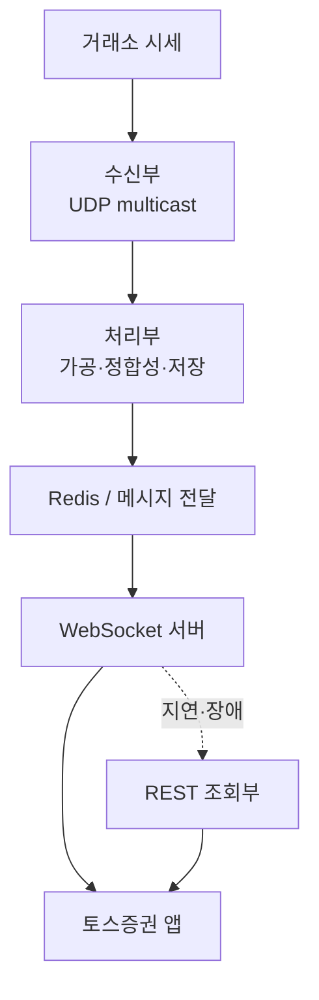

이 글을 쓰는 시점 기준으로 토스증권의 `Server Developer (Product)` 채용공고와 그 주변 자료를 읽었다. 공고 본문만으로는 역할의 윤곽이 잘 잡히지 않아서, 토스 커리어의 현직자 인터뷰, 서버 챕터 Q&A, SLASH 22·23 발표, Toss Tech 글, AWS 기술 사례까지 함께 봤다. 이 글은 그 자료들을 한 방향으로 읽어 낸 기록이다.

내가 내린 결론은 이렇다. 공고명은 제품 서버 개발자지만, 실제로 요구하는 것은 고객이 직접 쓰는 투자 제품을 빠르게 만들면서 동시에 실제 자산을 다루는 시스템의 정합성·실시간성·장애 복원력을 끝까지 책임지는 역할이다. 제품 개발과 원장 수준의 안정성을 따로 떼어 준비하면 어느 한쪽이 비게 된다.

## 공고가 말하는 것과 말하지 않는 것

글을 쓸 당시 읽은 공고의 배치 범위는 일반적인 제품 사일로보다 넓었다.

| 배치 가능 영역 | 주요 업무 |
| --- | --- |
| 제품 사일로 | 계좌·수익률·검색·주문·시세·커뮤니티·알림 등 고객 접점 제품 |
| 원장 플랫폼 | 주식 매수·매도, 결제, 권리, 환전 등 금융 원천 데이터 |
| 백오피스 | 비대면 업무 처리, 망분리 환경의 내부 운영 제품 |
| 신규 영역 | AI 투자 서비스, 레버리지·담보대출, 글로벌 제품 |

소속은 입사 전에 회사 우선순위와 지원자의 역량 특성을 종합해 안내한다고 공고에 적혀 있다. 그래서 특정 제품 하나를 겨냥해 준비하는 것보다 "제품 개발 + 금융 정합성 + 대규모 운영"을 한 묶음으로 준비해야 한다.

기술 스택은 Java, Kotlin, Spring, JPA/Hibernate, MySQL, Oracle, MongoDB, Redis, Kafka, Elasticsearch, Kubernetes, ELK, Grafana가 중심이고, 일부 영역에서 Go, Netty, NATS를, 실시간·네트워크 영역에서 WebSocket, FIX, UDP multicast를 쓴다. 공고가 따로 강조하는 역량은 대규모 트래픽과 동시성, JVM부터 OS·네트워크까지 내려가는 트러블슈팅, 실시간 데이터 처리, 기존 시스템 개선, 그리고 담당 영역의 기술적 최종 의사결정이다. [공식 채용공고](https://toss.im/career/job-detail?job_id=4076140003)

공고는 이후 바뀌었다. 2026년 10월 1일에 같은 주소로 다시 열어 본 공고에는 위의 배치 영역 표가 없다. 기술 목록도 Java, Kotlin, Spring Framework, JPA/Hibernate, Netty, Golang과 MySQL, Oracle, Redis, MongoDB, Kafka, Elasticsearch, Grafana로 적혀 있고, Kubernetes와 ELK는 업무 설명에만 나온다. NATS, WebSocket, FIX, UDP multicast는 지금 공고에서는 확인되지 않는다. 강조 역량(대규모 트래픽과 동시성, 여러 레이어의 트러블슈팅, 실시간 데이터 처리, 기존 서비스 개선, 기술적 최종 의사결정)은 그대로다.

공고가 직접 말하지 않는 것은, 이 스택 목록이 어떤 문제를 풀기 위해 조합돼 있는가다. 그건 공개된 아키텍처 자료를 읽어야 보인다.

## 제품 영역에서 실제로 풀리는 문제

Product 서버 개발자가 닿을 수 있는 영역은 계좌 정보와 실시간 수익률, 국내·해외주식 주문과 체결 상태, 종목 검색과 가격 변동, 실시간 시세와 호가, 커뮤니티와 투자 콘텐츠, 관심 종목·체결·가격 알림, AI 기반 투자 정보, 미수 거래와 주식담보대출 같은 레버리지 제품이다.

이 목록에서 "API를 만들었다"는 문장은 힘이 없다. 대신 이런 질문에 답이 있어야 한다.

- 여러 시스템의 데이터를 어떻게 한 화면에 일관되게 조합했는가
- 주문이나 잔고가 중복 처리되지 않도록 무엇으로 보장했는가
- 외부 시스템이 느리거나 응답을 잃었을 때 고객에게 무엇을 보여줬는가
- 장애 중에 최신 데이터와 정확한 데이터 중 무엇을 우선했는가
- 운영자가 새벽에 수동 조치하지 않도록 무엇을 자동화했는가

원장 쪽은 더 분명하다. 원장은 고객 주문, 잔고, 체결, 배당·액면분할 같은 권리, 환전 내역을 기록하는 핵심 시스템이다. 2026년 현직자 인터뷰에는 해외주식 권리 도메인의 구조 설계와 테스트 환경 구축, 국내주식 권리 원장의 안정화와 제도 개편 대응, MSA 환경의 트랜잭션 관리, 법률·제도 변경 히스토리를 AI 에이전트로 탐색하는 일, AI 서비스 결과를 서빙하는 서버와 데이터 파이프라인 같은 업무가 나온다. 인터뷰는 권리 도메인에서 아주 작은 숫자 하나만 틀려도 고객 신뢰에 치명적이라고 말하고, 변화에 유연한 소프트웨어 구조와 그것을 검증할 테스트 환경을 함께 과제로 꼽는다. [2026년 서버 개발자 인터뷰](https://toss.im/career/article/sec_server_2602)

## 공개 자료로 복원한 시스템의 모양

내가 여섯 개의 자료를 순서대로 읽으며 본 원칙은 하나다. **데이터 종류마다 유실 허용 여부, 순서 보장, 최신성 우선순위, 복구 방식을 다르게 정한다**는 것이다. "항상 Kafka", "항상 무손실"이 아니다.

### 빠른 성장이 남긴 통합 문제

서버 챕터 Q&A의 설명은 이렇다. 초기에는 사일로 단위 팀이 제품마다 기능을 독립적으로 빠르게 만들었다. 서비스가 커지자 비슷한 기능과 데이터가 서로 다른 서버와 DB에 흩어졌다. 그래서 국내·해외 주식 보유 내역처럼 한 화면을 그리려면 API를 각각 호출하고 수익률 계산 로직도 따로 다뤄야 했고, 화면이 늘수록 aggregation 코드가 복잡해지고 중복됐다. Q&A는 이를 풀기 위한 통합 레이어를 중요한 과제로 꼽는다. 다만 통합 레이어는 그 자체로 성능 저하의 원인이나 새로운 장애 지점이 될 수 있고, 비즈니스 로직이 많이 들어가면 upstream 변경이 통합 레이어로 번지므로 팀 간 커뮤니케이션이 중요해진다고 덧붙인다. 여기에 캐시, timeout, [circuit breaker](/posts/circuit-braker/), tracing까지 함께 설계해야 한다는 것은 내가 덧붙인 항목이다.

면접에서 BFF나 GraphQL 같은 정답을 요구한다기보다, 분산된 도메인을 어디까지 통합하고 어디까지 분리할지의 트레이드오프를 말할 수 있어야 한다는 뜻으로 읽힌다. [서버 챕터 Q&A](https://toss.im/career/article/secu_server-chapter-2)

### CQRS와 Vitess로 읽기를 분리하되, 검증기로 위험을 통제한다

서버 챕터 Q&A에 따르면 원본 데이터는 Oracle에서 관리하고, 조회 트래픽은 별도의 읽기 전용 모델로 분리하며, MySQL 계열 수평 확장에 Vitess(MySQL 앞에 두는 샤딩 게이트웨이, [샤딩](/posts/partitioning-and-sharding/))를 쓴다. 공개 당시 API [p95](/posts/percentile-statistics/)는 약 40ms, 실시간 일관성이 필요한 데이터는 대부분 10ms 이내에 갱신됐다. 여기서 눈여겨볼 것은 성능 수치가 아니라 그 다음 문장이다. 원본과 read view 사이에 실시간 검증기를 운영하고, 실시간 검증이 놓친 잔차는 일 배치로 다시 대사한다.

[CQRS](/posts/event-sourcing-and-cqrs/)를 성능 패턴으로만 쓰는 것이 아니라, eventual consistency(쓰기 직후에는 읽기 모델이 잠시 뒤처질 수 있는 일관성)가 만드는 위험을 온라인 검증과 배치 [대사](/posts/parity-pay-reconciliation/) 두 겹으로 잡는다는 이야기로 나는 읽는다. 이 구조는 [토스증권의 CQRS·검증기와 ParityPay](/posts/toss-securities-cqrs-validator-vs-parity-pay/)에서 따로 비교했다. 이 구조를 놓고 나올 만한 질문은 다음과 같다.

- read model 지연을 사용자에게 어떻게 표현할 것인가
- [CDC](/posts/cdc-principles-and-limits/) 이벤트가 중복·역전·유실되면 어떻게 복구할 것인가
- 원장과 조회 DB의 차이를 어떻게 탐지할 것인가
- 온라인 검증과 배치 대사의 책임을 어떻게 나눌 것인가
- resharding 중 쓰기·읽기 일관성을 어떻게 관리할 것인가

### 실시간 시세: WebSocket과 polling fallback

SLASH 22 발표에 따르면 토스증권은 런칭 전 시세를 polling으로 구현해 두었다가 런칭 직전 WebSocket으로 바꿨고, WebSocket 장애나 지연에 대비해 polling API를 fallback으로 유지했다([SLASH 22 리뷰](/posts/slash22-realtime-quote-websocket/)). 아래 그림은 SLASH 23의 수신부·처리부와 SLASH 22의 WebSocket·fallback 경로를 내가 하나로 합친 것이다. SLASH 22 시점에는 원장에서 WebSocket 서버까지 Kafka로 시세를 전달했다.

초기 WebSocket 구조에서는 전자금융 망분리 요건과 네트워크 홉을 고려해 DMZ에 WebSocket 서버를 두고, 별도 라우팅 서버와 Redis로 클라이언트 연결 위치를 관리했다. [SLASH 22 세션](https://toss.im/slash-22/sessions/2-6), [발표 영상](https://www.youtube.com/watch?v=WKYE-QtzO6g)

### 시세 처리부: 저지연을 위해 유실을 받아들인다

[SLASH 23 발표](/posts/slash23-realtime-quote-platform/)는 시세 플랫폼을 수신부·처리부·조회부로 나눈다. 수신부가 거래소 UDP multicast를 받고 수신 시각을 헤더에 넣어 end-to-end latency를 잰다. 처리부가 비즈니스 로직 뒤 Redis에 저장하거나 서비스로 전달하고, 조회부가 REST API를 제공한다. 처리부와 저장소를 복제해 장애 시 오염되지 않은 경로로 전환한다.

선택이 드러나는 지점은 메시징이다. Kafka보다 낮은 latency가 필요한 구간에는 Redis Pub/Sub을 썼다. Redis Pub/Sub은 영속 큐가 아니므로 유실 가능성을 받아들이는 대신 저지연을 얻는다. 종목별 순서는 이벤트 루프 단위로 채널을 분리해 보장하고, Redis 저장은 ReactiveRedisTemplate 같은 non-blocking 방식으로, 과거 값 조회는 local cache로, RDB 적재나 배치는 별도 EventLoopGroup으로 격리했다. [SLASH 23 세션](https://toss.im/slash-23/session-detail/B1-7), [발표 영상](https://www.youtube.com/watch?v=SF7eqlL0mjw)

### 해외주식 주문: 분산락 다음에 무엇이 있는가

해외주식은 국내 시스템에서 해외 브로커를 거쳐 현지 거래소로 주문한다. 공개된 설계의 선택은 다음과 같다.

- MSA 간 계좌 단위 동시성 제어에 Redis [분산락](/posts/kleppmann-distributed-locking/)
- 분산락 timeout 전에 트랜잭션이 끝나지 않는 예외 상황은 JPA optimistic locking/CAS로 방어
- 주요 테이블의 변경 이력 관리
- 브로커 호출을 주문 트랜잭션에서 분리해 비동기 처리
- 응답 유실·TCP timeout 시 임의로 성공이나 실패로 처리하지 않음
- 멱등 API와 제한된 재시도, exponential backoff
- 끝까지 해결되지 않은 건은 사후 대사와 운영으로 복구
- 브로커별 어댑터·요청 서버로 외부 의존성을 매매 서버에서 격리
- Kafka 장애 시 polling으로 전환하는 failover 경로

[SLASH 22 세션](https://toss.im/slash-22/sessions/2-7), [발표 영상](https://www.youtube.com/watch?v=UOWy6zdsD-c), [발표 리뷰](/posts/slash22-overseas-order-consistency/)

내가 보기에 이 포지션 면접에서 가장 깊게 파일 주제다. 분산락을 썼다는 설명으로는 부족하고, [lease 만료](/posts/parity-pay-lock-lease/) 뒤에도 이전 작업이 계속 실행되는 문제, fencing token 또는 version 기반 갱신, 외부 주문 요청의 [idempotency key](/posts/idempotency-key-design/), 요청은 성공했는데 응답을 잃은 상태의 reconciliation, at-least-once 소비에서의 중복 방지, 트랜잭션 DB와 Kafka 사이의 atomicity, [outbox](/posts/parity-pay-outbox/)·CDC·[saga](/posts/two-phase-commit-and-saga/)의 적용 범위와 한계까지 이어져야 한다.

### 폭증 트래픽과 브로커 장애: 탐지에서 전환까지 자동화

해외주식 서비스 안정화 사례에는 트래픽 특성이 구체적으로 나온다. 미국 정규장 시간의 TPS(초당 처리 건수)는 그 외 시간의 20배 이상이고, 서비스 오픈 초기 대비 주문 요청은 약 30배 넘게 늘었으며, 정규장 시작 직후 100만 건 이상의 예약 주문이 전송된다. 브로커가 수용 가능한 TPS를 넘지 않도록 resilience4j RateLimiter를 두고, Grafana·Kibana 규칙으로 이상 징후를 감지하면 그 결과를 Kafka 이벤트로 발행하고, 이를 구독한 시스템이 메인 브로커에서 서브 브로커로 스스로 전환한다.

그래서 여기서 운영은 알람을 받고 사람이 고치는 것만을 뜻하지 않는다고 나는 읽는다. 탐지, 판단, 격리, 전환의 상당 부분이 자동화되어 있다. [해외주식 서비스 안정화 사례](https://toss.tech/article/28738)

### 미국 옵션: 초당 수백만 건 앞에서 데이터마다 다른 정책

2025년 4월 AWS 기술 블로그에 공개된 사례가 현재 규모를 가늠하기에 가장 유용하다. 미국 옵션 종목은 약 160만 개, 장 초반 초당 200만~300만 건이 발생한다. Virginia 리전에 EKS와 Amazon MSK 기반 처리 시스템을 두고, Sliding Window Counter로 rate limit을 걸고, 3개 AZ에 걸친 2개 Kubernetes 클러스터와 이중화된 국내 데이터센터 채널로 전송한다. 데이터 결측을 감지하면 Slack 알림과 함께 보조 vendor를 자동 활성화하고, Virginia–Seoul latency를 지속 측정해 임계치 초과를 잡는다.

정책의 차이가 분명하다. NBBO(미국 전체 거래소의 최우선 매수·매도 호가)는 최신 상태가 중요하므로 유실 시 과거 데이터를 버리고 최신 값을 우선한다. 체결 데이터는 순서와 차트 복원이 중요하므로 별도의 영속 경로를 둔다. 실시간 경로는 Kafka `acks=0`, 복구용 원천은 `acks=all`로 이중 전송한다([전달 보장](/posts/kafka-delivery-guarantees/)). [AWS 기술 사례](https://aws.amazon.com/ko/blogs/tech/toss-securities-nasdaq-options-realtime-pipeline/)

## 모니터링과 트러블슈팅에서 보는 것

서버 챕터 Q&A에 따르면 에러 수, 스레드 고갈, API 실패율, Kafka lag 증가 같은 이상치를 서비스 특성에 맞춰 감시하고, 알림에 에러들이 특정 서버·사용자 같은 공통 특성을 갖는지도 함께 보낸다. 운영 흐름은 대체로 다음 순서다.

1. Grafana·Kibana·Flink 기반 이상 탐지
2. 알림에 서버·사용자 등 원인 분석용 context 포함
3. 최근 배포·작업 같은 변경 이력 확인
4. Jaeger·Pinpoint로 분산 호출 경로 추적
5. TCP dump·[thread dump](/posts/thread-dump-basics/) 같은 프로파일링 도구로 분석
6. CPU, 메모리, 스레드 고갈, deadlock 등 병목 확인
7. 재발 방지와 공통 도구화

알림 전달 시간을 5분에서 1분으로 줄인 사례도 공개돼 있다. 지원자 입장에서는 "장애를 해결했다"보다 MTTR(장애 발생부터 복구까지 걸린 평균 시간)을 어떻게 줄였고 같은 장애가 재발하지 않도록 무엇을 표준화했는지를 설명하는 편이 이 흐름과 맞는다. [서버 챕터 Q&A](https://toss.im/career/article/secu_server-chapter-2)

## 조직 구조와 기대하는 행동

제품은 PO, Product Designer, Frontend, Server, Data Analyst 등 6~8명 규모의 사일로가 자율적으로 만든다(이 규모와 구성은 이 글이 인용한 자료에서 다시 확인하지 못했다). 서버 개발자는 동시에 서버 챕터에 속한다. 공고는 코드 리뷰, 엔지니어링 데이, 서버 챕터 위클리 같은 챕터 활동과 라이브러리·개발 방식을 골라 공통화하는 일을 적고 있다. 사일로에서 비즈니스 임팩트를 만들고 챕터에서 기술 품질과 표준을 올리는 이중 구조다.

Q&A는 인재상을 코어밸류로 설명하고, 한 서버 개발자의 하루를 예로 들어 풀어 쓴다. 거기서 드러나는 행동은 꽤 구체적이다.

- 아무도 맡고 싶어 하지 않는 문제라도 팀에 중요하면 맡는다
- 피드백을 적극적으로 구한다
- 태스크 수보다 임팩트가 큰 일을 고른다
- "왜 배치여야 하는가"처럼 기존 전제를 의심한다
- 문서·히스토리·이전 담당자를 찾아 근본 원인을 학습한다
- 작게 구현해 가설을 빠르게 검증한다
- 완벽한 계획보다 실행과 학습을 우선한다
- 운영 고통을 제거하고 고객 경험의 변화를 확인한다

나는 이것을 문화적합성 인터뷰에서 "주도적입니다" 같은 형용사보다, 주인 없는 문제를 발견하고 동료를 설득해 운영 방식까지 바꾼 사례 하나가 필요하다는 뜻으로 읽는다. 근무 방식에 대해 2026년 인터뷰의 한 합류자는 필요할 때 몰입하고 필요할 때 쉴 수 있는 유연한 근무 제도 덕분에 업무 시간에는 더 높은 몰입도와 책임감으로 일하게 됐다고 말한다. [2026년 인터뷰](https://toss.im/career/article/sec_server_2602)

## 전형에서 무엇을 보는가

채용 절차는 서류 → 라이브 코딩 인터뷰 → 직무 인터뷰 → 문화적합성 인터뷰 → 레퍼런스 체크 → 처우 협의 순이다.

### 서류

공고의 이력서 작성 안내와 2026년 합류자 인터뷰를 바탕으로 내가 정리한 서술 순서는 다음과 같다.

> 문제 → 규모·제약 → 검토한 선택지 → 선택 이유 → 직접 한 일 → 수치 결과 → 장애·한계 → 후속 개선

예를 들면 이런 문단이다(설명을 위해 만든 가상의 예다).

> 주문 급증 시간대에 DB lock 경합으로 p99가 3.2초까지 증가했다. Redis 분산락, DB 비관적 락, optimistic locking을 비교했고, 충돌 빈도와 장애 시 안전성을 고려해 계정 단위 직렬화와 version 검증을 함께 적용했다. p99를 480ms로 줄이고 중복 갱신을 제거했다. 이후 lock lease 만료 상황을 fault injection으로 재현하는 테스트를 CI에 추가했다.

준비해야 할 경험은 여섯 종류로 정리된다.

1. 데이터 정합성 또는 트랜잭션 문제를 해결한 경험
2. 트래픽·응답 시간·비용을 수치로 개선한 경험
3. 실제 장애를 JVM·DB·네트워크 수준까지 추적한 경험
4. 외부 시스템의 지연·실패를 격리한 경험
5. 반복 운영을 자동화하거나 팀 공통 도구로 만든 경험
6. 고객 문제를 기술 과제로 변환하고 직접 의사결정한 경험

프로젝트 수를 늘리기보다 가장 깊게 설명할 수 있는 3~4개를 고르는 편이 낫다. 합격자들도 경력 나열보다 임팩트가 큰 프로젝트, 수치화된 결과, "왜 그 해결책이었는가"를 중심으로 준비했다. [2026년 합격자 인터뷰](https://toss.im/career/article/sec_server_2602)

### 라이브 코딩

인터뷰에 나온 합류자 세 명의 공통 행동은 이해한 내용을 처음부터 인터뷰어와 맞춰 보고, 이해가 안 되는 부분을 질문하고, 풀이 중 사고 과정을 계속 말로 설명하고, 인터뷰어와 함께 더 좋게 만드는 방법을 이야기하는 것이었다. 이들은 라이브 코딩을 언어 숙련도 시험이라기보다 문제를 정확히 정의하고 소통하는 능력을 보는, 페어 프로그래밍에 가까운 전형으로 설명한다. 풀이 전에 자료구조와 복잡도를 설명하고 edge case와 테스트를 직접 제시하는 것은 인터뷰에는 나오지 않는, 내가 덧붙인 준비 항목이다.

### 직무 인터뷰

CS 퀴즈보다 본인의 프로젝트를 깊게 파는 방식이다. 다음 꼬리 질문은 미리 답을 써 두는 것이 좋다.

- 왜 이 기술을 선택했는가
- 대안은 무엇이었고 왜 제외했는가
- 장애가 나면 어떤 순서로 확인하는가
- 데이터 중복과 유실을 어떻게 검증했는가
- 이 구조의 가장 큰 단점은 무엇인가
- 트래픽이 10배가 되면 어디가 먼저 깨지는가
- 지금 다시 만든다면 어떻게 바꾸겠는가
- 본인이 아닌 팀 전체에 남긴 변화는 무엇인가

2026년 인터뷰에서는 Coroutine 질문에 정확히 답하지 못한 합류자가 Java 환경의 비동기 처리 방식으로 대신 답했고, 다른 합류자는 "지금 하면 어떻게 만들겠냐"는 질문을 가장 인상 깊은 질문으로 꼽았다. 합류자는 정해진 답보다 후보자의 태도와 문제 해결 의지를 본다고 느꼈다고 한다. 나는 이것을 키워드 암기보다 모르는 지점에서 아는 원리로 추론하는 태도가 평가된다는 뜻으로 읽는다.

## 준비 우선순위

공개 자료에서 반복되는 빈도와 이 포지션의 책임 범위를 기준으로 순서를 매기면 다음과 같다.

| 순위 | 영역 | 구체 항목 |
| --- | --- | --- |
| 1 | 정합성과 동시성 | isolation level, MVCC, optimistic/pessimistic locking, Redis 분산락과 lease 만료, idempotency key, transactional outbox, CDC, saga와 보상 트랜잭션, 순서 보장·중복 소비·reconciliation, 금융 원장과 감사 이력 |
| 2 | Kafka와 이벤트 처리 | partition key와 종목·계좌 단위 순서, consumer group과 rebalance, retry topic과 DLQ, producer `acks`와 idempotent producer, lag 모니터링, exactly-once의 실제 범위, Kafka 장애 시 polling fallback, IDC·리전 이중화 |
| 3 | JVM·Spring 운영 | Coroutine과 Reactor의 차이, Tomcat thread pool과 connection pool, blocking/non-blocking I/O, GC와 heap dump, thread dump와 deadlock, Spring transaction proxy, JPA dirty checking·N+1·batch, graceful shutdown |
| 4 | 실시간 네트워크 | WebSocket 연결·heartbeat·reconnect, TCP flow control과 receive buffer, UDP multicast 특성, event loop와 종목별 순서, FIX 기본 구조, connection timeout과 unknown outcome, backpressure와 load shedding |
| 5 | 분산 시스템 운영 | CQRS와 read model, Vitess·샤딩·resharding, circuit breaker와 rate limiter, p95/p99, Grafana·Kibana·분산 tracing, Kubernetes rollout과 장애 격리, chaos·fault injection 테스트 |

정합성을 1순위로 둔 것은 위에서 본 자료들이 모두 "무엇을 잃어도 되고 무엇은 잃으면 안 되는가"를 정하는 이야기였기 때문이다.

## 지원 전에 인지할 현실

기술적으로 매력적인 만큼 책임 범위가 크다. 국내 장은 낮, 미국 장은 한국 기준 밤에 열린다. 브로커·거래소·인증기관처럼 통제할 수 없는 외부 시스템이 많다. 주문·잔고·배당은 단순 재시도로 처리하면 자산이 중복 변경될 수 있다. MSA에서는 로컬 트랜잭션만으로 전체 정합성을 보장할 수 없다. 금융 제도와 법률 개정에 따라 기존 시스템을 계속 바꿔야 한다. 빠른 출시와 금융 안정성이 동시에 요구되고, 자율성이 큰 만큼 "담당자가 아니어서 하지 않았다"는 태도와는 맞지 않는다.

반대로 증권 경력이 필수는 아니다. 최근 합류자 인터뷰에서도 배달 주문 시스템, 검색 플랫폼, 데이터 엔지니어링 경험이 토스증권 업무로 이어졌다. 중요한 것은 기존 경험을 주문·정합성·실시간 데이터·외부 의존성 문제로 번역할 수 있는지다.

## 내 경험을 어떻게 번역할 것인가

지금까지의 경력을 다음 네 축으로 다시 분류하는 것이 가장 효율적이라고 판단했다.

| 평가 축 | 제시해야 할 증거 |
| --- | --- |
| 제품 임팩트 | 고객 지표, 전환율, latency, 운영 시간 같은 수치 |
| 금융 수준의 안정성 | 중복·유실·순서·감사·복구를 다룬 경험 |
| 기술적 깊이 | JVM·DB·네트워크까지 원인을 추적한 과정 |
| Ownership | 주인 없는 문제를 정의하고 조직에 전파한 경험 |

자기소개의 방향도 여기서 정해진다. "Java/Spring을 쓰는 개발자"가 아니라 **실제 고객 트래픽에서 정합성과 성능 문제가 났을 때 여러 계층을 추적하고, 기술 선택의 트레이드오프를 설명하며, 재발 방지까지 제품과 운영에 반영해 온 개발자**로 위치를 잡는다.

한 가지 단서를 남겨 둔다. SLASH 22·23 자료는 당시 아키텍처의 스냅샷이므로 세부 구현이 지금도 같다고 단정할 수 없다. 다만 2025~2026년 자료에서도 MSA, 실시간 대용량 처리, 정합성, Kafka·Redis, 장애 대응 자동화라는 방향은 일관되게 확인된다.

## 참고 자료

- [Server Developer (Product) 채용공고](https://toss.im/career/job-detail?job_id=4076140003)
- [2026년 토스증권 서버 개발자 인터뷰](https://toss.im/career/article/sec_server_2602)
- [토스증권 서버 개발자가 많이 듣는 질문 4가지](https://toss.im/career/article/secu_server-chapter-2)
- [토스증권 실시간 시세 적용기 (SLASH 22)](https://toss.im/slash-22/sessions/2-6)
- [실시간 시세 데이터 안전하고 빠르게 처리하기 (SLASH 23)](https://toss.im/slash-23/session-detail/B1-7)
- [애플 한 주가 고객에게 전달되기까지 (SLASH 22)](https://toss.im/slash-22/sessions/2-7)
- [해외주식 서비스 안정화 사례 (Toss Tech)](https://toss.tech/article/28738)
- [미국 옵션 실시간 시세 파이프라인 (AWS)](https://aws.amazon.com/ko/blogs/tech/toss-securities-nasdaq-options-realtime-pipeline/)
- [토스증권 마진 트레이딩 서버 개발자 인터뷰](https://toss.tech/article/tosspeople-jimin)
- [Kafka IDC 이중화 (SLASH 23)](https://toss.im/slash-23/session-detail/B2-6)
