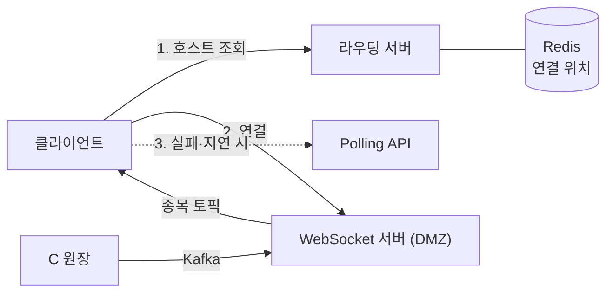
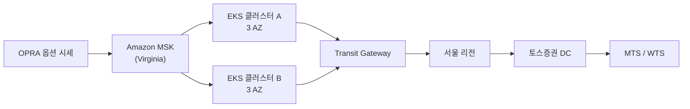
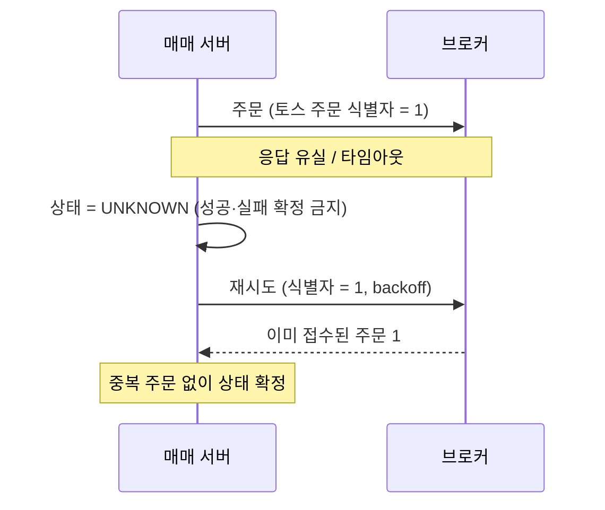

토스증권이 2022년부터 2025년까지 공개한 기술 자료 다섯 개를 시간순으로 읽었다. SLASH 22의 실시간 시세 적용기와 해외주식 주문 세션, SLASH 23의 시세 처리부 세션, Toss Tech의 해외주식 안정화 글, 그리고 AWS와 공동 공개한 미국 옵션 시세 파이프라인 글이다. [채용공고 분석](/posts/toss-securities-server-developer-job-analysis/)에서는 이 자료들을 지원 준비의 재료로 훑었다면, 이 글은 자료 자체를 아키텍처 리뷰의 대상으로 놓는다.

다섯 자료를 나란히 놓으면 한 가지 설계 습관이 반복된다고 나는 읽는다. 시스템을 "무손실"로 만들려 하지 않고, 데이터 종류별로 무엇을 잃어도 되는지, 무엇은 절대 잃으면 안 되는지를 먼저 정한 뒤 그 결정에 맞춰 전송 계층을 고른다. 시세 경로는 오래된 값을 적극적으로 버리고, 주문 경로는 아무것도 버리지 않는 대신 "모른다"는 상태를 도입한다. 이 글은 그 두 경로를 따라가며 각 선택의 이유와 대가를 적는다. 발표 하나하나의 세부는 따로 쓴 리뷰([SLASH 22 실시간 시세](/posts/slash22-realtime-quote-websocket/), [SLASH 22 해외주식 주문](/posts/slash22-overseas-order-consistency/), [SLASH 23 시세 플랫폼](/posts/slash23-realtime-quote-platform/))에 있다.

발표 자료는 당시의 스냅샷이다. 2022년 구조가 지금도 그대로일 가능성은 낮고, 이 글의 해석도 공개된 슬라이드·글·후기에 근거한 추정이다. 확인되지 않은 부분은 그렇게 적었다.

## 시세 경로: 세 번의 발표, 세 번의 "버리기"

### 2022: polling에서 WebSocket으로, 망분리 안에서

토스증권은 처음에 시세를 polling API로 제공했다. 초기 고객이 주식 초심자 중심이라 실시간성이 덜 중요하다고 봤고 벤치마킹 대상도 그랬다는 설명이 후기에 남아 있다. 이후 "가능한 가장 최신 정보를 제공해야 한다"는 요구가 커지면서 WebSocket을 도입했다. SSE(Server-Sent Events, 서버에서 클라이언트로만 흐르는 HTTP 스트림)도 검토했지만, 향후 양방향 통신으로 기능을 넓힐 수요가 있다고 보고 WebSocket을 골랐다. 후기에 따르면 방화벽 친화성은 오히려 SSE 쪽이 나았고, 패킷 검사 방화벽에서 WebSocket이 문제를 일으킨다는 사실은 런칭 뒤에야 알았다.

구조의 제약 조건은 전자금융감독규정의 망분리다. WebSocket 서버는 DMZ에 두되 서버마다 고유 호스트명을 갖게 하고, 라우팅 서버가 Redis에 "어느 클라이언트가 어느 서버에 붙어 있는가"를 관리한다. 시세의 원천은 Unix C 기반 원장이고, MTS 애플리케이션은 Kubernetes 위 Java라서 둘 사이를 Kafka가 잇는다. 서버 구현은 Spring WebSocket과 STOMP로, 토픽은 종목 코드 단위(현재가·호가·시장정보)와 사용자 단위(보유 종목 갱신) 두 종류다.



첫 번째 "버리기"는 Kafka 설정에 있다. Kafka producer의 `acks`(브로커가 몇 개의 복제본에 쓴 뒤 응답할지 정하는 설정, [전달 보장](/posts/kafka-delivery-guarantees/))를 `all`과 `1`로 비교했더니 평균 latency가 약 5.7배 차이가 났고, 시세 토픽은 `acks=1`을 택했다. 압축은 producer와 consumer를 함께 고려해 lz4를 골랐다. Kafka 문서는 `acks=1`이면 leader가 응답한 직후 follower가 복제하기 전에 leader가 죽을 때 그 레코드를 잃는다고 적는다([Kafka producer 설정](https://kafka.apache.org/43/configuration/producer-configs/)). 시세는 다음 틱이 곧 오므로 그 손실을 감수한다.

사용자 자산 갱신은 데이터를 밀어 넣지 않고 갱신 신호만 보낸다. handshake에서 얻은 사용자 ID로 접속 서버를 Redis에 기록해 두고, 원장에서 매매·입출고가 발생하면 라우팅 서버가 해당 서버로 이벤트를 넘기고, 클라이언트는 신호를 받은 뒤 자산 API를 다시 조회한다. 정확해야 하는 데이터는 push 경로에 태우지 않고 조회 경로로 돌린다는 원칙이 여기서 처음 보인다.

런칭 뒤 문제도 공개돼 있다. Least Connection 로드밸런싱이 장 개장 직후 2~3분에 몰리는 연결을 특정 서버에 집중시켰고, 배포 없이 수일에서 일주일이 지나면 WebSocket 커넥션이 서서히 누수됐으며, 예상보다 이른 트래픽 증가가 방화벽 처리량을 넘겼다. 모바일에서 네트워크가 바뀌며 비정상 종료되는 연결을 어떻게 정리하느냐가 커넥션 누수의 핵심이었다. [SLASH 22 세션](https://toss.im/slash-22/sessions/2-6), [발표 영상](https://www.youtube.com/watch?v=WKYE-QtzO6g), [참석 후기](https://velog.io/@rosencrantz96/%ED%86%A0%EC%8A%A4%EC%A6%9D%EA%B6%8C-%EC%8B%A4%EC%8B%9C%EA%B0%84-%EC%8B%9C%EC%84%B8-%EC%A0%81%EC%9A%A9%EA%B8%B0)

### 2023: 수신부·처리부·조회부, 그리고 이벤트 루프 하나짜리 스레드 풀

1년 뒤 발표는 시세 플랫폼 내부로 들어간다. 거래소와의 연결은 UDP multicast 그룹이고, 수신 시각을 헤더에 넣어 수신부터 클라이언트까지의 총 처리 시간을 잰다. 수신부와 처리부 사이에는 메시지 브로커를 두어 둘을 독립시켰는데, 후보였던 UDP multicast, Kafka, Redis Pub/Sub 중 latency가 가장 낮은 Redis Pub/Sub을 골랐다.

이것이 두 번째 "버리기"다. Redis 문서는 Pub/Sub의 전달 의미를 at-most-once로 규정하고, 구독자가 메시지를 처리하지 못하면(오류나 연결 끊김) 그 메시지는 영영 사라진다고 적는다([Redis Pub/Sub](https://redis.io/docs/latest/develop/pubsub/)). Kafka였다면 얻었을 재처리 가능성을 포기하고 지연을 산 것이다. 시세 처리부는 장애 확률이 높다고 보고 여러 개를 띄우며, ZooKeeper로 리더를 뽑아 리더만 DB에 쓰게 해서 중복 적재를 막는다.

순서는 스레드 수로 보장한다. 멀티스레드에서 같은 종목의 틱이 뒤바뀌는 것을 막기 위해 종목별로 [이벤트 루프](/posts/nio-and-event-loop/)를 두는데, 구현은 Spring의 `ThreadPoolTaskExecutor`를 `corePoolSize = 1, maxPoolSize = 1`로 만든 것이다. 스레드가 하나이므로 그 루프에 들어온 종목의 순서는 자연히 보존된다. 그리고 큐가 가득 차면 `DiscardOldestPolicy`로 가장 오래된 작업을 버린다. JDK Javadoc의 정의는 처리되지 않은 가장 오래된 요청을 버리고 새 작업을 다시 넣는 거부 정책이다([ThreadPoolExecutor.DiscardOldestPolicy](https://docs.oracle.com/en/java/javase/21/docs/api/java.base/java/util/concurrent/ThreadPoolExecutor.DiscardOldestPolicy.html)). 이것이 세 번째 "버리기"다. 시세에서 오래된 틱은 처리해 봐야 이미 틀린 값이므로, [백프레셔](/posts/reactive-and-backpressure/)(소비가 밀릴 때 생산 쪽을 기다리게 하는 것)로 지연을 키우는 대신 낡은 것을 떨어뜨린다.

이벤트 루프 개수는 트레이드오프로 설명된다. 많으면 컨텍스트 스위칭 비용이 늘고, 적으면 한 루프에 종목이 몰려 백프레셔 지연이 커진다. Redis 접근은 Netty 기반 Lettuce로 논블로킹 처리하고, 과거 값 조회는 로컬 캐시로 받아내며, RDB 적재나 배치처럼 느린 작업은 별도 `EventLoopGroup`으로 격리해 시세 루프를 막지 않게 한다. [SLASH 23 세션](https://toss.im/slash-23/session-detail/B1-7), [발표 영상](https://www.youtube.com/watch?v=SF7eqlL0mjw), [참석 후기](https://velog.io/@ddonghyeo_/SLASH23-%EC%8B%A4%EC%8B%9C%EA%B0%84-%EB%8D%B0%EC%9D%B4%ED%84%B0-%EC%B2%98%EB%A6%AC)

### 2025: 미국 옵션, 초당 200만~300만 건 앞에서 데이터를 둘로 가른다

AWS와 공동 공개한 사례(2025년 4월 22일 게시)는 규모가 다르다. 미국 옵션 종목은 약 160만 개(2025년 3월 기준), 장 초반에는 초당 200만~300만 건이 들어온다. 미국 시장 데이터를 한국 데이터센터에 직접 연결해 시험해 보니, 공용 인터넷 구간의 패킷 손실과 높은 RTT(왕복 시간) 때문에 한국의 consumer가 미국 Kafka를 제때 비우지 못해 consumer lag(아직 읽지 않은 메시지 수)이 계속 늘었다. 해결은 Virginia 리전에 EKS 클러스터를 두어 AWS 내부망으로 MSK를 소비하고, 처리한 결과를 Transit Gateway로 서울 리전을 거쳐 국내 데이터센터로 보내는 것이었다.



consumer 클러스터 둘은 각각 3개 AZ(가용 영역)에 걸쳐 있고, 같은 토픽을 받는 consumer가 다른 AZ에도 있으므로 AZ 하나가 죽어도 데이터는 계속 전달된다. 옵션 시세의 결측이 감지되면 Slack 알림과 함께 보조 데이터 vendor가 자동으로 활성화된다. Virginia–Seoul 사이 latency는 ICMP로 매초 재고, 임계치를 넘으면 보조 vendor를 쓰도록 알림과 후속 조치를 자동화했다.

자원 예측이 어려웠던 이유도 숫자로 나온다. 발생량 편차가 가장 큰 두 토픽이 100,987.2 TPS와 4,652.6 TPS로 20배 이상 차이가 났고, 장 시작·마감에 변동이 몰렸다. 그래서 Sliding Window Counter 기반 rate limit을 넣었다. 옵션 하나당 NBBO는 최대 3.0 TPS로 제한하고, 고정 윈도우가 아니라 이동 윈도우를 써서 시간 경계에 트래픽이 2배로 몰리는 현상을 없앴다. 이전 윈도우 카운트에 `1 - (nanoSecond / 1e9)`를 가중치로 곱해 현재 윈도우 카운트와 더한 값이 한도 미만일 때만 보낸다.

내가 보기에 이 사례에서 가장 중요한 결정은 데이터를 둘로 가른 것이다. 아래 표는 원문의 설명을 내가 정리한 것이다.

| 데이터 | 비중 | 성격 | 유실 시 | Kafka `acks` |
| --- | --- | --- | --- | --- |
| 호가(NBBO) | 약 95% | 최신 상태만 의미 있음 | 되감지 않고 버림, 다음 수신으로 자연 복구 | `0` |
| 체결 | 나머지 | 순서와 누락 없음이 차트를 결정 | `acks=all`로 영속화한 사본을 복구 원천으로 씀 | `0`으로 보내고 `all`로 한 번 더 |

원문에 따르면 장중에는 체결과 NBBO를 모두 `acks=0`으로 보내 속도를 챙기고, 체결만 `acks=all`로 한 번 더 보내 유실 없이 Kafka에 영속화한다. 2022년의 `acks=1` 하나가 2025년에는 `acks=0`과 `acks=all`의 이중 전송으로 갈라졌다. 같은 "시세"라도 호가와 체결은 다른 내구성이 필요하다는 판단이 설정으로 드러난 것이다. [AWS 기술 사례](https://aws.amazon.com/ko/blogs/tech/toss-securities-nasdaq-options-realtime-pipeline/)

## 주문 경로: 아무것도 버리지 않되, "모른다"를 허용한다

해외주식 주문은 토스증권이 현지 거래소에 직접 낼 수 없다. 원장의 매매 서버가 브로커에 요청하고, 브로커가 거래소에 내고, 체결이 브로커를 거쳐 체결 수신 서버로 돌아와 Kafka를 타고 매매 서버로 온다. SLASH 22 슬라이드는 이 여섯 단계 흐름 위에서 세 가지 문제를 다룬다. [SLASH 22 세션](https://toss.im/slash-22/sessions/2-7), [발표 영상](https://www.youtube.com/watch?v=UOWy6zdsD-c), [발표 자료](https://static.toss.im/assets/homepage/slash22/pt-session/SLASH22_%EC%9D%B4%EC%8A%B9%EC%B2%9C%EB%8B%98.pdf)

### 분산락이 끝나지 않은 트랜잭션을 지켜주지 못할 때

MTS(모바일 거래 시스템), WTS(웹 거래 시스템), 자동 매매가 같은 계좌에 동시에 주문을 낸다. 슬라이드는 먼저 `SELECT ... FROM ACCOUNT_LOCK WHERE ACCOUNT_NUMBER = ? FOR UPDATE`로 계좌 단위 잠금을 잡는 그림을 보여 주고, MSA 환경에서는 이를 Redis 분산락으로 옮긴다. 그리고 분산락의 약점을 타임라인 하나로 설명한다.

| t | T1 | T2 | 잔고 |
| --- | --- | --- | --- |
| 0 | 락 획득 | 락 대기 | 2,000원 |
| 2 | 락 타임아웃 | 락 획득 | 2,000원 |
| 3 | | 500원 출금 | 1,500원 |
| 4 | 2,000원 출금 | | 0원 |

T1이 락을 잡고 처리하던 중 lease(락의 유효 기간)가 만료됐고, T2가 락을 얻어 500원을 빼 갔는데, T1은 자신이 여전히 락을 가진 줄 알고 2,000원을 뺀다. 잔고는 마이너스여야 하는데 0원이 된다. 갱신 유실이다.

대응은 락을 더 길게 잡는 것이 아니라 갱신 손실을 자동으로 감지하게 만드는 것이다. `@OptimisticLocking`으로 잔고 행에 version을 두고([낙관적 락](/posts/banksalad-optimistic-lock/)), T1의 `UPDATE Account SET balance = 0 WHERE id = 1 AND version = 1`은 T2가 version을 2로 올린 뒤라 0건 갱신으로 실패한다. 나는 이것을 분산락은 평상시 경합을 줄이는 1차 방어, version 비교(compare-and-set)는 락이 무너졌을 때의 2차 방어로 읽는다. 락 lease를 넘긴 작업이 계속 실행되는 문제를 [fencing token](/posts/kleppmann-distributed-locking/) 없이도 DB 단에서 막는 방식이다.

### 타임아웃은 실패가 아니다

해외 구간은 느리다. 매매 서버가 브로커를 동기로 기다리면 고객 요청 스레드가 묶이므로 브로커 호출을 비동기로 뗀다. 그런데 브로커 호출이 타임아웃되면 주문이 브로커에 도달했는지 알 수 없다. 슬라이드의 그림은 이 상황을 "1번 주문"이 토스와 브로커 양쪽에 있는데 응답만 없는 상태로 그린다.

여기서 단순 재시도를 하면 "1번 주문"과 "2번 주문"이 브로커에 둘 다 생긴다. 그래서 요청에 토스 주문 식별자를 싣고, 브로커가 같은 식별자를 같은 주문으로 취급하게 한다. 재시도는 [멱등 키](/posts/idempotency-key-design/)가 있을 때만 안전하다. 그리고 재시도 자체가 혼잡을 키우지 않도록 "혼잡 제어"를 둔다. 발표는 이를 재시도 횟수 제한과 지수 백오프(재시도 간격을 점점 늘리는 것)로 설명한다. 그래도 끝내 상태를 모르는 건은 사후 대사와 운영으로 정합성을 맞춘다.



시세 경로와는 반대 방향이다. 시세는 모르면 버리고 다음 틱을 기다리지만, 주문은 모르면 모른다고 기록하고 확인될 때까지 어느 쪽으로도 확정하지 않는다. 같은 문제를 개인 프로젝트에서 상태로 저장해 본 기록은 [ParityPay 3편](/posts/parity-pay-unknown-state/)에 있다.

### 브로커는 바뀐다: 어댑터와 유실 없는 체결 수신

브로커는 "언제든지 변경되거나 추가될 수 있다". 그래서 매매 서버가 브로커 API를 직접 알지 않고, 브로커별 "매매 요청 서버"를 사이에 둔다. 브로커가 바뀌면 그 서버만 바꾸면 된다.

체결 수신 쪽도 같은 원칙이다. 브로커에서 오는 체결 이벤트는 체결 수신 서버가 먼저 DB에 적고 Kafka로 넘긴다. 슬라이드 제목은 "유실 없는 이벤트 수신"이다. 그리고 "브로커에 의존하지 않는 중복 이벤트 처리"를 위해 체결 수신 서버가 유니크 아이디를 직접 발급한다. 브로커가 같은 체결을 두 번 보내든, Kafka가 at-least-once로 두 번 전달하든, 매매 서버는 토스가 발급한 ID로 중복을 거른다. 나는 이것을 외부 시스템의 ID 체계를 믿지 않는다는 뜻으로 읽는다.

## 운영 자동화: 사람이 새벽에 깨지 않도록

2024년 Toss Tech 글은 같은 해외주식 시스템이 성장한 뒤의 문제를 다룬다. 서비스 오픈 이후 주문 요청은 약 30배 늘었고, 미국 정규장이 열리는 한국 시간 22시 30분의 TPS는 장외 시간의 20배를 넘는다. 정규장 시작 후 최소 2시간은 급증이 이어진다. 글은 이 장 초반 트래픽과 사용자 증가를 원인으로 들고, 그 결과 브로커 응답이 조금씩 밀리다 5,000ms를 넘긴 그래프를 보여 준다. 여기에 정규장 시작 뒤 배치로 나가는 예약 주문이 100만 건 이상이라 한 번에 보내면 브로커에 부하가 된다. [해외주식 서비스 안정화 사례](https://toss.tech/article/28738)

### 브로커가 받을 수 있는 만큼만 보낸다

브로커를 보호하는 도구는 resilience4j의 RateLimiter다. 아래는 원문 코드에서 설정 부분만 줄여 옮긴 것이다.

```kotlin
RateLimiterConfig.custom()
    .limitRefreshPeriod(Duration.ofSeconds(1))
    .limitForPeriod(tps)   // 배치 파라미터로 동적 조정
    .timeoutDuration(Duration.ofSeconds(5))
    .build()
```

설정을 yml 대신 코드로 두고, TPS(초당 처리 건수)는 배치를 실행할 때 파라미터로 넘긴다. 내가 보기에 실용적인 점은 브로커 상황에 따라 재배포 없이 TPS를 조절할 수 있다는 것이다. 글은 맺음말에서, 오버엔지니어링 없이 이미 잘 만들어진 제품으로 문제를 빨리 풀고 아낀 시간을 비즈니스 개발에 썼다는 것을 팀의 방식으로 든다.

### 탐지 → 이벤트 → 전환

출발점은 사람의 한계다. 브로커 이슈는 주로 한국 시간 새벽에 나고, 사람이 감지하려면 24시간 대기해야 한다. 그래서 이상 탐지는 Grafana·Kibana의 룰에 맡기고, 탐지 결과를 웹훅으로 이상 탐지 시스템에 보내 Kafka 이벤트로 발행한다. 여러 시스템이 한 토픽을 구독하므로 이벤트는 규격화된 JSON이 된다. 글의 규칙은 "1분 동안 API 요청 실패가 100개 초과"이고, 예시 설정은 30초마다 평가하며 조건이 3분 지속돼야 발화한다. 상태는 `HEALTHY`, `CAUTION`, `CRITICAL` 세 가지로 나뉜다.

```kotlin
@KafkaListener(topics = ["topicName"])
fun consume(record: ConsumerRecord<String, String>) {
    when (message.status) {
        SystemStatus.CRITICAL -> {
            slackSender.sendCriticalSlackMessage(message)
            brokerFailoverService.failover()
        }
        // ...
    }
}
```

`CRITICAL`이면 담당자를 Slack에서 멘션하고 동시에 메인 브로커에서 서브 브로커로 전환한다. 이전 상태가 `CRITICAL`이었다가 `HEALTHY`로 돌아오면 복구 알림을 보낸다. 탐지를 Kafka 이벤트로 흘리는 이유는 여러 시스템이 같은 토픽을 구독해 각자 대응할 수 있게 하기 위해서다. `CAUTION`에서는 로그만 남긴다.

### 원장 조회를 위한 이중 저장소

같은 글에 원장 데이터 저장소 이야기도 있다. 단순 조회 API가 500ms, 일부는 1,000ms를 넘겼다. Oracle은 날짜 기반 파티션이 디스크 압축 효율에 유리하지만 파티션 키 없이 계좌 단위로 조회하면 모든 파티션을 뒤진다. MongoDB는 샤드 키가 없어도 모든 노드에 브로드캐스트해 병렬로 찾으므로 인덱스만 잘 잡으면 계좌 단위 조회에 맞았다. 결론은 역할 분담이다. Oracle은 날짜 파티션의 원본 저장소로 디스크 효율을, MongoDB는 계좌 단위 조회용으로 성능과 확장성을 맡는다. 초기 적재는 Impala로 대량 조회했고, 이후에는 Kafka 이벤트로 실시간 동기화한다.

채용 자료의 서버 챕터 Q&A에 나오는 [CQRS](/posts/event-sourcing-and-cqrs/) 구조(Oracle 원본, Vitess 기반 읽기 모델, p95 약 40ms, 원본과 read view 사이 실시간 검증기와 일 배치 대사)와 같은 방향이다. 읽기 모델을 분리하면 반드시 "원본과 다를 수 있다"는 문제가 생기고, 그 차이를 잡는 검증기가 구조의 일부여야 한다.

## 두 경로를 나란히 놓으면

| 관점 | 시세 경로 | 주문 경로 |
| --- | --- | --- |
| 유실 | 허용. `acks=1`, Redis Pub/Sub, `DiscardOldestPolicy`, NBBO drop (단, 시세 체결은 `acks=all`로 한 번 더) | 불허. 체결 수신 서버가 DB에 먼저 적고 Kafka로 |
| 순서 | 종목별 단일 스레드 이벤트 루프 | 계좌별 잠금 + version |
| 최신성 | 최우선. 오래된 틱은 버린다 | 정확성이 우선. 모르면 확정하지 않는다 |
| 중복 | 문제되지 않음(최신 값이 덮어씀) | 토스 발급 식별자로 멱등 처리 |
| 외부 장애 | 보조 vendor 자동 전환, polling fallback | 서브 브로커 자동 전환, 어댑터로 격리 |
| 복구 | 다음 틱을 기다린다 | 대사와 운영으로 사후 정합 |

같은 회사, 같은 Kafka, 같은 Redis를 쓰면서 두 경로의 설정과 코드가 정반대인 이유는 데이터의 성격이 다르기 때문이다. 이것이 내가 자료 다섯 개에서 읽은 결론이다. 채용공고가 "실시간 데이터 처리"와 "정합성"을 나란히 요구하는 것도 이 두 종류의 데이터를 반대 방향으로 설계할 줄 알아야 하기 때문이라고 본다.

## 이 구조를 보고 내가 되묻는 것

리뷰를 하면서 자료가 답하지 않은 질문을 적어 두었다. 면접에서 받을 수도, 내가 물을 수도 있는 것들이다.

- 종목별 이벤트 루프를 `corePoolSize = 1`로 만들면 한 루프에 배정된 종목 수가 곧 처리 지연의 상한이다. 종목을 루프에 어떻게 배정하고, 특정 종목이 폭주할 때 다른 종목이 같이 밀리는 것을 어떻게 막는가.
- `DiscardOldestPolicy`는 큐의 가장 오래된 틱을 버리는데, 그것이 같은 종목의 마지막 체결이라면 차트에 구멍이 난다. 2025년 자료에서 호가와 체결을 갈라 놓은 것이 이 답으로 보이지만, 2023년 시점의 처리부에서도 체결은 다른 경로였는지는 자료만으로 알 수 없다.
- optimistic locking은 갱신 유실을 감지하지만, 감지된 뒤의 처리가 남는다. 실패한 T1의 주문을 고객에게 어떻게 보여 주고, 재시도는 누가 하는가.
- 토스 주문 식별자는 브로커가 멱등 처리를 지원해야 의미가 있다. 지원하지 않는 브로커 어댑터는 어떻게 다루는가. 체결 수신 쪽에서 토스가 ID를 직접 발급하는 것과 대칭을 이루려면, 주문 쪽에서도 브로커의 확인 응답을 조회하는 경로가 있어야 한다.
- 이상 탐지 규칙의 pending period가 3분이면 브로커 장애 뒤 최소 3분은 실패가 쌓인다. 그 사이 주문은 실패로 확정되는가, 대기하는가.
- Oracle과 MongoDB, Oracle과 Vitess 읽기 모델처럼 원본이 하나에 사본이 여럿이면 검증기도 여럿이다. 검증기가 놓친 잔차를 일 배치가 잡는다고 했는데, 배치가 발견한 차이의 수정은 자동인가 수동인가.

이 질문들은 자료를 비판하기 위한 것이 아니다. 발표 한 편이 답할 수 있는 범위 밖의 일이고, 실제로 그 시스템을 운영하는 사람이 매일 답하고 있을 질문이다. 지원자로서 이 질문에 내 경험으로 답을 붙일 수 있는지가 준비의 척도가 된다.

## 참고 자료

- [토스증권 실시간 시세 적용기 (SLASH 22)](https://toss.im/slash-22/sessions/2-6) · [영상](https://www.youtube.com/watch?v=WKYE-QtzO6g)
- [애플 한 주가 고객에게 전달되기까지 (SLASH 22)](https://toss.im/slash-22/sessions/2-7) · [영상](https://www.youtube.com/watch?v=UOWy6zdsD-c) · [발표 자료](https://static.toss.im/assets/homepage/slash22/pt-session/SLASH22_%EC%9D%B4%EC%8A%B9%EC%B2%9C%EB%8B%98.pdf)
- [실시간 시세 데이터 안전하고 빠르게 처리하기 (SLASH 23)](https://toss.im/slash-23/session-detail/B1-7) · [영상](https://www.youtube.com/watch?v=SF7eqlL0mjw)
- [해외주식 서비스 안정화 사례 (Toss Tech)](https://toss.tech/article/28738)
- [미국 옵션 실시간 시세 파이프라인 (AWS 기술 블로그)](https://aws.amazon.com/ko/blogs/tech/toss-securities-nasdaq-options-realtime-pipeline/)
- [토스증권 서버 개발자가 많이 듣는 질문 4가지](https://toss.im/career/article/secu_server-chapter-2)
- [Kafka producer 설정: `acks`](https://kafka.apache.org/43/configuration/producer-configs/)
- [Redis Pub/Sub: Delivery semantics](https://redis.io/docs/latest/develop/pubsub/)
- [Java 21 `ThreadPoolExecutor.DiscardOldestPolicy`](https://docs.oracle.com/en/java/javase/21/docs/api/java.base/java/util/concurrent/ThreadPoolExecutor.DiscardOldestPolicy.html)
- 참석 후기: [SLASH 22 실시간 시세 적용기](https://velog.io/@rosencrantz96/%ED%86%A0%EC%8A%A4%EC%A6%9D%EA%B6%8C-%EC%8B%A4%EC%8B%9C%EA%B0%84-%EC%8B%9C%EC%84%B8-%EC%A0%81%EC%9A%A9%EA%B8%B0), [SLASH 23 실시간 데이터 처리](https://velog.io/@ddonghyeo_/SLASH23-%EC%8B%A4%EC%8B%9C%EA%B0%84-%EB%8D%B0%EC%9D%B4%ED%84%B0-%EC%B2%98%EB%A6%AC)
