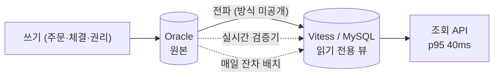
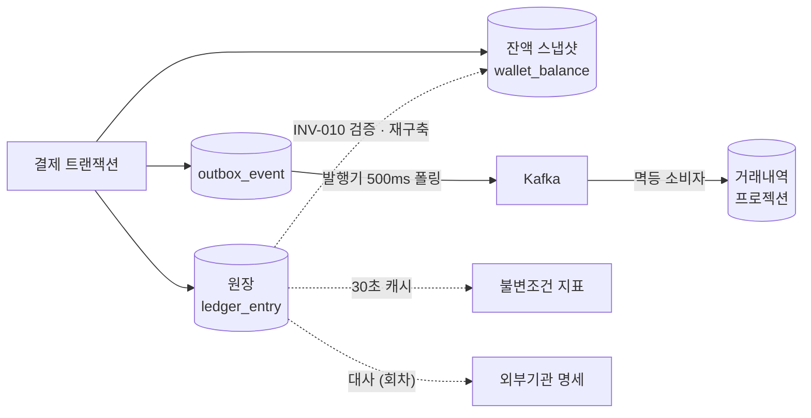

토스증권 서버 챕터가 2025년 7월에 공개한 Q&A에는 대규모 트래픽 처리에 관한 답이 한 문단으로 들어 있다. 원본은 Oracle, 읽기 전용 뷰는 별도 DB, 수평 확장을 위해 Vitess, API p95 40ms, 실시간 일관성이 필요한 데이터는 대부분 10ms 이내 갱신, 그리고 "read view database를 쓰면 데이터 일관성 관리가 굉장히 필요해지는데, 원본 database와 실시간 검증기를 거치고 매일 잔차 batch를 통해 데이터의 오염을 확인한다"는 문장이다. [서버 챕터 Q&A](https://toss.im/career/article/secu_server-chapter-2)

한 문단이지만 구조가 다 들어 있다. 원본 하나, 사본 하나, 사본을 채우는 경로, 그리고 사본이 틀렸을 때 잡는 장치 둘. 개인 프로젝트 [ParityPay](/posts/parity-pay-invariants/)에서 내가 만든 것도 규모만 다를 뿐 같은 모양이다. 원장이 원본이고, 잔액 스냅샷과 거래내역 프로젝션이 사본이고, 불변조건 지표와 대사가 검증 장치다. 이 글은 두 시스템을 나란히 놓고, 읽기 모델을 분리하는 순간 선택이 아니라 의무가 되는 장치 세 가지를 정리한다.

토스증권 쪽은 공개된 문장이 전부이고, 전파 방식이나 검증기가 비교하는 대상은 공개되지 않았다. 추정은 추정이라고 적었다. ParityPay 쪽은 [시리즈](/posts/parity-pay-invariants/)에 실측이 있으므로 그 숫자를 그대로 가져왔다.

## 토스증권이 말한 것과 말하지 않은 것

### 말한 것

- 원본은 Oracle이 관리한다. 읽기 전용 뷰는 별도 DB로 분리해 트래픽을 나눈다.
- 데이터가 늘면서 단일 인스턴스 읽기 뷰가 한계에 닿았고, MySQL 기반 샤딩 게이트웨이인 Vitess를 넣었다. Vitess는 온라인 reshard가 가능하고 OLTP 성격의 대용량 처리에 맞는다는 것이 선택 이유다.
- 결과로 API p95 약 40ms, 실시간 일관성이 필요한 데이터는 대부분 10ms 이내 갱신.
- 읽기 뷰의 일관성은 원본과의 **실시간 검증기**와 **매일 잔차 배치**로 "오염을 확인"한다.

같은 회사의 다른 글에서 읽기 모델 하나의 실제 사례를 볼 수 있다. 해외주식 원장의 계좌 단위 조회가 500ms를 넘자, Oracle은 날짜 파티션의 원본 저장소로 두고 MongoDB를 계좌 단위 조회용으로 붙였다. 초기 적재는 Impala로 대량 조회했고, 이후는 **Kafka 이벤트로 실시간 동기화**한다. [해외주식 서비스 안정화 사례](https://toss.tech/article/28738) Q&A의 Vitess 읽기 뷰와 같은 것인지는 알 수 없지만, "원본 → 이벤트 → 조회 전용 저장소"라는 형태는 확인된다.

### 말하지 않은 것

- **전파 방식.** Oracle에서 읽기 뷰로 무엇이 데이터를 나르는가. 10ms 이내 갱신이면 애플리케이션이 트랜잭션 안에서 두 곳에 쓰거나, CDC(로그 기반 변경 캡처)가 거의 실시간으로 흘리거나 둘 중 하나여야 한다. 폴링 기반 outbox로는 그 숫자가 나오기 어렵다.
- **검증기가 비교하는 것.** 전수인지 샘플인지, 행 단위인지 집계 단위인지, 원본 커밋 시점과 뷰 갱신 시점의 차이를 어떻게 잡는지.
- **잔차의 처리.** 배치가 차이를 "확인"한 다음 자동으로 뷰를 고치는지, 사람이 보는지.
- **reshard 중의 일관성.** Vitess가 온라인 reshard를 지원한다는 것과, reshard 도중 검증기가 어떻게 동작하는지는 다른 문제다.

이 네 가지는 비판이 아니라, 채용 Q&A 한 문단이 답할 범위 밖의 일이다. 그리고 정확히 이 네 가지가 ParityPay를 만들면서 결정해야 했던 것들이다.

## ParityPay에서 같은 모양

ParityPay는 원장이 시스템 오브 레코드다. 잔액을 조회할 때마다 원장을 합산하면 느리므로 사본이 둘 있다.

| 사본 | 어디에 | 어떻게 채우는가 | 지연 |
| --- | --- | --- | --- |
| 잔액 스냅샷 | 같은 DB, 같은 트랜잭션 | 원장 항목과 함께 커밋 | 0 |
| 거래내역 프로젝션 | Kafka 건너편 | outbox → 발행기 → 소비자 | 최소 500ms |

스냅샷은 토스증권의 "실시간 일관성이 필요한 데이터"에 해당한다. 잔액은 승인 판단에 쓰이므로 밀리초 단위로 틀려도 안 된다. 그래서 같은 트랜잭션에 넣었고, 대신 "둘이 어긋날 수 있다"는 위험을 INV-010(스냅샷은 같은 시점의 원장 계산값과 일치한다)이라는 문장으로 명시했다. 프로젝션은 초 단위 지연이 허용되는 화면용이라 [Transactional Outbox](/posts/parity-pay-outbox/)로 뗐다.

검증 장치도 둘이다. [6편](/posts/parity-pay-reconciliation/)의 표를 옮기면 이렇다.

| | 실시간 불변조건 지표 | 대사 |
| --- | --- | --- |
| 비교 대상 | 우리 안의 두 표현 (원장 차변·대변 합계, 원장 계산값과 스냅샷) | 우리 기록과 외부기관 기록 |
| 주기 | 30초마다 계산해 캐시, Prometheus가 읽음 | 회차 단위 |
| 잡는 것 | INV-001·003·010 위반. 평소 0이어야 하고 0이 아니면 그 자체가 장애 | 우리는 성공인데 기관에 없음, 기관은 처리했는데 우리에게 없음, 금액·상태 차이 |
| 잡지 못하는 것 | 외부와의 차이 | 지연 허용 시간 안의 차이 |

토스증권의 "실시간 검증기"와 "잔차 배치"에 대응하는 것이 각각 왼쪽과 오른쪽 열이다. 다만 ParityPay의 대사는 원본과 사본을 비교하는 것이 아니라 우리 기록과 **외부기관** 기록을 비교한다. 원본-사본 비교는 실시간 지표(INV-010)와 스냅샷 재구축 API가 맡는다.

## 대응 관계

| 관점 | 토스증권 (공개 Q&A·Toss Tech) | ParityPay (실측) |
| --- | --- | --- |
| 원본 | Oracle | PostgreSQL 원장 (append-only, 트리거로 UPDATE·DELETE 거부) |
| 읽기 모델 | Vitess 읽기 뷰, 계좌 조회용 MongoDB | 잔액 스냅샷(같은 DB), 거래내역 프로젝션(Kafka 건너편) |
| 전파 | 미공개 (MongoDB 사례는 Kafka 이벤트) | 같은 트랜잭션 / outbox → Kafka |
| 갱신 지연 | 대부분 10ms 이내 | 0 / 최소 500ms |
| 실시간 검증 | "원본 database와 실시간 검증기" | 불변조건 지표, 30초 캐시, `refresh_age_seconds` |
| 배치 검증 | "매일 잔차 batch" | 회차 단위 대사, 차이 6유형 |
| 잔차 처리 | "오염을 확인" (수정 여부 미공개) | 자동 보정 0유형. 보정은 새 분개·두 사람·사유 |
| 재구축 | Impala로 초기 적재 (MongoDB 사례) | 스냅샷 재구축 API, 지갑당 104ms |
| 규모 | 수백만 계좌 추정, Vitess 샤딩 | 지갑 87개, 원장 항목 200만 건 실험 |

표에서 바로 보이는 것이 있다. 토스증권은 읽기 모델을 **성능** 이야기의 일부로 꺼냈지만, 답의 절반은 검증기 이야기다. ParityPay도 스냅샷을 조회 속도 때문에 만들었지만, 관련 코드의 대부분은 스냅샷이 틀렸을 때를 위한 것이다. 읽기 모델의 비용은 저장소 하나가 아니라 검증 체계 전체다.

## 읽기 모델을 분리하면 반드시 따라오는 세 가지

### 첫째, 전파의 원자성을 어디서 포기할지 정해야 한다

원본에 커밋한 것과 사본에 반영된 것은 하나의 트랜잭션이 아니다. 어느 쪽을 먼저 하든 창이 생긴다. 원본 커밋 후 전파 전에 죽으면 사본이 뒤처지고, 전파 후 원본이 롤백되면 사본에 없는 사실이 남는다.

ParityPay는 이 창을 outbox로 닫았다. 이벤트를 업무 트랜잭션 안에서 `outbox_event`에 적고, 별도 발행기가 `FOR UPDATE SKIP LOCKED`로 선점해 브로커 ACK를 받은 것만 `PUBLISHED`로 바꾼다. 실측으로 업무 롤백 시 이벤트 0건, 커밋 후 발행 전 종료 시 재시작 후 이어서 발행, 발행기 4대에서 유실 0·중복 0이었다. 대가는 지연이다. 500ms 폴링이라 사본이 원본을 따라잡는 데 최소 그만큼 걸린다.

토스증권의 "10ms 이내"는 이 방식으로는 안 나온다. 가능한 경로는 둘이다. CDC로 Oracle의 변경 로그를 거의 실시간으로 흘리거나, 애플리케이션이 원본과 사본에 동기로 쓰거나. 전자는 outbox의 폴링과 선점 쿼리가 사라지는 대신 중복과 순서 문제가 남고([5편](/posts/parity-pay-outbox/)에서 그렇게 썼다), 후자는 두 번째 쓰기가 실패했을 때의 처리가 남는다. 어느 쪽이든 "전파가 실패할 수 있다"는 사실은 없어지지 않고, 그래서 검증기가 필요해진다. 검증기는 전파 방식의 보완재가 아니라, 전파가 원자적이지 않다는 사실의 직접적인 결과다.

여기서 ParityPay의 실험 하나가 토스증권의 문장을 다르게 읽게 만든다. 발행기 4대에서 유실도 중복도 0이었는데 **20,000건 중 50건이 역전**됐고, 그 순서가 정산 금액을 바꿨다. 사본이 원본과 "같은 사실"을 담고 있어도 "같은 순서"로 반영되지 않으면 결과가 다를 수 있다. 검증기가 행의 존재만 비교하면 이 종류의 오염은 잡히지 않는다. 토스증권의 검증기가 무엇을 비교하는지 공개되지 않았다고 위에 썼는데, 이것이 그 질문이 중요한 이유다.

### 둘째, 검증기는 자기 자신부터 무너진다

검증기를 만들면 그것이 먼저 병목이 된다. [4편 결함 G](/posts/parity-pay-experiments-and-defects/)가 정확히 그 사례다. 불변조건 지표가 Prometheus 스크레이프마다 원장 전체를 집계했다. 지갑 87개에서는 보이지 않던 비용이 원장 200만 건에서 스크레이프 한 번에 4.5초가 됐고, 간격이 5초라 쉬지 않고 도는 상태가 됐다. 더 커지면 스크레이프가 시간 초과되고, 그러면 이 지표만이 아니라 **모든** 지표가 사라진다. 불변조건을 지키는 장치가 데이터가 늘수록 먼저 무너지는 구조였다. 원장은 append-only라 이 비용은 단조 증가한다.

수정은 30초마다 계산해 캐시하고 게이지는 캐시를 읽게 한 것이다. 스크레이프 응답은 12~17ms, DB 점유는 90%에서 21%로 내려갔다. 그러자 새 위험이 생겼다. 갱신이 멈춘 채 마지막 0이 계속 보이면 아무 일도 없는 것처럼 보인다. 그래서 `refresh_age_seconds`를 같이 내보내고 경보를 걸었다. 갱신에 실패하면 값을 0으로 덮지 않고 마지막 값을 유지한 채 나이가 자라게 둔다.

토스증권 규모에서 "원본 database와 실시간 검증기"는 전수 비교일 수 없다. 원본이 Oracle이고 사본이 샤딩된 Vitess인데 두 쪽을 행 단위로 다 읽으면 그것이 곧 부하다. 추정하건대 변경 이벤트 단위로 "방금 원본에 커밋된 이 행이 사본에 도착했는가"를 보거나, 계좌 단위 집계값을 샘플링해 비교할 것이다. 어느 쪽이든 결함 G의 질문은 그대로 적용된다. 검증기가 멈췄을 때 그 사실을 누가 아는가. 검증기의 "정상"이 "검증했고 차이가 없다"인지 "검증하지 못했다"인지 구분되는가.

이 구분은 [6편](/posts/parity-pay-reconciliation/)에서 대사 쪽으로도 한 번 더 나왔다. 처음 만든 대사는 기관 표를 같은 DB에서 조인했다. 조회는 항상 성공하고, 비어 있으면 "기관에 기록이 없다"가 됐다. 대사가 실패할 수 없는 구조였고, 기관이 명세를 못 주는 날 우리 기록 전부가 불일치가 됐다. "물어보지 못했다"와 "기록이 없다"를 구분하지 못하는 검증기는 아무것도 하지 않는 것보다 나쁘다. 토스증권의 잔차 배치가 원본 조회에 실패한 날 무엇을 하는지는 공개되지 않았지만, 이 질문은 어느 검증기에나 던져야 한다.

### 셋째, 잔차를 찾는 것과 고치는 것을 분리해야 한다

토스증권의 문장은 "잔차 batch를 통하여 데이터의 오염을 **확인**"한다까지다. 확인한 다음 자동으로 사본을 원본에 맞추는지, 사람이 보는지는 없다. 이것은 문장의 빈틈이 아니라 실제로 갈리는 결정이다.

ParityPay는 차이 여섯 유형(`INTERNAL_ONLY`, `EXTERNAL_ONLY`, `STATUS_MISMATCH`, `AMOUNT_MISMATCH`, `DUPLICATE`, `LEDGER_MISSING`) 모두 자동 보정하지 않는다. 설계에는 `autoResolvable` 플래그가 있는데 `true`인 유형이 하나도 없다. 유형을 하나씩 검토할 때마다 "원인을 모른 채 숫자를 맞추면 진짜 문제를 덮는다"는 이유가 반복됐기 때문이다. 스냅샷 재구축도 같은 규칙이다. 어긋난 스냅샷을 찾는 API와 고치는 API가 다르고, 한 번에 전부 맞추는 API는 일부러 두지 않았다. 배경 작업이 조용히 맞춰 버리면 원인을 조사할 증거가 사라진다.

다만 이 결정은 원본과 사본의 관계에 따라 달라져야 한다고 본다. ParityPay의 대사는 우리 기록과 **외부기관** 기록을 비교한다. 어느 쪽이 맞는지 코드가 판단할 수 없으므로 자동 보정이 위험하다. 반면 토스증권의 잔차 배치는 Oracle 원본과 자기 사본을 비교한다. 원본이 정의상 맞으므로 사본을 원본으로 덮는 것은 "숫자를 맞추는" 것이 아니라 재구축이다. ParityPay에서도 스냅샷은 원장에서 재구축하며, 그때 쓸 수 있는 값은 원장 계산값 하나뿐이라 이 경로로 없는 돈을 만들 수 없다. 그러니 원본-사본 잔차는 자동 재구축이 합리적일 수 있고, 대신 **재구축이 일어났다는 사실**은 남아야 한다. 잔차가 생긴 원인(전파 지연, 소비자 장애, 순서 역전)은 재구축으로 사라지지 않기 때문이다.

정리하면 이렇다.

| 비교 대상 | 어느 쪽이 맞는가 | 자동 수정 |
| --- | --- | --- |
| 원본 vs 자기 사본 | 원본 | 재구축 가능. 단, 발생 기록과 원인 조사는 남긴다 |
| 우리 기록 vs 외부 기록 | 모른다 | 하지 않는다. 보정은 새 분개·승인·사유 |

토스증권의 "매일 잔차 batch"는 첫째 줄이고, ParityPay의 대사는 둘째 줄이다. 같은 단어(대사, reconciliation)가 두 줄에 걸쳐 쓰이는데, 정합성 인터뷰에서 이 둘을 구분해 말할 수 있는지가 이해의 깊이를 드러낸다.

## 규모가 바꾸는 것

ParityPay의 숫자는 지갑 87개, 원장 항목 200만 건, 개발 노트북이다. 토스증권은 계좌가 수백만 단위일 것이고 읽기 뷰는 샤딩돼 있다. 규모가 커지면 위의 세 장치가 어떻게 달라지는지 적어 둔다.

- **전파.** 500ms 폴링 outbox는 초당 수천 건에서 발행기 선점 쿼리가 병목이 된다. CDC로 옮기면 폴링은 사라지고 중복·순서만 남는다. 10ms 갱신은 CDC이거나 동기 이중 쓰기다.
- **검증기.** 전수 집계는 불가능하다. 이벤트 단위 도착 확인이나 집계 샘플링이 될 것이고, 그러면 "검증기가 놓치는 종류"가 생긴다. 그것을 잡는 것이 일 배치의 역할이 된다. 토스증권이 실시간 검증기와 잔차 배치를 둘 다 두는 이유가 여기 있다고 본다.
- **재구축.** 지갑 하나 104ms는 지갑 87개에서의 이야기다. 샤드 하나가 오염되면 수십만 계좌를 원본에서 다시 만들어야 하고, 그동안 조회를 어디로 보낼지가 설계에 들어가야 한다. MongoDB 사례의 Impala 초기 적재가 그 경로의 첫 형태다.
- **reshard.** Vitess의 온라인 reshard 중에는 같은 키가 두 샤드에 걸쳐 있는 순간이 있다. 검증기가 reshard를 인지하지 못하면 그 순간을 오염으로 오인한다. 검증기에 "지금은 reshard 중"이라는 상태가 필요하다.

## 면접에서 이어질 질문

이 비교를 하고 나서 스스로 답을 준비한 질문들이다. 토스증권의 구조를 놓고 받을 수 있는 질문이면서, ParityPay 실측으로 답할 수 있는 것들이다.

- read model 지연을 사용자에게 어떻게 표현하는가 → 스냅샷은 지연 0이어야 해서 같은 트랜잭션에 넣었고, 프로젝션은 500ms를 받아들였다. 어느 데이터가 어느 쪽인지 정하는 기준은 "그 값으로 돈이 움직이는가"였다.
- CDC 이벤트가 중복·역전·유실되면 어떻게 복구하는가 → 소비자 멱등 키 두 겹(소비 기록 삽입 반환 행 수, 업무 유니크 제약). 유실은 outbox가 막았고, 역전은 막지 못했다. 파티션 키를 계좌 단위로 고정해야 하고, 그래도 발행기 다중화에서 50건이 역전됐다.
- 원장과 조회 DB의 차이를 어떻게 탐지하는가 → 30초 캐시 지표 + `refresh_age_seconds` + 검증 API. 탐지기가 먼저 무너진 사례(결함 G)와 그 수정.
- 온라인 검증과 배치 대사의 책임을 어떻게 나누는가 → 온라인은 우리 안의 두 표현, 배치는 외부 기록. 원본-사본 잔차는 재구축, 외부 차이는 사람.
- resharding 중 쓰기·읽기 일관성 → 해 본 적 없다. 위에서 추론한 "검증기가 reshard 상태를 알아야 한다"까지가 답이고, 거기서부터는 질문이다.

마지막 항목처럼 모르는 것은 모른다고 적는 편이 낫다. 채용 Q&A의 한 문단에서 여기까지 끌어낼 수 있다는 것이, 그 문단이 잘 쓰였다는 뜻이기도 하다.

## 정리

- 토스증권의 CQRS 답변은 성능 이야기로 시작해 검증기 이야기로 끝난다. 읽기 모델의 비용은 저장소가 아니라 검증 체계다.
- 읽기 모델을 분리하면 세 가지가 의무가 된다. 전파의 원자성을 어디서 포기할지(outbox냐 CDC냐), 검증기 자체의 비용과 정지 감지, 잔차를 찾는 것과 고치는 것의 분리.
- 원본-사본 잔차와 우리-외부 잔차는 다른 문제다. 전자는 재구축할 수 있고 후자는 사람이 봐야 한다. 같은 단어로 부르지만 같은 결정을 내리면 안 된다.
- ParityPay의 실측 중 토스증권의 문장을 다르게 읽게 만든 것은 둘이다. 유실·중복 0에서도 순서가 역전됐다는 것, 그리고 검증기가 먼저 무너졌다는 것.

## 참고 자료

- [토스증권 서버 개발자가 많이 듣는 질문 4가지](https://toss.im/career/article/secu_server-chapter-2) (2025-07-17)
- [해외주식 서비스 안정화 사례 (Toss Tech)](https://toss.tech/article/28738)
- ParityPay 시리즈: [1편 불변조건](/posts/parity-pay-invariants/), [4편 실험과 결함](/posts/parity-pay-experiments-and-defects/), [5편 Transactional Outbox](/posts/parity-pay-outbox/), [6편 대사](/posts/parity-pay-reconciliation/), [8편 Kafka 장애 실험](/posts/parity-pay-kafka-failures/)
- 같은 주제의 앞선 글: [채용공고 분석](/posts/toss-securities-server-developer-job-analysis/), [시세·주문 아키텍처 리뷰](/posts/toss-securities-market-data-and-order-architecture/)
