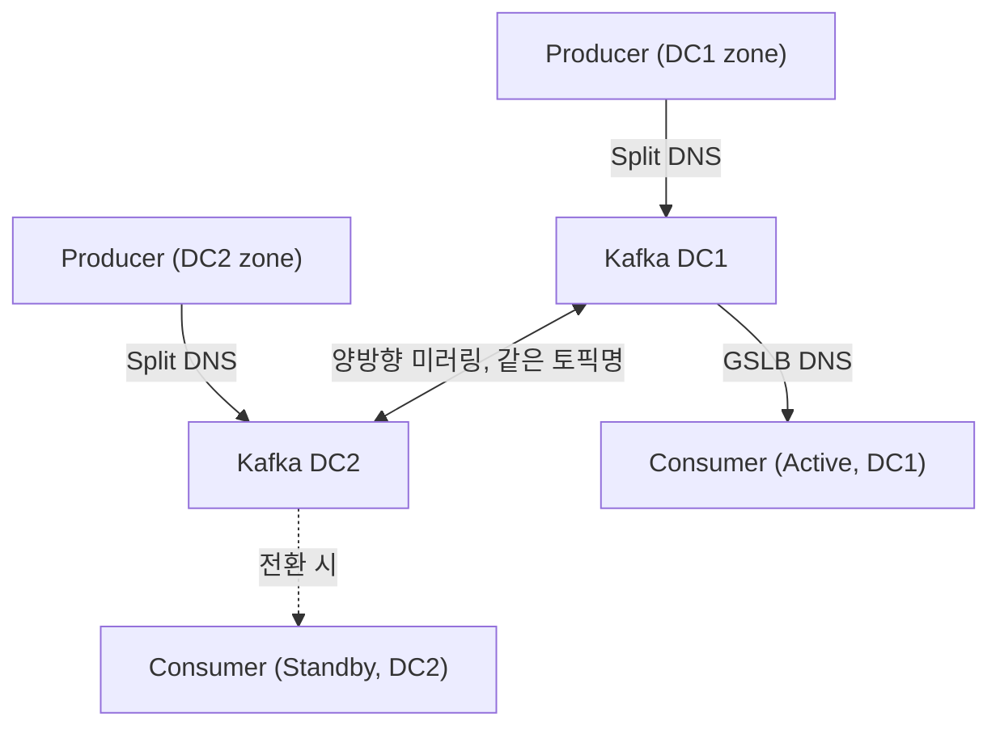

SLASH 23의 "Kafka 이중화로 다양한 장애 상황 완벽 대처하기"는 토스증권 데이터 엔지니어 강병수 님의 세션이다. 발표 뒤 같은 내용이 Toss Tech에 세 편의 글로 정리됐다. 1편(강병수)이 구조 선택, 2편(송지수)이 데이터 미러링, 3편(김용우)이 Consumer Group Offset 동기화이고, 세 사람 모두 Realtime Data Team이다. 세션 페이지는 개요만 있고 글에 세부가 있으므로, 이 리뷰는 글 세 편을 1차 자료로 삼는다. 발표 영상 쪽 리뷰는 [SLASH 23 Kafka 이중화 리뷰](/posts/slash23-kafka-idc-redundancy/)에 따로 있다. [세션](https://toss.im/slash-23/session-detail/B2-6), [#1 구성](https://toss.tech/article/kafka-distribution-1), [#2 데이터 미러링](https://toss.tech/article/kafka-distribution-2), [#3 Offset Sync](https://toss.tech/article/kafka-distribution-3)

앞의 두 글([시세·주문 아키텍처](/posts/toss-securities-market-data-and-order-architecture/), [CQRS와 검증기](/posts/toss-securities-cqrs-validator-vs-parity-pay/))이 데이터를 어떻게 다루는가였다면, 이 글은 그 데이터가 타고 다니는 브로커가 데이터센터째로 죽었을 때의 이야기다. 읽고 나서 내게 남은 결론을 먼저 적는다. 미러링은 상대적으로 쉽고 오프셋이 어렵다. 그리고 "중복과 유실이 없다"는 말은 재난 때와 작업 때 다른 뜻이다.

## 문제: 서버는 stateless인데 Kafka는 아니다

토스증권은 두 데이터센터에 비슷한 스펙의 Kubernetes 클러스터를 두고 평시에도 양쪽이 트래픽을 받는 Active-Active로 운영한다. 서버는 stateless로 설계돼 있어 한쪽이 죽으면 다른 쪽으로 보내면 된다. Kafka는 그렇지 않다. 메시지와 [오프셋](/posts/kafka-storage-internals/)(파티션 안에서 메시지의 순번)이 클러스터 안에 있다. MSA 전체가 Kafka로 이어져 있으니 Kafka가 한쪽 센터에만 있으면 그 센터가 곧 단일 장애점이다.

## 선택: Active-Active인가 Stretched Cluster인가

두 후보를 세 기준으로 비교했다. 우선순위 순으로 모든 장애 케이스에 대한 가용성, 이중화로 인한 성능 저하 방지, 운영 편의성이다.

| | Active-Active (독립 클러스터 둘 + 양방향 미러링) | Stretched Cluster (두 센터 노드를 한 클러스터로) |
| --- | --- | --- |
| 장점 | 클라이언트가 같은 센터의 Kafka에 붙어 지연이 낮다. 한쪽 장애가 다른 쪽에 번지지 않는다 | 운영이 단일 클러스터와 비슷하다. 센터 장애 시 클라이언트가 재연결만 하면 이어진다 |
| 단점 | 수백 개 토픽의 양방향 미러링, 수천 개 Consumer Group 오프셋 동기화, 토픽·권한 관리 두 배 | 매 요청이 센터 간 네트워크를 타서 지연이 커진다. 센터 간 단절 시 ZooKeeper split-brain으로 클러스터 전체가 멈출 수 있다 |

Stretched Cluster는 운영이 편하지만 1순위 기준에서 탈락한다. 센터 간 네트워크가 끊기면 가용성을 확보할 수 없고, 2순위에서도 지연으로 탈락한다. 그래서 Active-Active를 고르고, 단점 세 줄을 도구로 메우기로 했다. 그 도구가 2편과 3편이다.

이 결정 방식이 리뷰의 첫 번째 관찰이다. 1편은 운영 편의성을 기준에 넣되, 앞의 두 기준보다 상대적으로 중요도가 떨어진다고 적었다. 가용성과 성능을 확보하면 운영 부담은 어떻게든 풀면 된다는 이유다. 편의성이 기준에 없으면 나중에 "그래도 stretched가 편한데"라는 말이 계속 나오고, 기준에 있는데 순위가 없으면 매번 다시 싸운다.

## 최종 구조: 생산은 양쪽, 소비는 한쪽



Producer는 Split DNS(요청한 쪽의 위치에 따라 다른 주소를 돌려주는 DNS)로 자기가 배포된 zone과 같은 센터의 Kafka에 쓴다. 각 센터에 들어온 메시지를 양방향 미러링 도구가 상대 센터로 실시간 전달하므로 양쪽 모두 100%의 데이터를 갖는다. 메인 센터를 바꾸는 것은 Split DNS 제어로 끝난다.

Consumer는 양쪽에 데이터가 다 있으니 둘 다 소비하면 두 배로 처리하게 된다. 그래서 Active-Standby다. GSLB DNS로 한쪽 클러스터만 바라보게 통제하고, 전환도 GSLB로 한다. 문제는 오프셋이다. 같은 메시지가 DC1에서는 오프셋 10, DC2에서는 9,959,273에 있을 수 있다. Standby로 옮길 때 그 클러스터의 오프셋 체계로 보정한 값을 저장해 주는 것이 Offset Sync 도구다.

토픽명은 양쪽에서 같다. Uber 같은 해외 사례처럼 센터별 prefix를 붙이는 방식은 채택하지 않았다. 서비스 개발자가 어느 센터에 배포되든 신경 쓰지 않아도 되게 하려는 정책이었고, 1편은 그 결과 이중화 Kafka에 대한 추가 러닝커브가 없어졌다고 쓴다. 현재 천 개가 넘는 토픽과 Consumer Group을 이 구조로 운영한다.

## 데이터 미러링: MirrorMaker2를 쓰지 않은 이유

### 토픽명 하나가 이유였다

MM2는 소스 클러스터 alias를 토픽명 앞에 붙인다. 클러스터 A의 `topic.test.1`은 B에서 `A.topic.test.1`이 된다. 토스증권의 목표는 어느 센터에 붙어서 produce·consume하든 항상 같은 토픽명 하나를 쓰는 것이었다. 이 요구 하나가 MM2를 탈락시켰다.

### Sink Connector와 헤더 한 줄

미러링 도구는 Kafka Connect의 Sink Connector로 만들었다(2편에 따르면 MM2는 Source Connector 기반이다). Sink Connector는 Kafka에서 읽어 외부 시스템에 쓰는 것인데, 그 외부 시스템을 상대 센터의 Kafka로 잡은 것이다.

같은 토픽명으로 양방향 미러링을 하면 무한 루프가 생긴다. DC1의 메시지를 DC2로 보내면 DC2의 미러러가 그것을 다시 DC1로 보낸다. 해결은 헤더다. 미러링할 때 헤더에 Source DC 정보를 넣는다. 헤더에 Source DC가 있는 메시지는 미러링된 것으로 보고 다시 보내지 않는다. 없는 메시지만 사용자가 만든 원본으로 보고 상대 센터로 보낸다. 이것으로 양쪽에 정확히 100%씩만 존재한다. 헤더에는 원천 클러스터에서의 오프셋도 같이 싣는다. 이 값이 3편에서 쓰인다.

### 유실 없는 미러링과 모니터링

처리에 실패한 메시지는 Kafka Connect 2.0부터 지원하는 DLQ(Dead Letter Queue, 처리에 실패한 메시지를 따로 모아 두는 토픽)로 보낸다. 원본과 함께 토픽·파티션·오프셋·예외 메시지가 담기고, DLQ 토픽에 대한 재처리 시스템을 따로 뒀다. 글은 이것으로 "유실 없는 미러링 도구"가 됐다고 쓴다.

모니터링은 Prometheus에서 시작했다가 바꿨다. 보관 기간이 짧아 장기 분석이 어렵고, PromQL의 label 일치 제약 때문에 유연한 조인이 안 됐다. 그래서 커스텀 메트릭 리포터가 Kafka 메트릭 포맷 그대로 Kafka에 보내고, ClickHouse에 쌓아 SQL로 조인·대시보드를 만든다. 가장 중요한 메트릭은 원천 Kafka 인입 시점부터 대상 Kafka 전송까지의 지연이고, ms 단위만 허용한다. 시계열 트렌드로 토픽별 인입량이 평소보다 과하게 적거나 많은지를 잡아 이상 징후를 미리 본다.

운영 규모 문제도 있었다. 처음엔 큰 Connect 클러스터 하나에 토픽당 Connector 하나였는데, 토픽이 늘어 Connector 잡이 수백 개가 되자 운영 부담이 커졌다. 클러스터를 N개의 작은 클러스터로 쪼개 잡별 Task 수를 유연하게 잡고 분배를 조정해 성능도 올렸다.

## 오프셋 동기화: 같은 메시지가 클러스터마다 다른 번호를 갖는다

### 기존 도구가 안 되는 이유

MM2도 오프셋 동기화를 한다. 소스와 타깃의 오프셋 매핑을 `OffsetSync` 토픽에 적는데, 기본값으로 100 레코드에 한 번 기록한다. Consumer 오프셋이 그 매핑과 정확히 일치하지 않으면 downstream 오프셋에 1을 더해 보수적으로 쓴다. 유실은 막지만 중복이 생기고, 3편은 정확한 Offset Sync가 1/100 확률로만 가능하다고 정리한다. 같은 토픽명으로 미러링하는 환경에서는 사용이 제한적이고, 미러링이 없는 토픽에서는 동기화도 안 된다. Confluent Replicator는 timestamp 기반으로 검색하지만 Confluent Kafka를 구매해야 쓸 수 있다.

### 토픽을 두 형태로 나눈다

동기화 전략은 토픽에 데이터가 어떻게 들어오느냐로 갈린다.

| 형태 | 뜻 | 전략 |
| --- | --- | --- |
| 100:0 | 한쪽 센터에만 100% 들어오고 미러로 다른 쪽에 전달 | timestamp 검색 |
| 50:50 | 양쪽에 각 50%씩 들어오고 미러로 양쪽이 100% | 헤더 참조 |

### 전략 1: timestamp 검색 (100:0)

미러된 레코드는 원본과 같은 timestamp를 갖는다. 그래서 소스의 Consumer 오프셋을 읽고, 그 레코드의 timestamp를 확인하고, 타깃에서 `offsetsForTimes`로 같은 timestamp의 오프셋을 찾아, 그 값을 타깃의 Consumer 오프셋으로 커밋한다.

문제는 timestamp가 순차적이지 않을 때다. 배치 작업이나 중복 timestamp가 있으면 `offsetsForTimes`는 해당 timestamp보다 같거나 큰 timestamp를 가진 첫 오프셋을 돌려주므로, 목표보다 앞선 오프셋을 커밋하게 되어 중복이 생길 수 있다(더 뒤를 고르는 일은 없으므로 유실은 아니다). 대응은 고치는 것이 아니라 감지하는 것이다. timestamp 순서가 꼬여 중복이 날 수 있는 토픽을 잡는 메트릭을 만들어 작업 전에 파악한다.

### 전략 2: 헤더 참조 (50:50)

50:50에서는 양쪽에서 생산된 메시지가 섞이므로 순서 자체가 양쪽에서 다르다. timestamp로는 안 된다. 대신 미러러가 헤더에 넣어 둔 `IDC`와 `Offset`을 쓴다.

```text
"IDC"    : IDC2
"Offset" : 1234516
```

원리는 타깃 클러스터에서 미러된 데이터에 대해서만 Offset Sync를 실행하는 것이다. 미러된 레코드는 원천에서의 오프셋을 알고 있으므로 정확히 대응시킬 수 있고, 유실이 나지 않는다. 대가는 확률이다. 헤더가 있는 메시지가 절반이니 한 번의 동기화 시도가 성공할 확률은 50%다. 글은 여기서 계산을 한다. 30초 주기로 돌리면 5분 동안 열 번 연속 실패할 확률은 2의 10승분의 1, 약 0.1%다. 그리고 Consumer 오프셋 기준으로 최신 N건을 읽어 헤더가 있는 메시지를 찾는 방식으로 성공률을 65~70%까지 올렸다.

작업 중 중복은 다른 방법으로 없앤다. Split DNS 비율을 0:100으로 바꿔 모든 데이터를 타깃으로만 보내면, 양쪽에서 생산돼 교차 미러링되던 "X자 꼬임"이 풀리고 중복 없는 동기화가 가능해진다.

### 동기화가 되고 있는지는 어떻게 아는가

정상이면 소스와 타깃의 Consumer 오프셋 차이의 변화량이 일정 window에서 0으로 수렴한다. 10분 window의 변화량 합이 0에 수렴하면 정상, 증가하면 미동기 상태다. 대시보드는 Data Mirror와 Offset Sync가 모두 잘 도는 상태를 `Mirroring`으로, 그중에서도 Consumer 오프셋과 그 메시지 내용까지 같은 상태를 `InSync`로 보여 주고, `InSync`가 Consumer 이전의 신호가 된다. 데이터가 오래 안 들어와 동기화가 드문 토픽은 Consumer lag이 0이면 타깃 오프셋을 최신으로 유지한다.

## 리뷰: 이 설계에서 배울 것

### 재난과 작업의 수용 기준이 다르다

3편이 구현 설명 앞에 세운 두 요구사항이 이 설계 전체를 요약한다고 나는 본다. 재난 시에는 "중복은 최소화하되, 유실은 절대 발생하면 안 된다", 작업 시에는 "중복과 유실이 모두 없는 환경". 같은 도구인데 상황에 따라 목표가 다르고, 그 차이가 설계에 반영돼 있다. 재난 때는 헤더 참조의 50% 확률과 30초 주기가 만드는 미동기 창을 받아들인다. 그 창이 5분을 넘을 확률이 약 0.1%이고, 동기화가 밀린 만큼은 이전 뒤 중복으로 읽힐 수 있다. 작업 때는 Split DNS를 0:100으로 돌려 X자 꼬임을 풀어 중복까지 없앤다.

내가 보기에는 이것을 "중복과 유실이 없다"는 한 문장으로 뭉개지 않은 것이 이 시리즈에서 가장 배울 점이다. 분산 시스템에서 그 문장은 항상 조건부인데, 조건을 밝히지 않으면 나중에 그 조건 밖의 장애가 "약속 위반"으로 읽힌다.

### 복잡성을 플랫폼이 흡수하고 개발자에게는 토픽명 하나만 남긴다

MM2를 버린 이유가 토픽명이었고, 그 대가로 Sink Connector, 루프 방지 헤더, 오프셋 헤더, DLQ 재처리, ClickHouse 모니터링, Connect 클러스터 분할, 두 가지 Offset Sync 전략, 확률 계산, 변화량 수렴 메트릭, 대시보드를 전부 직접 만들었다. 서비스 개발자 입장에서 남은 것은 "어느 센터에 있든 같은 토픽명을 쓴다"뿐이다. 1편은 토스증권의 요구에 맞는 오픈소스가 없어 직접 개발했다고 적는다. 플랫폼 팀이 감당하는 복잡성의 양과 서비스 팀이 보는 단순함의 비율을 보면, 나는 그 선택이 같은 토픽명이라는 요구 하나에서 나왔다고 읽는다.

### 동기화 주기를 확률로 설명한다

3편은 50% 확률이 긴 지연처럼 보일 수 있다는 우려에 30초 주기면 5분 동안 열 번 시도하므로 모두 실패할 확률이 약 0.1%라고 답한다. 주기를 어떻게 골랐는지는 글에 없지만, 이 계산이 주기의 근거로 쓰일 수 있다. 같은 식으로 내가 계산해 보면, 주기를 10초로 줄이면 확률은 더 낮아지지만 동기화 시도가 3배가 되고, 60초로 늘리면 5분 안에 5번밖에 시도하지 못해 약 3%가 된다. 이런 계산이 있어야 "왜 30초인가"에 답할 수 있다.

## 남는 질문

글이 답하지 않았거나, 내가 다른 실험에서 본 것과 맞물리는 지점이다.

- 미러링 지연분의 유실. 미러링 지연이 ms 단위라 해도 DC1이 죽는 순간 아직 DC2로 넘어가지 못한 마지막 메시지들은 있다. "재난 시 유실 0"은 미러링이 완료된 범위에서의 약속이고, Producer 쪽에서 `acks`를 어떻게 잡았는지(로컬 클러스터 `acks=all`이어도 상대 센터 도착은 보장하지 않는다, [전달 보장](/posts/kafka-delivery-guarantees/))와 합쳐 읽어야 한다. [ParityPay 8편](/posts/parity-pay-kafka-failures/)에서 `acks=1`·`0`으로 브로커를 죽였을 때 "PUBLISHED인데 브로커에 없음"이 발행 배치 단위(100·200건)로 생겼는데, 센터 간 미러링에는 같은 모양의 창이 한 층 더 있다.
- 50:50 토픽의 파티션 키 순서. 같은 계좌의 이벤트가 두 센터에서 나뉘어 생산되면, 미러링 뒤 양쪽 클러스터에서 그 계좌의 이벤트 순서는 다르다. 글의 "X자 꼬임"이 이것이고, 작업 시에는 0:100으로 풀지만 평시에는 존재한다. 순서가 결과를 바꾸는 소비자(ParityPay에서는 정산이었다. 유실·중복 0에서도 20,000건 중 50건 역전이 금액을 바꿨다)는 50:50 토픽을 쓰면 안 되거나, 소비자가 순서 독립적이어야 한다. 3편은 50:50과 100:0이 토픽 사용자의 여러 이유로 정해진다고만 적는다. 나는 그 기준에 "이 데이터는 순서가 결과를 바꾸는가"가 들어가야 한다고 보는데, 글에는 없다.
- 소비자 멱등성은 여전히 필요하다. 재난 시 중복이 허용된다는 것은, 그 중복을 소비자가 걸러야 한다는 뜻이다. 3편도 이 경계를 직접 적는다. 중복은 각 서비스가 멱등성을 갖춰 보완할 수 있지만 유실은 서비스가 대처할 방법이 없어 Kafka 수준에서 막아야 한다는 것이다. 이 경계가 서비스 개발자에게 실제로 어떻게 전달되는지가 궁금하다.
- ZooKeeper 이후. Stretched Cluster 탈락 사유 하나가 ZooKeeper split-brain이었다. KRaft 기반 Kafka에서는 quorum 구성이 달라지므로 같은 결론이 나오는지는 다시 봐야 한다. 다만 센터 간 지연이라는 두 번째 사유는 그대로이므로 결론이 바뀔 것 같지는 않다.
- 미러러 자신의 이중화. Connect 클러스터를 N개로 쪼갰다고 했는데, 미러러가 어느 센터에서 돌고 그 센터가 죽으면 반대 방향 미러링은 누가 하는지는 적혀 있지 않다. 이 질문은 아래에서 따로 따져 본다.

### 미러러 자신의 이중화를 따져 보면

자료가 말해 주는 것은 셋이다. 미러러는 Kafka Connect의 Sink Connector이고, Connect 클러스터는 운영 부담 때문에 N개로 쪼갰으며(센터 이중화 때문이 아니다), 미러링 지연 메트릭과 대시보드의 `Mirroring` 상태가 있다. 어느 센터에서 도는지는 없지만, Sink Connector라는 사실이 배치를 거의 정한다고 나는 본다. 분산 모드의 Connect 워커는 config·offset·status 내부 토픽을 워커가 붙은 Kafka 클러스터에 둔다. Sink Connector의 소비 오프셋은 `connect-${connector}`라는 이름의 consumer group에 있다([Kafka Connect 사용자 가이드](https://kafka.apache.org/43/kafka-connect/user-guide/)). 소스 쪽 클러스터를 워커의 기본 클러스터로 두면 이 둘이 모두 소스 센터에 있다. 그러니 DC1→DC2 미러러의 상태는 DC1에 있고 워커도 DC1에 두는 것이 자연스럽다. 로컬에서 읽어 원격에 쓴다. 반대 방향은 반대다.

이 비대칭 때문에 센터 하나가 죽으면 두 방향의 미러러가 서로 다른 처지가 된다.

| 시나리오 | 두 미러러에 생기는 일 |
| --- | --- |
| DC1 전체 다운 | DC1→DC2 미러러는 워커·소스·상태가 함께 죽지만 할 일도 없다(Producer는 Split DNS로 DC2로 옮겨진다). DC2→DC1 미러러는 타깃이 없어 재시도하며 DC2 오프셋에서 멈춘다. DC2에 백로그가 쌓이고 DC1이 복구되면 이어서 미러링한다. DC2의 retention이 DC1 장애 시간보다 길어야 한다 |
| DC1의 Connect 클러스터만 다운 (Kafka는 정상) | DC1→DC2 미러링만 멈추고 DC2가 뒤처진다. 반대 방향은 정상. 서비스는 겉보기에 정상이다(Consumer는 DC1 Active). 이 상태에서 Consumer를 DC2로 넘기면 데이터가 빠진 채 넘어간다 |
| 센터 간 네트워크 단절 (양쪽 정상) | 양방향 모두 타깃 불가로 재시도한다. 양쪽이 각자 로컬 데이터만 갖고 갈라지고, 복구 후 양방향으로 따라잡는다 |

첫 줄과 셋째 줄은 Kafka가 죽거나 망이 끊긴 것이라 이중화 도구의 한계로 설명된다. 둘째 줄이 이 질문의 핵심이다. 미러러 자신의 가용성 문제이고, 자료가 답하지 않은 곳이 정확히 여기다. 가능한 답은 셋이다.

1. 센터 안의 이중화는 거의 확실히 되어 있다. Connect는 분산 프레임워크라 워커 여러 대가 한 클러스터를 이루고, 워커 하나가 죽으면 Task가 나머지로 재배치된다. N개로 쪼갠 클러스터도 각각 워커 여러 대일 것이다. 이것은 워커 장애를 막지 센터 장애를 막지는 않는다.
2. 센터 밖의 대기는 구조상 가능하지만 자료에 없다. [KIP-458](https://cwiki.apache.org/confluence/display/KAFKA/KIP-458%3A+Connector+Client+Config+Override+Policy)(Kafka 2.3.0) 이후 워커의 override 정책이 허용하면 Connector 단위로 `consumer.override.bootstrap.servers`를 줄 수 있으므로, DC2의 워커가 DC1 Kafka를 소스로 읽는 DC1→DC2 미러러를 띄울 수 있다. 소비 오프셋은 DC1의 consumer group에 있으니 DC1 Kafka가 살아 있는 한 같은 자리에서 이어 갈 수 있다. 다만 Connect 내부 토픽은 클러스터마다 따로라, "이어받기"라기보다 "같은 설정을 양쪽에 두는 것"에 가깝다.
3. 탐지가 이중화를 일부 대신한다. 이것은 자료에 있다. 미러링 지연 메트릭과 `Mirroring`·`InSync` 상태가 Consumer 이전의 전제 조건이다. 미러러가 죽으면 그 상태로는 Consumer를 넘기지 않고 사람이 미러러를 복구한다는 운영 규칙이면, 둘째 줄은 가용성 문제가 아니라 전환 가능성 문제로 바뀐다.

같이 딸려 나오는 세부 질문이 셋 있다.

- DLQ와 "타깃 불가"의 구분. 처리 실패 메시지를 DLQ로 보내 유실 없는 미러링을 만들었다고 했는데, 상대 센터 Kafka에 연결이 안 되는 예외까지 DLQ로 보내면 미러 경로에서는 사라진 것과 같다. 연결 오류는 무한 재시도(Kafka 문서상 `errors.retry.timeout=-1`이 무한 재시도이고 기본값 0은 재시도하지 않는다, [Connect 설정](https://kafka.apache.org/43/configuration/kafka-connect-configs/)), 역직렬화·변환 오류만 DLQ여야 한다고 나는 본다. 어떻게 나눴는지는 글에 없다.
- 미러링 창의 메시지는 늦게, 순서가 바뀐 채 도착한다. DC1이 죽기 직전 ms 동안 DC2로 못 넘어간 메시지는 DC1이 복구되면 그제야 DC2에 도착한다. Consumer는 이미 DC2로 넘어가 그 뒤 메시지를 처리한 상태다. 유실은 없지만 순서가 역전된 채 늦게 온다. "재난 시 유실 0, 중복 최소화"에 "지연 도착"이라는 셋째 항목이 숨어 있는 셈이고, 위의 50:50 순서 질문과 뿌리가 같다.
- retention이 곧 복구 창이다. DC2→DC1 미러러가 재시도하며 기다리는 동안 DC2 토픽의 retention이 지나면 그 구간은 DC1이 복구돼도 못 채운다. 이중화 설계에서 retention은 저장 비용이 아니라 허용 가능한 센터 장애 시간이다.

정리하면, "유실 0"은 "소스 클러스터의 디스크가 살아 있고 retention 안에 복구되는 한"이라는 조건이 붙고, 그 조건을 운영이 아는 방법이 지연 메트릭과 `Mirroring` 상태다. 자료가 말한 것은 거기까지이고, 그 너머는 물어봐야 안다.

## 직무와 연결하면

채용공고 분석에서 2순위 공부 목록에 "Kafka 장애 시 polling fallback"과 "IDC·리전 이중화"를 넣었는데, 이 시리즈가 그 항목의 실체다. 면접에서 이어질 만한 질문을 적어 둔다.

- Active-Active와 Stretched Cluster를 어떤 기준으로 고르겠는가. 우선순위를 말할 수 있는가.
- 같은 토픽명으로 양방향 미러링을 하면 무엇이 문제이고 어떻게 막는가.
- 두 클러스터의 오프셋이 다를 때 Consumer를 옮기려면 무엇이 필요한가. timestamp 방식의 한계는.
- "유실 0, 중복 최소화"와 "유실 0, 중복 0"이 각각 언제 가능한가.
- 동기화 주기를 어떻게 정했는가.
- 미러러가 죽었을 때 무엇이 Consumer 전환을 막아 주는가. "유실 0"에 붙는 조건은 무엇인가.

내 쪽에서 붙일 수 있는 답은 ParityPay 5편과 8편이다. outbox 발행기 4대에서 유실·중복 0이지만 역전 50건, `acks` 설정별 브로커 SIGKILL 결과, 파티션 키를 잘못 두면 결제의 32~33%가 뒤집혀 과지급되는 실측. 센터 간 이중화를 해 본 적은 없지만, 이중화가 새로 만드는 문제(중복·순서·미동기 창)는 단일 클러스터에서 이미 같은 모양으로 만나 봤다.

## 정리

- 플랫폼이 중복을 최소화해도 무해화는 소비자의 일이다. 이중화는 멱등 소비자를 대체하지 않는다.

## 참고 자료

- [Kafka 이중화로 다양한 장애 상황 완벽 대처하기 (SLASH 23 세션)](https://toss.im/slash-23/session-detail/B2-6)
- [토스증권 Apache Kafka 데이터센터 이중화 구성 #1](https://toss.tech/article/kafka-distribution-1)
- [#2: 데이터 미러링](https://toss.tech/article/kafka-distribution-2)
- [#3: Offset Sync](https://toss.tech/article/kafka-distribution-3)
- [Kafka Connect 사용자 가이드](https://kafka.apache.org/43/kafka-connect/user-guide/), [Kafka Connect 설정](https://kafka.apache.org/43/configuration/kafka-connect-configs/)
- [KIP-458: Connector Client Config Override Policy](https://cwiki.apache.org/confluence/display/KAFKA/KIP-458%3A+Connector+Client+Config+Override+Policy)
- ParityPay: [5편 Transactional Outbox](/posts/parity-pay-outbox/), [8편 Kafka 장애 실험](/posts/parity-pay-kafka-failures/)
- 같은 주제의 앞선 글: [채용공고 분석](/posts/toss-securities-server-developer-job-analysis/), [시세·주문 아키텍처](/posts/toss-securities-market-data-and-order-architecture/), [CQRS와 검증기](/posts/toss-securities-cqrs-validator-vs-parity-pay/)
