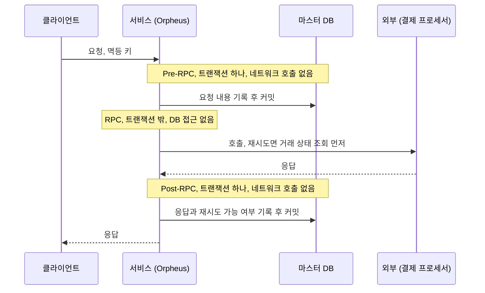
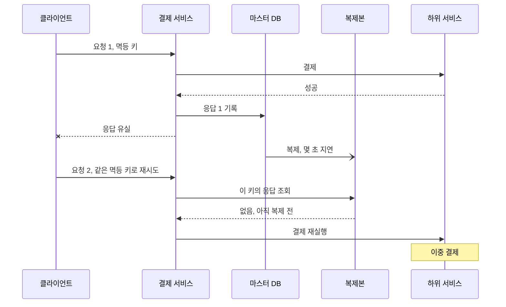

원문: [Avoiding double payments in a distributed payments system](https://medium.com/airbnb-engineering/avoiding-double-payments-in-a-distributed-payments-system-2981f6b070bb) — The Airbnb Tech Blog, Jon Chew·Ninad Khisti, 2019-04-17

7년 된 글이다. 고른 이유는 이 글이 결제 멱등성 글의 원형이기 때문이다. 이후 국내외 결제 글이 "멱등 키를 받고, 재시도 가능 여부를 나누고, 응답을 저장한다"고 쓸 때 그 뼈대가 대부분 여기서 온다. [ParityPay 1편](/posts/parity-pay-invariants/)의 INV-004 "같은 업무 참조의 금융 효과는 한 번만 발생한다"도 같은 문장이다. 원문은 그 문장을 Airbnb의 결제 SOA 규모에서 라이브러리 하나로 풀었고, 나는 지갑 4개와 Mock PG 위에서 실험으로 풀었다. 같은 문장이 어디서 같은 답을 내고 어디서 갈리는지를 본다. 첫 절은 원문의 주장만 옮기고, 그 뒤 절부터 내 평가를 적는다.

## 원문이 말하는 것

Airbnb는 결제를 SOA로 옮기는 중이었다. 서비스 하나를 호출하면 그 서비스가 다시 하위 서비스를 부르고, 각 서비스가 상태를 바꾸므로 호출 하나가 분산 트랜잭션이 된다. 2PC 같은 프로토콜 없이 최종 일관성을 얻는 흔한 방법으로 원문은 read repair, write repair, asynchronous repair 셋을 들고, Airbnb 결제는 셋을 다 쓰지만 이 글은 write repair를 다룬다. 클라이언트가 같은 요청을 반복해서 쏘고, 서버의 쓰기가 매번 깨진 상태를 고친다. 클라이언트는 재시도 외의 상태를 갖지 않고, "언제 일관성을 요구할지"를 클라이언트가 정한다.

요구사항은 넷이다. 특정 유스케이스용이 아닌 범용·설정 가능한 해법, 데이터 정합성 타협 없음, 초저지연(별도 멱등 서비스는 지연도 문제지만 그 서비스가 같은 문제를 겪으므로 탈락), 그리고 제품 개발자가 정합성 전문가가 되지 않아도 되는 것.

해법은 Orpheus라는 범용 멱등성 Java 라이브러리다. 별도 서비스가 아니라 라이브러리를 고른 이유로 원문은 낮은 지연을 든다. 네 개념으로 이뤄진다.

| 개념 | 내용 |
| --- | --- |
| 멱등 키 | 요청 하나를 대표하는 키. 클라이언트가 만들고 재시도에 재사용한다 |
| 멱등 정보 테이블 | 항상 샤딩된 마스터 DB에서 읽고 쓴다. 복제본은 쓰지 않는다 |
| Java 람다 | 라이브러리의 DB 문장과 애플리케이션의 DB 문장을 한 커밋으로 묶는다 |
| 예외 분류 | "재시도 가능"과 "재시도 불가"로 나눈다 |

원문의 중심은 요청을 세 단계로 자르는 것이다. Pre-RPC에서 요청 내용을 DB에 기록하고, RPC에서 외부(결제 프로세서, 매입사)를 호출하고, Post-RPC에서 응답과 재시도 가능 여부를 DB에 기록한다. 규칙은 둘이다. Pre·Post-RPC 단계에서는 네트워크 호출을 하지 않고, RPC 단계에서는 DB를 만지지 않는다.

> "We essentially want to avoid mixing network communication with database work." (Jon Chew, Ninad Khisti)

네트워크 통신과 DB 작업을 섞지 않겠다는 것이다. 원문은 Pre·Post 단계의 RPC가 커넥션 풀의 빠른 고갈과 성능 저하를 만든다는 것을 힘들게 배웠다고 적고, 네트워크 호출은 본질적으로 신뢰할 수 없다고 이유를 단다. 그래서 Pre와 Post는 각각 라이브러리가 연 하나의 DB 트랜잭션으로 감싸인다. RPC 단계는 멱등한 계산이나 RPC를 하는 자리이고, 원문은 그 예로 재시도 요청이면 하위 서비스에 거래 상태를 먼저 조회하는 것을 든다.

원문의 세 단계를 요청 하나의 흐름으로 놓으면, DB 트랜잭션 두 개 사이에 네트워크 호출이 트랜잭션 밖에 끼어 있는 모양이다.

예외 분류에서 원문이 만든 범용 예외 클래스는 기본값이 재시도 불가이고, 특정 경우만 재시도 가능으로 분류한다. 5XX 계열의 네트워크·인프라 예외는 일시적이라 보고 재시도 가능, 4XX 계열의 검증 오류("환불의 환불"은 안 된다)는 재시도 불가. 분류를 틀리면 양쪽으로 사고가 난다. 재시도 가능한 것을 불가로 두면 요청이 영원히 실패로 굳고, 불가한 것을 가능으로 두면 이중 결제가 날 수 있다.

클라이언트의 책임도 명시한다. 새 요청마다 고유 멱등 키를 만들고 재시도에는 같은 키를 쓴다. 서비스를 부르기 전에 키를 자기 DB에 저장한다. 성공 응답을 소비하면 키를 해제한다. 재시도 사이에 페이로드를 바꾸지 않는다. 지수 백오프나 지터로 재시도 전략을 짠다. 키는 요청 단위(UUID)일 수도, 엔티티 단위(`payment-1234-refund`처럼 "결제 1234의 환불은 한 번")일 수도 있다.

요청마다 lease가 있다. 멱등 키에 DB 행 락을 잡아 진행 권한을 얻고, 만료 시각이 있어 서버 타임아웃을 덮는다. 응답이 없으면 lease가 만료된 뒤에만 재시도할 수 있다. 경험칙은 "lease 만료가 RPC 타임아웃보다 길게". 최대 재시도 창도 따로 둬서 폭주하는 재시도를 막는다. 확정 상태(성공, 재시도 불가 오류)에 도달한 응답은 저장해서 재시도에 바로 돌려준다.

마지막이 마스터 전용 읽기다. 원문의 시스템은 MySQL 기반이고, 멱등 정보를 복제본에서 읽으면 결제는 성공했는데 응답만 유실된 클라이언트가 재시도했을 때 복제 지연 때문에 응답이 "없는" 것으로 보여 결제를 다시 실행할 수 있다. 원문은 몇 초의 복제 지연으로도 큰 금전 피해가 날 수 있다고 그림으로 보인다. 그래서 마스터만 쓰고, 마스터 하나로는 안 되니 멱등 키로 샤딩한다. 키는 카디널리티가 높고 고르게 분포해 샤드 키로 알맞다. 결과는 결제 정합성 five nines, 그 사이 연간 결제량은 두 배.

## 같은 곳: 타임아웃은 실패가 아니고, 분류는 기본값이 보수적이다

원문의 예외 분류를 ParityPay는 HTTP 응답 타입으로 갖고 있다. [3편](/posts/parity-pay-unknown-state/)에서 프론트엔드는 `202`, `5xx`, 네트워크 오류를 "결과를 모른다"로, `4xx` 업무 오류만 "실패했다"로 타입을 나눴다. 원문의 5XX 재시도 가능·4XX 재시도 불가와 같은 선이다. 그리고 두 시스템 다 기본값이 보수적이다. 원문은 범용 예외 클래스의 기본을 "재시도 불가"로 두고 특정 경우만 "가능"으로 분류한다. ParityPay는 "조회 불가"에서 아무것도 확정하지 않고 사람에게 넘긴다. 모르는 것을 자동으로 어느 쪽으로도 굳히지 않는다는 점이 같다.

원문이 든 애매한 경우도 같은 방향이다. `NullPointerException` 하나도 "DB 연결이 잠깐 끊겨 null이 온 것"과 "클라이언트나 외부 응답의 필드가 잘못 null인 것"은 다르게 다뤄야 한다는 지적은, 3편에서 "기록 없음"(외부가 없다고 답함)과 "조회 불가"(외부가 답하지 않음)를 나눈 것과 같은 이유다. 전자는 연속 3회 확인 뒤 실패로 확정하고 후자는 확정하지 않는다. 예외의 종류가 아니라 **그 예외가 세상에 대해 무엇을 말하는가**로 나눠야 한다.

## 같은 곳: 네트워크 호출과 DB 트랜잭션을 섞지 않는다

원문의 두 규칙(Pre·Post에 네트워크 없음, RPC에 DB 없음)을 나는 두 번 실측으로 만났다.

- [2편](/posts/parity-pay-lock-hold-time/): 잔액 UPDATE가 행을 잠근 뒤 원장 해석, 분개, 결제 저장, Outbox, 멱등 확정이 전부 잠금 안에서 일어나 잠금 보유 17ms 중 DB가 실제로 일한 시간은 2.31ms였다. 86%는 DB가 애플리케이션의 다음 문장을 기다린 시간이다. 문장 순서를 바꿔 잠금을 4~7ms로 줄였다. 원문이 Pre-RPC를 하나의 트랜잭션으로 감싸는 것은, 내가 보기에 이 잠금 구간 안에 무엇이 들어가는지를 라이브러리가 통제하겠다는 뜻이고, 그 안에 네트워크가 들어가면 잠금 보유 시간이 외부의 응답 시간이 된다.
- [9편](/posts/parity-pay-external-isolation/): 타임아웃 없는 외부 호출이 Tomcat 스레드 200개를 24초에 고갈시켰다. 원문이 "힘들게 배웠다"고 한 커넥션 풀 고갈과 같은 종류의 사고다. 트랜잭션 안의 외부 호출은 스레드와 DB 커넥션을 동시에 쥔 채 기다리므로 풀 두 개가 같이 마른다.

원문은 이것을 코드 구조로 강제했다. Java 람다로 단계를 넘기면 라이브러리가 Pre와 Post를 각각 트랜잭션으로 열고 RPC는 트랜잭션 밖에서 실행한다. 원문은 멱등 처리 루틴을 부르는 것이 제품 개발자의 책임이어서는 안 된다고 적는다. ParityPay는 규칙을 알고 지켰을 뿐 강제하지 않았다. 2편의 결함이 "알았지만 순서를 틀린" 경우였으니, 나는 강제가 더 나은 답이라고 본다. 원문도 "RPC 단계에서 DB 접근을 적극적으로 막는 것"을 아직 못 한 일로 적어 뒀다. 람다로 나눠도 RPC 람다 안에서 DB를 부르는 것을 컴파일러가 막지는 못한다.

## 갈리는 곳: 누가 수렴을 주도하는가

원문은 write repair다. 클라이언트가 같은 멱등 키로 요청을 반복해서 보내고, 서버는 lease로 동시 진입을 막고 저장된 응답으로 확정 결과를 돌려주며, 재시도 요청의 RPC 단계에서 하위 서비스에 상태를 먼저 조회할 수 있다. 수렴의 주도권이 클라이언트에 있고, 원문은 그것을 장점으로 적는다. 클라이언트가 필요할 때 최종 일관성을 요구할 수 있으므로 사용자 경험을 클라이언트가 통제한다.

ParityPay는 승인 요청의 재전송을 금지했다. 타임아웃이면 `UNKNOWN`으로 저장하고 `202`와 조회 위치를 돌려주며, 서버의 복구 작업이 외부에 상태를 조회해 확정한다. 원문의 분류로는 asynchronous repair다. 원문도 Airbnb 결제가 이것을 함께 쓴다고 했고, read·write repair와 같이 쓰면 두 번째 방어선이 된다고 적었다. 다만 이 글의 해법에서 클라이언트 재시도는 전제다.

ParityPay가 이쪽을 고른 것은 실측 때문이었다. 9편에서 타임아웃 3초에 재시도 3회를 붙이자 기관이 받은 요청이 정확히 3.00배가 됐고, 그 기관은 이미 느려서 타임아웃이 나던 중이었다. 지수 백오프와 지터는 총량을 줄이지 못했다. 지터가 값을 하는 조건은 동기화된 폭주인데, 고르게 도착하는 부하에는 펼칠 봉우리가 없었다. 이중 청구가 안 난 것은 Mock PG가 외부 키로 멱등했기 때문이고, 멱등하지 않은 기관이면 한 결제에 세 번 청구였다.

그렇다면 원문의 설계에서 이 비용은 어디에 있는가. 재시도 요청은 서버의 lease에 막히거나(lease가 만료되기 전에는 재시도할 수 없다), 저장된 응답을 받거나(확정됐으면 즉시), RPC 단계에서 상태 조회를 먼저 한다(미확정이면 조회 후 판단). 원문이 예로 든 대로 RPC 단계를 구현하면, 원문의 재시도는 하위 서비스에 **승인을 다시 보내는 것이 아니라 조회를 보내는 것**이 된다. 그 점에서 두 설계는 겉보다 가깝다. 다른 것은 조회를 누가 트리거하는가다. 원문은 클라이언트의 재시도가, ParityPay는 서버의 스케줄이 한다.

클라이언트가 트리거하면 사용자가 화면을 닫은 뒤에는 수렴이 멈춘다. 원문은 그래서 클라이언트에게 "키를 DB에 먼저 저장하라"고 요구한다. 클라이언트도 서버인 SOA 안에서는 가능한 요구이고, 브라우저가 클라이언트인 ParityPay에서는 불가능한 요구다. 서버가 트리거하면 사용자와 무관하게 수렴하지만, 3편에서 본 것처럼 확정 지연이 부하가 아니라 설정(grace 30초)이 정하는 상수가 되고, 프론트엔드의 폴링 한계가 그 상수와 맞아야 한다. 원문의 "클라이언트가 UX를 통제한다"는 장점의 대가가 "클라이언트가 상태를 가진다"이고, ParityPay의 "클라이언트가 상태를 안 가진다"는 장점의 대가가 "확정 시점을 서버가 정한다"다.

## 갈리는 곳: 언제 읽었는가를 묻는 설계

원문의 복제본 시나리오는 이렇다. 결제 성공, 응답 유실, 클라이언트 재시도, 복제본에는 아직 응답이 없음, 결제 재실행. 원문의 답은 마스터만 읽는 것이고, 그래서 샤딩이 따라온다.

원문이 그림으로 보인 실패 순서를 옮기면 이렇다. 마스터에서 읽었다면 요청 2는 응답 1을 바로 돌려받는다.

내가 보기에 이 시나리오가 성립하는 이유는 원문의 멱등 검사가 **읽고 나서 판단하는** 구조이기 때문이다. "이 키의 응답이 있는가"를 읽고, 없으면 진행한다. 읽은 값이 낡으면 판단이 틀린다. 마스터 읽기는 "읽은 값이 낡지 않게" 하는 답이고, lease의 행 락은 "읽고 판단하는 사이에 남이 끼어들지 않게" 하는 답이다. 둘 다 "언제 읽었는가"를 정확하게 만드는 장치다.

ParityPay는 그 질문을 DB에 넘겼다. [4편의 결함 E](/posts/parity-pay-experiments-and-defects/)에서 원장 계정 생성을 "조회 후 없으면 삽입"으로 만들었다가 동시 요청에 유니크 제약 위반이 났고, `INSERT ... ON CONFLICT DO NOTHING` 후 조회로 바꿨다. 그 글에 "이 저장소가 멱등성에서 이미 쓰던 방식"이라고 적었다. 멱등 키의 첫 등록이 조건부 삽입이면, 두 요청이 동시에 와도 DB가 하나만 통과시키고 "언제 읽었는가"는 묻지 않는다. [10편](/posts/parity-pay-lock-lease/)의 결론과 같은 구조다. 조건부 원자 UPDATE는 같은 멈춤 아래 여섯 번 전부 정확했고, 락은 세 번 모두 깨졌다.

다만 이 비교는 공정하지 않다. ParityPay는 PostgreSQL 한 대다. 복제본도 샤드도 없으니 원문의 문제가 생길 자리가 없다. 원문의 규모에서 조건부 삽입으로 가려면 유니크 제약이 샤드 안에서만 유효하므로 어차피 키로 샤딩해야 하고, 그러면 원문과 같은 자리에 도착한다. 갈리는 것은 그 뒤다. 샤드 안에서 "읽고 판단"(행 락 + 마스터 읽기)으로 갈 것인가, "쓰면서 판단"(조건부 삽입)으로 갈 것인가. 10편의 실측은 후자가 "lease가 얼마나 길어야 하는가"라는 답 없는 질문을 없앤다는 것이었다. 원문의 lease도 같은 질문을 갖고 있다. "lease 만료가 RPC 타임아웃보다 길게"는 경험칙이고, 10편에서 본 대로 lease의 시계는 락을 준 쪽의 것이라 그 상한은 아무도 모른다. 원문의 lease가 DB 행 락이라 Redis보다는 시계가 하나 적지만, GC 정지와 네트워크 지연은 그대로다.

## 원문이 잘한 것

클라이언트의 책임을 서버의 설계와 같은 무게로 적은 것이다. 다섯 항목(키 생성과 재사용, 호출 전 저장, 성공 시 해제, 페이로드 불변, 백오프와 지터)은 서버가 아무리 잘해도 클라이언트가 어기면 무너지는 것들이다. 3편에서 "재시도마다 새 멱등 키를 만드는 클라이언트 앞에서는 서버의 멱등성이 아무 의미가 없다"고 쓰고 그것을 타입으로 강제했는데, 원문은 그 다섯 개를 2019년에 한 목록으로 적었다.

그리고 결과를 정합성 지표로 말한 것이다. "five nines in consistency"는 지연이나 처리량이 아니라 정합성의 수치이고, 그것을 재는 방법을 별도 글로 뺐다. 1편에서 "불변조건 위반 지표는 평소 0이어야 하고, 0이 아니면 그 자체가 장애"라고 쓴 것과 같은 자리에 있는 숫자다.

## 원문이 답하지 않는 것

재시도 요청의 RPC 단계에서 하는 "상태 조회"가 실패하면 무엇이 되는지가 없다. 조회가 "없음"을 돌려주는 것과 조회 자체가 안 되는 것은 다른 상황이고, 3편에서 전자는 연속 3회 확인 뒤 실패 확정, 후자는 아무것도 확정하지 않는 것으로 갈랐다. 원문의 분류로는 조회 실패가 5XX라 "재시도 가능"이 되어 클라이언트가 다시 쏠 텐데, 그 재시도가 최대 재시도 창을 넘기면 어떤 상태로 남는지, 그때 사람이 개입하는 경로가 어디인지는 적혀 있지 않다.

lease 만료 값과 Orpheus의 지연 오버헤드도 없다. "초저지연이 요구사항"이라 별도 서비스를 배제했는데, 라이브러리가 Pre와 Post에 각각 트랜잭션을 여는 비용이 얼마인지는 없다. 응답 저장 테이블이 처리량에 비례해 자란다는 것은 적었지만 보존 기간을 얼마로 했는지도 없다. 그리고 원문 스스로 적은 미완의 일(재시도 시 페이로드 일치 검사, 스키마 변경 지원, RPC 단계의 DB 접근 차단)이 그 뒤 어떻게 됐는지는 후속 글이 없다.

## 가져갈 것

- 예외는 종류가 아니라 "세상에 대해 무엇을 말하는가"로 분류하고, 기본값은 보수적으로 둔다. 재시도 가능을 불가로 두면 굳고, 불가를 가능으로 두면 이중 결제다.
- 네트워크 호출과 DB 트랜잭션을 코드 구조로 분리한다. 알고 지키는 것보다 라이브러리가 강제하는 것이 낫다. 2편의 결함은 알고도 틀린 경우였다.
- 클라이언트 재시도는 승인 재전송이 아니라 조회여야 한다. 원문의 lease와 응답 저장은 재시도를 조회로 바꾸는 장치이고, 그것이 없는 재시도는 아픈 기관에 3배의 부하를 얹는다.
- "언제 읽었는가"를 정확하게 만드는 설계(마스터 읽기, 행 락, lease)와 그 질문을 없애는 설계(조건부 삽입·갱신)는 다른 비용을 낸다. 전자는 lease 길이라는 답 없는 상수를 갖고, 후자는 샤드 경계 안에서만 성립한다.
- 정합성은 정합성 지표로 말한다. 지연과 처리량이 아니라 위반 건수가 0인지로.
