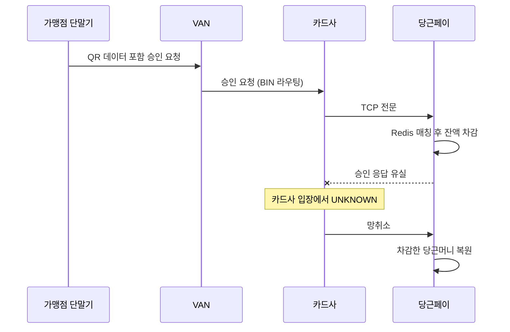

원문: [QR을 찍으면 무슨 일이 벌어질까? 당근페이 현장 결제의 모든 것](https://medium.com/daangn/c311780b9b75) — 당근 기술 블로그, Winter You(당근페이 오프라인 결제팀), 2025-10-02

결제 시스템을 만들어 본 뒤에 읽으면 결제 글의 빈칸이 보인다. 원문은 당근머니 오프라인 결제를 7주 만에 낸 과정을 QR 데이터 구조까지 내려가 설명한다. 그런데 승인 응답이 사라지는 순간은 다루지 않는다. 원문이 잘못한 것이 아니라 글의 범위 밖이고, 그 범위 밖이 [parity-pay 3편](/posts/parity-pay-unknown-state/)의 전부였으므로 대조할 가치가 있다.

## 원문이 말하는 것

오프라인 결제의 선택지는 NFC/MST(일반 앱은 정책상 어려움), MPM QR(가맹점에 QR 부착물 설치 비용), CPM QR(고객이 QR을 보여주고 가맹점 스캐너가 읽음), 자체 단말기(비용·시간·교체 저항)였다. 스캐너가 이미 있는 가맹점에서 장비 없이 시작할 수 있는 CPM QR을 골랐다.

가맹점 단말기가 읽은 데이터를 당근페이 서버까지 보내는 경로도 셋이었다. 단말기 직접 연결, VAN(가맹점 단말기와 카드사를 잇는 중계 네트워크 사업자) 직접 연결, 카드망 경유다. 단말기 업체나 전국 VAN사와 각각 협의하려면 시간과 공수가 크다. 그래서 이미 단말기·VAN과 통신 체계를 갖춘 카드사와 연동해 기존 카드망(단말기 → VAN → 카드사 → 당근페이)을 그대로 탔다. 최종 승인 판단은 카드사가 아니라 당근머니·포인트를 관리하는 당근페이가 한다.

QR은 EMV QR 표준을 따르고, 데이터는 TLV(Tag-Length-Value) 구조로 정의된다. 태그 57(Track 2)에 16자리 카드번호가 들어가는데 당근머니는 실물 카드가 없으므로 가상 카드번호를 만든다. 앞 6자리 BIN(Bank Identification Number)이 당근페이를 가리키고, VAN·카드사는 BIN을 보고 "이 거래는 당근페이로"라고 라우팅한다. 다른 회사의 BIN을 넣으면 요청이 그 회사로 흘러가지만, 그쪽 승인 단계의 보안 검증과 토큰 인증 때문에 결제되지는 않는다. 승인 요청은 TCP 전문으로 당근페이에 들어오는데 전문에는 당근페이 회원을 특정할 정보가 없어, QR 발급 시 필요한 데이터를 Redis에 미리 넣어 두고 승인 요청의 QR 데이터와 매칭한다. 이후 차감은 기존 결제 컴포넌트를 그대로 붙였다.

사용자 경험 쪽으로는 QR 발급마다 생체인증을 요구하면 불편하므로 세션을 둬 세션 안에서는 QR을 재발급하고, 기기 키 쌍의 서명으로 인증을 대신하는 빠른 결제도 뒀다.

가장 좋은 부분은 필드 테스트다. EMV QR 표준대로 만들었는데 단말기마다 반응이 달랐다. 태그 63(Application Specific Data)이 없으면 거부하는 단말기가 있었고, 서비스 코드를 모르면 거부하는 단말기가 있었다. 타사 QR을 캡처해 비교하며 단말기별 해석을 추정해 포맷을 맞췄고, 미리 만들어 둔 QR 생성기·해석기 테스트 코드가 그 과정을 빠르게 했다. 원문은 이 절의 제목을 "표준과 현실은 다르다"로 붙였다.

## 같은 곳: 표준을 따랐다와 동작한다는 다르다

원문의 "문서에 정의된 EMV QR 표준대로 구현했으니 문제없이 동작할 거라 생각했죠."와 바로 뒤의 단말기별 차이는 [parity-pay 4편](/posts/parity-pay-experiments-and-defects/)의 "대비되어 있다와 확인했다는 다르다"와 같은 발견이다. 결함 F는 ADR에 "다중 인스턴스 대비됨"이라 적혀 있었고 아무도 두 대를 띄워보지 않았다. 원문에서는 표준대로 만들었어도 실제 매장의 단말기에 찍어 보기 전까지 차이가 드러나지 않았다. 문서(표준, ADR)는 계약이고, 계약을 지켰다는 것과 상대가 그 계약대로 동작한다는 것은 다른 사실이다. 원문은 그 차이를 실제 매장에서 확인했고, 그 확인을 빠르게 만든 것은 미리 만든 생성기·해석기였다. 내가 이 글에서 가장 높게 보는 부분이 여기다. 4편에서 "측정 도구도 틀린다"고 적었는데, 원문의 도구는 틀린 것을 잡는 데 쓰였다.

## 원문이 다루지 않는 것: 승인 응답이 사라지면

원문의 승인 흐름을 다시 보면 방향이 [3편](/posts/parity-pay-unknown-state/)과 반대다. parity-pay에서는 우리가 기관(PG·은행)에 승인을 요청하고 응답을 잃는다. 그래서 `UNKNOWN`으로 보존하고 기관에 조회해 수렴시킨다. 당근페이 현장 결제에서는 카드사가 당근페이에 승인을 요청하고, 당근페이가 응답한다. 당근페이가 잔액을 차감하고 "승인"을 돌려줬는데 그 응답이 카드사에 닿지 않으면, 카드사 입장에서 이 거래는 `UNKNOWN`이다. 내가 아는 카드망의 처리로는 이때 카드사(또는 VAN)가 망취소를 보내고, 당근페이는 이미 차감한 당근머니를 되돌려야 한다. 원문은 망취소를 언급하지 않으므로 이 부분은 원문이 아니라 나의 이해다.

아래 그림은 원문이 설명한 승인 경로에, 원문이 다루지 않은 응답 유실 지점을 내가 덧붙인 것이다.

원문은 이 경로를 다루지 않는다. 승인 요청이 TCP 전문으로 들어온다는 것, 회원 매칭을 Redis로 한다는 것, 차감은 기존 컴포넌트를 쓴다는 것까지다. 그래서 세 질문이 남는다.

- 망취소 전문이 오면 어떤 키로 원거래를 찾는가. 승인 응답에 실었던 승인번호일 텐데, 망취소가 승인보다 먼저 도착하면(카드사 쪽 재시도 순서) 무엇이 되는가. [8편](/posts/parity-pay-kafka-failures/)에서 취소가 확정보다 먼저 도착해 3,600원이 새던 것과 같은 모양의 문제다.
- 같은 승인 요청이 두 번 오면(카드사 재전송) 두 번 차감하는가. 원문은 가상 카드번호의 중간 7자리를 QR마다 고유하게 만든다고 했으니 그것이 [멱등 키](/posts/idempotency-key-design/) 역할을 할 수 있는데, 명시돼 있지 않다.
- 당근페이가 차감은 했는데 응답 직전에 죽으면 누가 정리하는가. 카드사의 망취소를 기다리는가, 당근페이가 스스로 미응답 거래를 찾아 되돌리는가.

내 추측으로는 이 질문들의 답이 원문의 "당근머니 충전, 결제 기능을 담당하던 컴포넌트를 그대로 연결했어요."라는 문장 안에 있을 가능성이 높다. 당근페이의 기존 결제 컴포넌트가 이미 멱등 키와 취소 처리를 갖고 있을 수 있다. 다만 온라인 결제는 당근페이가 요청 주체이고 현장 결제는 응답 주체라, 같은 컴포넌트를 반대 방향에서 쓰는 것이므로 "그대로 붙였다"가 정말 그대로인지가 궁금하다.

## 원문이 잘한 것

빌릴 수 있는 것을 전부 빌렸다. 카드망, EMV QR, VAN의 라우팅, 기존 결제 컴포넌트다. 원문은 7주가 가능했던 이유로 불필요한 문서화와 회의를 줄이고 병목(클라이언트-서버 인터페이스 결정, EMV QR 해석기 사전 준비)을 먼저 제거한 일하는 방식을 든다. 나는 여기에 더해, 빌린 덕분에 새로 만들 것이 QR 생성·세션·회원 매칭 정도로 줄어든 것도 컸다고 읽는다. [parity-pay 6편](/posts/parity-pay-reconciliation/)에서 "경계는 기억이 아니라 불가능이어야 한다"고 적었는데, 원문은 반대 방향의 같은 교훈이다. 경계 밖의 것(카드망)을 새로 만들지 않고 경계를 지키면 시간이 남는다.

BIN 라우팅 설명도 좋다. 카드번호 앞자리 BIN이 "이 거래를 어디로 보낼지"를 정한다는 것은 결제 도메인 밖에서는 잘 모르는 사실이다. 원문은 그것을 다른 회사 BIN을 넣으면 요청은 그쪽으로 가지만 승인되지 않는다는 예로 설명했고, 그 설명이 정확하다.

## 가져갈 것

- 표준을 따랐다는 것과 상대가 그대로 동작한다는 것은 다르다. 실제 상대에게 찍어보기 전까지는 "대비됨"이다.
- 사람이 다루기 힘든 규격은 생성기와 해석기를 먼저 만든다. 문제가 났을 때 어디서 달라졌는지가 바로 보인다.
- 승인의 방향이 바뀌면 `UNKNOWN`의 위치도 바뀐다. 우리가 응답 주체일 때는 상대의 망취소를 받아 되돌리는 경로가 있어야 하고, 그 경로의 순서·멱등·미응답 정리가 설계에 있어야 한다.
- 빌릴 수 있는 것을 빌리면 새로 만들 것이 줄고, 그만큼 확인에 시간을 쓸 수 있다.
