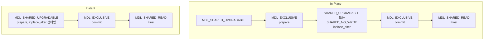

원문: [MySQL ALTER DDL 수행 방식에 대한 이해](https://tech.kakao.com/posts/703) — kakao tech, 2025-05-14

## 한 줄 요약

MySQL의 ALTER는 세 알고리즘으로 돈다. Copy(새 테이블에 전부 복사, 쓰기 차단), In-Place(5.6+, 임시 구조와 DML 로그로 읽기·쓰기 허용, 필요 시 리빌드), Instant(8.0+, 메타데이터만 수정)다. 원문은 소스 코드 수준에서 ALTER의 3단계(Initialization → Execution → Final)와 세 핵심 함수(`ha_prepare_inplace_alter_table`, `ha_inplace_alter_table`, `ha_commit_inplace_alter_table`)를 따라가며 어느 시점에 어떤 [메타데이터 락](/posts/lock-types-and-waits/)(MDL, 테이블 구조를 보호하는 락)을 잡는지를 비교한다. 원문이 확인한 것은 In-Place가 prepare 전과 commit 전 두 번 Exclusive 락을 잡고, Instant는 commit 전 한 번만 잡는다는 것, 그리고 메타데이터만 바꾸는 작업이라도 In-Place로 지정하면 두 번 잡는다는 것이다. 원문의 결론은 두 가지 습관이다. `ALGORITHM`을 명시하라, 실행 전 장기 트랜잭션을 확인하라.

## 배경

MySQL은 서비스가 커질수록 운영이 어려웠고, 그중 하나가 서비스 중 Online DDL이다. 5.6에서 In-Place가 추가돼 가용성이 올라갔지만, 시작과 끝에 메타 락이 필요하고 작업에 따라 임시 테이블과 복사도 필요해 편하지는 않았다. 그래서 8.0에서 Instant가 추가됐고, 원문은 이 세 알고리즘의 내부 동작을 비교해 운영에 도움을 주려 한다.

## ALTER의 3단계

**Initialization.** 사용자가 지정한 알고리즘으로 가능한지 확인하고(컬럼명 중복 등 메타데이터만으로 알 수 있는 것), `handler::check_if_supported_inplace_alter()`로 필요한 락 모드를 얻어 사용자가 지정한 `LOCK=`과 충돌하면 오류로 중단한다.

**Execution.** 실제 작업. 메타데이터 락 네 가지를 알아야 한다.

| 락 | 의미 |
| --- | --- |
| `MDL_SHARED_UPGRADABLE` | 승격 가능한 공유 락. 다른 세션의 읽기·쓰기 허용 |
| `MDL_SHARED_READ` | 읽기용 공유 락 |
| `MDL_SHARED_NO_WRITE` | 다른 세션의 읽기는 허용, 쓰기는 차단 |
| `MDL_EXCLUSIVE` | 모든 접근 차단 |

순서는 이렇다. ① `MDL_SHARED_UPGRADABLE` 획득. ② In-Place면 `MDL_EXCLUSIVE`로 승격. ③ `ha_prepare_inplace_alter_table()`로 제약 검사, 인덱스·외래키 메타데이터 갱신(Instant는 건너뜀). ④ In-Place면 다시 강등. DDL 중 DML을 막아야 하면 `SHARED_NO_WRITE`, 아니면 `SHARED_UPGRADABLE`. ⑤ `ha_inplace_alter_table()`로 실제 변경(Instant는 건너뜀). ⑥ `MDL_EXCLUSIVE`로 승격 후 `ha_commit_inplace_alter_table()`로 메타데이터 변경.

**Final.** Data Dictionary 갱신과 커밋. atomic DDL을 지원하는 엔진은 테이블 이름 교체를 먼저 하고 DD를 갱신·커밋하며, 아닌 엔진은 반대다. 마지막에 `MDL_SHARED_READ`로 메타데이터를 확인하고 정리한다.

## 세 함수

- **prepare**: 인덱스 이름·컬럼 이름 제약을 검사하고 인덱스·외래키 메타데이터를 갱신. Instant는 아무것도 안 하고 빠져나온다.
- **inplace_alter**: 테이블 리빌드, DML 로그 적용, 인덱스 구성. Instant이거나, In-Place라도 인덱스 구성이 아니고 리빌드도 필요 없으면 아무것도 안 한다.
- **commit**: 임시 이름 생성, 통계 스레드 접근 차단, 원본과 새 테이블 메타데이터 동기화. Instant는 `dd_add_instant_columns`로 `row_version`을 올리고 DEFAULT 값을 설정한다.

## 세 알고리즘

**Copy.** 가장 오래되고 단순하다. DDL이 적용된 새 테이블을 만들고 → 데이터를 복사하고 → 이름을 바꾸고 옛 테이블을 지운다. 읽기는 되지만 쓰기는 끝날 때까지 막힌다. 8.0 기준 PK 삭제, 컬럼 타입 변경, 문자셋 변환은 Copy로만 된다. 디스크 공간·I/O·시간이 테이블 크기에 비례하고 [복제 지연](/posts/db-replication/)을 만들며 롤백도 오래 걸린다.

**In-Place.** 5.6에서 추가. 대부분의 작업에서 읽기·쓰기가 되고 필요하면 리빌드한다. 리빌드 기준으로 임시 테이블 생성 → 데이터 복사(타입 변환 포함) → 복사 중 유입된 쓰기는 별도 버퍼에 DML 로그로 적재 → 복사가 끝나면 DML 로그 적용 → 이름 교체. 원문의 내부 테스트로는 이 임시 테이블 작업이 Copy의 전체 복사와는 다른 것으로 추정되며 더 빠르다. 단점은 여전히 크기에 비례하는 시간, 일부 작업의 쓰기 차단, 높은 I/O, 복제 지연, Exclusive 메타 락 2회, `innodb_online_alter_log_max_size`(DML 로그 상한)를 잘못 잡으면 실패한다는 것.

**Instant.** 8.0.12에서 추가. 메타데이터만 바꾸고 `row_version`을 올린다. 컬럼 추가/삭제, DEFAULT 설정, ENUM 명세 변경을 지원하며 확대 중이다(컬럼 추가 외는 8.0.29부터). 단점은 지원 작업이 적고, 64번까지만 가능하며 그 뒤에는 리빌드가 필요하고, FULLTEXT 인덱스나 `ROW_FORMAT=COMPRESSED` 테이블에서는 컬럼 추가/삭제가 안 되며, Exclusive 락이 짧게 1회 있다는 것.

| | Copy | In-Place | Instant |
| --- | --- | --- | --- |
| 테이블 복사 | 예 | 부분적(내부 중간 구조) | 아니오 |
| 동시 DML | 아니오 | 작업에 따라 | 예 |
| 디스크 오버헤드 | 높음 | 중간(임시 파일·로그) | 매우 낮음 |
| 시간 | 가장 느림 | 작업·크기에 따라 | 가장 빠름 |
| 버전 | 모두 | 5.6+ | 8.0.12+ |

## 핵심: 메타 락 비교

두 알고리즘 모두 `MDL_SHARED_UPGRADABLE`로 시작하니 그 단계까지는 다른 세션에 영향이 없다. 아래 그림은 원문의 단계별 설명을 내가 락 전이 순서로 옮긴 것이다.

단계별 차이는 다음이다.

1. prepare 전: In-Place만 `MDL_EXCLUSIVE`로 승격한다. 이때부터 다른 세션이 메타 락 대기에 빠질 수 있다. prepare가 끝나면 다시 강등한다.
2. inplace_alter 중: 둘 다 `SHARED_UPGRADABLE`. Instant이거나 In-Place 중 리빌드·인덱스가 아니면 이 안에서 하는 일이 없다.
3. commit 전: 둘 다 `MDL_EXCLUSIVE`로 승격하고 commit 함수가 끝날 때까지 다른 세션을 막는다.
4. Final: `MDL_SHARED_READ`.

예외로 AUTO_INCREMENT INT 컬럼 추가는 In-Place에서 `SHARED_UPGRADABLE`이 아니라 `SHARED_NO_WRITE`로 강등한다.

그리고 궁금할 만한 실험 하나. In-Place로도 메타데이터만 수정하는 작업이 있는데, 그러면 Instant와 같지 않을까? 원문이 디버깅해 보니 아니었다. 소스가 알고리즘만 보고 승격을 결정하므로 메타데이터만 바꾸는 작업이라도 In-Place면 prepare 전에 `MDL_EXCLUSIVE`를 잡는다. 즉 **Exclusive 락 횟수는 작업 내용이 아니라 지정한 알고리즘이 정한다.**

## 결론: 두 가지 습관

작업에 따라 쓸 수 있는 알고리즘이 정해져 있어 선택의 폭은 좁다. 그래도 어떤 경우든 `ALGORITHM` 구문을 명시하라는 것이 원문의 첫 권고다. 그래야 예기치 않게 느린 알고리즘으로 대체되는 것을 막는다. 원문은 이를 방어적 수행 방식이라고 부른다. 공식 문서에 따르면 ALGORITHM을 지정했는데 그 알고리즘을 지원하지 않는 작업이면 오류로 실패한다([ALTER TABLE Statement](https://dev.mysql.com/doc/refman/8.4/en/alter-table.html)). 두 번째 권고는 실행 전 장기 실행 트랜잭션이 없는지 확인하라는 것이다. 어떤 DDL이든 Exclusive 메타 락이 짧게라도 들어가기 때문이다. 공식 문서는 그 결과를 이렇게 적는다. "Additionally, a pending exclusive metadata lock requested by an online DDL operation blocks subsequent transactions on the table."(Online DDL이 요청해 대기 중인 Exclusive 메타데이터 락은 그 테이블의 뒤이은 트랜잭션을 막는다.) ([Online DDL Performance and Concurrency](https://dev.mysql.com/doc/refman/8.4/en/innodb-online-ddl-performance.html)) 그래서 긴 트랜잭션 하나가 있으면 그 뒤의 세션이 줄줄이 대기한다.

## 읽고 남는 질문

- Instant의 64회 제한이 실제 운영에서 얼마나 빨리 닿는지, 닿았을 때의 리빌드를 어떻게 스케줄하는지가 궁금하다. 컬럼 추가가 잦은 테이블은 생각보다 빨리 닿을 수 있다.
- In-Place의 "임시 테이블 작업이 Copy의 전체 복사와 다른 것으로 추정"은 추정에 그친다. 크기가 큰 테이블에서 실제 소요 시간과 디스크 사용량을 비교한 수치가 있으면 좋겠다.
- `LOCK=NONE`을 명시하는 것도 `ALGORITHM` 명시만큼 중요한 방어인데(공식 문서상 지원 안 되면 오류로 멈춤), 결론에 같이 언급됐으면 완결성이 있었을 것이다.

## 한 줄로 가져가기

Online DDL의 위험은 복사 시간이 아니라 승격되는 Exclusive 메타 락의 순간이다. In-Place는 두 번, Instant는 한 번이고, 그 순간에 긴 트랜잭션이 하나라도 있으면 서비스 전체가 그 뒤에 줄을 선다.

## 참고

- [MySQL ALTER DDL 수행 방식에 대한 이해](https://tech.kakao.com/posts/703) — kakao tech, 2025-05-14
- [ALTER TABLE Statement](https://dev.mysql.com/doc/refman/8.4/en/alter-table.html) — MySQL 8.4 Reference Manual
- [Online DDL Performance and Concurrency](https://dev.mysql.com/doc/refman/8.4/en/innodb-online-ddl-performance.html) — MySQL 8.4 Reference Manual
