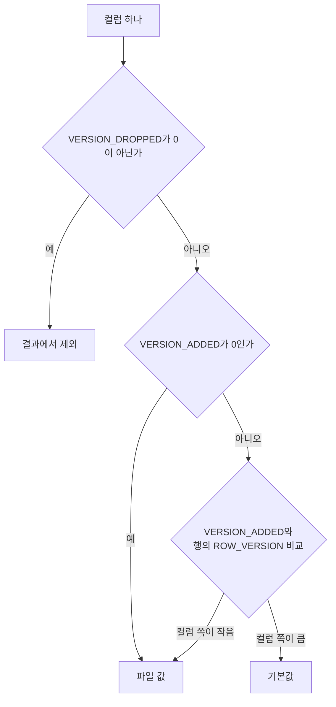

원문: [MySQL Ver. 8.0 New Feature: Instant DDL Algorithm에 대한 이해](https://tech.kakao.com/posts/731) — kakao tech, 2025-09-02 (2023-11 분석, 8.0.29 기준)

## 한 줄 요약

8.0.12의 Instant v1은 컬럼을 마지막에 추가만 됐고, 8.0.29의 v2는 어느 위치든 추가·삭제가 된다. 비결은 데이터 파일을 건드리지 않고 메타데이터만 바꾸는 것이다. 테이블에는 Instant DDL을 몇 번 했는지(`ROW_VERSION`, 최대 64)와 컬럼마다 언제 추가·삭제됐는지(`VERSION_ADDED`/`VERSION_DROPPED`)를 적고, 각 행 헤더에는 그 행이 쓰일 당시의 `ROW_VERSION`을 적는다. 읽을 때는 행의 버전과 컬럼의 버전을 비교해 "이 컬럼은 이 행에 실제로 있는가, 없으면 기본값"을 결정한다. 원문은 `xxd`로 데이터 파일을 열어 삭제한 컬럼 값이 그대로 남아 있고 추가한 컬럼 값은 없음을 직접 확인한다. Fetch가 복잡해지니 SELECT가 느려질 수 있는데, 카카오 표준 구성에서 sysbench로 재 보니 의미 있는 저하는 없었다.

## 배경: Copy → In-Place → Instant

Copy는 DDL 내내 읽기 락을 잡고 임시 테이블로 데이터를 옮겨 24시간 서비스에서는 중단이 필요했다. [In-Place](/posts/kakao-mysql-alter-ddl-algorithms/)는 긴 락은 없앴지만 "새 테이블을 만들고 복사한다"는 본질은 같아 테이블이 클수록 공간과 시간이 든다. Instant는 그 본질을 바꿔 물리 구조를 안 건드린다. 원문의 8.0.12 실행 결과로는 1.6GB 테이블에 0.01초 만에 컬럼이 추가된다. 설계자인 Mayank Prasad는 MySQL 블로그에서 이 아이디어를 "don't touch any row but update the metadata only"(어떤 행도 건드리지 않고 메타데이터만 갱신한다)라고 적었다([MySQL 8.0 INSTANT ADD and DROP Column(s)](https://dev.mysql.com/blog-archive/mysql-8-0-instant-add-and-drop-columns/)).

## v1의 한계와 v2의 ROW_VERSION

v1(8.0.12)은 마지막 컬럼으로만 추가할 수 있고 DROP은 안 됐다. v2(8.0.29)는 내부 설계를 바꿔 위치 무관 추가·삭제를 지원한다. 그 중심 개념이 ROW_VERSION이다. 테이블마다 독립적으로 Instant DDL이 수행된 횟수이고, 테이블 메타데이터와 행 메타데이터 두 곳에 각각 저장된다.

- `INFORMATION_SCHEMA.INNODB_TABLES.TOTAL_ROW_VERSIONS`로 확인한다. 생성 시 0, Instant 추가 후 1, Instant 삭제 후 2.
- 64가 상한이다. 넘으면 "Maximum row versions" 오류가 난다. 설계자의 글도 64를 설정할 수 없는 한도로 적고, 실제로 부족하면 이후 버전에서 늘릴 수 있다고 했다(위 MySQL 블로그). 그런데 오류는 `ALGORITHM=INSTANT`를 명시했을 때만 난다. 64에 닿은 뒤 명시하지 않고 DDL을 돌리면 **조용히 In-Place로 동작한다.** 그래서 의도치 않은 긴 작업이 될 수 있다.
- 초기화는 테이블 재구축이다(TRUNCATE도 되지만 데이터가 사라지니 의미 없음).
- 여전히 FULLTEXT 인덱스가 있는 테이블, `ROW_FORMAT=COMPRESSED`, 임시 테이블에서는 못 쓴다.

## 메타데이터와 물리 구조의 불일치를 어떻게 메우는가

Instant로 컬럼을 추가해도 데이터 파일의 행에는 그 컬럼이 없고, 삭제해도 행에는 값이 남아 있다. 이 불일치를 메우는 정보가 세 가지다.

**행 메타데이터.** 행 헤더의 INFO BITS(4비트) 중 두 번째 비트가 "이 행에 ROW_VERSION이 있는가"다. 있으면 행이 삽입·수정될 때의 테이블 `TOTAL_ROW_VERSIONS` 값이 기록된다. 설계자의 글에 따르면 이 비트는 원래 쓰이지 않던 한 비트를 가져다 쓴 것이고, 기본값은 꺼짐이다.

**테이블 메타데이터.** 컬럼마다 `VERSION_ADDED`(어느 버전에 추가됐나)와 `VERSION_DROPPED`(어느 버전에 삭제됐나). ROW_VERSION 0인 테이블에서 C1을 삭제하면 ROW_VERSION=1, C1의 VERSION_DROPPED=1. 이어 C2를 추가하면 ROW_VERSION=2, C2의 VERSION_ADDED=2. 이 값들은 Data Dictionary에 있다고 문서에 있지만 물리 위치는 파악하지 못했다고 원문이 솔직히 적는다.

**Fetch 규칙.**

1. VERSION_ADDED와 VERSION_DROPPED가 모두 0인 컬럼은 파일 값을 그대로 쓴다.
2. VERSION_DROPPED가 0이 아닌 컬럼은 결과에서 제외한다.
3. VERSION_ADDED가 0이 아닌 컬럼은 행의 ROW_VERSION과 비교한다. 컬럼의 VERSION_ADDED가 행의 ROW_VERSION보다 크면(행이 쓰일 때 그 컬럼이 없었음) 기본값을 읽고, 작으면(행이 쓰일 때 이미 있었음) 파일 값을 읽는다.

세 규칙을 컬럼 하나에 대한 판단 순서로 그리면 다음과 같다. 원문의 규칙을 그대로 옮긴 것이다.

## 직접 확인한 시나리오

테이블 [c1, c2, c3, c4] 생성 → 행 R1 삽입(ROW_VERSION 0) → c5 추가 → c3 삭제 → R1 조회.

`xxd`로 데이터 파일을 보면, c5 추가 후 SELECT에는 기본값 'rE'가 나오지만 파일에는 그 값이 없다. c3 삭제 후 SELECT에는 c3이 없지만 파일에는 'rC'가 남아 있다. 단계별로 행을 추가하며 보면 첫 행은 INFO BITS 두 번째 비트가 0이고 ROW_VERSION이 없다. 컬럼 추가 후 삽입한 행은 ROW_VERSION 1, INFO BITS가 4(두 번째 비트 1). 삭제 후 삽입한 행은 ROW_VERSION 2.

## UPDATE는 어떻게 되나

Instant DDL을 3번 한 테이블(TOTAL_ROW_VERSIONS=3)에서 ROW_VERSION 1인 행을 UPDATE하면 두 경우로 갈린다.

- 작아지는 갱신(c2를 'r2B' → 'rU'): 제자리에서 바뀌고 ROW_VERSION이 1 → 3으로 갱신된다.
- 커지는 갱신(c2를 'rBRBRBR…'): 제자리에 못 들어가 페이지 뒤쪽에 새로 쓰이고 ROW_VERSION 3이 붙는다. 기존 행은 그대로 남는다.

원문이 보여 준 것은 두 경우 모두 갱신된 행에 현재 테이블 버전 3이 붙는다는 것이다. 나는 이것을 행이 갱신될 때 현재 테이블 버전으로 "승격"되고, 그 시점에 현재 컬럼 구성으로 다시 쓰인다고 읽는다. 원문이 바이트 단위로 컬럼 구성까지 보여 주지는 않는다.

## 성능 우려와 실측

Fetch가 컬럼마다 버전 비교를 하므로 SELECT가 느려질 수 있다. 카카오는 이를 인지하고 sysbench의 bulk_insert, oltp_read_write 시나리오로 Instant DDL 후 성능을 쟀고, **표준 DB 구성에서는 의미 있는 저하가 없다**고 판단했다. 수치는 글이 길어진다는 이유로 싣지 않았다. 원문의 결론은 신중하다. 서비스 영향은 낮아졌지만 SELECT 저하가 예측되니 쓰는 것이 맞는지 고민하고, 특징과 제한을 알고 필요한 곳에 쓰라는 것이다.

## 읽고 남는 질문

- sysbench 결과의 수치가 없다. "의미 있게 저하되지 않는다"의 크기(예: 1% 이내)와 ROW_VERSION이 64 근처일 때(컬럼 버전 비교가 가장 많을 때)의 결과가 있으면 훨씬 설득력이 있다.
- 삭제한 컬럼 값이 파일에 남아 있다는 것은 디스크 공간이 회수되지 않는다는 뜻이다. 큰 컬럼을 Instant DROP한 뒤 공간을 되찾으려면 결국 재구축이 필요한데, 그 운영 가이드가 있으면 좋겠다.
- 64에 닿았을 때 명시 없이 In-Place로 떨어지는 동작은 앞선 [ALTER DDL 글](/posts/kakao-mysql-alter-ddl-algorithms/)의 "ALGORITHM을 명시하라"는 권고가 왜 필요한지 보여 주는 구체적인 사례다.

## 한 줄로 가져가기

Instant DDL은 "지금 바꾸는 것"을 "읽을 때 해석하는 것"으로 미룬 기술이다. 그래서 빠르고, 그래서 행마다 버전이 붙고, 그래서 64번이 지나면 미룬 것을 한꺼번에 갚아야 한다.

## 참고

- [MySQL Ver. 8.0 New Feature: Instant DDL Algorithm에 대한 이해](https://tech.kakao.com/posts/731) — kakao tech, 2025-09-02
- [MySQL 8.0 INSTANT ADD and DROP Column(s)](https://dev.mysql.com/blog-archive/mysql-8-0-instant-add-and-drop-columns/) — Mayank Prasad, MySQL Blog Archive, 2023-03-09
