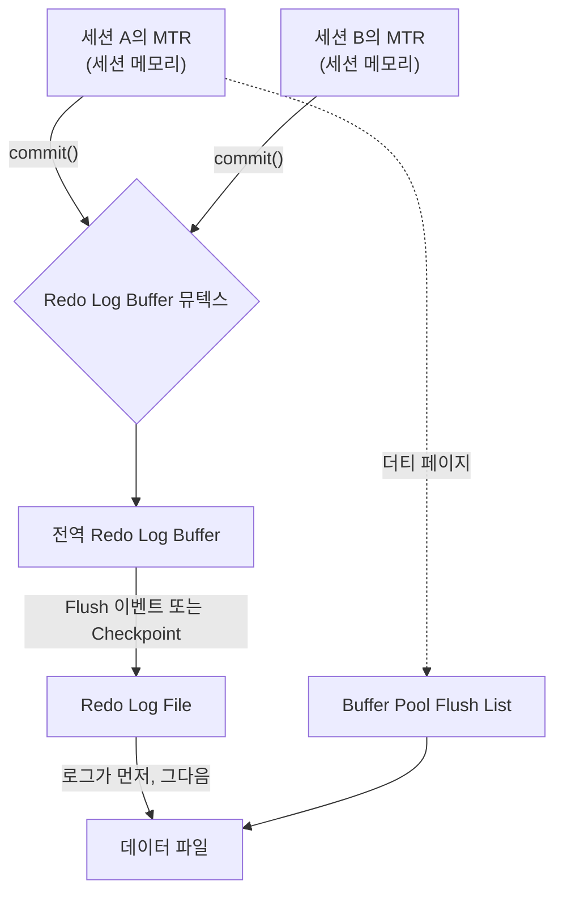

원문: [MySQL InnoDB Log에 대한 이해 - (1)](https://tech.kakao.com/posts/721) — kakao tech, 2025-08-11

## 한 줄 요약

InnoDB의 [Redo Log](/posts/redo-undo-log/)는 [WAL(Write-Ahead Log)](/posts/wal-and-checkpoint/)이다. 데이터 파일을 고치기 전에 "무엇을 고쳤다"를 먼저 로그에 순차로 쓴다. 커밋은 로그가 디스크에 동기화된 시점이다. 실제 데이터 파일 반영은 백그라운드가 나중에 하고, 크래시가 나면 로그로 되살린다. 이 글은 그 로그가 만들어지는 최소 단위인 MTR(mini transaction)을 소스 구조체 수준으로 설명한다. 그리고 5.7에서 세션마다 만든 MTR이 뮤텍스(한 번에 한 스레드만 들어가게 하는 잠금) 하나를 잡고 전역 Redo Log Buffer에 복사되는 과정을 보여 준다. 2편(8.0의 개선)을 위한 기초편이다.

## 배경: WAL의 네 가지 조건

원문은 "이것이 있어야 WAL"이라고 넷을 든다.

1. 변경이 생기면 먼저 WAL에 쓰고, 그다음 디스크에 순차 기록한다.
2. 커밋 성공의 기준은 WAL이 디스크에 동기화된 시점이다.
3. WAL의 변경은 나중에 백그라운드가 실제 데이터 파일에 반영한다.
4. 크래시 시 WAL로 복구해, 데이터 파일에 안 쓰인 변경을 다시 적용한다.

Redo Log의 부품은 둘이다. Redo Log Buffer(메모리, 기본 16MB, `innodb_log_buffer_size`)와 Redo Log File(디스크, 기본 2개, `innodb_log_files_in_group`)이다.

## 기본 흐름

DML로 페이지가 바뀌면 이렇게 흐른다.

1. Buffer Pool에 페이지를 복사해 거기서 변경한다.
2. 변경 내용을 MTR 단위로 세션별 메모리에 기록한다.
3. MTR에 다 기록되면 `commit()`으로 Redo Log Buffer로 옮기고, 바뀐 페이지를 Buffer Pool의 Flush List에 넣는다.
4. Flush 이벤트나 Checkpoint 때 Redo Log Buffer가 Redo Log File에 쓰인다. Checkpoint 때는 페이지가 디스크에 쓰이기 전에 로그가 먼저 쓰인다(이것이 Write-Ahead).
5. 그 뒤 Flush List의 페이지가 데이터 파일로 내려간다.

이 논리는 모든 InnoDB 버전에서 같다. 세션 둘이 쓰는 경우를 그리면 다음과 같다(뮤텍스는 아래 5.7 절의 내용이다).

Flush 주기는 `innodb_flush_log_at_trx_commit`으로 조절한다. 1이면 커밋마다 디스크에 flush(안정성), 0이나 2면 성능 우선. 원문은 이 변수를 따로 꼭 공부하라고 권한다. [MySQL 문서](https://dev.mysql.com/doc/refman/8.0/en/innodb-parameters.html)로 보면 0은 초당 한 번 쓰고 flush하며, 2는 커밋마다 쓰되 [flush](/posts/page-cache-and-fsync/)는 초당 한 번 한다.

## 핵심: MTR

MTR은 Redo Log가 다루는 가장 작은 작업 단위로, 페이지 하나 또는 몇 개의 변경을 로그에 쓰는 단위다.

- I/O 작업의 최소 단위다. 사용자 트랜잭션 하나는 여러 MTR로 쪼개진다.
- 원자적이다. MTR의 변경은 전부 기록되거나 전혀 기록되지 않는다.
- WAL로 동작한다. 먼저 Redo Log Buffer에, 다음에 스케줄대로 파일에.

MTR로 나누면 트랜잭션 내부 작업을 동시에 진행할 수 있다. 또 물리적 변경 단위로 기록하므로 논리적 SQL보다 훨씬 작고 효율적인 로그 레코드가 나온다. 로그가 작으면 디스크 I/O가 준다.

구조체 `mtr_t`의 주요 필드는 `m_memo`(잠금용), `m_log`(MTR 로그), `m_log_mode`, `m_state`, 더티 페이지 생성 여부, 수정한 테이블스페이스·Undo·System 테이블스페이스 등이다. 로그 모드는 넷이다. `MTR_LOG_ALL`(기본, redo 저장 + 더티 페이지 Flush List 추가), `MTR_LOG_NONE`(둘 다 안 함), `MTR_LOG_NO_REDO`(redo는 안 쓰고 더티 페이지만 Flush List에), `MTR_LOG_SHORT_INSERTS`(로그 크기 축소). 상태는 INIT → ACTIVE → COMMITTING → COMMITTED.

MTR은 세션 메모리의 힙에, 초기 64바이트로 만들고 필요한 만큼 링크드 리스트로 잇는다.

생애 주기는 `start()`(초기화) → 변경 기록 → `commit()`(Redo Log Buffer로 넘길지 검토 후 수행) → `release_resource()`(자원 반환). commit 안에서는 취소되지 않으면 `execute()`가 `prepare_write()`(버퍼에 쓸 준비, 작업량 계산)와 `finish_write()`(memcpy로 복사)를 부른다.

## UPDATE 하나가 만드는 MTR 셋

UPDATE 쿼리 하나에 MTR이 세 종류 생긴다.

- Buffer Pool의 데이터 페이지 변경을 담는 MTR
- Undo 테이블스페이스의 페이지 변경을 담는 MTR
- 커밋 관련 정보를 담는 MTR

트랜잭션이 시작해 DML을 수행하면 세션 메모리에 MTR을 만들어 `start()`하고, 변경 정보 중 Undo 관련은 Undo용 MTR에, 일반 페이지 변경은 데이터용 MTR에 저장한다. 쿼리가 끝나면 `commit()`이 Redo Log Buffer로 넘기고 더티 페이지를 Flush List에 넣은 뒤 `release_resource()`한다.

번외 둘. Flush List의 더티 페이지는 동기(`buf_dblwr_flush_buffered_writes()`)와 비동기(`buf_flush_write_block_now()`) 방식이 모두 있고 최종적으로 `file_io()`로 쓴다. 롤백은 각 쿼리의 MTR이 이미 Redo Log에 들어갔으므로, 되돌리는 변경도 다시 Redo Log에 저장되어야 한다.

## 5.7: 뮤텍스 기반

5.7의 Redo Log는 한마디로 뮤텍스 기반이다. MTR `commit()`이 호출되면 먼저 Redo Log Buffer의 뮤텍스를 확보하고, MTR 정보를 버퍼에 쓴 뒤, 뮤텍스를 반환한다. 트랜잭션 전체로 보면 ① MTR → Redo Log Buffer, ② 더티 페이지 → Flush List, ③ Redo Log Buffer → Redo Log File 세 단계이고, 각 단계에서 경합이 있는 자원은 뮤텍스로 확보한 뒤 진행한다. 여러 세션의 MTR이 이렇게 하나의 전역 버퍼에 직렬로 들어간다.

1편은 여기서 끝나고 8.0의 개선은 2편으로 넘긴다. 8.0이 바꾼 것은 MySQL 팀의 설계 글 [MySQL 8.0: New Lock free, scalable WAL design](https://dev.mysql.com/blog-archive/mysql-8-0-new-lock-free-scalable-wal-design/)(2018-06-18)이 설명한다. 옛 설계는 `log_sys_t::mutex`와 `flush_order_mutex`를 맞물려 잡았고, 그래서 Flush List를 기다리는 스레드 하나 때문에 로그 버퍼에 쓰려는 다른 스레드도 기다렸다. 8.0은 두 뮤텍스를 없애고 lock-free 자료구조로 바꿨다. "Thanks to lock-free log buffer and relaxed order in flush lists, synchronization between commits of concurrent mini transactions is negligible!" (lock-free 로그 버퍼와 Flush List의 느슨한 순서 덕에 동시 MTR 커밋 사이의 동기화 비용이 무시할 만해졌다.)

## 읽고 남는 질문

- MTR이 "물리적 변경 단위"라고 했는데, 페이지 내 오프셋과 바이트를 기록하는 physiological logging인지 순수 physical인지가 구분돼 있으면 로그 크기 논의가 더 정확해진다.
- `MTR_LOG_NO_REDO`가 쓰이는 경우(예: 임시 테이블, 인덱스 생성 중)가 언급만 되고 예시가 없다. 언제 redo 없이 더티 페이지만 flush하는지가 궁금하다.
- `innodb_flush_log_at_trx_commit=2`에서 커밋마다 쓰고 flush는 초당 한 번 하는 동작이 이 글의 4단계 흐름 중 어디에 해당하는지 짚어 주면 초심자에게 더 도움이 됐을 것이다.

## 한 줄로 가져가기

Redo Log를 이해하려면 "트랜잭션"이 아니라 "MTR"로 내려가야 한다. 트랜잭션은 MTR 여러 개의 묶음이다. 각 MTR이 세션 메모리에서 전역 버퍼로 옮겨지는 순간, 5.7에서는 모든 세션이 뮤텍스 하나를 지나가고, 8.0은 그 뮤텍스를 없앴다.

## 참고

- [MySQL InnoDB Log에 대한 이해 - (1)](https://tech.kakao.com/posts/721) — kakao tech, 2025-08-11
- [MySQL 8.0 Reference Manual: InnoDB Startup Options and System Variables](https://dev.mysql.com/doc/refman/8.0/en/innodb-parameters.html) — `innodb_flush_log_at_trx_commit`
- [MySQL 8.0: New Lock free, scalable WAL design](https://dev.mysql.com/blog-archive/mysql-8-0-new-lock-free-scalable-wal-design/) — Paweł Olchawa, MySQL Server Blog, 2018-06-18
