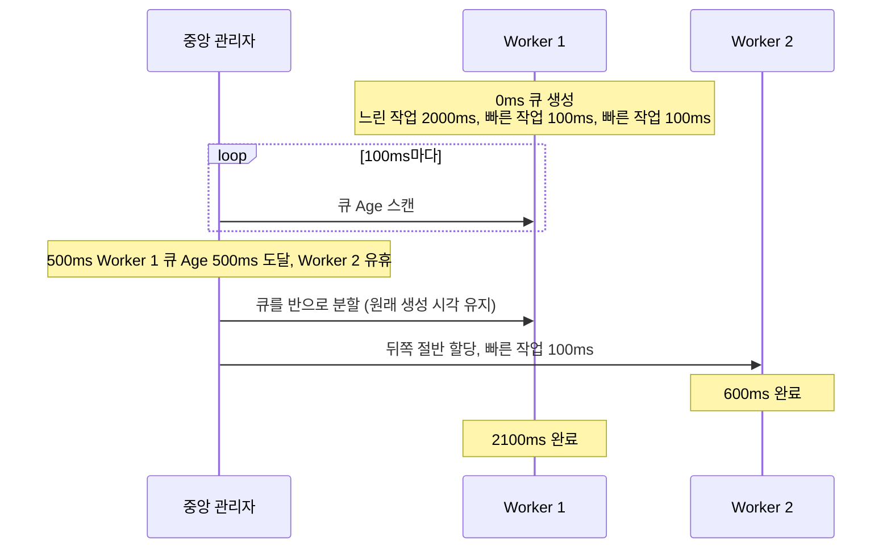

원문: [하루 N억 건의 알림 시스템 구축기 (1): 카카오뱅크는 어떻게 발송 플랫폼의 새로운 뼈대를 세웠나](https://tech.kakaobank.com/posts/2609-new-notification-platform-1/), 카카오뱅크 기술블로그, 알림경험엔지니어링팀 Remy·Kenneth·Jett, 2026-09-07

이 글은 발행된 지 열흘 된 글이다. 고른 이유는 원문의 진단 한 줄 때문이다. 레거시 발송기의 P99 지연 중 80%가 처리 시간이 아니라 대기 시간이었다. 같은 진단을 나는 [monticker 24편](/posts/monticker-partition-ordering/)의 핫 종목 실험에서 적었다. 핫 종목이 스레드의 90%를 먹으면 같은 파티션의 다른 종목이 p99 13초로 함께 밀린다. 원문은 그 문제를 은행의 알림 규모에서 다룬다.

## 원문이 말하는 것

이 절은 원문의 내용만 옮긴다. 내 평가는 다음 절부터다.

카카오뱅크 UMS 발송기는 Push·Email·SMS·알림톡을 하루 N억 건 보낸다. 원문이 꼽은 레거시의 문제는 둘이다.

첫째는 성능이다. 요청마다 새 스레드를 만들었다. 요청 1,000개면 스레드 1,000개, 컨텍스트 스위칭, 고갈, OOM으로 이어졌다. 게다가 단일 큐라 느린 작업(2,000ms) 뒤의 빠른 작업(100ms)들이 2,000ms를 기다렸고, 그동안 다른 워커는 유휴였다. 프로파일링 결과 P99의 80%가 이 대기였다. 원문은 이것이 문제인 이유를 도메인에서 찾는다. 인증번호 SMS나 거래 확인 Push에서 수 초의 지연은 사용자 이탈로 이어진다는 것이다. 목표는 10,000 TPS 이상, P99 200ms 미만으로 잡았다.

둘째는 멘탈 모델이다. 채널 하나를 추가하려면 스레드 관리, 큐 처리, 재시도 로직을 전부 이해해야 했다. "광고 시간 체크는 어디에 넣지?"를 개발자마다 다르게 답했고, 구조가 없으니 의사결정이 느렸다.

해법은 두 층이다. Service Layer는 개발자가 보는 세상이다. `RequestHandler`(메서드 3개: 처리 가능한가, 처리하라, 이름)와 `Sender`(외부 API 호출 하나)만 구현하고, 재시도·타임아웃·동시성은 몰라도 된다. 그것을 숨기는 것이 Core Layer이고, 중심에 `WorkStealQueue`가 있다. 큐를 채널 기준으로 나누고(Push 큐, Email 큐, SMS 큐), 각 큐 안에서는 순차, 큐들 사이는 병렬로 처리한다. 그런데 부하가 한 큐에 몰리면 다시 단일 큐의 문제가 된다. 그래서 Work-Stealing을 넣는데, 원문은 방향을 바꾼다. 일반적인 Work-Stealing은 유휴 스레드가 다른 작업의 태스크를 찾아 실행하는 방식이다([`ForkJoinPool` Javadoc](https://docs.oracle.com/en/java/javase/21/docs/api/java.base/java/util/concurrent/ForkJoinPool.html)). 원문은 이를 자원 중심이라 부르고 대비를 세운다.

> "Work-Stealing이 노는 일꾼(Worker)이 없게 만드는 자원 중심 알고리즘이라면, 메시징 시스템은 오래 기다리는 메시지가 없게 만드는 데이터 중심 알고리즘이어야 하기 때문입니다."

구체적으로는 중앙 관리자가 100ms마다 모든 큐를 스캔해 Age(큐 생성 시각 기준)가 500ms를 넘은 큐를 반으로 나눠 유휴 워커에 준다. 구현은 CAS로 분할 시점을 원자적으로 잡고 Barrier로 경계를 표시하는 Lock-Free, 배열 복사 없이 인덱스만 조정하는 Zero-Copy, 고정 크기 배열로 GC 압박을 줄이는 방식이다. 원문은 초당 200번의 steal이 일어나도 새 배열을 만들지 않는다고 적었다.

Service Layer의 계약은 원문에 Kotlin 인터페이스로 실려 있고, `handle`은 요청 하나가 아니라 Core Layer가 넘겨주는 `WorkQueue`를 받는다. 원문 코드에서 두 인터페이스만 옮긴다.

```kotlin
interface RequestHandler<T> {
    suspend fun availableHandle(req: T): Boolean  // 내가 처리할 수 있는 요청인가?
    suspend fun handle(queue: WorkQueue<T>)       // 요청 처리하기
    fun alias(): String                           // 핸들러 식별자
}

interface Sender<Request, Response> {
    suspend fun send(request: Request): Response
}
```

원문이 든 Age 기반 steal 예시를 시각 순으로 옮기면 다음과 같다. 원문의 설계를 그린 것이고 내 실험이 아니다.



## 같은 곳: 느린 것 하나가 뒤를 막는다

이 진단을 내 저장소에서 세 번 만났다.

- **monticker 24편**: 파티션 하나에 핫 종목과 30개 종목이 같이 있다. 핫 종목 처리 비용이 스레드의 90%가 되자 같은 파티션 종목이 p99 12.8~14.3초로 함께 밀렸고, 다른 파티션은 39~46ms로 무영향이었다.
- **parity-pay 5편**: Outbox 발행기가 순서를 위해 파티션 키별 선두만 집어가자, 적체가 한 지갑에 몰리면 배치가 1건이 되어 처리량이 110배 떨어졌다. head-of-line 대기가 순서 보장의 대가였다.
- **parity-pay 9편**: 외부 호출이 Tomcat 스레드 200개를 24초 만에 다 잡자 무관한 API가 멈췄다. 원문의 "요청마다 스레드 생성"과 반대 방향(풀은 있으나 상한이 없음)이지만 결과는 같다.

원문은 이것을 "P99의 80%가 대기"라는 숫자로 진단했고, 내가 보기에 그 숫자가 설계의 출발점이다. 대기가 지연의 대부분이라면 작업 하나를 빠르게 만드는 것으로는 P99가 크게 줄지 않는다. 그래서 목표가 "Lock-Free로 빠르게"가 아니라 "오래 기다린 메시지가 없게"가 된다. 원문이 자원 중심 대신 데이터 중심을 택한 것도 이 진단과 이어진다고 읽었다.

## 갈리는 곳: 큐를 나누면 순서를 잃는다

원문의 Work-Stealing은 큐를 반으로 나눠 다른 워커에 준다. 그러면 그 큐 안에 있던 메시지들은 두 워커에서 병렬로 처리되고, 큐 안의 순서는 보장되지 않는다. 원문은 steal 이후의 순서를 따로 다루지 않는다. 다만 순서 요구 자체는 미래 요구사항으로 적어 뒀다. 동일 사용자의 연속된 요청은 순서 보장이 필요할 수 있고, "현재는 모든 요청을 병렬로 처리하지만, 나중에 순차 처리가 필요한 케이스가 생길 수 있습니다"라는 것이다. 그때는 동일 사용자의 요청을 같은 큐로 보내면 되고, Handler 코드는 바뀌지 않는다고 말한다.

내 경험과 겹치는 지점이 여기다. monticker에서 파티션 키 = 종목 ID는 순서를 주지만 핫 종목의 이웃을 인질로 잡았다. 순서를 지키려면 같은 키를 한 곳에 모아야 하고, 격리하려면 느린 것을 다른 곳으로 보내야 한다. 둘이 같은 자원(파티션, 큐)을 두고 반대 방향으로 당긴다. 원문의 Age 기반 steal은 격리 쪽을 택한 것이고, 그렇게 할 수 있는 것은 지금 알림에 순서 요구가 없기 때문이라고 본다. 사용자별 순서가 요구되면 steal은 "같은 사용자의 메시지는 나누지 않는다"는 제약을 받아야 한다. 그러면 한 사용자에게 알림이 몰릴 때 그 사용자의 큐는 다시 head-of-line이 된다. 5편의 26.6건/초가 그 모양이었다.

그래서 "Handler 코드는 안 바뀐다"는 원문의 말은 맞지만, Core Layer의 steal 규칙은 바뀌어야 한다. 그 변경이 얼마나 큰지는 1편에 없다. 원문이 예고한 2편은 이메일 발송 채널을 다루므로, 이 부분은 그 뒤의 글에서 다뤄지길 기대한다.

## 갈리는 곳: 상한은 어디에 있는가

원문의 레거시는 요청마다 스레드를 만들어 OOM이 났고, 신규는 워커 풀과 큐로 바꿨다. 그런데 원문에는 큐의 길이 상한이나 거절 정책이 없다. 코드에 고정 크기 배열(1024)이 있으니 상한은 있을 텐데, 가득 찼을 때 무엇이 되는지는 1편에 없다. [parity-pay 9편](/posts/parity-pay-external-isolation/)에서 벌크헤드의 계약은 "느린 상대 때문에 잃는 것을 일부로 한정한다"였고, 그 일부(거절된 601건)를 표에 같이 실어야 격리를 평가할 수 있었다. 알림은 거절보다 지연이 낫다고 볼 수도 있다(재시도하면 되므로). 그렇다면 큐가 무한히 자라는 것을 무엇이 막는지가 적혀 있어야 한다.

## 원문이 잘한 것

멘탈 모델을 성능과 같은 무게로 다룬 점이다. 고성능 시스템 글은 Lock-Free와 GC 최적화를 소개하고 끝나는 경우가 많다. 원문은 그 복잡성을 숨기는 것이 플랫폼의 일이라고 말하고, "동시성 처리 및 큐 분배 메커니즘을 여러 번 크게 변경했지만, Handler 코드는 단 한 줄도 수정하지 않았습니다"라는 경험을 든다. 나는 이 문장을 원문이 보여 준 결과 중 가장 검증 가능한 것으로 읽었다. Spring의 `@Transactional`, JPA의 `save()`, Kafka Streams의 선언적 API를 예로 든 것도 적절하다. 셋 다 "어떻게"를 숨기고 "무엇을"만 남긴다.

[7편](/posts/parity-pay-ledger/)에서 원장 규칙을 `Money`·`Journal`·DB 세 층에 둔 것과 같은 구조다. 개발자가 만지는 층은 얇고, 규칙을 지키는 층은 아래에 있다.

## 원문이 답하지 않는 것

원문은 결과로 "10,000 TPS 이상, P99 < 200ms 달성"을 적었지만, 그것을 확인한 측정 조건이나 전환 전후 분포는 1편에 없다. "P99의 80%가 대기"라는 전환 전의 진단은 구체적인데 전환 후는 달성 여부만 있고, 다음 편 예고도 이메일 발송이다. Age 500ms·스캔 100ms·배열 1024라는 상수를 어떻게 정했는지도 없다. 500ms는 원문이 말한 "알림에서는 수 초도 긴 시간"이라는 도메인 판단에서 나왔을 것으로 짐작하지만, 그 판단과 상수의 연결이 적혀 있으면 다른 도메인에서 옮겨 쓸 때 기준이 된다.

## 가져갈 것

- P99를 처리 시간과 대기 시간으로 나눠 재 보면 병목이 어디 있는지가 갈린다. 원문처럼 80%가 대기라면 손볼 곳은 작업 하나의 속도가 아니라 큐 구조다.
- steal로 큐를 나눌 수 있는 것은 순서 요구가 없을 때다. 사용자별 순서가 생기면 steal 규칙과 head-of-line 비용을 다시 따져야 한다.
- 큐 상한과 거절 정책이 없으면 격리를 평가할 수 없다. 거절된 것을 처리된 것과 같은 표에 놓아야 한다.

## 참고

- [하루 N억 건의 알림 시스템 구축기 (1)](https://tech.kakaobank.com/posts/2609-new-notification-platform-1/), 카카오뱅크 기술블로그
- [`ForkJoinPool` Javadoc (Java SE 21)](https://docs.oracle.com/en/java/javase/21/docs/api/java.base/java/util/concurrent/ForkJoinPool.html), 자원 중심 Work-Stealing의 정의
