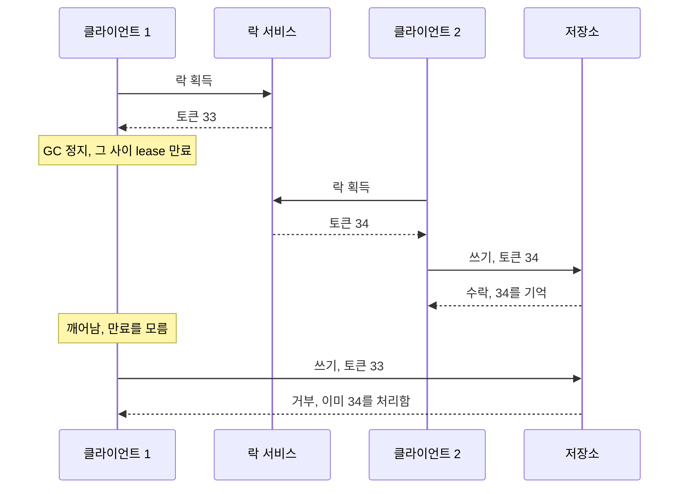
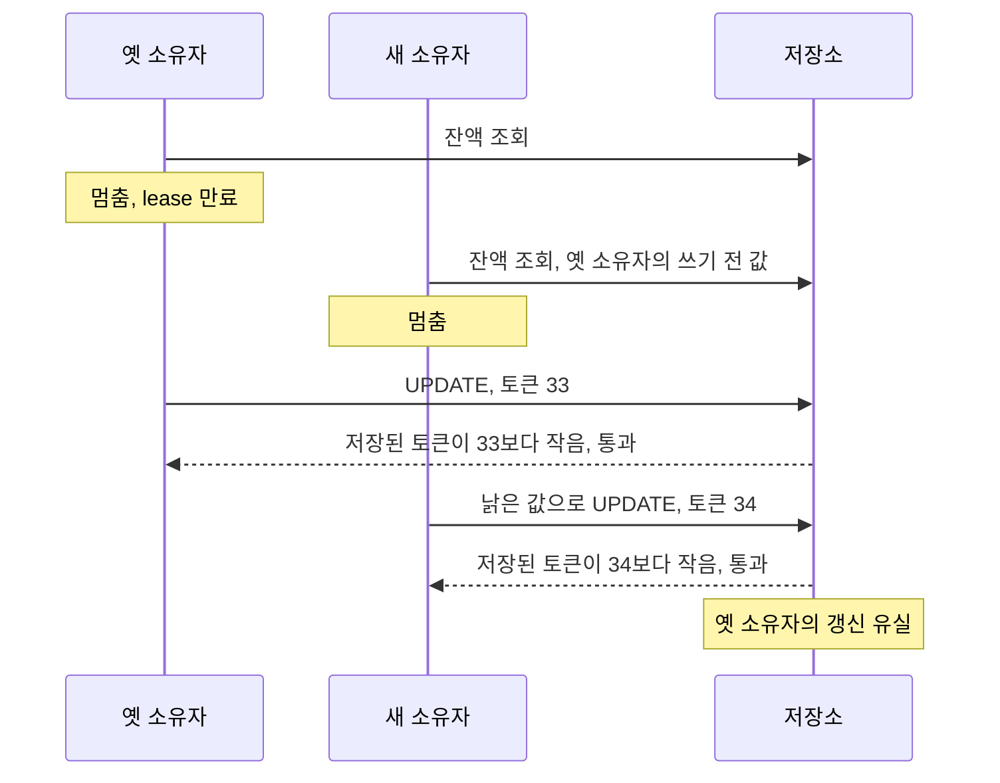
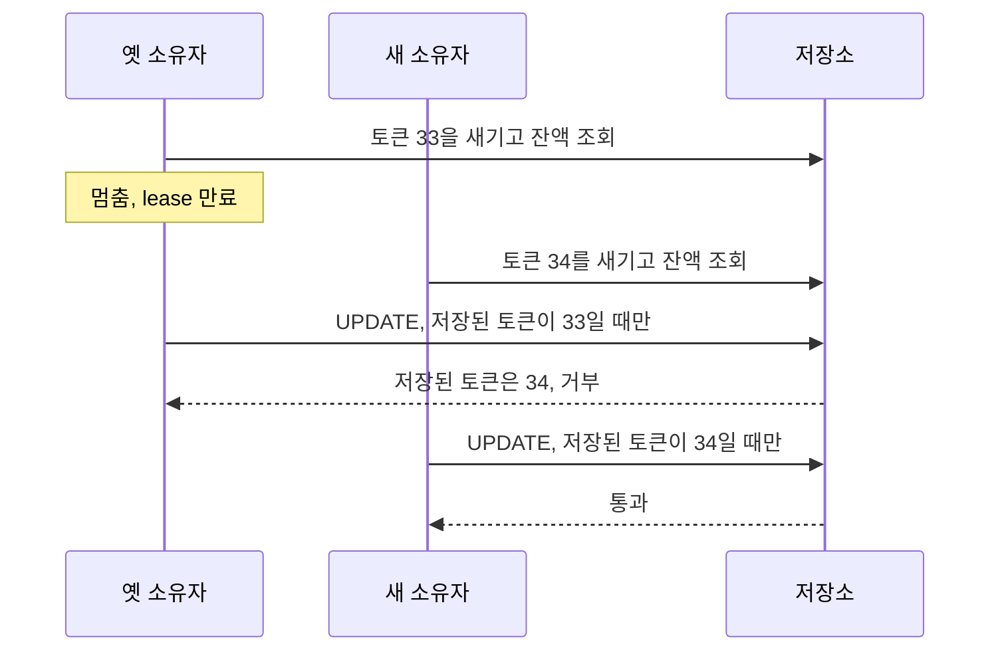

원문: [How to do distributed locking](https://martin.kleppmann.com/2016/02/08/how-to-do-distributed-locking.html) — Martin Kleppmann, 2016-02-08

10년 된 글이다. 이 시리즈의 첫 글로 고른 이유는, 분산락에 대해 내가 실무에서 만든 것과 프로젝트에서 잰 것이 전부 이 글의 문장 안에 들어가기 때문이다. [지분율 시스템](/series/batch-structure-improvement/)의 SETNX + TTL + 소유 토큰 락은 원문이 "효율을 위한 락"이라 부르는 것의 표준 구현이고, [ParityPay 10편](/posts/parity-pay-lock-lease/)의 다섯 실험은 원문의 두 그림(GC 정지, fencing token)을 일부러 재현한 것이다. 아래에서 먼저 원문의 주장만 옮기고, 그 다음 절부터 실측이 그 주장을 확인한 곳과 다르게 나온 곳을 나눠 적는다.

## 원문이 말하는 것

[Redis 문서의 Redlock](https://redis.io/docs/latest/develop/clients/patterns/distributed-locks/)은 서로 복제하지 않는 독립된 Redis 마스터 N개(문서의 예시는 5개)에 같은 키를 걸고, 과반에서 성공하면 락을 쥔 것으로 본다. Kleppmann은 『Designing Data-Intensive Applications』를 쓰며 자료를 찾다가 이 알고리즘을 검토했고, 정확성을 위한 락이라면 쓰지 말라고 결론짓는다. 논지는 세 층이다.

첫째, 락의 용도를 먼저 물어야 한다. 효율을 위한 락은 같은 일을 두 번 하지 않으려는 것이다. 깨지면 계산 비용이 조금 늘거나 알림이 두 번 간다. 정확성을 위한 락은 동시 접근이 상태를 망치지 않게 하는 것이다. 깨지면 파일 손상, 데이터 유실, 영구적 불일치, 환자에게 잘못된 약 투여다. 전자에는 Redis 한 대의 단순한 락이면 되고, 후자에는 Redlock이 맞아 보이지만 그것이 착각이라는 것이 이 글이다.

둘째, 락 서비스가 완벽하다고 가정해도 아래 코드는 깨진다.

```text
lock = lockService.acquireLock(filename)
data = storage.read(filename)
updated = compute(data)
storage.write(filename, updated)   // 여기 도달하기 전에 GC 정지가 오면
lock.release()
```

클라이언트 1이 락을 쥔 채 [stop-the-world GC](/posts/java-garbage-collection/)(GC가 애플리케이션 스레드를 모두 멈추는 구간)에 들어간다. 그 사이 lease(락을 쥘 수 있는 유효 시간)가 만료되고, 클라이언트 2가 락을 쥐고 쓴다. 클라이언트 1은 깨어나서 자기 lease가 끝난 줄 모르고 쓴다. 두 쓰기가 겹친다. 원문은 쓰기 직전에 lease 만료를 검사해도 이 문제를 못 고친다고 적는다. GC는 실행 중인 스레드를 어느 지점에서든 멈출 수 있으므로, 검사를 통과한 직후 쓰기 전에 멈출 수도 있기 때문이다. HBase가 실제로 이 문제를 겪었다. GC가 없는 언어라도 같은 정지가 생긴다. 원문이 드는 원인은 [페이지 폴트](/posts/why-a-process-pauses/), 실제로는 동기 네트워크 요청인 EBS 디스크 읽기, CPU 경합, 실수로 보낸 `SIGSTOP`이다. 네트워크 쪽에서는 GitHub 장애에서 패킷이 약 90초 지연된 적이 있다.

그래서 원문이 내놓는 해법이 fencing token이다. 락 서비스가 락을 줄 때마다 단조 증가하는 번호를 붙이고, 저장소는 이미 처리한 번호보다 작은 번호의 쓰기를 거부한다. 클라이언트 1이 33번으로 늦게 쓰면 저장소는 34번을 이미 받았으므로 거부한다. 원문은 이것이 저장소가 토큰을 능동적으로 검사해야 성립한다고 덧붙인다. [ZooKeeper](/posts/zookeeper/)라면 `zxid`나 znode 버전을 토큰으로 쓸 수 있다. Redlock에는 이 번호를 만드는 장치가 없다. Redlock이 쓰는 고유한 무작위 값은 단조성을 주지 않고, Redis 노드 하나에 카운터를 두면 그 노드가 죽을 수 있다. 원문은 토큰을 만드는 데만도 [합의 알고리즘](/posts/consensus-raft/)이 필요할 가능성이 크다고 본다.

원문의 fencing 그림을 시간 순서로 옮기면 이렇다. 저장소의 거부가 없으면 앞 문단의 GC 정지 시나리오와 같은 순서다.



셋째, Redlock은 시간에 의존한다. Redis는 [단조 시계](/posts/time-and-ordering/)(뒤로 가거나 건너뛰지 않는 시계)가 아니라 `gettimeofday`를 쓰고, 시스템 시계는 NTP나 운영자에 의해 불연속으로 뛴다. 노드 5개 중 C의 시계가 앞으로 뛰어 락이 조기 만료되면, 클라이언트 1은 A·B·C에서, 클라이언트 2는 C·D·E에서 과반을 얻어 둘 다 락을 쥔다. 시계가 정확해도 클라이언트 1이 5개 노드에 요청을 보낸 뒤 GC에 들어가면, 모든 노드에서 lease가 만료되고 클라이언트 2가 락을 쥔 뒤에야 클라이언트 1이 깨어나 "성공" 응답을 읽는다. 원문은 이것을 동기 시스템 모델의 가정이라 부른다. 네트워크 지연 상한, 프로세스 정지 상한, 시계 오차 상한이 알려져 있어야 Redlock이 안전하다. 잘 관리된 데이터센터는 "대부분의 시간" 그 가정을 만족하지만, 정확성이 락에 달려 있으면 대부분으로는 부족하다. Raft, Viewstamped Replication, Zab, Paxos 같은 합의 알고리즘은 시간 가정 없이 안전성을 지킨다.

원문의 결론은 Redlock이 이도 저도 아니라는 것이다.


"it is unnecessarily heavyweight and expensive for efficiency-optimization locks, but it is not sufficiently safe for situations in which correctness depends on the lock."


효율 락으로 쓰기에는 불필요하게 무겁고, 정확성이 락에 달린 상황에서는 충분히 안전하지 않다는 뜻이다. 그래서 원문은 효율이 목적이면 Redis 한 대의 단순 락을 쓰고 가끔 깨질 수 있다고 코드에 분명히 적으라고 하고, 정확성이 목적이면 ZooKeeper 같은 합의 시스템을 쓰고 락 아래의 모든 자원 접근에 fencing token을 강제하라고 한다.

## 확인된 곳: 락 서비스가 완벽해도 깨진다

10편의 실험 1은 원문의 두 번째 그림을 그대로 만든 것이다. Redis `SET key token NX PX 200` 락 안에서 조회, 300~500ms 멈춤, 계산, 조건 없는 UPDATE. 소유 토큰으로 조건부 해제까지 지분율 시스템의 설계 그대로다. 결과는 3회 모두 소유 겹침 1,697~1,714쌍, 초과 승인 340~350건, 지갑 4개 전부 원장 음수. 스냅샷은 정상으로 보이고 원장만 음수다.

원문이 "쓰기 직전에 만료를 검사해도 못 고친다"고 한 것은 실험 2에서 확인됐다. Redisson식 Watchdog(별도 스레드가 lease를 주기적으로 연장)은 느린 작업에서는 겹침 0을 만들었지만, `SIGSTOP`으로 프로세스를 400ms씩 35회 멈추자 131쌍이 돌아왔다. Watchdog은 같은 프로세스의 스레드라 프로세스와 함께 멈춘다. 원문이 정지 원인으로 든 `SIGSTOP`을 그대로 쓴 실험이었고, 그래서 위험한 만료는 느린 작업이 아니라 멈춘 프로세스에서 온다고 판단했다.

원문의 셋째 층, 시계 가정도 실측에 흔적이 있다. TTL을 1초로 늘리고 멈춤을 300~500ms로 두면 안전해야 한다. 그런데 3회차에 336~463ms만 쥔 홀드 4건이 1,000ms lease 안에서 빼앗겼다. 원인은 두 시간의 출발점이 다르다는 데 있다. 홀드 시간은 클라이언트가 응답을 받은 뒤부터 재고, lease는 Redis가 `SET`을 실행한 순간부터 흐른다. 그 사이에 Redis가 수백 ms 멈추면(이날 Docker VM은 메모리 압박으로 다른 컨테이너가 죽던 상태였다), 소유자가 락을 받은 시점에 lease는 이미 절반 넘게 지나 있다. 소유자는 그것을 알 수 없다. 10편에 "lease의 시계는 락 서버의 것"이라고 적었다. 원문의 "네트워크 지연 상한이 알려져 있어야 한다"가 노드 한 대에서 이렇게 나타난다. Redlock의 노드 수와 무관하다.

락 서버가 죽는 경우(실험 5)는 원문에 없는 축이다. fail-closed면 가용성 사고, fail-open이면 초과 승인 475~491건의 정합성 사고, fencing이면 재기동 뒤 토큰이 되돌아가 거부 사고. 원문이 "합의 시스템을 쓰라"고 한 것은 이 축의 답이기도 하다. 합의 시스템은 과반이 살아 있는 한 토큰이 되돌아가지 않는다.

## 갈리는 곳: fencing token이 막는 순서와 실제 순서

원문의 fencing 그림은 이렇다. 클라이언트 1이 33번을 받고 멈춤, 클라이언트 2가 34번을 받고 씀, 클라이언트 1이 깨어나 33번으로 씀, 거부. 저장소가 "이미 받은 번호보다 작으면 거부"하면 된다.

실험 3의 c-1이 이 그림 그대로다. 잔액 UPDATE 직전에 "저장된 토큰 < 내 토큰"이면 토큰을 올리고 쓰고, 아니면 거부. 결과는 3회 1,505건 중 거부 **1건**. 실험 1과 구별되지 않았다. [잃어버린 갱신](/posts/isolation-levels-and-anomalies/) 864~876쌍, 초과 승인 350~353건.

이유는 순서다. lease가 만료된 옛 소유자는 먼저 시작했으므로 먼저 쓴다. 그 시점에 저장된 토큰은 자기 것보다 작아서 통과한다. 새 소유자는 옛 소유자가 쓰기 전에 읽어 둔 낡은 값으로 뒤에 쓴다. 토큰이 더 크니 이것도 통과하고, 옛 소유자의 갱신은 덮여 사라진다. 쓰기 시점 fencing이 막는 것은 "새 소유자가 이미 쓴 뒤에 도착하는 옛 소유자의 쓰기" 하나뿐이다. 그런데 트랜잭션이 lease보다 길어서 만료되는 상황에서는 옛 소유자가 먼저 쓰므로 그 순서가 거의 나오지 않는다. **원문의 그림은 lease 만료의 한 경우이지 전형이 아니다.**

실험 3의 c-1에서 실제로 나온 순서는 이쪽이다. 토큰 번호는 비교하기 쉽게 원문 그림의 33과 34를 빌렸다.



그렇다고 원문이 틀린 것은 아니다. 원문의 저장소 예시는 HDFS나 S3의 파일 하나를 읽고 고쳐 다시 쓰는 것이다. 그리고 원문은 ZooKeeper의 znode 버전을 토큰으로 쓸 수 있다고만 적었지만, znode 버전은 ZooKeeper API에서 [`setData`가 "주어진 버전이 노드의 버전과 같을 때만" 쓰는](https://zookeeper.apache.org/doc/current/apidocs/zookeeper-server/org/apache/zookeeper/ZooKeeper.html) 조건으로 쓰이는 값이다. 나는 그 예시를 [비교-후-교체](/posts/lock-free-and-cas/)(CAS, 값이 예상과 같을 때만 바꾸는 연산)로 읽는다. 쓰기 시점 검사가 아니라 읽은 시점을 쓰기까지 들고 가는 검사다. 실험 3의 c-2가 그것이다. 락을 잡은 직후 별도 트랜잭션에서 토큰을 새기고 잔액을 읽고, 쓰기는 "저장된 토큰 = 내 토큰"일 때만 통과. drift 0, 초과 승인 0, 잃어버린 갱신 0. 원문의 결론이 실측으로 성립하는 형태는 이것 하나였고, 그 형태는 fencing이라기보다 [낙관적 잠금](/posts/banksalad-optimistic-lock/)에 가깝다. 그래서 원문의 "모든 자원 접근에 fencing을 강제하라"는 이 뜻으로 읽어야 한다고 본다. 원문의 그림만 보고 구현하면 c-1이 나온다.

같은 순서에 c-2를 놓으면 토큰을 새기는 시점이 읽기로 당겨지고, 쓰기 조건이 "작으면 통과"에서 "같으면 통과"로 바뀐다.



c-2에는 대가가 있었다. lease가 항상 작업보다 짧으면 1,159건 중 승인 4~6건. 모든 소유자가 쓰기 전에 다음 소유자에게 추월당한다. fencing은 안전을 주지 실행 보장을 주지 않고, lease가 작업보다 짧은 시스템에 fencing을 붙이면 "틀리게 승인"에서 "전부 거부"로 바뀐다. 원문은 이 지점을 다루지 않는다. 원문의 관심은 안전성이고 그것은 맞는 우선순위다. 다만 이 경우 고칠 것이 fencing이 아니라 lease라는 사실은 실측을 하고서야 보였다.

## 갈리는 곳: 락이 필요한가

원문은 "효율이면 단순 락, 정확성이면 합의 + fencing"으로 끝난다. 그런데 실험 4는 세 번째 답을 냈다. 락 없이 `UPDATE ... WHERE balance >= :amount`. 같은 멈춤 아래 여섯 번 전부 정확히 240건 승인, drift 0, 처리량은 락의 2배. 조건부 원자 UPDATE는 "언제 읽었는가"를 묻지 않는다. 조건은 쓰는 순간 DB가 검사하고, 멈춤은 지연일 뿐 정합성에 닿지 않는다.

나는 이것을 원문과의 모순이 아니라, 원문의 결론을 자원 하나로 줄인 것으로 본다. 원문도 fencing은 저장소가 토큰을 능동적으로 검사해야 성립한다고 적었다. 그러니 "모든 자원 접근에 fencing을 강제하라"는 곧 "저장소가 검사하라"는 뜻이다. 자원이 행 하나이고 조건을 WHERE 절로 쓸 수 있다면, 저장소가 검사하는 데 락 서비스도 토큰도 필요 없다. 원문의 파일 저장소 예시에서 이 답이 나오지 않은 것은, 그 예시의 저장소에 행 단위 조건부 쓰기가 없기 때문이라고 본다.

락이 필요한 것은 단일 행 조건으로 환원되지 않는 다단계 작업이다. 지분율 배치는 "삭제 후 재등록"이었고, 그것은 WHERE 절이 아니다. 거기서 락이 필요했고, 10편에서 돌아보니 그 시스템에서 정합성을 지킨 것은 락이 아니라 작업 상태(`DELETING`·`REGISTERING`·`COMPLETED`)를 저장소에 남긴 것이었다. 락은 경합을 줄이는 보조 장치였고, 저장소의 상태가 "지금 이 작업을 해도 되는가"를 판정했다. 당시에는 반대로 이해했다. 원문의 언어로 다시 쓰면, 그 시스템은 효율 락 하나와 저장소 측의 상태 검사(fencing의 역할)로 이뤄져 있었고, 두 번째가 정확성을 맡았다. 원문이 10년 전에 한 구분을 나는 만들고 몇 년 뒤에 실험으로 알았다.

## 원문이 잘한 것

질문의 순서다. "이 락이 어떤 알고리즘인가"보다 "이 락이 깨지면 무엇이 일어나는가"를 먼저 물었다. 10편의 실험 설계가 이 순서였다. 깨지면 원장이 음수가 되는 락(정확성)과 깨지면 배치가 두 번 도는 락(효율)을 같은 도구로 다루지 않게 된 것은 이 구분 덕이다.

그리고 "락 서비스가 완벽하다고 가정해도"라는 전제를 둔 것이다. 대부분의 분산락 논의는 락 서비스의 가용성과 일관성에 머문다. 원문은 락 서비스를 논외로 두고 클라이언트를 본다. 실험 1~3이 Redis 한 대로 충분했던 이유다. Redlock을 재지 않았어도(10편의 한계에 적었다) 결론이 노드 수와 무관하다는 것을 원문이 먼저 말해 뒀다.

## 원문이 답하지 않는 것

원문은 fencing이 안전을 주는 대신 실행 보장을 빼앗는 조건을 다루지 않는다. lease가 작업보다 짧으면 fencing은 모든 쓰기를 거부하는 쪽으로 수렴한다. 이것을 고치려면 lease를 고쳐야 한다. 그런데 "충분히 긴 lease"가 얼마인지는 락 서버의 시계에 달려 있어서 아무도 모른다. 원문은 시계 문제를 Redlock 비판에 썼지만, 같은 시계 문제가 원문의 권장안(합의 + fencing)의 lease에도 그대로 있다. 합의 시스템은 토큰 번호가 줄어들지 않는다는 것은 보장하지만, lease 길이가 적절하다는 것은 보장하지 않는다.

그리고 저장소가 토큰을 검사한다는 것이 구체적으로 무엇인지가 그림 한 장이다. 쓰기 시점 비교인지 읽기부터 쓰기까지의 비교-후-교체인지가 결과를 가르는데, 원문의 그림은 전자로 읽힌다. 그런데 원문 발행 직후 Redis 저자 Salvatore Sanfilippo(antirez)가 쓴 반론 [Is Redlock safe?](http://antirez.com/news/101)는 후자를 적었다. 그는 Redlock의 고유한 무작위 토큰으로 무엇을 하느냐고 묻고 스스로 답한다.


"For example you can implement Check and Set."


예컨대 그 토큰으로 Check and Set을 구현할 수 있다는 것이다. 작업을 시작할 때 자원의 상태에 토큰을 새기고, 쓸 때 토큰이 그대로일 때만 읽기-수정-쓰기를 하라는 설명이 이어진다. 실험 3의 c-2와 같은 형태다. 이후 논쟁은 주로 시계와 Redlock의 안전성에 머물렀지만, 나는 이 구현 형태가 더 실용적인 쟁점이라고 본다.

## 가져갈 것

- 락을 고르기 전에 "깨지면 무엇이 일어나는가"를 묻는다. 답이 "원장이 틀린다"면 락은 답의 일부일 뿐이고, 저장소가 검사하는 장치가 별도로 있어야 한다.
- Watchdog은 같은 프로세스에 있으므로 프로세스와 같이 멈춘다. lease 연장은 느린 작업은 막아도 멈춘 프로세스는 막지 못했다.
- fencing은 쓰기 시점 비교가 아니라 읽은 시점을 쓰기까지 들고 가는 비교-후-교체여야 한다. 전자는 락 없는 경우와 구별되지 않았고, 후자만 정합성을 지켰다.
- fencing은 안전을 주고 실행 보장을 뺏는다. lease가 작업보다 짧으면 전부 거부다. 고칠 것은 lease이고, lease의 시계는 락 서버의 것이다.
- 자원이 행 하나이고 조건이 WHERE 절이면 락도 토큰도 필요 없다. 원문의 "저장소가 검사하라"의 가장 짧은 구현은 조건부 원자 UPDATE다.

## 참고

- [How to do distributed locking](https://martin.kleppmann.com/2016/02/08/how-to-do-distributed-locking.html) — Martin Kleppmann, 2016-02-08
- [Is Redlock safe?](http://antirez.com/news/101) — Salvatore Sanfilippo의 반론, 2016
- [Distributed Locks with Redis](https://redis.io/docs/latest/develop/clients/patterns/distributed-locks/) — Redis 문서의 Redlock 설명
- [ZooKeeper Javadoc: `ZooKeeper.setData`](https://zookeeper.apache.org/doc/current/apidocs/zookeeper-server/org/apache/zookeeper/ZooKeeper.html) — 버전 조건부 쓰기
- [ParityPay 10편 - 락 lease가 트랜잭션보다 먼저 끝나면 정말 정합성이 깨지는가](/posts/parity-pay-lock-lease/)
